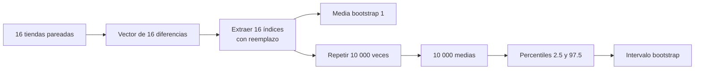
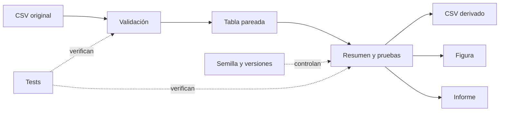

# Ejercicio Semana 2: auditoría, bootstrap pareado y pipeline

Volver al [[00 Índice - Comparación estadística de modelos|índice]] · Base conceptual: [[02 Diseño pareado, diferencias e independencia]] · Prueba principal: [[04 Prueba t pareada, p-value e intervalo de confianza]] · Código general: [[07 Implementación reproducible en Python]]

Esta nota completa los aspectos nuevos del ejercicio de Semana 2 que no estaban desarrollados en detalle en las notas anteriores. El ejercicio no cambia la teoría central de comparación pareada: la lleva a un **pipeline completo**, desde la auditoría de un CSV hasta la generación de resultados reproducibles.

> [!important] Qué añade este ejercicio
> 1. Una métrica de regresión concreta: error absoluto en unidades vendidas.
> 2. Validación defensiva del archivo antes de calcular.
> 3. Una tabla de auditoría por `store_id`.
> 4. Un intervalo *bootstrap* percentil que preserva los pares.
> 5. Pruebas automatizadas, figura, CSV de resultados e historial Git.

## 1. Escenario y contrato del análisis

Dos modelos de regresión ya entrenados, A y B, pronostican la demanda semanal de las mismas 16 tiendas. Para cada tienda se registra el error absoluto de ambos modelos:

| Campo | Significado |
| --- | --- |
| `store_id` | Identidad de la tienda y clave del par. |
| `error_a` | Error absoluto del modelo A. |
| `error_b` | Error absoluto del modelo B. |

La métrica está expresada en **unidades vendidas** y una cantidad menor representa mejor desempeño.

La diferencia se define como

$$
d_i=error_{A,i}-error_{B,i}.
$$

Por tanto:

| Resultado | Interpretación |
| ---: | --- |
| $d_i>0$ | A se equivocó más; favorece a B. |
| $d_i<0$ | B se equivocó más; favorece a A. |
| $d_i=0$ | Ambos tuvieron el mismo error. |

> [!warning] El signo no tiene significado universal
> El signo depende del orden de la resta y de la dirección de la métrica. Aquí `A - B > 0` favorece a B porque **menor error es mejor**. Si la métrica fuera *accuracy*, donde mayor es mejor, la lectura cambiaría.

### Población objetivo y límite de los datos

Una interpretación posible sería comparar los modelos sobre pronósticos semanales futuros de tiendas semejantes. Pero el archivo del ejercicio es **sintético y determinista**:

- no contiene una muestra aleatoria de tiendas reales;
- no representa una empresa o mercado identificado;
- no incorpora variabilidad de nuevos entrenamientos;
- no permite atribuir causalidad a la elección del modelo.

Los procedimientos estadísticos calculan incertidumbre bajo ciertos modelos; no pueden fabricar representatividad que el diseño no posee.

## 2. Por qué la auditoría ocurre antes de la estadística

Una función estadística puede producir un número aunque la tabla esté mal emparejada. Por eso el primer contrato es validar la entrada.

### Condiciones que debe cumplir el CSV

1. Deben existir al menos las variables necesarias para el análisis: `store_id`, `error_a` y `error_b`. Si hay columnas adicionales, el pipeline puede ignorarlas sin modificar el CSV original.
2. Ningún `store_id` puede ser nulo o una cadena vacía.
3. Cada `store_id` debe aparecer una sola vez.
4. Los errores deben ser numéricos.
5. Los errores deben ser finitos: no se aceptan `NaN`, `+inf` ni `-inf`.
6. Los errores no pueden ser negativos porque son valores absolutos.

### Por qué la misma longitud no demuestra emparejamiento

Supón que existen dos vectores:

```text
error_a = [S01, S02, S03]
error_b = [S02, S03, S01]
```

Ambos tienen longitud 3, pero la resta por posición compara tiendas diferentes. El emparejamiento requiere **identidad**, no solo posición o cantidad de filas.

La representación correcta mantiene los dos errores en una sola fila:

```text
store_id,error_a,error_b
S01,12.4,10.6
S02,9.8,9.1
S03,15.1,13.9
```

### Implementación defensiva con pandas y NumPy

```python
data = pd.read_csv(path)

missing = [name for name in REQUIRED_COLUMNS if name not in data]
if missing:
    raise ValueError(f"Faltan columnas requeridas: {missing}")

data = data.loc[:, REQUIRED_COLUMNS].copy()

if data["store_id"].isna().any():
    raise ValueError("store_id no puede ser nulo")

if not data["store_id"].is_unique:
    raise ValueError("store_id debe ser único")

for column in ("error_a", "error_b"):
    data[column] = pd.to_numeric(data[column], errors="coerce")

errors = data[["error_a", "error_b"]].to_numpy(dtype=float)

if not np.isfinite(errors).all():
    raise ValueError("Los errores deben ser finitos")

if (errors < 0).any():
    raise ValueError("Los errores no pueden ser negativos")
```

Lectura conceptual:

- `pd.read_csv` transforma el archivo en un `DataFrame`;
- `.loc[:, REQUIRED_COLUMNS]` selecciona las columnas y conserva su orden;
- `.copy()` crea una tabla independiente;
- `pd.to_numeric(..., errors="coerce")` convierte texto inválido en `NaN` para poder detectarlo;
- `np.isfinite(...).all()` exige que todos los elementos sean números finitos;
- `(errors < 0).any()` pregunta si existe al menos un valor negativo.

> [!note] Validar no significa corregir silenciosamente
> Cambiar un identificador duplicado, reemplazar un `NaN` por cero o convertir un error negativo en positivo altera los datos. Si no existe una regla de limpieza predefinida y justificable, es preferible detener el análisis con un mensaje claro.

## 3. La tabla pareada es evidencia, no un resultado decorativo

Después de validar, se construye una tabla con cinco columnas:

```python
table = data.copy()
table["difference"] = table["error_a"] - table["error_b"]
table["favors"] = np.select(
    [table["difference"] > 0, table["difference"] < 0],
    ["B", "A"],
    default="Tie",
)
```

La tabla permite auditar:

- qué tienda produjo cada diferencia;
- qué modelo favorece el signo;
- qué casos tienen mayor magnitud;
- si existen empates o valores atípicos;
- si la conclusión media oculta heterogeneidad.

### Resultado de las 16 tiendas

| Resumen por dirección | Resultado |
| --- | ---: |
| Favorecen a B | 10 tiendas |
| Favorecen a A | 6 tiendas |
| Empates | 0 tiendas |
| Mayor diferencia positiva | S08: $2.1$ |
| Mayor diferencia negativa | S09: $-1.8$ |

Que 10 de 16 tiendas favorezcan a B describe esta muestra. No demuestra por sí solo una ventaja poblacional: la magnitud y la incertidumbre también importan.

## 4. Efecto, dispersión y precisión

Con el vector de diferencias $d_1,\ldots,d_{16}$ se calculan cuatro cantidades:

$$
n=16,
$$

$$
\bar d=\frac{1}{n}\sum_{i=1}^{n}d_i=0.41875,
$$

$$
s_d=\sqrt{\frac{1}{n-1}\sum_{i=1}^{n}(d_i-\bar d)^2}=1.25338,
$$

$$
SE(\bar d)=\frac{s_d}{\sqrt n}=0.31334.
$$

### Qué responde cada número

| Cantidad | Pregunta |
| --- | --- |
| $n$ | ¿Cuántas unidades pareadas aportan información? |
| $\bar d$ | ¿Cuál fue la ventaja media observada? |
| $s_d$ | ¿Cuánto varía la ventaja entre tiendas? |
| $SE(\bar d)$ | ¿Con qué precisión se estima la diferencia media? |

La media positiva indica que A tuvo, en promedio, `0.41875` unidades más de error absoluto que B. La desviación estándar de `1.25338` muestra que las diferencias individuales varían bastante respecto de esa media.

> [!warning] No confundir desviación con error estándar
> `sample_sd` describe heterogeneidad entre tiendas. `standard_error` describe incertidumbre de la **media** bajo el modelo. Dividir por $\sqrt n$ no hace que las tiendas sean más homogéneas.

### Implementación

```python
n = differences.size
mean = np.mean(differences)
sample_sd = np.std(differences, ddof=1)
standard_error = sample_sd / np.sqrt(n)
```

`ddof=1` usa el denominador $n-1$ y produce la desviación estándar muestral.

## 5. Procedimiento principal: prueba t sobre las diferencias

La prueba pareada se puede expresar como una prueba t de una muestra aplicada a $d$:

$$
H_0:\Delta=0,
\qquad
H_1:\Delta\ne0.
$$

El estadístico es

$$
t=\frac{\bar d}{s_d/\sqrt n}=1.33639,
$$

con

$$
gl=n-1=15.
$$

SciPy lo calcula así:

```python
test = stats.ttest_1samp(
    differences,
    popmean=0.0,
    alternative="two-sided",
)
```

El resultado bilateral es

$$
p_t=0.20134.
$$

Interpretación correcta:

> Bajo $H_0$, el diseño pareado y los supuestos del modelo t, aproximadamente el 20.1 % de los estadísticos serían al menos tan extremos en magnitud como el observado.

No significa que exista un 20.1 % de probabilidad de que $H_0$ sea verdadera.

### Intervalo t del 95 %

$$
IC_{95\%}=\bar d\pm t_{0.975,15}SE(\bar d)
=[-0.24913,\ 1.08663].
$$

El intervalo incluye:

- cero;
- una pequeña ventaja media de A;
- ventajas de B cercanas a una unidad.

Esto no demuestra igualdad entre modelos. Indica que el diseño y el tamaño muestral no permiten distinguir con precisión entre esos valores compatibles.

## 6. Referencia exacta por cambios de signo

Bajo una nulidad que permita invertir el signo de cada diferencia, se conservan las magnitudes $|d_i|$ y se consideran todos los vectores

$$
d_i^{(b)}=s_i^{(b)}|d_i|,
\qquad s_i^{(b)}\in\{-1,+1\}.
$$

Con 16 tiendas existen

$$
2^{16}=65\,536
$$

configuraciones. Para una prueba bilateral se cuentan las medias nulas que cumplen

$$
|\bar d^{(b)}|\ge|\bar d_{obs}|.
$$

En el ejercicio, 13 372 configuraciones son al menos tan extremas:

$$
p_{signos}=\frac{13\,372}{65\,536}=0.20404.
$$

### Por qué no es la misma prueba con otro algoritmo

| Prueba t | Cambios de signo |
| --- | --- |
| Usa un estadístico estandarizado por el error estándar. | Construye una distribución nula invirtiendo signos. |
| Se apoya en un modelo t para la media. | Requiere invariancia o simetría defendible bajo la nulidad. |
| Produce una referencia continua. | Produce una referencia discreta y, aquí, exhaustiva. |

Que `0.20134` y `0.20404` sean cercanos es un resultado del conjunto de datos; no vuelve equivalentes sus supuestos.

## 7. Concepto nuevo principal: bootstrap pareado percentil

El *bootstrap* aproxima cómo variaría un estadístico si pudiéramos extraer muchas muestras del proceso representado por los datos. Usa la muestra observada como distribución empírica.

### Unidad que se remuestrea

La unidad es la tienda completa:

```text
S01 -> (error_a=12.4, error_b=10.6) -> difference=1.8
```

Remuestrear una tienda equivale, para este análisis, a remuestrear su diferencia `1.8`. Nunca se deben remuestrear `error_a` y `error_b` por separado, porque eso destruiría el par.



### Qué significa «con reemplazo»

En una remuestra una tienda puede:

- aparecer cero veces;
- aparecer una vez;
- aparecer varias veces.

Cada remuestra conserva tamaño 16. La variación entre las 10 000 medias aproxima la incertidumbre del estimador bajo la distribución empírica.

### Algoritmo paso a paso

1. Fijar una semilla reproducible.
2. Extraer 16 índices enteros entre 0 y 15, con reemplazo.
3. Seleccionar las diferencias correspondientes.
4. Calcular su media.
5. Repetir 10 000 veces.
6. Tomar los percentiles 2.5 y 97.5 de las medias.

```python
rng = np.random.default_rng(20260829)

indices = rng.integers(
    0,
    differences.size,
    size=(10_000, differences.size),
)

bootstrap_means = differences[indices].mean(axis=1)
low, high = np.quantile(bootstrap_means, [0.025, 0.975])
```

Lectura del código:

- `default_rng(20260829)` crea un generador pseudoaleatorio reproducible;
- `rng.integers` crea una matriz de 10 000 filas por 16 columnas;
- cada fila contiene los índices de una remuestra;
- `differences[indices]` convierte índices en diferencias;
- `.mean(axis=1)` calcula una media por remuestra;
- `np.quantile` extrae los límites percentiles.

El resultado reproducible es

$$
IC_{bootstrap,95\%}=[-0.19375,\ 1.00625].
$$

### Por qué se llama intervalo percentil

No se calcula como `media ± valor crítico × SE`. Los extremos son directamente percentiles de la distribución de medias bootstrap:

$$
[q_{0.025}(\bar d^*),\ q_{0.975}(\bar d^*)].
$$

El asterisco indica una estadística calculada en una remuestra.

### Qué aporta y qué no aporta

El bootstrap aporta una referencia de sensibilidad que no utiliza exactamente la fórmula t. En este caso, tanto el intervalo t como el bootstrap incluyen cero y cuentan una historia compatible.

Pero el bootstrap no corrige automáticamente:

- falta de representatividad;
- sesgo de selección;
- dependencia no modelada entre tiendas;
- mediciones erróneas;
- una unidad de análisis mal definida;
- un tamaño muestral pequeño con poca información en las colas;
- el carácter sintético del dataset.

> [!warning] Remuestrear mal replica el error 10 000 veces
> Un gran número de remuestras reduce el ruido Monte Carlo del algoritmo. No vuelve correcto un diseño incorrecto.

## 8. Visualización por tienda

Una gráfica defendible debe mostrar:

- una observación por `store_id`;
- el signo de cada diferencia;
- la magnitud;
- una referencia visible en cero;
- una leyenda o texto que explique qué modelo favorece cada dirección.

```python
positions = np.arange(len(table))
colors = np.where(table["difference"] > 0, "blue", "red")

fig, ax = plt.subplots()
ax.bar(positions, table["difference"], color=colors)
ax.axhline(0, color="black")
ax.set_xticks(positions, table["store_id"], rotation=45)
fig.tight_layout()
fig.savefig(output_path, dpi=160)
plt.close(fig)
```

`plt.close(fig)` es importante en scripts y pruebas porque libera los recursos asociados con la figura.

## 9. Reproducibilidad como propiedad del pipeline

Un análisis reproducible no es solo una fórmula correcta. Debe conservar la ruta completa:



### Artefactos del ejercicio

| Archivo | Propósito |
| --- | --- |
| `data/model_errors.csv` | Entrada original, que no debe modificarse. |
| `src/week2_exercise/analysis.py` | Funciones de validación y análisis. |
| `output/store_differences.csv` | Evidencia pareada derivada. |
| `output/store_differences.png` | Evidencia visual por tienda. |
| `informe.md` | Interpretación estadística y límites. |
| `tests/test_public.py` | Contratos automatizados. |
| `git_history.txt` | Registro de cambios concretos. |

### Checklist exacto de entrega

El proyecto comprimido debe contener, como mínimo:

- `src/week2_exercise/` con el código fuente;
- `pyproject.toml` y `uv.lock`;
- `git_history.txt`;
- `informe.md`;
- `data/model_errors.csv` sin modificaciones;
- `output/store_differences.csv`;
- `output/store_differences.png`.

Antes de comprimir:

1. Confirmar que existen al menos dos commits con mensajes concretos.
2. Ejecutar `uv run pytest -v` y comprobar que finalice con `9 passed`.
3. Ejecutar `uv run week2-exercise` para regenerar el CSV y la figura.
4. Ejecutar `git log --oneline > git_history.txt`.
5. Excluir `.venv`, `__pycache__`, `.pytest_cache`, `.DS_Store`, cachés y archivos temporales.

El ZIP no necesita incluir esta carpeta de apuntes de Obsidian: las notas sirven como apoyo conceptual, no forman parte de los artefactos solicitados.

### Qué prueban los tests

Los tests automatizados comprueban, entre otros aspectos:

- columnas y forma del archivo;
- rechazo de IDs duplicados;
- rechazo de errores inválidos;
- dirección correcta de `difference`;
- uso de desviación muestral;
- estadístico, p-value e intervalo t;
- enumeración de $2^{16}$ signos;
- reproducibilidad del bootstrap;
- creación real de la figura.

> [!note] Los tests no validan toda la ciencia
> Que nueve tests pasen demuestra que el código cumple los contratos programados. No demuestra que la población objetivo sea adecuada, que exista independencia o que la interpretación escrita sea prudente.

## 10. Lectura conjunta de los resultados

| Evidencia | Resultado |
| --- | ---: |
| Tiendas | 16 |
| Diferencia media A - B | 0.41875 |
| Desviación muestral | 1.25338 |
| Error estándar | 0.31334 |
| $t(15)$ | 1.33639 |
| $p_t$ bilateral | 0.20134 |
| IC t 95 % | [-0.24913, 1.08663] |
| $p$ exacto de signos | 0.20404 |
| IC bootstrap 95 % | [-0.19375, 1.00625] |

La muestra presenta una ventaja promedio de B, pero los dos intervalos incluyen cero. Esto significa que también son compatibles efectos pequeños en la dirección opuesta. Los p-values no son pequeños bajo sus respectivas referencias nulas.

La conclusión defendible no es «los modelos son iguales». Es:

> En estas 16 tiendas sintéticas, B tuvo menor error absoluto promedio por 0.41875 unidades, pero la incertidumbre es amplia y el diseño no permite establecer superioridad poblacional ni generalizar a tiendas reales.

## 11. Errores frecuentes que este ejercicio ayuda a detectar

### «Las columnas tienen 16 filas; entonces están emparejadas»

Incorrecto. Debe coincidir la identidad `store_id`.

### «Diez tiendas favorecen a B; entonces B ganó»

Describe la muestra, pero omite magnitud, incertidumbre y población objetivo.

### «El intervalo incluye cero; entonces son iguales»

No. No rechazar una diferencia no demuestra equivalencia.

### «El bootstrap no supone nada»

Supone que remuestrear la distribución empírica representa adecuadamente el proceso y que la unidad de remuestreo conserva la dependencia relevante.

### «10 000 remuestras son 10 000 tiendas nuevas»

No. Son recombinaciones con reemplazo de las mismas 16 diferencias observadas.

### «La semilla 20260829 mejora la validez»

La semilla permite reproducir la simulación. No mejora la representatividad ni los supuestos.

### «Si los tests pasan, la conclusión es correcta»

Los tests verifican contratos programables; la interpretación y los límites necesitan razonamiento humano.

## 12. Preguntas de repaso

1. ¿Por qué una diferencia positiva favorece a B?
2. ¿Qué demuestra `store_id` que no demuestra la longitud?
3. ¿Por qué se usa `ddof=1`?
4. ¿Cuál es la diferencia entre $s_d$ y $SE(\bar d)$?
5. ¿Qué expresa el p-value t de 0.20134?
6. ¿Por qué la prueba t y la prueba de cambios de signo no tienen supuestos idénticos?
7. ¿Cuál es la unidad de remuestreo del bootstrap?
8. ¿Qué se rompe al remuestrear A y B por separado?
9. ¿Qué significa que ambos intervalos incluyan cero?
10. ¿Qué limitaciones no puede corregir el bootstrap?

> [!success]- Respuestas breves
> 1. Porque se define `error_a - error_b` y un error menor es mejor.
> 2. Que los dos errores corresponden a la misma identidad.
> 3. Para calcular la desviación estándar muestral con denominador $n-1$.
> 4. La primera mide heterogeneidad entre tiendas; el segundo, precisión de la media.
> 5. La extremidad del estadístico observado bajo $H_0$, diseño y supuestos; no la probabilidad de $H_0$.
> 6. La t usa un modelo para la media estandarizada; la exacta requiere invariancia de signos.
> 7. La tienda completa, representada por su diferencia pareada.
> 8. Se destruye la correspondencia dentro de cada tienda.
> 9. Que valores nulos y efectos en ambas direcciones son compatibles bajo cada procedimiento.
> 10. Representatividad, sesgo, dependencia ignorada, errores de medición y una unidad mal definida.

## 13. Conexiones con las notas existentes

- [[01 Conceptos para recordar antes de comparar modelos]]: población, estimando, desviación, error estándar e intervalos.
- [[02 Diseño pareado, diferencias e independencia]]: identidad de los pares y dependencia entre unidades.
- [[03 Efecto observado, estimando y precisión]]: separación entre magnitud e incertidumbre.
- [[04 Prueba t pareada, p-value e intervalo de confianza]]: procedimiento principal.
- [[05 Prueba exacta por cambios de signo]]: referencia exacta de sensibilidad.
- [[07 Implementación reproducible en Python]]: traducción general a NumPy y SciPy.
- [[08 Cómo redactar una conclusión defendible]]: estructura del informe ejecutivo.
- [[09 Resumen, errores frecuentes y preguntas de repaso]]: repaso acumulado.

## Fuente del ejemplo

Ejercicio de refuerzo de Semana 2: comparación de dos modelos sobre 16 tiendas pareadas. Los valores numéricos de esta nota corresponden al pipeline verificado del ejercicio; las explicaciones desarrollan sus fundamentos conceptuales y de implementación.
