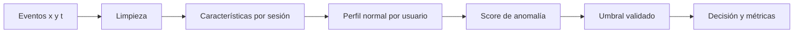

# Detección de anomalías y secuencias

> [!abstract] Pregunta del módulo
> ¿Cómo aprender el comportamiento normal de una entidad y detectar desviaciones sin contaminar la evaluación con información de otras sesiones o usuarios?

## Recordatorio de niveles

```text
evento → trayectoria → ventana → sesión → usuario → población
```

| Nivel | Ejemplo | Riesgo si se mezcla |
|---|---|---|
| evento | movimiento/clic | autocorrelación |
| ventana | 5 segundos | solapamiento |
| sesión | interacción continua | fuga entre ventanas |
| usuario | identidad | memorizar estilo individual |

## Ruta

1. [[01 De eventos a secuencias y características]]
2. [[02 Particiones temporales, por sesión y por identidad]]
3. [[03 Detección de anomalías e Isolation Forest]]
4. [[04 Umbrales biométricos - FAR, FRR y EER]]
5. [[05 Incertidumbre, ablaciones y análisis de errores]]
6. [[06 Laboratorio del proyecto - dinámica de mouse]]



---

Volver a [[../00 INICIO - Qué es cada cosa y ruta maestra de IA]] · Siguiente: [[01 De eventos a secuencias y características]]

