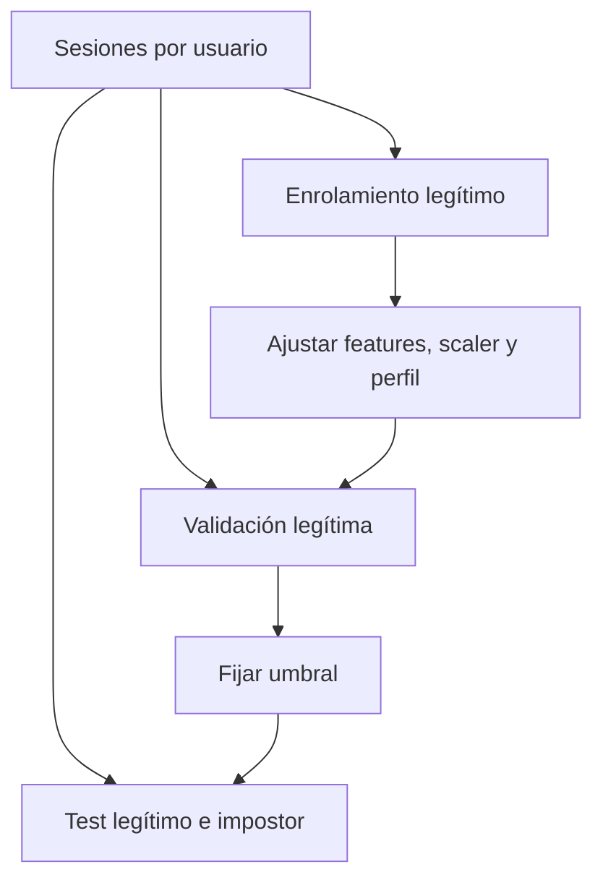

# Particiones temporales, por sesión y por identidad

## La partición define la afirmación

| Partición | Pregunta |
|---|---|
| eventos aleatorios | casi nunca es la pregunta real |
| sesiones futuras mismo usuario | ¿reconozco continuidad personal? |
| usuarios nuevos | ¿generaliza a identidades no vistas? |
| dispositivos nuevos | ¿resiste cambio de hardware? |
| periodos futuros | ¿resiste drift temporal? |

## Autenticación personalizada

Para cada usuario $u$:

1. enrolamiento legítimo;
2. validation legítimo para calibrar tolerancia;
3. test con sesiones legítimas e impostoras;
4. ningún evento o sesión aparece en dos particiones.

## Evaluación externa por usuario

Si hiperparámetros se ajustan usando usuarios, separa usuarios de desarrollo y evaluación. No adaptes decisiones globales con resultados de usuarios finales.

## Orden temporal

Cuando se simula despliegue:

$$t_{train}<t_{validation}<t_{test}.$$

Una división aleatoria puede dejar que el modelo vea comportamiento futuro para predecir pasado.

## Preprocesamiento

Para cada fold o usuario:

1. ajustar imputación/escalado con enrolamiento;
2. transformar validation;
3. escoger umbral;
4. congelar;
5. transformar y evaluar test.



## Identidad del impostor

Usar datos de otros usuarios como ataques simulados puede crear dependencia: una misma sesión impostora podría aparecer contra varias cuentas. La unidad inferencial debe declarar si resume por cuenta, por sesión atacante o por par cuenta-sesión.

## Pruebas programáticas

```python
assert train_sessions.isdisjoint(validation_sessions)
assert train_sessions.isdisjoint(test_sessions)
assert validation_sessions.isdisjoint(test_sessions)
```

También verifica grupos después de cualquier transformación o merge.

## Autoevaluación

1. ¿Qué afirmación permite split por usuario?
2. ¿Por qué validation legítimo puede calibrar una tasa de falsas alarmas?
3. ¿Qué se congela antes de test?
4. ¿Por qué una sesión atacante reutilizada crea dependencia?

---

Anterior: [[01 De eventos a secuencias y características]] · Siguiente: [[03 Detección de anomalías e Isolation Forest]]

