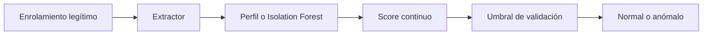

# Detección de anomalías e Isolation Forest

## Formulación one-class

Se dispone principalmente de comportamiento normal. El modelo aprende una región o score de normalidad y detecta desviaciones.

No demuestra intención maliciosa. “Anómalo” significa incompatible con el perfil aprendido bajo la representación usada.

## Baseline por distancia estandarizada

Con media $\mu_j$ y desviación $\sigma_j$ de enrolamiento:

$$z_j=\frac{x_j-\mu_j}{\sigma_j},$$

$$s(x)=\sqrt{\frac1D\sum_jz_j^2}.$$

Es interpretable, pero asume escalas independientes y puede fallar con correlaciones.

## Distancia de Mahalanobis

$$d_M(x)=\sqrt{(x-\mu)^T\Sigma^{-1}(x-\mu)}.$$

Considera correlaciones, pero estimar/invertir $\Sigma$ es inestable con pocas sesiones o muchas características. Se necesita regularización o reducción dimensional.

## Isolation Forest

Idea: puntos aislados requieren menos particiones aleatorias para separarse.

Cada árbol:

1. elige una característica;
2. elige un corte aleatorio entre mínimo y máximo;
3. divide recursivamente;
4. mide profundidad de aislamiento.

Profundidad corta sugiere anomalía.

## Score y convención

Las APIs pueden devolver “normalidad alta” o “anomalía alta”. Define una convención única:

$$s_{anomalo}\uparrow\Rightarrow\text{más sospechoso}.$$

Si una librería devuelve lo contrario, cambia el signo una sola vez en un adaptador y prueba la convención.

## Hiperparámetros

| Parámetro | Efecto |
|---|---|
| `n_estimators` | estabilidad del promedio |
| `max_samples` | escala de cada árbol |
| `max_features` | subespacios considerados |
| `contamination` | umbral interno, no prevalencia verdadera garantizada |

Para un proyecto académico es preferible obtener scores y calibrar un umbral externo con validation.

## Limitaciones

- depende de representación y escala;
- pocos datos legítimos producen perfil frágil;
- comportamiento cambia con tiempo/dispositivo;
- anomalías colectivas pueden no ser puntos aislados;
- el score no es probabilidad calibrada.

## Autoevaluación

1. ¿Qué significa realmente anomalía?
2. ¿Por qué Mahalanobis puede ser inestable?
3. ¿Qué representa profundidad corta en Isolation Forest?
4. ¿Por qué el score no es una probabilidad?

---

Anterior: [[02 Particiones temporales, por sesión y por identidad]] · Siguiente: [[04 Umbrales biométricos - FAR, FRR y EER]]

