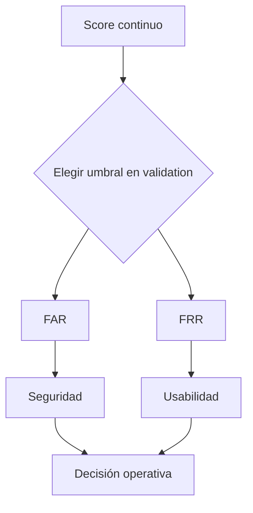

# Umbrales biométricos: FAR, FRR y EER

![[../assets/ruta maestra ia/09-far-frr-umbral.svg|900]]

Supón score de anomalía alto = más sospechoso y decisión de impostor si $s\ge t$.

## FAR

False Acceptance Rate: fracción de intentos impostores aceptados como legítimos.

$$FAR=\frac{FN_{impostor}}{N_{impostor}}.$$

En convención positiva=impostor, coincide con tasa de falsos negativos.

## FRR

False Rejection Rate: fracción de intentos legítimos rechazados.

$$FRR=\frac{FP_{impostor}}{N_{legitimo}}.$$

Coincide con tasa de falsos positivos bajo la misma convención.

> [!warning] Declara la clase positiva
> La terminología biométrica habla de aceptación/rechazo; clasificación habla de positivo/negativo. Escribe siempre qué clase consideras positiva para evitar intercambiar FAR y FRR.

## Movimiento del umbral

- umbral alto: pocas alarmas → FAR puede subir y FRR bajar;
- umbral bajo: muchas alarmas → FAR baja y FRR sube.

## EER

Equal Error Rate es el punto donde FAR y FRR son aproximadamente iguales. Sirve para comparar sistemas, pero no siempre es el punto operativo adecuado.

$$t_{EER}=\arg\min_t|FAR(t)-FRR(t)|.$$

## Coste operativo

Si aceptar impostor es mucho más costoso:

$$C(t)=C_{FA}\,FA(t)+C_{FR}\,FR(t).$$

El umbral debe minimizar una función de coste o cumplir una restricción de seguridad definida con validation.

## Métricas por usuario

Reporta:

- macro: promedio de métrica por usuario;
- micro: conteos agregados de todas las sesiones;
- distribución: mediana, rango e intervalos.

Un promedio global puede ocultar usuarios para quienes el sistema falla.

## Curva DET

Grafica FRR frente a FAR, a menudo en ejes transformados. Hace visible el compromiso entre seguridad y comodidad.

## Autoevaluación

1. Define clase positiva antes de escribir FAR y FRR.
2. ¿Por qué EER no es automáticamente el mejor umbral?
3. ¿Qué diferencia hay entre promedio macro y micro?
4. ¿Dónde se fija el umbral y dónde se reporta una vez?

---

Anterior: [[03 Detección de anomalías e Isolation Forest]] · Siguiente: [[05 Incertidumbre, ablaciones y análisis de errores]]
