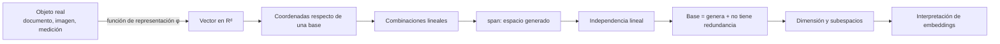

# Espacios vectoriales, subespacios y embeddings

Estas notas explican con detalle la parte teórica del módulo 04. La pregunta que conecta todo es:

> [!question] Pregunta guía
> ¿Cómo puede un algoritmo representar un documento, una imagen o una medición mediante números sin confundir el objeto real con su representación?

![[assets/01-mapa-del-modulo.jpg|900]]

## Ruta recomendada

1. [[01 Vectores, puntos, bases y coordenadas]]
2. [[02 Espacios vectoriales, combinaciones y span]]
3. [[03 Independencia, bases, dimensión y subespacios]]
4. [[04 Embeddings y representación de objetos]]
5. [[05 Comprobación con NumPy]]
6. [[06 Resumen, errores frecuentes y preguntas de repaso]]

## El mapa mental completo

## Las cuatro distinciones que debes conservar

| Concepto | Qué es | Qué no es |
| --- | --- | --- |
| Objeto | La entidad original: palabra, documento, imagen o medición. | No es la lista de números que la representa. |
| Vector | Elemento de un espacio vectorial; puede sumarse y multiplicarse por escalares. | No tiene que ser una flecha ni una lista de números por definición. |
| Coordenadas | Coeficientes que reconstruyen un vector respecto de una base ordenada. | No son el vector mismo; cambian si cambia la base. |
| Embedding | Función que asigna a cada objeto un vector de dimensión fija. | No garantiza por sí solo significado, causalidad ni una interpretación aislada de cada componente. |

> [!tip] Cadena para memorizar
> **Objeto → representación vectorial → coordenadas → geometría interpretable bajo una medida.**

## Fuente del módulo

- PDF completo: ![[assets/module_04.pdf]]
- Las imágenes insertadas en estas notas provienen de las diapositivas del mismo PDF.

## Objetivos de aprendizaje

Al terminar deberías poder:

- distinguir un punto, un vector y sus coordenadas;
- construir vectores mediante combinaciones lineales;
- explicar qué significa `span` o espacio generado;
- detectar dependencia y redundancia;
- definir base, dimensión y subespacio;
- explicar qué es un embedding y qué límites tiene su interpretación;
- usar NumPy para comprobar una afirmación matemática ya formulada.

## Cómo estudiar este material

En cada nota sigue tres pasos: **definir**, **calcular** e **interpretar**. Por ejemplo, no basta con calcular que $v_3=v_1+v_2$: debes decir que $v_3$ es redundante y que añadirlo no cambia el espacio generado.

