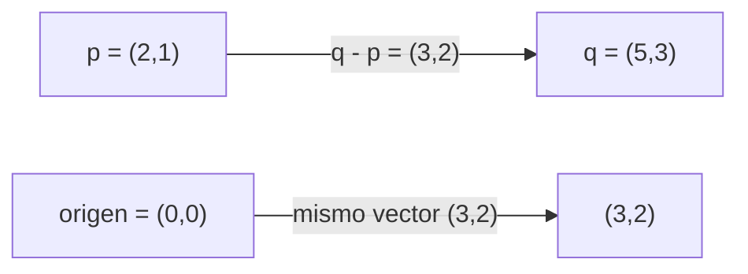

---
tags:
  - algebra-lineal
  - vectores
  - coordenadas
related: "[[00 Índice - Espacios vectoriales y embeddings]]"
---

# Vectores, puntos, bases y coordenadas

Anterior: [[00 Índice - Espacios vectoriales y embeddings]] · Siguiente: [[02 Espacios vectoriales, combinaciones y span]]

## 1. Números reales y pertenencia

$\mathbb{R}$ es el conjunto de los números reales. El símbolo $\in$ se lee «pertenece a». Por ejemplo:

$$
3\in\mathbb{R},\qquad (21.5,68)\in\mathbb{R}^2.
$$

$\mathbb{R}^2=\mathbb{R}\times\mathbb{R}$ contiene pares **ordenados** de números reales. El orden importa: en una observación $(21.5,68)$ podemos decidir que la primera componente es temperatura y la segunda humedad. Intercambiarlas produciría otra observación con otro significado.

En general,

$$
\mathbb{R}^n=\{(x_1,\ldots,x_n):x_i\in\mathbb{R}\}.
$$

## 2. ¿Punto o vector?

El mismo par $(21.5,68)$ puede cumplir dos papeles:

- como **punto**, indica una ubicación en un sistema de coordenadas;
- como **vector**, es un elemento algebraico que admite suma y multiplicación por escalares.

Las coordenadas pueden ser idénticas y, sin embargo, la interpretación cambia según la pregunta. Un punto suele contestar «¿dónde?». Un vector puede contestar «¿qué desplazamiento?» o «¿qué elemento del espacio estamos operando?».

> [!warning] Error frecuente
> La notación no decide por sí sola qué representa el objeto. Antes de operar, aclara si estás tratando el par como ubicación, desplazamiento, medición o representación.

## 3. Un vector no está atado al origen

Si $p=(2,1)$ y $q=(5,3)$, el desplazamiento de $p$ a $q$ es

$$
q-p=(5-2,3-1)=(3,2).
$$

La flecha desde $(0,0)$ hasta $(3,2)$ representa el mismo vector libre: conserva magnitud, dirección y sentido. Trasladar una flecha paralelamente no cambia el vector que representa.

La magnitud euclídea de $v=(3,2)$ es

$$
\lVert v\rVert_2=\sqrt{3^2+2^2}=\sqrt{13}.
$$

## 4. Base estándar

En $\mathbb{R}^2$, la base estándar es

$$
e_1=(1,0),\qquad e_2=(0,1).
$$

$e_1$ marca una unidad horizontal y $e_2$ una unidad vertical. Son unitarios, independientes y están alineados con los ejes. Con ellos construimos

$$
v=(3,2)=3e_1+2e_2.
$$

Los coeficientes $3$ y $2$ son las coordenadas de $v$ en la base estándar. Geométricamente: avanzamos tres unidades en la dirección $e_1$ y luego dos en la dirección $e_2$.

## 5. Qué es una base

Una base ordenada $B=(b_1,\ldots,b_n)$ es un conjunto de direcciones que cumple dos propiedades:

1. **genera** el espacio: todo vector se obtiene combinando los $b_i$;
2. es **linealmente independiente**: ninguna dirección es redundante.

Si $B$ es una base, cada vector $v$ tiene una representación única

$$
v=c_1b_1+\cdots+c_nb_n.
$$

La columna de coeficientes

$$
[v]_B=\begin{bmatrix}c_1\\ \vdots\\ c_n\end{bmatrix}
$$

es el vector de coordenadas de $v$ respecto de $B$.

## 6. Vector y coordenadas no son lo mismo

El vector geométrico no cambia cuando cambiamos de base; cambian los números que usamos para describirlo. Sea $v=(3,2)$ y la base inclinada

$$
b_1=(1,1),\qquad b_2=(1,-1).
$$

Buscamos $a,b$ tales que $v=ab_1+bb_2$:

$$
a(1,1)+b(1,-1)=(a+b,a-b)=(3,2).
$$

Por tanto, $a+b=3$ y $a-b=2$, de donde $a=2.5$ y $b=0.5$. Así,

$$
[v]_E=\begin{bmatrix}3\\2\end{bmatrix},\qquad
[v]_B=\begin{bmatrix}2.5\\0.5\end{bmatrix}.
$$

Es el **mismo vector**, descrito en dos lenguajes de referencia distintos.

## 7. La flecha es solo una visualización

Un vector se define por la estructura algebraica del espacio, no por tener forma de flecha. También pueden ser vectores:

- una tupla $(x_1,\ldots,x_n)\in\mathbb{R}^n$;
- una matriz en $M_{m\times n}(\mathbb{R})$;
- un polinomio en un espacio como $P_2$;
- una función continua en $C(\mathbb{R})$.

Lo esencial es que estén definidas una suma y una multiplicación por escalares que satisfagan los axiomas de espacio vectorial.

## Comprobación rápida

1. ¿Por qué $(3,2)$ puede ser un punto o un vector?
2. ¿Qué cambia al pasar de la base estándar a una base inclinada?
3. Expresa $(4,-1)$ como combinación de $e_1$ y $e_2$.
4. ¿Por qué una matriz puede ser un vector aunque no sea una flecha?

