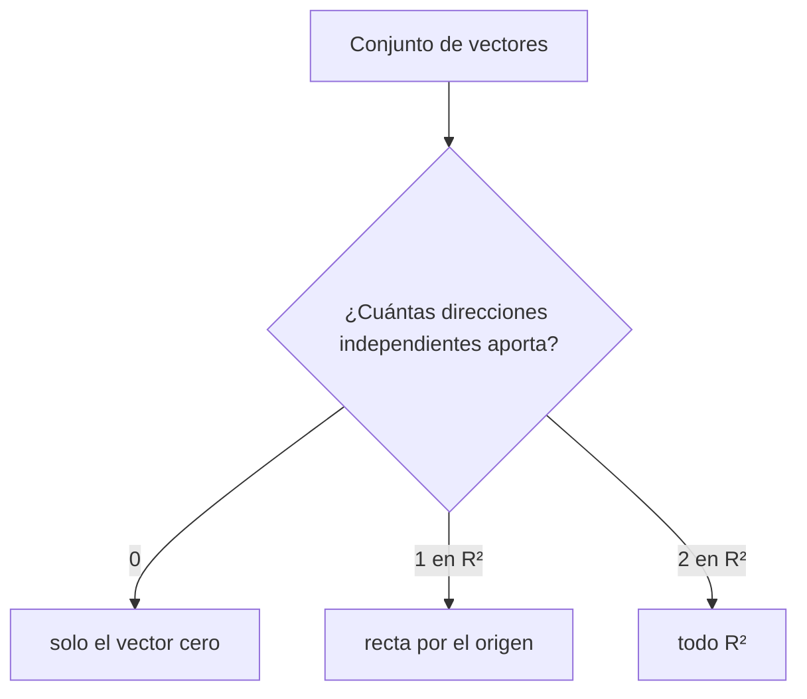
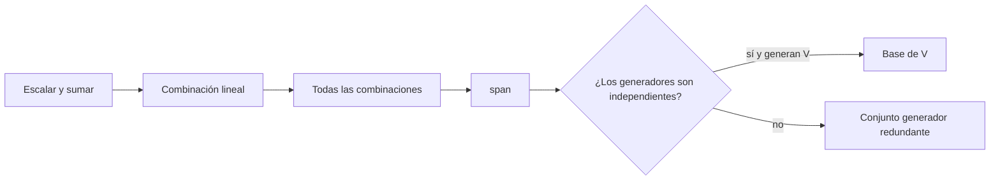

---
tags:
  - algebra-lineal
  - espacio-vectorial
  - span
related: "[[00 Índice - Espacios vectoriales y embeddings]]"
---

# Espacios vectoriales, combinaciones y `span`

Anterior: [[01 Vectores, puntos, bases y coordenadas]] · Siguiente: [[03 Independencia, bases, dimensión y subespacios]]

## 1. Espacio vectorial

Un espacio vectorial $V$ sobre $\mathbb{R}$ combina:

- un conjunto de elementos llamados vectores;
- una suma $+:V\times V\to V$;
- una multiplicación por escalares $\mathbb{R}\times V\to V$.

La notación de las flechas indica **cierre**: si $u,v\in V$, entonces $u+v\in V$; si $\lambda\in\mathbb{R}$ y $v\in V$, entonces $\lambda v\in V$.

Además deben cumplirse los axiomas habituales: asociatividad y conmutatividad de la suma, existencia del vector cero y de opuestos aditivos, distributividad y compatibilidad de la multiplicación escalar, y $1v=v$.

> [!tip] Intuición
> Un espacio vectorial es un universo en el que podemos **sumar elementos y escalarlos sin salir del universo**, respetando reglas coherentes.

## 2. Combinación lineal

Dados $v_1,\ldots,v_k\in V$ y escalares $a_1,\ldots,a_k\in\mathbb{R}$, una combinación lineal es

$$
a_1v_1+\cdots+a_kv_k.
$$

Los escalares controlan cuánto aporta cada dirección. Pueden ser positivos, negativos o cero. Por ejemplo, con

$$
u=(1,1),\qquad v=(2,0),
$$

obtenemos

$$
w=2u+v=2(1,1)+(2,0)=(4,2).
$$

Una combinación lineal no es una simple agrupación: produce un nuevo vector mediante dos operaciones permitidas por el espacio, escalar y sumar.

## 3. Espacio generado o `span`

El espacio generado por $v_1,\ldots,v_k$ es el conjunto de **todas** sus combinaciones lineales:

$$
\operatorname{span}\{v_1,\ldots,v_k\}
=\left\{a_1v_1+\cdots+a_kv_k:a_i\in\mathbb{R}\right\}.
$$

El `span` responde: «¿qué vectores puedo construir con estas direcciones?».

### Un vector no nulo

Si $v\neq0$, entonces

$$
\operatorname{span}\{v\}=\{\lambda v:\lambda\in\mathbb{R}\}.
$$

Esto forma una recta completa por el origen. Incluye múltiplos positivos, negativos y el vector cero.

### Dos vectores no paralelos en $\mathbb{R}^2$

Si $u$ y $v$ no son paralelos, aportan dos direcciones independientes y

$$
\operatorname{span}\{u,v\}=\mathbb{R}^2.
$$

Si son paralelos, el `span` sigue siendo solo una recta.

## 4. Matriz de columnas

Podemos agrupar generadores como columnas de una matriz:

$$
A=\begin{bmatrix}|&&|\\v_1&\cdots&v_k\\|&&|\end{bmatrix}.
$$

Entonces una combinación lineal se escribe $Ac$, donde $c$ contiene los coeficientes. Por ello:

$$
\operatorname{Col}(A)=\operatorname{span}\{v_1,\ldots,v_k\}.
$$

Resolver $Ac=x$ pregunta si $x$ pertenece al espacio generado y, si pertenece, qué coeficientes lo construyen.

## 5. Qué ocurre al añadir un vector redundante

Sean

$$
v_1=(1,0),\quad v_2=(0,1),\quad v_3=(1,1).
$$

Como $v_3=v_1+v_2$, cualquier combinación que use $v_3$ puede reescribirse usando solo $v_1$ y $v_2$:

$$
av_1+bv_2+cv_3=(a+c)v_1+(b+c)v_2.
$$

Por tanto,

$$
\operatorname{span}\{v_1,v_2,v_3\}=\operatorname{span}\{v_1,v_2\}.
$$

Añadir $v_3$ no amplía el espacio generado; solo añade redundancia.

## 6. Relación entre combinación, `span` y base

## Errores frecuentes

- Creer que `span` es una sola combinación. En realidad es el conjunto de todas.
- Olvidar escalares negativos o cero.
- Pensar que más vectores siempre generan un espacio mayor. Un vector redundante no lo amplía.
- Confundir «pertenece al `span`» con «es uno de los generadores».

## Comprobación rápida

1. Describe geométricamente $\operatorname{span}\{(2,4)\}$.
2. ¿Generan $(1,0)$ y $(2,0)$ todo $\mathbb{R}^2$? ¿Por qué?
3. Demuestra que $(3,3)$ pertenece a $\operatorname{span}\{(1,0),(0,1)\}$.
4. Si $v_3=2v_1-v_2$, ¿cambia el `span` al añadir $v_3$ a $\{v_1,v_2\}$?

