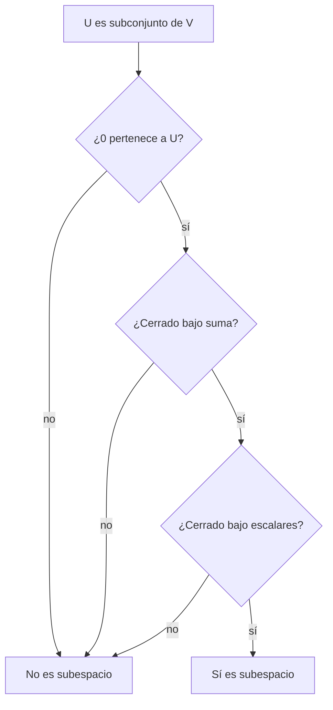

---
tags:
  - algebra-lineal
  - independencia-lineal
  - bases
  - subespacios
related: "[[00 Índice - Espacios vectoriales y embeddings]]"
---

# Independencia, bases, dimensión y subespacios

Anterior: [[02 Espacios vectoriales, combinaciones y span]] · Siguiente: [[04 Embeddings y representación de objetos]]

## 1. Independencia lineal

Los vectores $v_1,\ldots,v_k$ son linealmente independientes si la ecuación homogénea

$$
a_1v_1+\cdots+a_kv_k=0
$$

solo tiene la solución trivial

$$
a_1=\cdots=a_k=0.
$$

Esto significa que ninguna dirección del conjunto puede construirse combinando las demás. No hay redundancia.

Si existe una solución no trivial, el conjunto es dependiente. En ese caso, al menos uno de los vectores puede despejarse como combinación de los otros. Por ejemplo,

$$
v_3=v_1+v_2
\quad\Longleftrightarrow\quad
v_1+v_2-v_3=0.
$$

Los coeficientes $(1,1,-1)$ no son todos cero, así que el conjunto $\{v_1,v_2,v_3\}$ es dependiente.

> [!important] Método mental
> Para demostrar dependencia basta encontrar **una relación no trivial**. Para demostrar independencia hay que justificar que la relación homogénea solo admite coeficientes nulos.

## 2. Interpretación geométrica

En $\mathbb{R}^2$:

- dos vectores no nulos y no paralelos son independientes;
- dos vectores paralelos son dependientes;
- cualquier conjunto de tres o más vectores es dependiente, porque el plano solo tiene dos direcciones independientes.

En $\mathbb{R}^3$, tres vectores pueden ser independientes si no quedan contenidos en un mismo plano por el origen.

## 3. Base: generar sin redundancia

Una base de $V$ es un conjunto que:

1. genera todo $V$;
2. es linealmente independiente.

![[assets/19-base-sin-redundancia.jpg|850]]

Estas condiciones se complementan:

| Situación | ¿Independiente? | ¿Genera todo el espacio? | ¿Es base? |
| --- | ---: | ---: | ---: |
| Faltan direcciones | Sí | No | No |
| Sobran vectores redundantes | No | Sí | No |
| Genera sin redundancia | Sí | Sí | Sí |

La base estándar $E=(e_1,e_2)$ es una base de $\mathbb{R}^2$. Un solo vector no puede ser base de $\mathbb{R}^2$ porque solo genera una recta. Tres vectores pueden generar $\mathbb{R}^2$, pero necesariamente contienen redundancia.

## 4. Por qué una base da coordenadas únicas

Supón que un mismo vector $x$ tuviera dos representaciones en la base $B=(b_1,\ldots,b_n)$:

$$
x=\sum_i c_ib_i=\sum_i d_ib_i.
$$

Restando,

$$
0=\sum_i(c_i-d_i)b_i.
$$

Como los $b_i$ son independientes, todos los coeficientes deben ser cero: $c_i-d_i=0$. Por tanto, $c_i=d_i$ para todo $i$. La unicidad no es una regla añadida: es consecuencia directa de la independencia.

## 5. Dimensión

La dimensión de un espacio vectorial finito es la cantidad de vectores de cualquiera de sus bases:

$$
\dim(V)=\text{número de direcciones independientes necesarias para generar }V.
$$

Ejemplos:

- $\dim(\mathbb{R}^2)=2$;
- $\dim(\mathbb{R}^3)=3$;
- si $L=\operatorname{span}\{(1,2)\}\subset\mathbb{R}^2$, entonces $\dim(L)=1$.

> [!warning] Dimensión no es número de componentes
> Los vectores de la recta $L\subset\mathbb{R}^2$ tienen dos componentes, pero el subespacio tiene dimensión 1 porque basta una dirección para generarlo.

## 6. Rango

El rango de una matriz $A$ es la dimensión de su espacio columna:

$$
\operatorname{rank}(A)=\dim(\operatorname{Col}(A)).
$$

Equivale al número de columnas linealmente independientes. Si una matriz tiene tres columnas en $\mathbb{R}^2$ y su rango es 2, contiene dos direcciones independientes, no tres.

## 7. Subespacio

Un subconjunto $U\subseteq V$ es subespacio si conserva la estructura vectorial. Basta comprobar:

1. $0\in U$;
2. si $u,v\in U$, entonces $u+v\in U$;
3. si $u\in U$ y $\lambda\in\mathbb{R}$, entonces $\lambda u\in U$.

Estas tres propiedades pueden condensarse en el criterio:

$$
u,v\in U,\ a,b\in\mathbb{R}
\quad\Longrightarrow\quad
au+bv\in U.
$$

### Ejemplo que sí es subespacio

$$
L=\{t(1,2):t\in\mathbb{R}\}
=\operatorname{span}\{(1,2)\}.
$$

Contiene el cero cuando $t=0$, y sumar o escalar múltiplos de $(1,2)$ produce otro múltiplo del mismo vector.

También puede escribirse

$$
L=\{(x_1,x_2)\in\mathbb{R}^2:x_2=2x_1\}.
$$

### Ejemplo que no es subespacio

$$
S=\{(x_1,x_2)\in\mathbb{R}^2:x_2=2x_1+1\}.
$$

Es una recta paralela a $L$, pero desplazada. El vector cero no pertenece a $S$ porque

$$
0\neq2\cdot0+1.
$$

Una sola condición fallida basta para descartarlo como subespacio.

## Comprobación rápida

1. ¿Por qué $\{(1,0),(0,1),(1,1)\}$ es dependiente?
2. ¿Cuál es la diferencia entre un conjunto generador y una base?
3. ¿Por qué una base garantiza coordenadas únicas?
4. Decide si $\{(x,y):y=3x\}$ es subespacio de $\mathbb{R}^2$.
5. Decide si $\{(x,y):y=3x-2\}$ es subespacio y señala la primera condición que falla.

