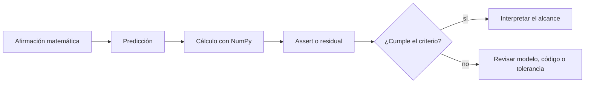
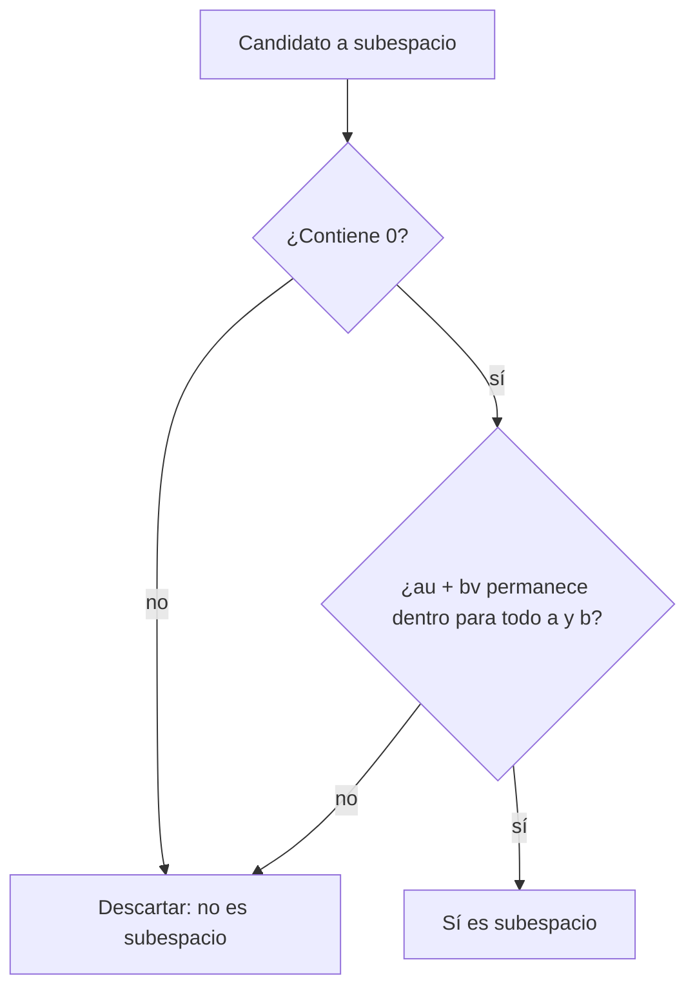

---
tags:
  - numpy
  - algebra-lineal
  - verificacion
related: "[[00 Índice - Espacios vectoriales y embeddings]]"
---

# Comprobación con NumPy

Anterior: [[04 Embeddings y representación de objetos]] · Siguiente: [[06 Resumen, errores frecuentes y preguntas de repaso]]

## 1. El código comprueba; la definición justifica

NumPy permite verificar ejemplos concretos, pero no reemplaza una definición ni una demostración. El orden correcto es:

1. formular la afirmación matemática;
2. predecir el resultado;
3. calcularlo con NumPy;
4. interpretar si el resultado coincide y con qué tolerancia.



![[assets/25-numpy.jpg|850]]

```python
import numpy as np

np.set_printoptions(precision=6, suppress=True)
```

## 2. Caso conductor: documentos representados por filas

Sean tres documentos y una regla $\varphi$ que cuenta dos características observables. La matriz

$$
\Phi=
\begin{bmatrix}
2&1\\
1&3\\
3&4
\end{bmatrix}
\in\mathbb{R}^{3\times2}
$$

tiene una fila por documento y una columna por característica. El documento `d1` **no es** el vector $(2,1)$; $\varphi(d_1)=(2,1)$ es la representación que produce la regla elegida.

```python
documents = ["d1", "d2", "d3"]
phi = np.array([[2.0, 1.0], [1.0, 3.0], [3.0, 4.0]])

assert phi.shape == (len(documents), 2)
print(dict(zip(documents, phi, strict=True)))
```

El `assert` comprueba la forma esperada $(3,2)$; no demuestra que las dos características sean suficientes para la tarea. Esa suficiencia necesita un criterio externo.

## 3. Combinación lineal

Para $u=(1,1)$ y $v=(2,0)$ esperamos $2u+v=(4,2)$:

```python
import numpy as np

u = np.array([1.0, 1.0])
v = np.array([2.0, 0.0])
w = 2 * u + v

assert np.allclose(w, np.array([4.0, 2.0]))
```

`np.allclose` compara con tolerancia. Es preferible a `w == esperado` para cálculos de punto flotante, porque muchos números reales no tienen representación binaria exacta.

## 4. Coordenadas en otra base

Sea la base $B=(b_1,b_2)$, con

$$
b_1=(1,1),\qquad b_2=(1,-1),
$$

y sea $x=(3,2)$. Construimos una matriz colocando los vectores de la base como **columnas**:

```python
b1 = np.array([1.0, 1.0])
b2 = np.array([1.0, -1.0])
B = np.column_stack([b1, b2])
x = np.array([3.0, 2.0])

c = np.linalg.solve(B, x)
assert np.allclose(c, np.array([2.5, 0.5]))
assert np.allclose(B @ c, x)
```

La ecuación $Bc=x$ significa

$$
c_1b_1+c_2b_2=x.
$$

Por eso `c` contiene $[x]_B$. `np.linalg.solve` requiere una matriz cuadrada invertible; aquí eso equivale a que $b_1$ y $b_2$ formen una base de $\mathbb{R}^2$.

> [!warning] Filas vs. columnas
> Si apilas los vectores como filas, el producto ya no representa la misma combinación. En esta convención, cada vector de la base es una columna.

## 5. Rango e independencia

Considera

$$
a_1=(1,0),\quad a_2=(0,1),\quad a_3=(1,1).
$$

Como $a_3=a_1+a_2$, hay tres columnas pero solo dos direcciones independientes:

```python
a1 = np.array([1.0, 0.0])
a2 = np.array([0.0, 1.0])
a3 = np.array([1.0, 1.0])
A = np.column_stack([a1, a2, a3])

rank = np.linalg.matrix_rank(A)
assert rank == 2
assert np.allclose(a3, a1 + a2)
```

Interpretación: `rank == 2` es el número de direcciones independientes, no el número total de columnas.

## 6. Dependencia exacta y casi dependencia

### Dependencia exacta

Si $a_3=a_1+a_2$ por construcción algebraica, la dependencia es exacta. La igualdad proporciona una prueba clara.

### Casi dependencia

En datos reales, una columna podría ser casi combinación de otras debido a ruido o redondeo:

```python
epsilon = 1e-12
almost_dependent = np.array([
    [1.0, 1.0],
    [1.0, 1.0 + epsilon],
])

singular_values = np.linalg.svd(almost_dependent, compute_uv=False)
rank_default = np.linalg.matrix_rank(almost_dependent)
rank_with_tol = np.linalg.matrix_rank(almost_dependent, tol=1e-10)

assert rank_default == 2
assert rank_with_tol == 1
print("valores singulares:", [f"{value:.3e}" for value in singular_values])
print("rangos:", rank_default, rank_with_tol)
```

Las dos columnas no son exactamente iguales porque $\varepsilon\neq0$, de modo que el rango algebraico es 2. Sin embargo, una dirección singular es del orden de $10^{-13}$: con `tol=1e-10` se trata como numéricamente nula y el rango reportado cambia a 1.

El rango numérico puede depender de la escala y la tolerancia. Internamente se examinan valores singulares y se trata como cero aquello que cae por debajo de un umbral. Por eso la conclusión correcta incluye el criterio: «rango numérico 1 con tolerancia $10^{-10}$».

Puedes inspeccionar los valores singulares:

```python
s = np.linalg.svd(almost_dependent, compute_uv=False)
print(s)
```

Un valor singular muy pequeño respecto de los otros sugiere una dirección casi redundante.

## 7. Comprobar un candidato a subespacio

Considera

$$
U=\{(x_1,x_2):x_2=2x_1\}
\quad\text{y}\quad
S=\{(x_1,x_2):x_2=2x_1+1\}.
$$

$U$ es una recta por el origen. $S$ es una recta paralela desplazada y falla inmediatamente porque no contiene al vector cero:

```python
in_U = lambda q: bool(np.isclose(q[1], 2.0 * q[0]))
in_S = lambda q: bool(np.isclose(q[1], 2.0 * q[0] + 1.0))

zero = np.zeros(2)
u_U = np.array([1.0, 2.0])
v_U = np.array([-2.0, -4.0])

assert in_U(zero)
assert in_U(3.0 * u_U - 0.5 * v_U)
assert not in_S(zero)
```

El código comprueba ejemplos representativos y encuentra un contraejemplo decisivo para $S$. La justificación general de que $U$ es subespacio sigue siendo algebraica: toda combinación $au+bv$ de múltiplos de $(1,2)$ vuelve a ser un múltiplo de $(1,2)$.



## 8. Comprobar pertenencia a un `span`

Para preguntar si $x$ pertenece al `span` de las columnas de una matriz no cuadrada, podemos resolver por mínimos cuadrados:

```python
A = np.column_stack([
    np.array([1.0, 2.0, 0.0]),
    np.array([0.0, 1.0, 1.0]),
])
x = np.array([2.0, 5.0, 1.0])

c, *_ = np.linalg.lstsq(A, x, rcond=None)
residuo = np.linalg.norm(A @ c - x)

print(c, residuo)
```

Si el residuo es cero en aritmética exacta, $x$ pertenece al `span`. Numéricamente comprobamos si es suficientemente pequeño para la escala y precisión del problema.

## 9. Interpretar embeddings con límites explícitos

La matriz `phi` permite comparar representaciones, pero una coordenada aislada no adquiere semántica ni causalidad por aparecer en el arreglo. Antes de interpretar distancias o ángulos hay que declarar cómo se construyó $\varphi$ y qué medida geométrica es pertinente.

> [!important] Límite de la evidencia numérica
> Un `assert` exitoso respalda una identidad o un caso concreto dentro de la precisión usada. No convierte la observación en una demostración general ni valida por sí solo el significado de la representación.

## 10. Lista de comprobación antes de aceptar el resultado

- ¿Qué afirmación matemática estoy evaluando?
- ¿Coloqué los vectores como columnas?
- ¿El resultado esperado es exacto o numérico?
- ¿Qué significa el rango en este contexto?
- ¿La escala de los datos hace razonable la tolerancia?
- ¿Estoy comprobando un ejemplo o demostrando una propiedad general?

## Ejercicios

1. Verifica que $(5,1)=3(1,1)+(2,-2)$.
2. Halla con `solve` las coordenadas de $(4,1)$ en la base $((1,1),(1,-1))$.
3. Construye una matriz con cuatro columnas en $\mathbb{R}^3$ y explica por qué no pueden ser todas independientes.
4. Modifica `epsilon` y observa cuándo cambia el rango numérico.
5. Cambia el desplazamiento de $S$ de $1$ a $0$ y explica por qué cambia el veredicto de subespacio.
