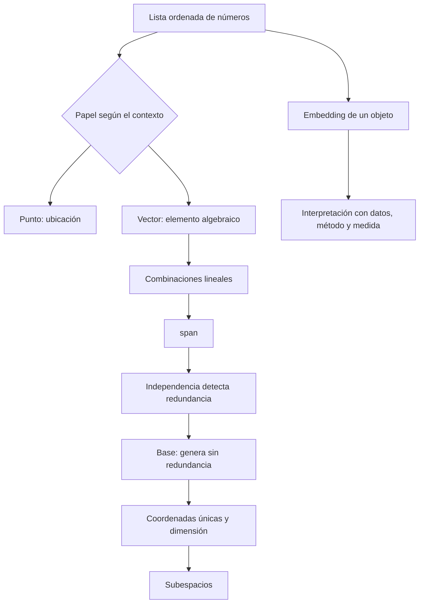

---
tags:
  - algebra-lineal
  - repaso
  - embeddings
related: "[[00 Índice - Espacios vectoriales y embeddings]]"
---

# Resumen, errores frecuentes y preguntas de repaso

Anterior: [[05 Comprobación con NumPy]] · Volver al [[00 Índice - Espacios vectoriales y embeddings|índice]]

## Resumen en una página

| Concepto | Definición breve | Pregunta que responde |
| --- | --- | --- |
| Vector | Elemento de un espacio con suma y multiplicación escalar. | ¿Qué objeto algebraico puedo combinar? |
| Coordenadas | Coeficientes de un vector respecto de una base ordenada. | ¿Cómo describo ese vector en esta base? |
| Combinación lineal | $a_1v_1+\cdots+a_kv_k$. | ¿Qué construyo al escalar y sumar? |
| `span` | Todas las combinaciones lineales de un conjunto. | ¿Qué espacio alcanzan estos vectores? |
| Independencia | La combinación que da cero solo usa coeficientes nulos. | ¿Hay una dirección redundante? |
| Base | Conjunto independiente que genera todo el espacio. | ¿Cuál es un lenguaje mínimo y completo? |
| Dimensión | Número de vectores de una base. | ¿Cuántas direcciones independientes tiene el espacio? |
| Subespacio | Subconjunto que contiene cero y es cerrado bajo suma y escalares. | ¿Se conserva dentro de él la estructura vectorial? |
| Embedding | Función $f:X\to\mathbb{R}^d$. | ¿Cómo represento objetos mediante vectores? |
| Rango | Dimensión del espacio columna. | ¿Cuántas direcciones independientes contienen las columnas? |

## Cadena conceptual

## Errores frecuentes y su corrección

### «Un vector es una flecha»

La flecha es una representación geométrica útil. Tuplas, matrices, polinomios y funciones también pueden ser vectores si pertenecen a un espacio con las operaciones adecuadas.

### «El vector es sus coordenadas»

Las coordenadas dependen de una base. El mismo vector puede tener listas de coordenadas distintas en bases distintas.

### «Tres columnas significan rango 3»

El rango cuenta columnas independientes. Puede haber muchas columnas y pocas direcciones si existe redundancia.

### «Si genera el espacio, ya es una base»

No. Además debe ser independiente. Un conjunto generador redundante no es base.

### «Una recta en $\mathbb{R}^2$ siempre es subespacio»

Solo si pasa por el origen. Una recta desplazada falla al menos la condición $0\in U$.

### «Cada componente de un embedding tiene un significado»

No necesariamente. En representaciones aprendidas, el significado puede estar distribuido y depender de la representación completa.

### «Dos embeddings cercanos prueban una relación causal»

La cercanía solo expresa proximidad bajo una medida específica. No demuestra causalidad.

### «NumPy demuestra la teoría»

NumPy verifica cálculos concretos bajo aritmética finita. La definición y el razonamiento matemático establecen la afirmación general.

## Preguntas para responder sin mirar

1. ¿Qué significa $(21.5,68)\in\mathbb{R}^2$ y por qué importa el orden?
2. ¿Cómo puede el mismo par representar un punto o un vector?
3. ¿Qué información da una base?
4. ¿Por qué las coordenadas cambian al cambiar de base?
5. Define combinación lineal con tus propias palabras.
6. ¿Qué diferencia hay entre una combinación lineal y un `span`?
7. ¿Cómo demuestras que un conjunto es dependiente?
8. ¿Qué dos propiedades definen una base?
9. ¿Por qué las coordenadas en una base son únicas?
10. ¿Por qué una recta en $\mathbb{R}^2$ puede tener dimensión 1 aunque sus vectores tengan dos componentes?
11. ¿Cuáles son las tres pruebas de subespacio?
12. ¿Qué representa cada parte de $f:X\to\mathbb{R}^d$?
13. ¿Qué debes conocer antes de interpretar la cercanía entre embeddings?
14. ¿Qué diferencia existe entre dependencia exacta y casi dependencia numérica?

## Mini examen con respuestas plegadas

> [!question]- 1. Sean $v_1=(1,0)$, $v_2=(0,1)$ y $v_3=(2,3)$. ¿Es independiente el conjunto de tres vectores?
> No. En $\mathbb{R}^2$ no puede haber tres direcciones independientes. Además, $v_3=2v_1+3v_2$, que da una relación explícita no trivial.

> [!question]- 2. ¿Cambia el `span` al quitar $v_3$ del conjunto anterior?
> No. $v_1$ y $v_2$ ya generan todo $\mathbb{R}^2$, y $v_3$ es combinación de ellos.

> [!question]- 3. ¿Es $S=\{(x,y):x+y=0\}$ subespacio de $\mathbb{R}^2$?
> Sí. Puede escribirse $S=\{t(1,-1):t\in\mathbb{R}\}=\operatorname{span}\{(1,-1)\}$, por lo que contiene el cero y está cerrado bajo combinaciones lineales.

> [!question]- 4. ¿Es $T=\{(x,y):x+y=1\}$ subespacio?
> No. $(0,0)$ no satisface $x+y=1$.

> [!question]- 5. Dos documentos tienen similitud coseno alta. ¿Qué puedes concluir?
> Solo que sus representaciones están alineadas según esa medida y ese embedding. La interpretación semántica depende del método y los datos; no implica causalidad ni identidad de los documentos.

## Lista final de dominio

- [ ] Distingo objeto, vector y coordenadas.
- [ ] Puedo expresar un vector en la base estándar y en otra base.
- [ ] Entiendo combinación lineal y `span`.
- [ ] Detecto una relación de dependencia.
- [ ] Explico base y dimensión sin confundir dimensión con componentes.
- [ ] Aplico las tres condiciones de subespacio.
- [ ] Defino un embedding como función de representación.
- [ ] Evito interpretar componentes o cercanías sin contexto.
- [ ] Uso NumPy como comprobación y considero la tolerancia numérica.

