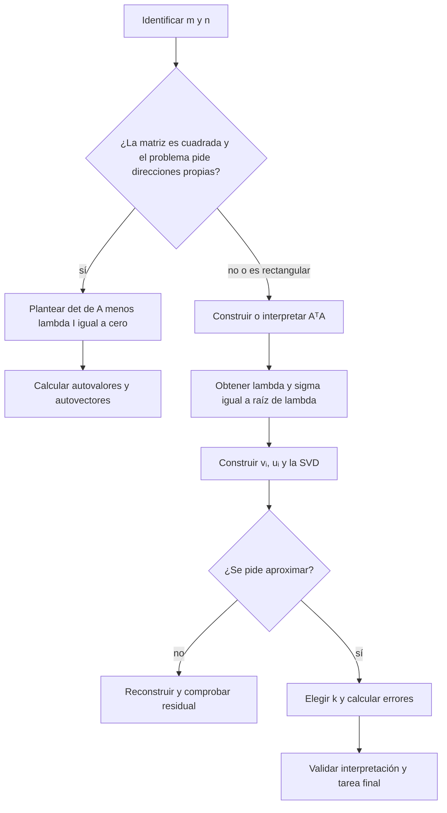

# Formulario razonado: fundamentos, espectro y SVD

Volver al [[00 Índice - Espectro, SVD y rango bajo|índice]] · Repasar el [[00 Glosario visual - términos esenciales para entender SVD|glosario visual]]

> [!abstract] Objetivo
> Este no es un formulario para memorizar símbolos. Cada fórmula responde cinco preguntas: **qué es**, **cómo se lee**, **qué dimensiones tiene**, **por qué funciona** y **cuándo se usa**.

## Cómo estudiar esta nota

Para cada fórmula intenta responder, sin mirar:

1. ¿Qué representa cada símbolo?
2. ¿En qué espacio vive cada objeto?
3. ¿Qué entra y qué sale?
4. ¿Qué idea geométrica expresa?
5. ¿Qué afirmación permite hacer y cuál no?

## 0. Lenguaje y dimensiones

| Símbolo | Tipo | Lectura |
| --- | --- | --- |
| $a,\lambda,\sigma$ | escalar | un solo número |
| $x,v,u\in\mathbb{R}^n$ | vector | columna de $n$ números |
| $A\in\mathbb{R}^{m\times n}$ | matriz | $m$ filas y $n$ columnas |
| $A^T\in\mathbb{R}^{n\times m}$ | transpuesta | intercambia filas y columnas |
| $I_n$ | identidad | matriz $n\times n$ que no cambia un vector |
| $0$ | cero | escalar, vector o matriz cero según el contexto |

### Regla de multiplicación de dimensiones

$$
(m\times n)(n\times p)=(m\times p).
$$

Las dimensiones interiores deben coincidir. Las exteriores determinan el tamaño del resultado.

### Reglas de transposición

$$
(A^T)^T=A,
\qquad
(AB)^T=B^TA^T.
$$

El orden se invierte al transponer un producto. Esta regla permite demostrar que $A^TA$ y $AA^T$ son simétricas.

> [!example] Ejemplo
> Si $A$ es $5\times4$ y $x$ es $4\times1$, entonces $Ax$ existe y es $5\times1$. En cambio, $xA$ no existe porque las dimensiones interiores $1$ y $5$ no coinciden.

## 1. Matriz por vector: combinar columnas

Si

$$
A=\begin{bmatrix}a_1&a_2&\cdots&a_n\end{bmatrix},
\qquad
x=\begin{bmatrix}x_1\\x_2\\\vdots\\x_n\end{bmatrix},
$$

entonces

$$
Ax=x_1a_1+x_2a_2+\cdots+x_na_n.
$$

Visto fila por fila,

$$
(Ax)_i=\sum_{j=1}^{n}a_{ij}x_j.
$$

Cada componente de la salida es el producto interno entre una fila de $A$ y el vector $x$.

### Qué significa

Multiplicar $A$ por $x$ crea una combinación lineal de las columnas de $A$. Los números de $x$ son los pesos.

### Por qué importa

Esta lectura explica tres ideas posteriores:

- la imagen de $A$ está generada por sus columnas;
- $Ax=0$ significa que cierta combinación de columnas se cancela;
- en $Av_i=\sigma_i u_i$, la dirección $v_i$ indica cómo combinar columnas para producir la dirección $u_i$.

## 2. Producto interno: medir alineación

$$
\langle x,y\rangle=x^Ty=\sum_{i=1}^{n}x_i y_i.
$$

### Cómo se lee

«Producto interno de $x$ con $y$» o «$x$ transpuesta por $y$».

### Dimensiones

$$
(1\times n)(n\times1)=1\times1.
$$

El resultado es un escalar.

### Interpretación geométrica

$$
x^Ty=\lVert x\rVert_2\lVert y\rVert_2\cos\theta.
$$

| Resultado | Interpretación |
| --- | --- |
| $x^Ty>0$ | apuntan en sentidos parecidos |
| $x^Ty=0$ | son ortogonales |
| $x^Ty<0$ | apuntan principalmente en sentidos opuestos |

> [!example] Ejemplo
> Para $x=(2,3)^T$ e $y=(4,-1)^T$, $x^Ty=2(4)+3(-1)=5$.

## 3. Norma, norma al cuadrado y distancia

### Longitud de un vector

$$
\lVert x\rVert_2=\sqrt{x^Tx}=\sqrt{\sum_{i=1}^{n}x_i^2}.
$$

La norma es una longitud y siempre es no negativa.

### Longitud al cuadrado

$$
\lVert x\rVert_2^2=x^Tx.
$$

Se usa mucho porque evita cargar una raíz cuadrada durante una demostración.

### Distancia entre dos vectores

$$
d(x,y)=\lVert x-y\rVert_2.
$$

> [!example] Ejemplo 3–4–5
> Para $x=(3,4)^T$, $\lVert x\rVert_2=\sqrt{3^2+4^2}=5$.

## 4. Normalización: conservar dirección y fijar longitud 1

Para $x\neq0$,

$$
\widehat{x}=\frac{x}{\lVert x\rVert_2}.
$$

### Qué hace

Divide todas las componentes por la misma cantidad. La dirección no cambia, pero la nueva longitud es $1$:

$$
\left\lVert\frac{x}{\lVert x\rVert_2}\right\rVert_2=1.
$$

### Por qué aparece en SVD

Los vectores singulares $u_i$ y $v_i$ se eligen unitarios para separar limpiamente **dirección** y **escala**. La escala queda almacenada en $\sigma_i$.

## 5. Ortogonalidad y ortonormalidad

### Vectores ortogonales

$$
x\perp y
\quad\Longleftrightarrow\quad
x^Ty=0.
$$

### Vectores ortonormales

Una colección $q_1,\ldots,q_k$ es ortonormal si

$$
q_i^Tq_j=
\begin{cases}
1,&i=j,\\
0,&i\neq j.
\end{cases}
$$

Ortonormal significa dos cosas a la vez: vectores perpendiculares y de norma $1$.

## 6. Proyección: la parte de un vector que vive en una dirección

### Si $u$ es unitario

$$
\operatorname{proj}_u(x)=(u^Tx)u.
$$

- $u^Tx$ es la coordenada escalar de $x$ sobre $u$.
- $(u^Tx)u$ convierte esa coordenada en un vector.

### Si $u$ no es unitario

$$
\operatorname{proj}_u(x)=\frac{u^Tx}{u^Tu}u.
$$

El denominador corrige la longitud de $u$.

### Residuo ortogonal

$$
r=x-\operatorname{proj}_u(x).
$$

Si $u$ es unitario,

$$
u^Tr=u^Tx-u^T(u^Tx)u=u^Tx-(u^Tx)(u^Tu)=0.
$$

Por eso el residuo queda perpendicular a la dirección conservada.

> [!tip] Conexión con rango bajo
> Una aproximación de rango bajo conserva proyecciones sobre direcciones importantes y deja el resto en un residuo.

## 7. Base ortonormal y matriz ortogonal

Si

$$
Q=\begin{bmatrix}q_1&q_2&\cdots&q_n\end{bmatrix}
$$

tiene columnas ortonormales, entonces

$$
Q^TQ=I,
\qquad
Q^{-1}=Q^T.
$$

### Obtener coordenadas

$$
c=Q^Tx.
$$

Cada entrada $c_i=q_i^Tx$ indica cuánto de $x$ hay en la dirección $q_i$.

### Reconstruir

$$
x=Qc=QQ^Tx.
$$

### Conservar longitudes

$$
\lVert Qx\rVert_2^2
=(Qx)^T(Qx)
=x^TQ^TQx
=x^Tx
=\lVert x\rVert_2^2.
$$

Por tanto,

$$
\lVert Qx\rVert_2=\lVert x\rVert_2.
$$

> [!important] Cuadrada frente a rectangular
> Si $Q$ es cuadrada y ortogonal, $QQ^T=Q^TQ=I$. Si $Q_k$ solo tiene $k$ columnas ortonormales, $Q_k^TQ_k=I_k$, pero $Q_kQ_k^T$ es una proyección, no necesariamente la identidad.

## 8. Normas de matrices

### Norma de Frobenius: tamaño total

$$
\lVert A\rVert_F
=\sqrt{\sum_{i=1}^{m}\sum_{j=1}^{n}a_{ij}^2}.
$$

Trata todas las entradas como un solo vector largo. En una aproximación, $\lVert A-A_k\rVert_F$ agrega el error de todas las entradas.

### Norma espectral: máximo estiramiento

$$
\lVert A\rVert_2
=\max_{x\neq0}\frac{\lVert Ax\rVert_2}{\lVert x\rVert_2}
=\sigma_1(A).
$$

Responde: «¿cuál es el mayor factor por el que $A$ puede estirar una dirección?».

Cuando se conocen los valores singulares,

$$
\lVert A\rVert_2=\sigma_1,
\qquad
\lVert A\rVert_F^2=\sum_{i=1}^{r}\sigma_i^2.
$$

| Norma | Pregunta |
| --- | --- |
| Frobenius | ¿Cuánto error hay en total? |
| Espectral | ¿Cuál es el peor error en una dirección? |

# Parte II. Autovalores y espectro

## 9. Autovector y autovalor

Para una matriz cuadrada $A\in\mathbb{R}^{n\times n}$,

$$
Av=\lambda v,
\qquad
v\neq0.
$$

### Qué significa

$v$ es una dirección que no se desvía al aplicar $A$. Solo cambia su escala:

- $\lambda>1$: se alarga;
- $0<\lambda<1$: se acorta;
- $\lambda<0$: además invierte la orientación;
- $\lambda=0$: se envía al vector cero.

### Por qué $v\neq0$

$A0=\lambda0$ se cumple para cualquier $\lambda$ y no identifica ninguna dirección.

## 10. Ecuación característica

Partimos de

$$
Av=\lambda v.
$$

Reordenamos:

$$
(A-\lambda I)v=0.
$$

Para permitir una solución $v\neq0$, $A-\lambda I$ debe ser singular:

$$
\det(A-\lambda I)=0.
$$

Esta ecuación produce los autovalores. Después se sustituye cada $\lambda_i$ en

$$
(A-\lambda_i I)v=0
$$

para obtener sus autovectores.

### Fórmula general $2\times2$

Si

$$
A=\begin{bmatrix}a&b\\c&d\end{bmatrix},
$$

entonces

$$
\det(A-\lambda I)
=(a-\lambda)(d-\lambda)-bc=0.
$$

## 11. Ejemplo completo de autovalores

Sea

$$
A=\begin{bmatrix}2&1\\1&2\end{bmatrix}.
$$

### Autovalores

$$
\det(A-\lambda I)
=(2-\lambda)^2-1
=(\lambda-3)(\lambda-1)=0.
$$

Por tanto,

$$
\lambda_1=3,
\qquad
\lambda_2=1.
$$

### Autovectores normalizados

$$
q_1=\frac{1}{\sqrt2}\begin{bmatrix}1\\1\end{bmatrix},
\qquad
q_2=\frac{1}{\sqrt2}\begin{bmatrix}1\\-1\end{bmatrix}.
$$

Se comprueba que

$$
Aq_1=3q_1,
\qquad
Aq_2=q_2.
$$

## 12. Matriz simétrica y teorema espectral

Una matriz es simétrica si

$$
A=A^T.
$$

Para una matriz real simétrica:

1. los autovalores son reales;
2. existe una base ortonormal de autovectores;
3. puede escribirse

$$
A=Q\Lambda Q^T,
$$

donde

$$
Q=\begin{bmatrix}q_1&\cdots&q_n\end{bmatrix},
\qquad
\Lambda=\operatorname{diag}(\lambda_1,\ldots,\lambda_n).
$$

### Lectura de derecha a izquierda

$$
Ax=Q\Lambda Q^Tx.
$$

1. $Q^Tx$: obtiene coordenadas en la base propia.
2. $\Lambda$: escala cada coordenada por $\lambda_i$.
3. $Q$: regresa a las coordenadas originales.

# Parte III. De matrices rectangulares a la SVD

## 13. Por qué $Av=\lambda v$ falla para una matriz rectangular

Si

$$
A\in\mathbb{R}^{m\times n},
\qquad
A:\mathbb{R}^n\to\mathbb{R}^m,
$$

entonces para $v\in\mathbb{R}^n$:

$$
Av\in\mathbb{R}^m,
\qquad
\lambda v\in\mathbb{R}^n.
$$

Si $m\neq n$, los dos lados viven en espacios diferentes. No se pueden comparar como la misma dirección.

> [!warning] La conclusión correcta
> Una matriz rectangular no carece de estructura. Lo que falla es la ecuación de autovectores usual. La SVD describe una dirección de entrada $v_i$ y otra de salida $u_i$.

## 14. Construcciones cuadradas $A^TA$ y $AA^T$

Para $A\in\mathbb{R}^{m\times n}$:

$$
A^TA\in\mathbb{R}^{n\times n},
\qquad
AA^T\in\mathbb{R}^{m\times m}.
$$

| Matriz | Actúa sobre | Produce |
| --- | --- | --- |
| $A^TA$ | entrada $\mathbb{R}^n$ | direcciones derechas $v_i$ |
| $AA^T$ | salida $\mathbb{R}^m$ | direcciones izquierdas $u_i$ |

### Son simétricas

$$
(A^TA)^T=A^TA,
\qquad
(AA^T)^T=AA^T.
$$

### Son semidefinidas positivas

Para todo $x\in\mathbb{R}^n$,

$$
x^TA^TAx=(Ax)^T(Ax)=\lVert Ax\rVert_2^2\ge0.
$$

Por eso los autovalores de $A^TA$ son reales y no negativos.

## 15. De autovalores a valores singulares

Si

$$
A^TAv_i=\lambda_i v_i,
$$

definimos

$$
\sigma_i=\sqrt{\lambda_i}\ge0.
$$

Los $\sigma_i$ son los valores singulares de $A$.

### Construir la dirección de salida

Para $\sigma_i>0$,

$$
u_i=\frac{Av_i}{\sigma_i}.
$$

Si $v_i$ es unitario, $u_i$ también lo es:

$$
\lVert u_i\rVert_2^2
=\frac{v_i^TA^TAv_i}{\sigma_i^2}
=\frac{\sigma_i^2v_i^Tv_i}{\sigma_i^2}
=1.
$$

Entonces

$$
Av_i=\sigma_i u_i.
$$

Además,

$$
A^Tu_i
=\frac{1}{\sigma_i}A^TAv_i
=\sigma_i v_i.
$$

Finalmente,

$$
A^TAv_i=\sigma_i^2v_i,
\qquad
AA^Tu_i=\sigma_i^2u_i.
$$

> [!tip] Frase para recordar
> **$v_i$ entra, $\sigma_i$ escala y $u_i$ sale.**

## 16. Definición de SVD

Toda matriz real $A\in\mathbb{R}^{m\times n}$ admite

$$
A=U\Sigma V^T.
$$

- $V$: direcciones ortonormales de entrada.
- $\Sigma$: valores singulares no negativos.
- $U$: direcciones ortonormales de salida.

Los valores singulares se ordenan:

$$
\sigma_1\ge\sigma_2\ge\cdots\ge0.
$$

![[assets/infografia-04.jpg|900]]

## 17. Formas completa, reducida y compacta

Sea

$$
q=\min(m,n),
\qquad
r=\operatorname{rank}(A).
$$

| Forma | $U$ | $\Sigma$ | $V^T$ | Qué conserva |
| --- | ---: | ---: | ---: | --- |
| Completa | $m\times m$ | $m\times n$ | $n\times n$ | bases completas de entrada y salida |
| Reducida | $m\times q$ | $q\times q$ | $q\times n$ | $q$ direcciones, incluso valores cero |
| Compacta | $m\times r$ | $r\times r$ | $r\times n$ | solo valores singulares positivos |

> [!important] Reducida no significa truncada
> La SVD reducida cambia tamaños sin aproximar. La SVD truncada conserva solo $k<r$ componentes y sí introduce error.

## 18. Aplicar la SVD a un vector

Con la SVD compacta

$$
A=U_r\Sigma_rV_r^T,
$$

un vector $x\in\mathbb{R}^n$ pasa por tres etapas:

$$
z=V_r^Tx,
\qquad
w=\Sigma_rz,
\qquad
y=U_rw=Ax.
$$

| Etapa | Dimensiones | Significado |
| --- | --- | --- |
| $V_r^Tx$ | $(r\times n)(n\times1)=r\times1$ | obtiene coordenadas activas |
| $\Sigma_rz$ | $(r\times r)(r\times1)=r\times1$ | escala cada coordenada |
| $U_rw$ | $(m\times r)(r\times1)=m\times1$ | expresa la salida en $\mathbb{R}^m$ |

Cada coordenada cumple

$$
z_i=v_i^Tx,
\qquad
w_i=\sigma_i z_i.
$$

Por tanto,

$$
Ax=\sum_{i=1}^{r}\sigma_i(v_i^Tx)u_i.
$$

### Ejemplo rectangular

$$
A=
\begin{bmatrix}
1&0\\
1&0\\
0&1
\end{bmatrix},
\qquad
x=\begin{bmatrix}3\\-2\end{bmatrix}.
$$

Una SVD compacta es

$$
U=
\begin{bmatrix}
\tfrac1{\sqrt2}&0\\
\tfrac1{\sqrt2}&0\\
0&1
\end{bmatrix},
\quad
\Sigma=
\begin{bmatrix}
\sqrt2&0\\
0&1
\end{bmatrix},
\quad
V=I_2.
$$

Entonces

$$
V^Tx=\begin{bmatrix}3\\-2\end{bmatrix},
$$

$$
\Sigma V^Tx=\begin{bmatrix}3\sqrt2\\-2\end{bmatrix},
$$

$$
U\Sigma V^Tx
=\begin{bmatrix}3\\3\\-2\end{bmatrix}
=Ax.
$$

## 19. Rango, núcleo e imagen mediante SVD

### Rango

$$
\operatorname{rank}(A)
=\#\{i:\sigma_i>0\}.
$$

Además,

$$
\operatorname{rank}(A)\le\min(m,n).
$$

### Núcleo

Si $\sigma_i=0$, entonces

$$
Av_i=0,
$$

por lo que $v_i\in\ker(A)$.

### Imagen

Las columnas activas $u_1,\ldots,u_r$ generan la imagen de $A$:

$$
\operatorname{Im}(A)=\operatorname{span}(u_1,\ldots,u_r).
$$

## 20. Unicidad con matices

### Cambio de signo

$$
\sigma_i(-u_i)(-v_i)^T
=\sigma_i u_i v_i^T.
$$

El signo de un par singular no es único.

### Valores singulares repetidos

Si $\sigma_i=\sigma_j$, puede elegirse otra base ortonormal dentro de ese subespacio sin cambiar $A$.

> [!warning] Comparar SVDs
> No compares vectores componente a componente sin corregir el signo ni considerar subespacios repetidos.

# Parte IV. Aproximación de rango bajo

## 21. Expansión en componentes de rango uno

$$
A=\sum_{i=1}^{r}\sigma_i u_i v_i^T.
$$

Cada $u_iv_i^T$ es una matriz de rango $1$. $\sigma_i$ indica la importancia algebraica de ese patrón.

## 22. SVD truncada

Para conservar solo los primeros $k$ componentes:

$$
A_k
=\sum_{i=1}^{k}\sigma_i u_i v_i^T
=U_k\Sigma_kV_k^T.
$$

Esto no elimina columnas originales. Sustituye la matriz por una combinación de sus $k$ patrones singulares dominantes.

## 23. Teorema de Eckart–Young–Mirsky

Entre todas las matrices $B$ de rango a lo sumo $k$, $A_k$ minimiza

$$
\lVert A-B\rVert_2
\quad\text{y}\quad
\lVert A-B\rVert_F.
$$

### Qué garantiza

$A_k$ es la mejor aproximación de rango $k$ bajo las normas espectral y de Frobenius.

### Qué no garantiza

No garantiza el mejor resultado en clasificación, predicción, recuperación ni interpretación semántica. Eso debe validarse en la tarea final.

## 24. Fórmulas exactas del error

### Error espectral

$$
\lVert A-A_k\rVert_2=\sigma_{k+1}.
$$

Es el peor estiramiento que quedó fuera.

### Error de Frobenius

$$
\lVert A-A_k\rVert_F
=\sqrt{\sum_{i=k+1}^{r}\sigma_i^2}.
$$

Agrega la contribución cuadrática de todos los componentes descartados.

### Error relativo

$$
\operatorname{error}_{\mathrm{rel}}
=\frac{\lVert A-A_k\rVert_F}{\lVert A\rVert_F}.
$$

Permite comparar matrices de escalas distintas.

### Masa cuadrática conservada

$$
E_k
=\frac{\sum_{i=1}^{k}\sigma_i^2}{\sum_{i=1}^{r}\sigma_i^2}.
$$

La relación exacta es

$$
\operatorname{error}_{\mathrm{rel}}^2=1-E_k.
$$

> [!warning] La raíz importa
> Si se conserva $99.962\%$ de masa cuadrática, no se pierde $0.038\%$ de longitud relativa. El error relativo es la raíz cuadrada de esa fracción descartada.

## 25. Compresión

Una matriz $m\times n$ almacena

$$
mn
$$

números. Los factores truncados almacenan aproximadamente

$$
mk+k+kn=k(m+n+1)
$$

números.

Hay ahorro de almacenamiento cuando

$$
k(m+n+1)<mn.
$$

> [!example] El caso pequeño $5\times4$
> Para $k=2$, la matriz original usa $20$ números y los factores también usan $2(5+4+1)=20$. El ejemplo demuestra estructura de rango bajo, pero no ahorro de memoria.

## 26. Elección de $k$ en el caso conductor

Para

$$
X=\begin{bmatrix}
4&5&0&0\\
3&4&0&0\\
0&1&5&4\\
0&1&4&3\\
5&6&0&0
\end{bmatrix},
$$

los valores singulares son aproximadamente

$$
(11.3771,\ 8.0925,\ 0.2492,\ 0.1068).
$$

| $k$ | Error relativo de Frobenius | Masa conservada | Lectura                           |
| --: | --------------------------: | --------------: | --------------------------------- |
|   1 |                  $57.984\%$ |      $66.379\%$ | falta el segundo patrón dominante |
|   2 |                   $1.941\%$ |      $99.962\%$ | buen equilibrio algebraico        |
|   3 |                   $0.765\%$ |      $99.994\%$ | mejora pequeña adicional          |
|   4 |                       $0\%$ |         $100\%$ | reconstrucción exacta             |

![[assets/infografia-05.jpg|900]]

## 27. Rango algebraico y rango efectivo

### Rango algebraico

Cuenta valores singulares exactamente positivos.

### Rango efectivo

Declara como activas solo las direcciones que superan una tolerancia $\tau$:

$$
r_{\mathrm{efectivo}}
=\#\{i:\sigma_i>\tau\}.
$$

Una tolerancia relativa posible es

$$
\tau=\alpha\sigma_1,
$$

donde $\alpha$ debe declararse.

> [!important] No escondas el umbral
> «El rango es 2» y «el rango efectivo es 2 con $\tau=0.03\sigma_1$» son afirmaciones diferentes.

# Parte V. Espacio latente y PCA

## 28. Coordenadas latentes

Si las filas de $X\in\mathbb{R}^{m\times n}$ son observaciones, entonces

$$
Z_k=U_k\Sigma_k=XV_k.
$$

### Dimensiones

$$
(m\times n)(n\times k)=m\times k.
$$

Cada fila de $Z_k$ es una representación de una observación mediante $k$ coordenadas latentes.

Cada entrada es

$$
(Z_k)_{ij}=x_i^Tv_j.
$$

Es decir, la coordenada de la observación $i$ en la dirección latente $j$.

### Reconstrucción desde el espacio latente

$$
X_k=Z_kV_k^T.
$$

Primero se almacenan las coordenadas reducidas y luego se reconstruyen los rasgos aproximados.

## 29. Centrado de datos

Para cada columna $j$, la media es

$$
\bar{x}_j=\frac1m\sum_{i=1}^{m}x_{ij}.
$$

La matriz centrada es

$$
X_c=X-\mathbf{1}\bar{x}^T.
$$

Cada columna de $X_c$ tiene media cero.

## 30. PCA mediante SVD

Si

$$
X_c=U\Sigma V^T,
$$

entonces:

- las columnas de $V$ son direcciones principales;
- $X_cV=U\Sigma$ son las puntuaciones principales;
- los autovalores de la covarianza son

$$
\lambda_i(\operatorname{Cov}(X))
=\frac{\sigma_i^2}{m-1}.
$$

La covarianza muestral es

$$
\operatorname{Cov}(X)
=\frac1{m-1}X_c^TX_c.
$$

## 31. PCA frente a SVD sin centrar

| PCA | SVD o TruncatedSVD sin centrar |
| --- | --- |
| trabaja con $X_c$ | trabaja directamente con $X$ |
| describe variación respecto de la media | describe estructura respecto del origen |
| permite hablar de varianza explicada | permite hablar de masa cuadrática conservada |

> [!warning] No son interpretaciones intercambiables
> Aplicar SVD a $X$ sin centrar no convierte automáticamente el resultado en PCA.

# Parte VI. Hoja compacta de fórmulas

## 32. Fórmulas esenciales en una sola tabla

| Concepto | Fórmula | Qué debes pensar |
| --- | --- | --- |
| Producto interno | $x^Ty$ | alineación y coordenada |
| Norma | $\lVert x\rVert_2=\sqrt{x^Tx}$ | longitud |
| Distancia | $\lVert x-y\rVert_2$ | separación |
| Normalización | $x/\lVert x\rVert_2$ | misma dirección, longitud 1 |
| Ortogonalidad | $x^Ty=0$ | perpendicularidad |
| Proyección unitaria | $(u^Tx)u$ | parte de $x$ sobre $u$ |
| Base ortonormal | $Q^TQ=I$ | ejes independientes y unitarios |
| Coordenadas | $c=Q^Tx$ | cuánto hay en cada eje |
| Reconstrucción | $x=Qc$ | volver desde coordenadas |
| Autovector | $Av=\lambda v$ | dirección propia |
| Ecuación característica | $\det(A-\lambda I)=0$ | encontrar autovalores |
| Diagonalización simétrica | $A=Q\Lambda Q^T$ | coordenadas, escala y regreso |
| Semidefinición positiva | $x^TA^TAx=\lVert Ax\rVert_2^2\ge0$ | autovalores no negativos |
| Valor singular | $\sigma_i=\sqrt{\lambda_i(A^TA)}$ | escala no negativa |
| Par singular | $Av_i=\sigma_i u_i$ | entrada, escala y salida |
| SVD | $A=U\Sigma V^T$ | orientar, escalar, expresar |
| Rango | $\#\{\sigma_i>0\}$ | direcciones activas |
| Expansión | $A=\sum_i\sigma_i u_iv_i^T$ | suma de patrones rango 1 |
| Truncamiento | $A_k=U_k\Sigma_kV_k^T$ | conservar $k$ patrones |
| Error espectral | $\sigma_{k+1}$ | peor dirección omitida |
| Error Frobenius | $\sqrt{\sum_{i>k}\sigma_i^2}$ | pérdida total |
| Error relativo | $\lVert A-A_k\rVert_F/\lVert A\rVert_F$ | pérdida respecto del tamaño |
| Masa conservada | $\sum_{i\le k}\sigma_i^2/\sum_i\sigma_i^2$ | fracción cuadrática |
| Coordenadas latentes | $Z_k=XV_k=U_k\Sigma_k$ | observaciones reducidas |
| Reconstrucción latente | $X_k=Z_kV_k^T$ | volver al espacio original |
| PCA | $X_c=U\Sigma V^T$ | SVD de datos centrados |

## 33. Orden lógico para resolver un ejercicio

## 34. Errores frecuentes que debes detectar

1. Usar $Av=\lambda v$ cuando $A$ es rectangular.
2. Confundir $\lambda_i(A)$ con $\sigma_i(A)$.
3. Olvidar que $\sigma_i\ge0$.
4. Decir que $U$ o $V$ «solo rotan»: también pueden reflejar.
5. Confundir SVD reducida con SVD truncada.
6. Borrar columnas originales en lugar de componentes singulares.
7. Elegir $k$ sin declarar una norma o un objetivo.
8. Confundir masa cuadrática con error relativo sin tomar la raíz.
9. Llamar «varianza explicada» a una SVD sin centrar.
10. Dar significado humano a un eje latente sin validación externa.
11. Comparar signos de vectores singulares como si fueran únicos.
12. Pensar que un error algebraico pequeño garantiza buen rendimiento en ML.

## 35. Preguntas de comprobación con respuestas

> [!question]- 1. ¿Qué hace realmente $V^Tx$?
> Calcula productos internos $v_i^Tx$ y los reúne como coordenadas de $x$ en las direcciones de $V$.

> [!question]- 2. ¿Por qué los valores singulares no pueden ser negativos?
> Porque $\sigma_i=\sqrt{\lambda_i(A^TA)}$ y $A^TA$ es semidefinida positiva, así que $\lambda_i\ge0$.

> [!question]- 3. ¿Dónde viven $v_i$ y $u_i$ si $A$ es $5\times4$?
> $v_i\in\mathbb{R}^4$ porque es una dirección de entrada; $u_i\in\mathbb{R}^5$ porque es una dirección de salida.

> [!question]- 4. ¿Qué diferencia hay entre $A=U\Sigma V^T$ y $A\approx A_k$?
> La primera es una igualdad exacta si se conservan todos los componentes. La segunda es una aproximación que descarta componentes y debe acompañarse de una medida de error.

> [!question]- 5. ¿Por qué $k=2$ es razonable en el caso conductor?
> Porque reduce el error relativo de Frobenius a aproximadamente $1.941\%$ y conserva cerca del $99.962\%$ de la masa cuadrática. Aun así, la decisión final depende de la tarea.

> [!question]- 6. ¿Qué convierte una SVD de datos en PCA?
> Centrar primero las columnas y adoptar la interpretación estadística de la covarianza.

## Para continuar

- Fundamentos con más ejemplos: [[01 Prerrequisitos - producto interno, norma y ortogonalidad]].
- Autovalores paso a paso: [[02 Autovalores, autovectores y espectro]].
- Construcción y geometría de la SVD: [[03 Descomposición en valores singulares - SVD]].
- Truncamiento y elección de $k$: [[04 Aproximación de rango bajo y elección de k]].
- Espacio latente y PCA: [[05 Espacio latente, PCA e interpretación]].
- Práctica acumulativa: [[06 Resumen y preguntas de repaso]].
