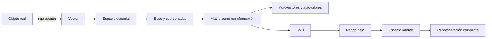
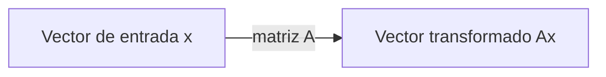
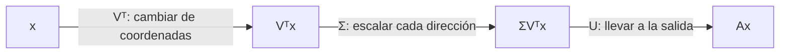
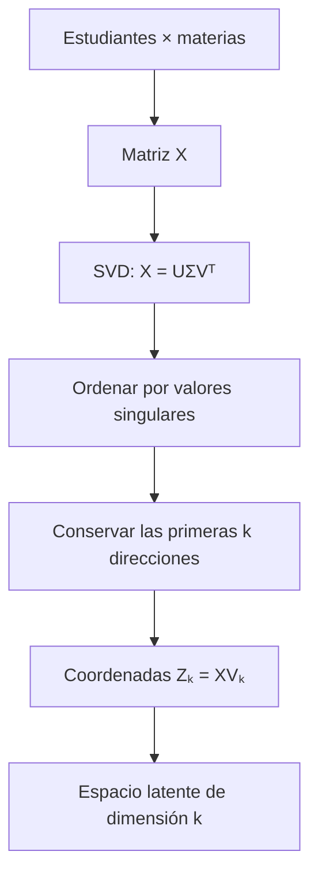

---
tags:
  - algebra-lineal
  - glosario
  - svd
  - autovalores
  - espacio-latente
related:
  - "[[00 Índice - Espectro, SVD y rango bajo]]"
  - "[[00 Índice - Espacios vectoriales y embeddings]]"
aliases:
  - Términos esenciales para entender SVD
  - Glosario de SVD
---

# Glosario visual: términos esenciales para entender SVD

Índice del módulo: [[00 Índice - Espectro, SVD y rango bajo]] · Prerrequisito: [[00 Índice - Espacios vectoriales y embeddings]]

> [!abstract] Propósito de esta nota
> Esta nota explica con palabras sencillas los términos que aparecen al estudiar autovalores, SVD y espacios latentes. No intenta sustituir las notas detalladas: funciona como un mapa al que puedes regresar cuando una palabra técnica no esté clara.

## La historia completa en una imagen

La idea general es esta:

1. Representamos objetos mediante vectores.
2. Organizamos muchos vectores dentro de una matriz.
3. La SVD encuentra nuevas direcciones que resumen la estructura de esa matriz.
4. Conservamos las direcciones más importantes.
5. Las nuevas coordenadas forman una representación de menor dimensión llamada espacio latente.

---

## 1. Vector

### En una frase

Un **vector** es un elemento que tiene componentes y que podemos sumar y multiplicar por números.

$$
x=\begin{bmatrix}3\\4\end{bmatrix}
$$

### Intuición

Puede verse como:

- una flecha con dirección y longitud;
- una lista de características;
- la representación numérica de un objeto.

Por ejemplo, un estudiante podría representarse mediante

$$
x=\begin{bmatrix}
8\\6\\9
\end{bmatrix},
$$

donde las componentes son calificaciones en tres materias.

### ¿Para qué sirve?

Permite convertir información en una forma sobre la que podemos calcular distancias, ángulos, combinaciones y transformaciones.

Más detalle: [[01 Vectores, puntos, bases y coordenadas]].

---

## 2. Espacio vectorial

### En una frase

Un **espacio vectorial** es el universo de vectores dentro del cual podemos sumar y escalar sin salirnos de él.

Por ejemplo, $\mathbb{R}^2$ contiene todos los pares de números reales:

$$
\mathbb{R}^2=\{(x_1,x_2):x_1,x_2\in\mathbb{R}\}.
$$

### Intuición

- $\mathbb{R}^2$ se visualiza como un plano.
- $\mathbb{R}^3$ se visualiza como el espacio tridimensional.
- $\mathbb{R}^{1000}$ no se puede dibujar, pero obedece las mismas reglas algebraicas.

Un documento representado por $1000$ características vive en $\mathbb{R}^{1000}$.

### ¿Para qué sirve?

Establece el lugar matemático donde viven los datos y qué operaciones están permitidas.

Más detalle: [[02 Espacios vectoriales, combinaciones y span]].

---

## 3. Base

### En una frase

Una **base** es un conjunto mínimo de direcciones con el que podemos construir todos los vectores de un espacio.

La base estándar de $\mathbb{R}^2$ es el conjunto $B=\{e_1,e_2\}$, donde

$$
e_1=\begin{bmatrix}1\\0\end{bmatrix},
\qquad
e_2=\begin{bmatrix}0\\1\end{bmatrix}.
$$

Entonces

$$
\begin{bmatrix}3\\4\end{bmatrix}=3e_1+4e_2.
$$

### Intuición

Una base es como un sistema de ejes. Podemos cambiar los ejes sin cambiar el vector real; solo cambian los números usados para describirlo.

### ¿Para qué sirve en SVD?

La SVD encuentra bases ortonormales especialmente adaptadas a una matriz:

- $V$ aporta direcciones para el espacio de entrada.
- $U$ aporta direcciones para el espacio de salida.

Más detalle: [[03 Independencia, bases, dimensión y subespacios]].

---

## 4. Dimensión

### En una frase

La **dimensión** es la cantidad de direcciones independientes necesarias para describir un espacio.

- Una recta tiene dimensión $1$.
- Un plano tiene dimensión $2$.
- $\mathbb{R}^{1000}$ tiene dimensión $1000$.

> [!warning] Componentes y dimensión efectiva no siempre coinciden
> Un vector puede tener $1000$ componentes, pero si todos los datos se concentran cerca de un plano, su estructura importante podría describirse con solo $2$ direcciones. Esta es la idea detrás de la reducción de dimensión.

---

## 5. Matriz

### En una frase

Una **matriz** es una tabla de números que puede representar datos o una transformación lineal.

### Matriz como conjunto de datos

En

$$
X\in\mathbb{R}^{m\times n},
$$

podemos interpretar:

- $m$ filas como observaciones, por ejemplo documentos;
- $n$ columnas como características, por ejemplo palabras.

### Matriz como transformación

La operación

$$
y=Ax
$$

toma un vector de entrada $x$ y produce un vector de salida $y$. Geométricamente, una matriz puede rotar, reflejar, estirar, comprimir o proyectar vectores.

### ¿Para qué sirve?

Permite almacenar muchos datos y describir cómo una transformación actúa sobre todas las direcciones posibles.

---

## 6. Autovector

También se llama **vector propio**.

### En una frase

Un **autovector** es una dirección especial que una matriz cuadrada no desvía al transformarla.

La ecuación es

$$
Av=\lambda v,
\qquad v\ne0.
$$

Esto significa que $Av$ queda sobre la misma recta que $v$. Puede cambiar de longitud o de sentido, pero no gira hacia otra dirección.

### Ejemplo

Sea

$$
A=\begin{bmatrix}3&0\\0&2\end{bmatrix},
\qquad
v=\begin{bmatrix}1\\0\end{bmatrix}.
$$

Entonces

$$
Av=
\begin{bmatrix}3&0\\0&2\end{bmatrix}
\begin{bmatrix}1\\0\end{bmatrix}
=\begin{bmatrix}3\\0\end{bmatrix}
=3v.
$$

$v$ es un autovector porque conserva su dirección.

### ¿Para qué sirve?

Ayuda a encontrar los ejes naturales de una transformación: direcciones en las que su comportamiento se reduce a un simple escalamiento.

---

## 7. Autovalor

También se llama **valor propio**.

### En una frase

El **autovalor** es el número que indica qué hace la matriz sobre su autovector asociado.

En

$$
Av=\lambda v,
$$

$v$ es el autovector y $\lambda$ es el autovalor.

| Valor de $\lambda$ | Efecto sobre el autovector |
| --- | --- |
| $\lambda>1$ | Lo alarga |
| $0<\lambda<1$ | Lo acorta |
| $\lambda=1$ | Conserva su longitud |
| $\lambda=0$ | Lo lleva al vector cero |
| $\lambda<0$ | Invierte el sentido y además lo escala |

En el ejemplo anterior, $v=[1,0]^T$ tiene autovalor $3$: la matriz triplica esa dirección.

> [!tip] Pareja inseparable
> El autovector dice **en qué dirección** ocurre algo simple; el autovalor dice **cuánto** se escala esa dirección.

Más detalle: [[02 Autovalores, autovectores y espectro]].

---

## 8. Espectro

### En una frase

El **espectro** de una matriz cuadrada es el conjunto de sus autovalores.

Si una matriz tiene autovalores $5$, $2$ y $0$, su espectro es

$$
\{5,2,0\}.
$$

### Intuición

Es como un resumen de las escalas naturales de la transformación. Los valores grandes indican efectos fuertes en ciertas direcciones propias; un valor cero indica una dirección que la matriz elimina.

### ¿Para qué sirve?

Se usa para analizar estabilidad, dinámica, matrices de covarianza y el puente hacia SVD mediante $A^TA$ y $AA^T$.

---

## 9. Valor singular

### En una frase

Un **valor singular** $\sigma_i$ mide cuánto estira una matriz una dirección singular concreta.

Siempre cumple

$$
\sigma_i\ge0.
$$

Los valores singulares se ordenan de mayor a menor:

$$
\sigma_1\ge\sigma_2\ge\cdots\ge0.
$$

### ¿Cómo se relaciona con los autovalores?

$$
\sigma_i(A)=\sqrt{\lambda_i(A^TA)}.
$$

Es decir, los valores singulares de $A$ son las raíces cuadradas de los autovalores no negativos de $A^TA$.

> [!warning] Autovalor y valor singular no son sinónimos
> - Los autovalores se definen directamente para matrices cuadradas y pueden ser negativos o complejos.
> - Los valores singulares existen para cualquier matriz, incluso rectangular, y siempre son reales y no negativos.

---

## 10. Vectores singulares

### En una frase

Los **vectores singulares** son las direcciones de entrada y salida que la SVD empareja.

Para cada índice $i$:

$$
Av_i=\sigma_i u_i.
$$

- $v_i$ es el vector singular derecho: una dirección en el espacio de entrada.
- $\sigma_i$ indica cuánto se escala esa dirección.
- $u_i$ es el vector singular izquierdo: la dirección resultante en el espacio de salida.

Una forma sencilla de recordarlo es:

> [!tip] Regla mnemotécnica
> **$v_i$ entra, $\sigma_i$ escala y $u_i$ sale.**

---

## 11. SVD

SVD significa **descomposición en valores singulares**; en inglés, *Singular Value Decomposition*.

### En una frase

La **SVD** separa una matriz en direcciones de entrada, cantidades de estiramiento y direcciones de salida.

$$
A=U\Sigma V^T.
$$

### ¿Qué es cada parte?

| Factor | Contiene | Pregunta que responde |
| --- | --- | --- |
| $V^T$ | Direcciones singulares de entrada | ¿En qué nuevos ejes describo la entrada? |
| $\Sigma$ | Valores singulares | ¿Cuánto importa o se escala cada dirección? |
| $U$ | Direcciones singulares de salida | ¿Hacia qué dirección sale cada componente? |

### Lectura paso a paso

Para calcular $Ax$ mediante la SVD:

1. $V^T$ expresa $x$ usando las direcciones especiales de entrada.
2. $\Sigma$ multiplica cada componente por su valor singular.
3. $U$ reconstruye el resultado en el espacio de salida.

### ¿Para qué sirve?

- Encontrar estructura dominante en una matriz.
- Reducir dimensión.
- Comprimir imágenes o datos.
- Eliminar ruido de pequeña escala.
- Construir aproximaciones de rango bajo.
- Calcular la pseudoinversa.
- Obtener componentes principales cuando los datos están centrados.

Más detalle: [[03 Descomposición en valores singulares - SVD]].

---

## 12. Rango

### En una frase

El **rango** de una matriz es la cantidad de direcciones independientes que realmente conserva o produce.

También equivale a la cantidad de valores singulares distintos de cero:

$$
\operatorname{rank}(A)=\#\{\sigma_i:\sigma_i>0\}.
$$

### Intuición

Una matriz puede tener muchas filas y columnas, pero contener información redundante. El rango cuenta cuántas direcciones aportan información lineal nueva.

---

## 13. Aproximación de rango bajo

### En una frase

Una **aproximación de rango bajo** reemplaza una matriz por otra más simple que conserva sus direcciones más importantes.

La SVD se puede escribir como

$$
A=\sum_{i=1}^{r}\sigma_i u_i v_i^T.
$$

Si solo conservamos los primeros $k$ términos:

$$
A_k=\sum_{i=1}^{k}\sigma_i u_i v_i^T,
\qquad k<r.
$$

### Intuición

Es parecido a resumir un texto: se eliminan detalles y se intenta conservar la estructura principal. Cuanto menor sea $k$, mayor será la compresión, pero también puede aumentar la pérdida.

### ¿Para qué sirve?

- Comprimir matrices grandes.
- Reducir ruido.
- Acelerar modelos.
- Crear representaciones de menor dimensión.

Más detalle: [[04 Aproximación de rango bajo y elección de k]].

---

## 14. Variable latente

### En una frase

Una **variable latente** es una característica interna que no observamos directamente, pero que usamos para explicar patrones presentes en los datos.

Ejemplo conceptual: tenemos calificaciones de muchas materias. Aunque observamos cada calificación, podrían existir patrones más generales como “desempeño cuantitativo” o “desempeño verbal”. Esos factores no vienen escritos explícitamente en la tabla; se infieren a partir de relaciones entre columnas.

> [!warning] El nombre requiere validación
> Una dirección matemática no demuestra por sí sola que represente “habilidad”, “sentimiento”, “calidad” u otro concepto humano. Ese significado debe comprobarse con datos, etiquetas o conocimiento del dominio.

---

## 15. Espacio latente

### En una frase

Un **espacio latente** es un nuevo sistema de coordenadas, normalmente de menor dimensión, que resume patrones importantes de los datos.

### Ejemplo intuitivo

Supón que cada documento se representa con $1000$ palabras. La matriz original tiene $1000$ características, pero muchas palabras aparecen juntas porque hablan de temas relacionados.

La SVD podría resumirlas mediante $k=3$ direcciones dominantes. Cada documento deja de describirse con $1000$ números y pasa a describirse con $3$ coordenadas latentes:

$$
\underbrace{x\in\mathbb{R}^{1000}}_{\text{espacio original}}
\quad\longrightarrow\quad
\underbrace{z\in\mathbb{R}^{3}}_{\text{espacio latente}}.
$$

### ¿Cómo se calcula con SVD?

Si

$$
X=U\Sigma V^T,
$$

las coordenadas latentes de las observaciones al conservar $k$ dimensiones son

$$
Z_k=XV_k=U_k\Sigma_k.
$$

- Cada fila de $Z_k$ representa una observación.
- Cada columna representa una dirección latente conservada.
- $k$ es la dimensión elegida del espacio latente.

### ¿Para qué sirve?

- Representar datos con menos números.
- Descubrir patrones de variación conjunta.
- Visualizar datos de alta dimensión.
- Agrupar o comparar observaciones.
- Usar las coordenadas reducidas como entrada de otro modelo.

### ¿Qué no significa?

- No significa que el algoritmo haya descubierto automáticamente conceptos humanos verdaderos.
- No garantiza que cada eje tenga una interpretación sencilla.
- No conserva toda la información cuando $k$ es menor que el rango.
- No demuestra causalidad.

Más detalle: [[05 Espacio latente, PCA e interpretación]].

---

## 16. Embedding

### En una frase

Un **embedding** es una función que convierte un objeto en un vector:

$$
\varphi:X\to\mathbb{R}^d.
$$

Por ejemplo:

$$
\text{palabra}\longrightarrow
\begin{bmatrix}0.2\\-0.7\\0.4\\\vdots\end{bmatrix}.
$$

### Relación con el espacio latente

Un embedding vive con frecuencia en un espacio latente porque sus componentes son representaciones internas aprendidas, no necesariamente características observables con nombre propio.

Sin embargo, los términos no son idénticos:

- **Embedding:** es la representación vectorial de un objeto o la función que la produce.
- **Espacio latente:** es el espacio de coordenadas internas donde viven esas representaciones.

Más detalle: [[04 Embeddings y representación de objetos]].

---

## 17. PCA

PCA significa **análisis de componentes principales**.

### En una frase

PCA encuentra direcciones ortogonales que explican la mayor cantidad posible de variación en datos centrados.

Primero se resta la media de cada columna:

$$
X_c=X-\bar X.
$$

Después se aplica SVD:

$$
X_c=U\Sigma V^T.
$$

Las columnas de $V$ son las direcciones principales y $U\Sigma$ contiene las nuevas coordenadas.

> [!important] SVD y PCA están relacionadas, pero no son idénticas
> SVD es una descomposición algebraica aplicable a cualquier matriz. PCA es un método estadístico que usa datos centrados y busca explicar varianza.

---

## Diferencias que suelen confundirse

| Términos | Diferencia esencial |
| --- | --- |
| Vector y coordenadas | El vector es el objeto matemático; las coordenadas son su descripción respecto de una base. |
| Autovector y autovalor | El autovector es una dirección; el autovalor es el factor que la escala. |
| Autovalor y valor singular | El autovalor pertenece a una matriz cuadrada; el valor singular mide estiramiento y existe también para matrices rectangulares. |
| Vector propio y vector singular | El propio conserva su dirección bajo una matriz cuadrada; el singular conecta una dirección de entrada con otra de salida. |
| Embedding y espacio latente | El embedding es una representación concreta; el espacio latente es el sistema de coordenadas donde vive. |
| SVD y PCA | SVD es algebraica; PCA interpreta la SVD de datos centrados en términos de varianza. |
| Dimensión original y rango | La dimensión original cuenta componentes disponibles; el rango cuenta direcciones independientes realmente presentes. |
| Rango y $k$ | El rango pertenece a la matriz; $k$ es cuántas direcciones decidimos conservar. |

## Ejemplo que conecta todos los términos

Imagina una matriz $X$ con calificaciones:

- Cada **fila** representa un estudiante.
- Cada **columna** representa una materia.
- Cada fila es un **vector** en el espacio original de materias.
- Si hay $10$ materias, cada estudiante vive inicialmente en $\mathbb{R}^{10}$.
- Algunas materias pueden variar juntas, por lo que existe redundancia.
- La **SVD** encuentra direcciones que resumen esos patrones conjuntos.
- Los **valores singulares** ordenan las direcciones desde la más dominante hasta la menos dominante.
- Elegir $k=2$ produce una **aproximación de rango bajo**.
- Cada estudiante queda representado por $2$ nuevas coordenadas.
- Esas coordenadas viven en un **espacio latente** de dimensión $2$.
- Podríamos intentar interpretar los ejes, pero debemos validar sus significados antes de ponerles nombres.

## Tabla de consulta rápida

| Término | Qué debes recordar |
| --- | --- |
| Vector | Representación con dirección, longitud o características. |
| Espacio vectorial | Universo donde viven los vectores y se pueden combinar linealmente. |
| Base | Ejes suficientes y sin redundancia. |
| Dimensión | Número de direcciones independientes necesarias. |
| Matriz | Datos organizados o transformación lineal. |
| Autovector | Dirección que una matriz cuadrada no desvía. |
| Autovalor | Factor con el que se escala un autovector. |
| Espectro | Conjunto de autovalores. |
| Valor singular | Cantidad no negativa de estiramiento en una dirección singular. |
| SVD | $A=U\Sigma V^T$: direcciones de entrada, escalas y direcciones de salida. |
| Rango | Número de direcciones independientes activas. |
| Rango bajo | Representación que conserva pocas direcciones dominantes. |
| Variable latente | Factor interno inferido, no observado directamente. |
| Espacio latente | Sistema reducido de coordenadas que resume patrones. |
| Embedding | Vector que representa un objeto. |
| PCA | Reducción que explica varianza después de centrar los datos. |

## Orden recomendado para estudiar

1. [[01 Vectores, puntos, bases y coordenadas]]
2. [[02 Espacios vectoriales, combinaciones y span]]
3. [[03 Independencia, bases, dimensión y subespacios]]
4. [[04 Embeddings y representación de objetos]]
5. [[01 Prerrequisitos - producto interno, norma y ortogonalidad]]
6. [[02 Autovalores, autovectores y espectro]]
7. [[03 Descomposición en valores singulares - SVD]]
8. [[04 Aproximación de rango bajo y elección de k]]
9. [[05 Espacio latente, PCA e interpretación]]

## Comprueba si ya conectaste las ideas

1. ¿Qué diferencia existe entre un autovector y su autovalor?
2. ¿Qué representa cada factor de $A=U\Sigma V^T$?
3. ¿Por qué una matriz rectangular puede tener SVD, pero no autovalores propios definidos directamente?
4. ¿Qué información aporta un valor singular grande?
5. ¿Qué diferencia hay entre un embedding y un espacio latente?
6. ¿Por qué una dirección latente no debe recibir automáticamente un nombre semántico?

> [!faq]- Ver respuestas
> 1. El autovector indica una dirección que no se desvía; el autovalor indica cuánto se escala esa dirección.
> 2. $V^T$ cambia a direcciones de entrada, $\Sigma$ escala y $U$ lleva las componentes al espacio de salida.
> 3. En una matriz rectangular, $Av$ y $\lambda v$ tendrían dimensiones distintas; la SVD sí relaciona correctamente un espacio de entrada con otro de salida.
> 4. Que la matriz tiene un efecto fuerte en la dirección singular asociada.
> 5. Un embedding es el vector que representa un objeto; el espacio latente es el sistema de coordenadas internas en el que vive.
> 6. Porque la SVD detecta estructura algebraica, no significado humano; la interpretación requiere validación externa.
