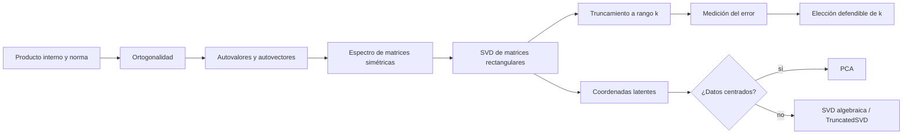

# Espectro, SVD y rango bajo

Este módulo enseña a descubrir cuánta estructura útil contiene una matriz, comprimirla de manera controlada y limitar correctamente la interpretación de sus direcciones latentes.

Prerrequisito recomendado: [[00 Índice - Espacios vectoriales y embeddings]].

![[assets/01-mapa-modulo.jpg|900]]

## Vista general del recorrido

![[assets/infografia-01.jpg|900]]

> [!warning] Dos matrices ilustrativas, una misma idea
> La primera página de la infografía usa una matriz esquemática distinta de la matriz numérica desarrollada en la guía y en [[04 Aproximación de rango bajo y elección de k#4. Caso conductor|el caso conductor]]. No deben mezclarse sus entradas. En ambos ejemplos, la observación conceptual es la misma: las columnas forman dos bloques parecidos y sugieren una dimensión efectiva menor que cuatro.

> [!question] Preguntas guía
> ¿Qué estructura conserva una matriz? ¿Qué error introduce truncarla? ¿Qué interpretación permiten realmente los resultados?

> [!tip] Antes de comenzar
> Si términos como autovalor, autovector, valor singular o espacio latente todavía no están claros, consulta primero [[00 Glosario visual - términos esenciales para entender SVD]].

> [!success] Fórmulas explicadas como una clase
> Usa [[00 Formulario razonado - fundamentos, espectro y SVD]] cuando necesites reunir en un solo lugar todas las fórmulas, su lectura, dimensiones, demostración, ejemplos y errores frecuentes.

## Método para leer cada fórmula

La guía propone una secuencia que evita memorizar símbolos sin entenderlos:

1. **Leerla en palabras:** por ejemplo, $A=U\Sigma V^T$ se lee «primero obtengo coordenadas con $V^T$, luego escalo con $\Sigma$ y finalmente expreso la salida con $U$».
2. **Nombrar cada símbolo:** qué representa y en qué espacio vive.
3. **Auditar dimensiones:** comprobar que cada multiplicación está definida.
4. **Dar una interpretación geométrica:** cambio de coordenadas, escala, proyección o reconstrucción.
5. **Revisar el desarrollo algebraico:** justificar la identidad y no solo repetirla.

> [!tip] Regla práctica
> Si no puedes decir de qué tamaño es cada objeto y leer la expresión de derecha a izquierda, todavía no conviene pasar al código.

## Ruta sugerida de 110 minutos

| Bloque | Slides | Tiempo | Resultado esperado |
| --- | ---: | ---: | --- |
| Problema y narrativa | 1–3 | 14 min | Formular redundancia, estructura y error antes de calcular |
| Geometría mínima | 4 | 7 min | Usar producto interno, norma, proyección y ortogonalidad |
| Problema espectral | 5–7 | 21 min | Entender $Av=\lambda v$ y $A=Q\Lambda Q^T$ en el caso simétrico |
| Del caso rectangular a la SVD | 8–11 | 31 min | Construir $A^TA$, $AA^T$ y obtener $\sigma_i=\sqrt{\lambda_i}$ |
| Operación e interpretación de la SVD | 12–16 | 32 min | Seguir $V^T\rightarrow\Sigma\rightarrow U$, distinguir formas y entender las ambigüedades |
| Verificación numérica | 17 | 5 min | Reconstruir y medir residuales sin confundir comprobación con demostración |
| **Total** | **1–17** | **110 min** | **Explicar, calcular, auditar e interpretar con límites claros** |

## Ruta teórica

0. [[00 Formulario razonado - fundamentos, espectro y SVD|Formulario razonado de todas las fórmulas]]
1. [[01 Prerrequisitos - producto interno, norma y ortogonalidad]]
2. [[02 Autovalores, autovectores y espectro]]
3. [[03 Descomposición en valores singulares - SVD]]
4. [[04 Aproximación de rango bajo y elección de k]]
5. [[05 Espacio latente, PCA e interpretación]]
6. [[06 Resumen y preguntas de repaso]]

## Parte de Python, separada

La explicación del notebook está en [[python/00 Índice - Demo computacional M05|Demo computacional M05]]. Allí se explica cada celda y cada función sin mezclar la sintaxis con la exposición teórica.

## Mapa conceptual

## Orden correcto de razonamiento

1. Formular el problema y declarar las dimensiones.
2. Estudiar la estructura espectral cuando corresponda.
3. Aplicar la SVD (*singular value decomposition* o descomposición en valores singulares).
4. Truncar solo si hay un objetivo de compresión.
5. Elegir una norma y medir el error.
6. Interpretar dentro de los límites de los datos y la tarea.
7. Validar con NumPy y, en ML, con una métrica *downstream*.

> [!warning] Regla central
> La narrativa no comienza con `np.linalg.svd`. Primero se formula una afirmación matemática y después el código la comprueba.

## Fuentes

- Presentación completa: ![[assets/module_05.pdf]]
- Guía detallada de los slides 1–17: ![[assets/guia-estudiante-slides-1-17.pdf]]
- Infografías de apoyo: ![[assets/infografia-apoyo-svd.pdf]]
- Notebook original: [[assets/01_demo_05.ipynb]]
