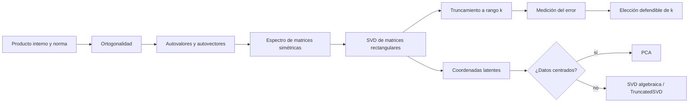

# Espectro, SVD y rango bajo

Este módulo enseña a descubrir cuánta estructura útil contiene una matriz, comprimirla de manera controlada y limitar correctamente la interpretación de sus direcciones latentes.

Prerrequisito recomendado: [[00 Índice - Espacios vectoriales y embeddings]].

![[assets/01-mapa-modulo.jpg|900]]

> [!question] Preguntas guía
> ¿Qué estructura conserva una matriz? ¿Qué error introduce truncarla? ¿Qué interpretación permiten realmente los resultados?

> [!tip] Antes de comenzar
> Si términos como autovalor, autovector, valor singular o espacio latente todavía no están claros, consulta primero [[00 Glosario visual - términos esenciales para entender SVD]].

## Ruta teórica

1. [[01 Prerrequisitos - producto interno, norma y ortogonalidad]]
2. [[02 Autovalores, autovectores y espectro]]
3. [[03 Descomposición en valores singulares - SVD]]
4. [[04 Aproximación de rango bajo y elección de k]]
5. [[05 Espacio latente, PCA e interpretación]]
6. [[06 Resumen y preguntas de repaso]]

## Parte de Python, separada

La explicación del notebook está en [[python/00 Índice - Demo computacional M05|Demo computacional M05]]. Allí se explica cada celda y cada función sin mezclar la sintaxis con la exposición teórica.

## Mapa conceptual

## Orden correcto de razonamiento

1. Formular el problema y declarar las dimensiones.
2. Estudiar la estructura espectral cuando corresponda.
3. Aplicar la SVD (singular value decomposicion).
4. Truncar solo si hay un objetivo de compresión.
5. Elegir una norma y medir el error.
6. Interpretar dentro de los límites de los datos y la tarea.
7. Validar con NumPy y, en ML, con una métrica *downstream*.

> [!warning] Regla central
> La narrativa no comienza con `np.linalg.svd`. Primero se formula una afirmación matemática y después el código la comprueba.

## Fuentes

- Presentación completa: ![[assets/module_05.pdf]]
- Notebook original: [[assets/01_demo_05.ipynb]]
