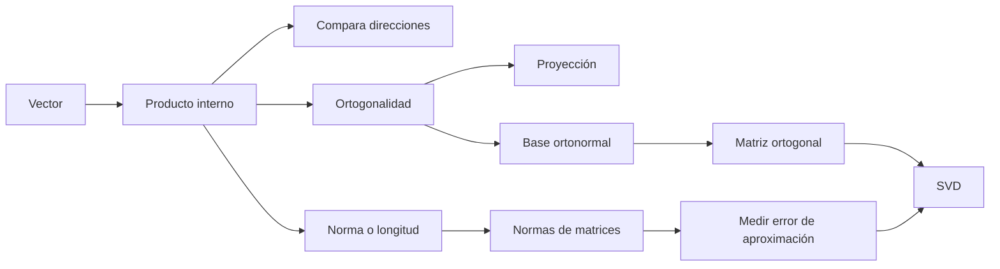
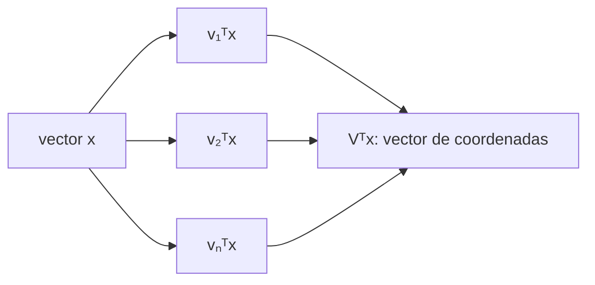

---
tags:
  - algebra-lineal
  - producto-interno
  - norma
  - ortogonalidad
related: "[[00 Índice - Espectro, SVD y rango bajo]]"
---

# Prerrequisitos: producto interno, norma y ortogonalidad

Anterior: [[00 Índice - Espectro, SVD y rango bajo]] · Siguiente: [[02 Autovalores, autovectores y espectro]]

Glosario de apoyo: [[00 Glosario visual - términos esenciales para entender SVD]]

Formulario general: [[00 Formulario razonado - fundamentos, espectro y SVD|fórmulas explicadas paso a paso]].

> [!abstract] La idea central
> Un vector tiene **dirección** y **longitud**. El producto interno compara direcciones; la norma mide longitudes; la ortogonalidad detecta direcciones independientes. Estas tres ideas permiten entender qué hace la SVD: encontrar las direcciones más importantes de una matriz y medir cuánto aporta cada una.

## 0. Antes de empezar: ¿qué es un vector?

Un vector es una lista ordenada de números. Por ejemplo,

$$
x=\begin{bmatrix}3\\4\end{bmatrix}.
$$

Se puede interpretar de dos maneras:

- **Geométricamente:** es una flecha que avanza $3$ unidades horizontalmente y $4$ verticalmente.
- **Como datos:** puede representar dos características de un objeto, por ejemplo `[peso, altura]`.

En ambos casos nos interesan preguntas parecidas:

- ¿Qué tan grande es el vector?
- ¿Dos vectores apuntan de forma similar?
- ¿Son completamente independientes o perpendiculares?
- ¿Cuánto de un vector se encuentra en la dirección de otro?

Las herramientas de esta nota responden esas preguntas.

## Mapa de conceptos

## 1. Producto interno: comparar dos vectores

### ¿Qué es?

El **producto interno** —también llamado producto punto o producto escalar— toma dos vectores del mismo tamaño y devuelve **un solo número**:

$$
\langle x,y\rangle=x^Ty=\sum_{i=1}^{n}x_i y_i.
$$

El símbolo $x^T$ significa que convertimos el vector columna $x$ en una fila. Así, $x^Ty$ es una multiplicación de matrices cuyo resultado es un escalar.

### ¿Cómo se calcula?

Se multiplican las componentes que ocupan la misma posición y luego se suman:

$$
x=\begin{bmatrix}2\\3\end{bmatrix},\qquad
y=\begin{bmatrix}4\\-1\end{bmatrix}
$$

$$
x^Ty=(2)(4)+(3)(-1)=8-3=5.
$$

### ¿Qué significa?

También se puede escribir como

$$
x^Ty=\lVert x\rVert_2\,\lVert y\rVert_2\cos(\theta),
$$

donde $\theta$ es el ángulo entre los vectores. Por eso el signo del producto interno informa sobre sus direcciones:

| Resultado | Ángulo | Interpretación |
| --- | --- | --- |
| $x^Ty>0$ | Menor que $90^\circ$ | Apuntan en direcciones parecidas |
| $x^Ty=0$ | Igual a $90^\circ$ | Son perpendiculares u ortogonales |
| $x^Ty<0$ | Mayor que $90^\circ$ | Apuntan principalmente en sentidos opuestos |

![[assets/producto-interno-alineacion.svg]]

> [!note] El valor depende de la longitud
> Un producto interno grande puede aparecer porque los vectores están muy alineados, porque son muy largos o por ambas razones. Para comparar solamente la dirección se usa el coseno:
> $$
> \cos(\theta)=\frac{x^Ty}{\lVert x\rVert_2\lVert y\rVert_2}.
> $$

### ¿Para qué sirve?

- Medir semejanza entre vectores.
- Calcular el ángulo entre dos direcciones.
- Detectar perpendicularidad.
- Calcular proyecciones.
- En aprendizaje automático, comparar representaciones o *embeddings* mediante similitud coseno.

**El producto interno convierte dos vectores en un número que indica cuánto coinciden en dirección; positivo significa a favor, cero significa perpendicular y negativo significa en contra.**

## 2. Norma: medir la longitud

### ¿Qué es?

La **norma euclídea** o norma 2 de un vector es su longitud:

$$
\lVert x\rVert_2=\sqrt{x^Tx}=\sqrt{x_1^2+x_2^2+\cdots+x_n^2}.
$$

La expresión $x^Tx$ es el producto interno del vector consigo mismo. Como suma cuadrados, nunca puede ser negativa.

### Ejemplo

Para $x=[3,4]^T$:

$$
\lVert x\rVert_2=\sqrt{3^2+4^2}=\sqrt{25}=5.
$$

Es exactamente el teorema de Pitágoras: las componentes son los catetos y la norma es la hipotenusa.

### ¿Qué es un vector unitario?

Es un vector de longitud $1$. Para convertir cualquier vector no nulo $x$ en uno unitario, se divide por su norma:

$$
\hat{x}=\frac{x}{\lVert x\rVert_2}.
$$

Este proceso se llama **normalizar**. Conserva la dirección y elimina el efecto de la longitud.

Para $x=[3,4]^T$:

$$
\hat{x}=\frac{1}{5}\begin{bmatrix}3\\4\end{bmatrix}
=\begin{bmatrix}0.6\\0.8\end{bmatrix},
\qquad \lVert\hat{x}\rVert_2=1.
$$

### Distancia entre dos vectores

La distancia euclídea entre $x$ e $y$ es la longitud de la flecha que va de uno al otro:

$$
d(x,y)=\lVert x-y\rVert_2.
$$

Por ejemplo, si $x=[1,2]^T$ e $y=[4,6]^T$:

$$
d(x,y)=\sqrt{(4-1)^2+(6-2)^2}=\sqrt{9+16}=5.
$$

### ¿Para qué sirve?

- Medir el tamaño de un vector.
- Calcular distancias entre observaciones.
- Normalizar datos.
- Medir el error entre un resultado exacto y una aproximación.

## 3. Ortogonalidad: direcciones perpendiculares

### ¿Qué significa?

Dos vectores $x$ e $y$ son **ortogonales** cuando su producto interno es cero:

$$
x^Ty=0.
$$

Geométricamente forman un ángulo de $90^\circ$. Por ejemplo:

$$
x=\begin{bmatrix}2\\1\end{bmatrix},\qquad
y=\begin{bmatrix}-1\\2\end{bmatrix}
$$

$$
x^Ty=(2)(-1)+(1)(2)=0.
$$

Aunque el dibujo no use los ejes horizontal y vertical, estas dos direcciones son perpendiculares.

### Ortogonal no significa ortonormal

Estos términos se parecen, pero no significan lo mismo:

| Concepto | Condición | Idea |
| --- | --- | --- |
| Ortogonales | $x^Ty=0$ | Son perpendiculares |
| Normales o unitarios | $\lVert x\rVert_2=\lVert y\rVert_2=1$ | Cada uno mide 1 |
| Ortonormales | Cumplen ambas condiciones | Son perpendiculares y cada uno mide 1 |

En el ejemplo anterior, $x$ e $y$ son ortogonales, pero no ortonormales porque ambos tienen norma $\sqrt{5}$. Al dividir cada uno por $\sqrt{5}$ obtenemos vectores ortonormales.

### ¿Por qué es útil la ortogonalidad?

Las direcciones ortogonales no se mezclan entre sí. Esto permite separar un vector en componentes independientes y estudiar cada componente por separado.

Una analogía útil son los ejes $x$ e $y$: moverse horizontalmente no produce movimiento vertical. La SVD buscará ejes parecidos, adaptados a los datos.

## 4. Proyección: la “sombra” de un vector

La proyección de $x$ sobre la dirección de $u$ responde:

> ¿Qué parte de $x$ apunta en la misma dirección que $u$?

Si $u$ es unitario, la proyección es

$$
\operatorname{proj}_u(x)=(u^Tx)u.
$$

- $u^Tx$ es un número: indica cuánto avanza $x$ en la dirección de $u$.
- Al multiplicarlo por $u$, ese número vuelve a convertirse en un vector.
- El residuo $r=x-\operatorname{proj}_u(x)$ queda ortogonal a $u$.

![[assets/proyeccion-vector.svg]]

Si $u$ no es unitario, se corrige su longitud:

$$
\operatorname{proj}_u(x)=\frac{u^Tx}{u^Tu}u.
$$

> [!tip] Conexión con la SVD
> Aproximar una matriz con rango bajo consiste, en esencia, en conservar sus proyecciones sobre las direcciones más importantes y descartar las menos importantes.

### De una proyección a todas las coordenadas: $V^Tx$

Si las columnas de

$$
V=\begin{bmatrix}v_1&v_2&\cdots&v_n\end{bmatrix}
$$

forman una base ortonormal, entonces

$$
V^Tx=
\begin{bmatrix}
v_1^Tx\\
v_2^Tx\\
\vdots\\
v_n^Tx
\end{bmatrix}.
$$

Cada entrada es un producto interno y, por tanto, una **coordenada de $x$ en una dirección $v_i$**. $V^Tx$ no es una operación misteriosa: reúne de una sola vez las proyecciones escalares sobre todos los ejes de $V$.

Si se conservan todas las direcciones, $VV^Tx=x$. Si solo se conservan $k$ columnas, $V_kV_k^Tx$ es la proyección de $x$ sobre el subespacio generado por esas $k$ direcciones.

![[assets/infografia-02.jpg|900]]

## 5. Base ortonormal y matrices ortogonales

### Base ortonormal

Una **base** es un conjunto de direcciones con las que podemos construir cualquier vector del espacio. Si las direcciones son ortonormales, calcular las coordenadas es especialmente sencillo.

Si $q_1,\dots,q_n$ forman una base ortonormal, entonces cualquier vector $x$ se escribe como

$$
x=(q_1^Tx)q_1+\cdots+(q_n^Tx)q_n.
$$

Cada coeficiente $q_i^Tx$ dice cuánto de $x$ hay en la dirección $q_i$.

### Matriz ortogonal

Si colocamos esos vectores como columnas,

$$
Q=\begin{bmatrix}q_1&q_2&\cdots&q_n\end{bmatrix},
$$

la condición de ortonormalidad se resume en

$$
Q^TQ=QQ^T=I,
\qquad Q^{-1}=Q^T.
$$

Esto sucede porque cada producto interno $q_i^Tq_j$ vale $1$ cuando $i=j$ y $0$ cuando $i\ne j$.

Una matriz ortogonal representa una **rotación**, una **reflexión** o una combinación de ambas. No estira ni comprime:

$$
\lVert Qx\rVert_2=\lVert x\rVert_2,
\qquad
(Qx)^T(Qy)=x^Ty.
$$

Por tanto, conserva longitudes, distancias y ángulos.

> [!example] Una rotación de $90^\circ$
> $$
> Q=\begin{bmatrix}0&-1\\1&0\end{bmatrix},
> \qquad
> Q\begin{bmatrix}2\\1\end{bmatrix}
> =\begin{bmatrix}-1\\2\end{bmatrix}.
> $$
> El vector cambia de dirección, pero su norma sigue siendo $\sqrt{5}$.

## 6. Normas de una matriz: medir su tamaño o su error

Para matrices no existe una sola noción útil de tamaño. En este módulo aparecen dos.

### Norma de Frobenius: error total

$$
\lVert A\rVert_F=\sqrt{\sum_{i,j}a_{ij}^2}.
$$

Se elevan al cuadrado **todos** los elementos, se suman y se toma la raíz. Es como convertir la matriz en un vector largo y calcular su norma euclídea.

Si

$$
A=\begin{bmatrix}1&2\\2&1\end{bmatrix},
$$

entonces

$$
\lVert A\rVert_F=\sqrt{1^2+2^2+2^2+1^2}=\sqrt{10}.
$$

En una aproximación $A_k$,

$$
\lVert A-A_k\rVert_F
$$

mide el error total acumulado en todas las entradas.

### Norma espectral: peor estiramiento

$$
\lVert A\rVert_2=\max_{x\ne0}\frac{\lVert Ax\rVert_2}{\lVert x\rVert_2}=\sigma_1(A),
$$

donde $\sigma_1(A)$ es el mayor valor singular de $A$.

La interpretación es: entre todas las direcciones posibles, ¿en cuál estira más la matriz y por qué factor?

Para el residuo $A-A_k$, esta norma mide el peor error que puede sufrir una dirección de entrada.

> [!important] Responden preguntas diferentes
> - **Frobenius:** ¿cuánto error hay en total?
> - **Espectral:** ¿cuál es el peor error posible en una dirección?

## 7. Matrices simétricas y semidefinidas positivas

### Matriz simétrica

Una matriz real es **simétrica** si es igual a su transpuesta:

$$
A=A^T.
$$

Esto significa que los valores se reflejan respecto de la diagonal principal:

$$
\begin{bmatrix}
2&-1&3\\
-1&4&0\\
3&0&5
\end{bmatrix}.
$$

Las matrices simétricas son importantes porque tienen autovalores reales y admiten una base ortonormal de autovectores.

### Matriz semidefinida positiva

Una matriz simétrica $A$ es **semidefinida positiva** si

$$
x^TAx\ge0\qquad\text{para todo vector }x.
$$

$x^TAx$ es un escalar. La condición dice que la transformación nunca produce un “cuadrado negativo”. Equivalentemente, todos sus autovalores son no negativos.

### ¿Por qué aparecen $X^TX$ y $XX^T$?

Para cualquier matriz rectangular $X$, ambas matrices son simétricas:

$$
(X^TX)^T=X^TX,
\qquad
(XX^T)^T=XX^T.
$$

Además, son semidefinidas positivas porque

$$
z^TX^TXz=(Xz)^T(Xz)=\lVert Xz\rVert_2^2\ge0.
$$

La última cantidad es una longitud al cuadrado, así que no puede ser negativa.

> [!success] Puente hacia la SVD
> Los autovectores de $X^TX$ proporcionan las direcciones de entrada de la SVD; los de $XX^T$, las direcciones de salida. Sus autovalores no negativos son los cuadrados de los valores singulares.

## 8. Ejemplo integrador

Consideremos

$$
x=\begin{bmatrix}3\\4\end{bmatrix},
\qquad
e_1=\begin{bmatrix}1\\0\end{bmatrix},
\qquad
e_2=\begin{bmatrix}0\\1\end{bmatrix}.
$$

1. **Longitud de $x$:**

$$
\lVert x\rVert_2=5.
$$

2. **Ortogonalidad de los ejes:**

$$
e_1^Te_2=0.
$$

3. **Los ejes son unitarios:**

$$
\lVert e_1\rVert_2=\lVert e_2\rVert_2=1.
$$

Por tanto, $e_1$ y $e_2$ forman una base ortonormal.

4. **Proyección de $x$ en cada eje:**

$$
\operatorname{proj}_{e_1}(x)=(e_1^Tx)e_1=3e_1,
$$

$$
\operatorname{proj}_{e_2}(x)=(e_2^Tx)e_2=4e_2.
$$

5. **Reconstrucción a partir de componentes independientes:**

$$
x=3e_1+4e_2.
$$

Esta es la idea que luego generaliza la SVD: expresar datos mediante proyecciones sobre direcciones ortonormales convenientes.

## Resumen para recordar

| Concepto | Fórmula clave | Pregunta que responde |
| --- | --- | --- |
| Producto interno | $x^Ty$ | ¿Cuánto se alinean? |
| Norma | $\sqrt{x^Tx}$ | ¿Cuánto mide el vector? |
| Distancia | $\lVert x-y\rVert_2$ | ¿Qué tan separados están? |
| Ortogonalidad | $x^Ty=0$ | ¿Son perpendiculares? |
| Normalización | $x/\lVert x\rVert_2$ | ¿Cuál es la misma dirección con longitud 1? |
| Proyección | $(u^Tx)u$ si $\lVert u\rVert_2=1$ | ¿Qué parte de $x$ está en la dirección $u$? |
| Norma de Frobenius | $\sqrt{\sum_{i,j}a_{ij}^2}$ | ¿Cuál es la magnitud o error total? |
| Norma espectral | $\sigma_1(A)$ | ¿Cuál es el máximo estiramiento o peor error? |

## Comprueba tu comprensión

1. Si $x^Ty<0$, ¿qué se puede decir del ángulo entre $x$ e $y$?
2. ¿Cuál es la diferencia entre un par de vectores ortogonales y uno ortonormal?
3. ¿Qué conserva una matriz ortogonal?
4. ¿Qué norma usarías para medir el error total de una aproximación?
5. ¿Por qué $X^TX$ no puede tener autovalores negativos en aritmética exacta?

> [!faq]- Ver respuestas
> 1. El ángulo es mayor que $90^\circ$; los vectores apuntan principalmente en sentidos opuestos.
> 2. Los ortogonales son perpendiculares; los ortonormales, además, tienen norma $1$.
> 3. Conserva productos internos, normas, distancias y ángulos.
> 4. La norma de Frobenius.
> 5. Porque $z^TX^TXz=\lVert Xz\rVert_2^2\ge0$ para todo $z$; por ello $X^TX$ es semidefinida positiva.
