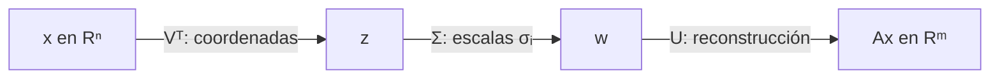

---
tags:
  - algebra-lineal
  - svd
  - valores-singulares
related: "[[00 Índice - Espectro, SVD y rango bajo]]"
---

# Descomposición en valores singulares: SVD

Anterior: [[02 Autovalores, autovectores y espectro]] · Siguiente: [[04 Aproximación de rango bajo y elección de k]]

## 1. Definición

Toda matriz $A\in\mathbb{R}^{m\times n}$ admite una descomposición

$$
A=U\Sigma V^T,
$$

donde $U$ y $V$ tienen columnas ortonormales y $\Sigma$ contiene valores singulares no negativos, ordenados

$$
\sigma_1\ge\sigma_2\ge\cdots\ge0.
$$

La SVD funciona para matrices cuadradas, rectangulares, singulares y de rango deficiente.

## 2. Lectura geométrica

![[assets/12-geometria-svd.jpg|900]]

Para calcular $y=Ax$:

1. $z=V^Tx$: expresa la entrada en las direcciones singulares derechas;
2. $w=\Sigma z$: escala cada coordenada sin mezclar ejes;
3. $y=Uw$: reconstruye la salida en las direcciones singulares izquierdas.

Si $x$ tiene una componente en $\ker(A)$, la SVD compacta no la conserva porque esa dirección tiene valor singular cero y no contribuye a $Ax$.

## 3. Tres formas y sus dimensiones

Sea $q=\min(m,n)$ y $r=\operatorname{rank}(A)$.

| Forma | $U$ | $\Sigma$ | $V^T$ |
| --- | --- | --- | --- |
| Completa | $m\times m$ | $m\times n$ | $n\times n$ |
| Reducida | $m\times q$ | $q\times q$ | $q\times n$ |
| Compacta | $m\times r$ | $r\times r$ | $r\times n$ |

La forma reducida de NumPy con `full_matrices=False` conserva $q$ direcciones, incluso si algunas tienen valor singular cero. La compacta conserva solo las $r$ direcciones activas.

## 4. Puente espectral

Si $v_i$ es una columna de $V$ y $u_i$ una columna de $U$:

$$
Av_i=\sigma_i u_i,
\qquad
A^Tu_i=\sigma_i v_i.
$$

Por tanto,

$$
A^TAv_i=\sigma_i^2v_i,
\qquad
AA^Tu_i=\sigma_i^2u_i.
$$

Los autovalores no nulos de $A^TA$ y $AA^T$ son los mismos y valen $\sigma_i^2$. $v_i$ vive en el espacio de entrada; $u_i$, en el espacio de salida.

## 5. Valores singulares frente a autovalores

Los valores singulares siempre son reales y no negativos. Se derivan de $A^TA$, no de los autovalores de $A$ en general:

$$
\sigma_i(A)=\sqrt{\lambda_i(A^TA)}.
$$

Para la matriz nilpotente $B$ de la nota anterior, $\lambda(B)=(0,0)$, pero $\sigma(B)=(1,0)$.

## 6. Unicidad con matices

La matriz $A$ reconstruida es estable, pero los factores no siempre son literalmente únicos:

- **Ambigüedad de signo:** podemos cambiar simultáneamente $u_i\to-u_i$ y $v_i\to-v_i$ sin cambiar $\sigma_i u_i v_i^T$.
- **Valores repetidos:** si varios $\sigma_i$ son iguales, puede cambiar la base ortonormal elegida dentro de ese subespacio.

Por eso, al comparar dos SVD, no se debe exigir que todos los vectores tengan exactamente el mismo signo.

## 7. Expansión en matrices de rango uno

La SVD también se escribe

$$
A=\sum_{i=1}^r\sigma_i u_i v_i^T.
$$

Cada término exterior $u_iv_i^T$ tiene rango 1. Esta suma ordena los componentes desde la mayor hasta la menor escala y prepara el truncamiento.

## Para recordar

> [!tip] Frase mnemotécnica
> **V encuentra direcciones de entrada; Σ mide su importancia algebraica; U las lleva a la salida.**

