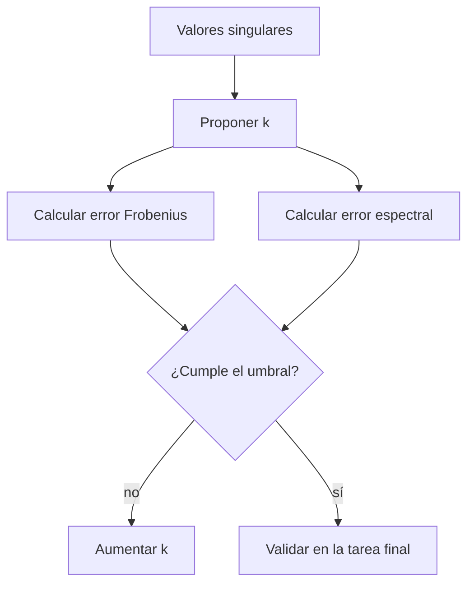

---
tags:
  - algebra-lineal
  - rango-bajo
  - compresion
  - eckart-young-mirsky
related: "[[00 Índice - Espectro, SVD y rango bajo]]"
---

# Aproximación de rango bajo y elección de $k$

Anterior: [[03 Descomposición en valores singulares - SVD]] · Siguiente: [[05 Espacio latente, PCA e interpretación]]

## 1. Truncar la SVD

Si

$$
A=\sum_{i=1}^r\sigma_i u_iv_i^T,
$$

la aproximación de rango a lo sumo $k$ es

$$
A_k=\sum_{i=1}^k\sigma_i u_iv_i^T=U_k\Sigma_kV_k^T.
$$

No se eliminan filas o columnas arbitrarias. Se conservan los $k$ componentes singulares de mayor escala y se descartan los restantes.

![[assets/19-truncamiento.jpg|850]]

## 2. Por qué esto comprime

Una matriz $m\times n$ almacena $mn$ números. La representación truncada necesita aproximadamente

$$
mk+k+kn=k(m+n+1)
$$

números. Es útil cuando $k\ll\min(m,n)$ y el error es aceptable. En lugar de almacenar toda la matriz, guardamos $U_k$, los $k$ valores singulares y $V_k^T$.

## 3. Teorema de Eckart-Young-Mirsky

Entre todas las matrices $B$ de rango a lo sumo $k$, $A_k$ minimiza

$$
\lVert A-B\rVert_2
\quad\text{y}\quad
\lVert A-B\rVert_F.
$$

Además,

$$
\lVert A-A_k\rVert_2=\sigma_{k+1},
$$

y

$$
\lVert A-A_k\rVert_F
=\sqrt{\sum_{i=k+1}^r\sigma_i^2}.
$$

El teorema dice que el truncamiento es óptimo bajo esas normas, no que sea óptimo para cualquier tarea de Machine Learning.

## 4. Caso conductor

La matriz del módulo es

$$
X=\begin{bmatrix}
4&5&0&0\\
3&4&0&0\\
0&1&5&4\\
0&1&4&3\\
5&6&0&0
\end{bmatrix}.
$$

Sus valores singulares son aproximadamente

$$
(11.3771,\ 8.0925,\ 0.2492,\ 0.1068).
$$

Los dos primeros dominan claramente. Para $k=2$:

$$
\frac{\lVert X-X_2\rVert_F}{\lVert X\rVert_F}\approx0.01941,
$$

es decir, un error relativo acumulado de aproximadamente $1.941\%$.

La fracción algebraica conservada es

$$
\frac{\sigma_1^2+\sigma_2^2}{\sum_i\sigma_i^2}
\approx0.99962.
$$

![[assets/21-eleccion-k.jpg|850]]

## 5. «Energía» no siempre significa varianza

La suma $\sum_i\sigma_i^2=\lVert X\rVert_F^2$ es una identidad algebraica. Llamarla «varianza explicada» requiere datos centrados y el marco estadístico de PCA. Para una matriz sin centrar, es mejor decir **fracción de energía algebraica** o **masa cuadrática conservada**.

## 6. Cómo elegir $k$

No existe un valor universal. Debe declararse el criterio:

- error relativo de Frobenius máximo;
- peor error espectral permitido;
- porcentaje algebraico conservado;
- límite de almacenamiento o tiempo;
- rendimiento de una tarea posterior: clasificación, recuperación o predicción.

## 7. Rango algebraico y rango efectivo

El rango algebraico cuenta valores singulares exactamente no nulos. En cálculo numérico, «cero» depende de una tolerancia. La matriz del módulo tiene rango algebraico 4, pero si declaramos un umbral relativo de $0.03\sigma_1$, solo dos valores singulares lo superan y hablamos de rango efectivo 2.

> [!warning] Una tolerancia es parte de la afirmación
> No digas solamente «el rango es 2» cuando quieres decir «el rango numérico bajo este umbral es 2».

## Preguntas rápidas

1. ¿Qué términos conserva $A_k$?
2. ¿Qué garantiza exactamente Eckart-Young-Mirsky?
3. ¿Por qué $k=2$ es defendible para esta matriz?
4. ¿Qué diferencia hay entre rango exacto y rango efectivo?
5. ¿Por qué el mejor error matricial no garantiza el mejor resultado en ML?

