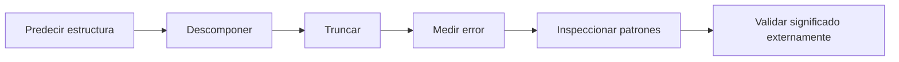

---
tags:
  - machine-learning
  - espacio-latente
  - pca
  - embeddings
related: "[[00 Índice - Espectro, SVD y rango bajo]]"
---

# Espacio latente, PCA e interpretación

Anterior: [[04 Aproximación de rango bajo y elección de k]] · Siguiente: [[06 Resumen y preguntas de repaso]]

Formulario general: [[00 Formulario razonado - fundamentos, espectro y SVD|fórmulas explicadas paso a paso]].

## 1. Qué representa cada factor en una matriz de datos

Supón que las filas de $X$ son documentos y las columnas son rasgos:

- las columnas de $V$ o filas de $V^T$ son direcciones en el espacio de características;
- $\Sigma$ indica la escala algebraica de cada dirección;
- $U\Sigma=XV$ contiene las coordenadas latentes de las observaciones.

![[assets/24-factores-datos.jpg|850]]

Para conservar $k$ dimensiones:

$$
Z_k=U_k\Sigma_k=XV_k.
$$

$Z_k$ tiene una fila por observación y una columna por dirección latente conservada.

### Auditoría de dimensiones

Si $X\in\mathbb{R}^{m\times n}$ contiene $m$ observaciones y $n$ rasgos, y $V_k\in\mathbb{R}^{n\times k}$, entonces

$$
Z_k=XV_k
\in\mathbb{R}^{m\times k}.
$$

| Objeto | Forma | Lectura |
| --- | ---: | --- |
| Fila $i$ de $X$ | $1\times n$ | observación original con $n$ rasgos |
| Columna $j$ de $V_k$ | $n\times1$ | dirección latente en el espacio de rasgos |
| Entrada $(Z_k)_{ij}=x_i^Tv_j$ | escalar | coordenada de la observación $i$ en la dirección $j$ |
| Fila $i$ de $Z_k$ | $1\times k$ | representación reducida de la observación $i$ |

Así, reducir dimensión no significa borrar columnas originales: significa reemplazar los $n$ rasgos por $k$ coordenadas obtenidas mediante productos internos.

![[assets/infografia-06.jpg|900]]

## 2. Lectura defendible del caso

En la matriz del módulo, las dos primeras columnas suelen activarse juntas en algunos documentos y las dos últimas en otros. La SVD detecta dos patrones dominantes. Es legítimo decir que una dirección pondera principalmente el primer bloque y otra el segundo.

No es legítimo nombrarlas como conceptos semánticos concretos sin saber qué representan las columnas y sin validación externa.

| Afirmación | ¿La SVD la respalda por sí sola? | Qué faltaría para una afirmación más fuerte |
| --- | --- | --- |
| «Dos componentes reconstruyen casi toda la matriz» | Sí, si el error calculado es pequeño | Declarar la norma y el umbral |
| «Dos grupos están próximos en $Z_k$» | Sí, dentro de la geometría reducida elegida | Comprobar estabilidad y sensibilidad a $k$ |
| «Esta dirección pondera más los rasgos 1 y 2» | Sí, observando las cargas de $V_k$ | Revisar signo, escala y estabilidad |
| «Esta dirección significa un tema humano concreto» | No | Etiquetas, ejemplos del dominio o evaluación externa |
| «Reducir a $k$ mejora la predicción» | No | Validación en datos no vistos con una métrica de tarea |
| «El patrón es causal» | No | Diseño causal o evidencia adicional |

## 3. Ambigüedad de signo y de base

Una implementación puede devolver $v_i$ o $-v_i$. Si simultáneamente cambia $u_i$ por $-u_i$, la matriz no cambia:

$$
\sigma_i(-u_i)(-v_i)^T=\sigma_i u_i v_i^T.
$$

Por eso la interpretación de una dirección debe ser invariante a su signo global. Comparar vectores mediante el valor absoluto de su coseno evita declarar erróneamente que dos implementaciones discrepan.

También hay que distinguir dos ideas sobre rotación:

- si los valores singulares son **distintos**, cada dirección singular queda determinada salvo por el signo;
- si varios valores singulares son **iguales**, puede rotarse la base dentro de ese subespacio repetido y la SVD sigue representando la misma matriz;
- si aplicamos la misma rotación ortogonal a todas las filas de una representación $Z_k$, se conservan distancias y ángulos entre puntos, aunque cambien sus coordenadas numéricas.

> [!important] Matiz sobre «la misma geometría»
> Una rotación arbitraria de $Z_k$ puede conservar su geometría interna, pero no necesariamente sigue siendo la base singular que mantiene $\Sigma$ diagonal. La libertad total de rotación dentro de la SVD aparece cuando hay valores singulares repetidos.

## 4. SVD de embeddings

Si cada fila es un embedding, la SVD puede:

- encontrar direcciones de variación lineal;
- reducir dimensión;
- eliminar direcciones de escala pequeña;
- producir coordenadas latentes compactas.

Pero no certifica que una dirección sea «sentimiento», «calidad» o cualquier concepto humano. La SVD organiza geometría lineal; la semántica necesita etiquetas, experimentos, análisis de estabilidad o validación en una tarea.

## 5. PCA mediante SVD

PCA comienza centrando cada columna:

$$
X_c=X-\bar X,
$$

donde $\bar X$ contiene las medias de las variables. Si

$$
X_c=U\Sigma V^T,
$$

entonces las columnas de $V$ son direcciones principales y

$$
\lambda_i(\operatorname{Cov}(X))
=\frac{\sigma_i^2}{m-1}
$$

para covarianza muestral con $m$ observaciones.

![[assets/28-pca-centrado.jpg|850]]

Las puntuaciones principales son $X_cV=U\Sigma$.

## 6. PCA frente a TruncatedSVD

| PCA | TruncatedSVD |
| --- | --- |
| Centra las columnas antes de descomponer. | Normalmente opera sobre $X$ sin centrar. |
| Sus direcciones describen varianza respecto de la media. | Sus direcciones describen estructura algebraica respecto del origen. |
| Adecuado para lectura estadística de componentes principales. | Útil en matrices dispersas donde centrar destruiría la dispersidad. |

La álgebra es similar, pero la interpretación cambia. SVD sin centrar no se convierte automáticamente en PCA.

## 7. Secuencia responsable de interpretación

## Preguntas rápidas

1. ¿Qué describen $V$, $\Sigma$ y $U\Sigma$ en una matriz de datos?
2. ¿Por qué el signo de una dirección singular es arbitrario?
3. ¿Qué debe hacerse antes de interpretar SVD como PCA?
4. ¿Por qué una dirección latente dominante no equivale a un concepto demostrado?
5. ¿Qué validación adicional pedirías antes de usar $k=2$ en un modelo?
