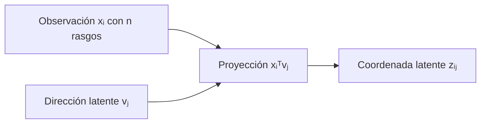
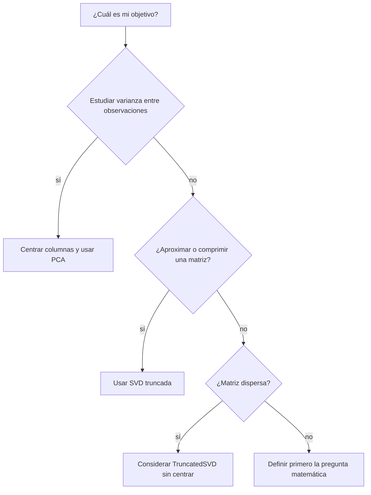
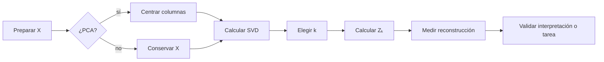

---
tags:
  - machine-learning
  - espacio-latente
  - pca
  - embeddings
related: "[[00 Índice - Espectro, SVD y rango bajo]]"
---

# Espacio latente, PCA e interpretación

Anterior: [[04 Aproximación de rango bajo y elección de k]] · Siguiente: [[06 Resumen y preguntas de repaso]]

Formulario general: [[00 Formulario razonado - fundamentos, espectro y SVD|fórmulas explicadas paso a paso]].

> [!summary] Idea principal
> La SVD reemplaza los rasgos originales por **nuevas coordenadas** que resumen los patrones dominantes de los datos. Esas coordenadas forman un **espacio latente**. Si primero centramos los datos, esta misma operación conduce a PCA.

## 1. Intuición: cambiar de sistema de coordenadas

Supón que una observación tiene cuatro rasgos:

$$
x_i=(x_{i1},x_{i2},x_{i3},x_{i4}).
$$

Tal vez esos cuatro números contienen información repetida. Por ejemplo, los rasgos 1 y 2 suelen variar juntos, y lo mismo ocurre con los rasgos 3 y 4. En lugar de describir cada observación con cuatro coordenadas, podríamos resumirla mediante dos patrones:

1. cuánto se parece al patrón formado principalmente por los rasgos 1 y 2;
2. cuánto se parece al patrón formado principalmente por los rasgos 3 y 4.

Esas dos cantidades son las **coordenadas latentes**. Se llaman latentes porque no son columnas originales: se calculan combinando las columnas existentes.

> [!example] Analogía
> Un punto no cambia cuando pasamos de coordenadas cartesianas a polares; cambia la forma de describirlo. De manera parecida, la SVD propone ejes nuevos para describir los datos. Si conservamos solo algunos ejes, obtenemos además una aproximación comprimida.

## 2. Qué representa cada factor de la SVD

Sea una matriz de datos

$$
X\in\mathbb{R}^{m\times n},
$$

donde cada fila es una observación y cada columna es un rasgo. Su SVD reducida es

$$
X=U\Sigma V^T.
$$

| Objeto | Interpretación |
| --- | --- |
| $V$ | Contiene los nuevos ejes o direcciones en el espacio de los rasgos. |
| $\Sigma$ | Indica la importancia o escala de cada dirección mediante los valores singulares. |
| $U\Sigma$ | Contiene las coordenadas de las observaciones sobre los nuevos ejes. |

![[assets/24-factores-datos.jpg|850]]

Si solo conservamos las primeras $k$ direcciones, usamos

$$
Z_k=XV_k=U_k\Sigma_k.
$$

$Z_k$ es la representación de los datos en el espacio latente de $k$ dimensiones.

### Dimensiones, paso a paso

$$
\underbrace{X}_{m\times n}
\underbrace{V_k}_{n\times k}
=
\underbrace{Z_k}_{m\times k}.
$$

Por tanto:

- $X$ describe $m$ observaciones usando $n$ rasgos originales;
- $V_k$ define $k$ direcciones nuevas;
- $Z_k$ describe las mismas $m$ observaciones usando solo $k$ coordenadas latentes.

Reducir la dimensión **no consiste en escoger $k$ columnas de $X$**. Consiste en crear $k$ columnas nuevas como combinaciones de las originales.

## 3. De dónde sale una coordenada latente

Sea $x_i^T$ la fila correspondiente a la observación $i$ y sea $v_j$ la dirección latente $j$. La entrada $(i,j)$ de $Z_k$ es

$$
(Z_k)_{ij}=x_i^Tv_j=\langle x_i,v_j\rangle.
$$

Esta fórmula es un producto interno. Como $v_j$ tiene norma 1, el resultado mide la proyección de $x_i$ sobre esa dirección:

- magnitud grande: la observación está fuertemente alineada con la dirección;
- valor cercano a cero: tiene poca presencia de ese patrón;
- signo positivo o negativo: indica en cuál de los dos sentidos del eje se encuentra.

El signo por sí solo no tiene un significado absoluto, porque la SVD puede devolver $v_j$ o $-v_j$.

![[assets/infografia-06.jpg|900]]

## 4. Ejemplo con la matriz del módulo

Usamos la matriz de [[04 Aproximación de rango bajo y elección de k#4. Caso conductor|la nota anterior]]:

$$
X=\begin{bmatrix}
4&5&0&0\\
3&4&0&0\\
0&1&5&4\\
0&1&4&3\\
5&6&0&0
\end{bmatrix}.
$$

A simple vista aparecen dos patrones:

- las observaciones 1, 2 y 5 tienen valores altos en las columnas 1 y 2;
- las observaciones 3 y 4 tienen valores altos en las columnas 3 y 4.

Los dos primeros valores singulares son mucho mayores que los demás, por lo que elegimos $k=2$. Una implementación numérica puede producir aproximadamente

$$
V_2^T\approx
\begin{bmatrix}
-0.609&-0.781&-0.111&-0.086\\
 0.172& 0.043&-0.776&-0.606
\end{bmatrix}.
$$

La primera dirección da mucho peso a las columnas 1 y 2. La segunda da mucho peso a las columnas 3 y 4. Al proyectar,

$$
Z_2=XV_2\approx
\begin{bmatrix}
-6.339& 0.901\\
-4.950& 0.686\\
-1.678&-6.259\\
-1.482&-4.877\\
-7.729& 1.116
\end{bmatrix}.
$$

Ahora cada observación está descrita por solo dos números. Las filas 1, 2 y 5 quedan próximas entre sí, y las filas 3 y 4 también. La SVD ha recuperado algebraicamente los dos bloques visibles en $X$.

> [!important] Los signos podrían aparecer invertidos
> Otra biblioteca podría multiplicar una fila de $V_2^T$ y la columna correspondiente de $U_2$ por $-1$. Las coordenadas cambiarían de signo, pero las distancias, los grupos y la reconstrucción serían los mismos.

## 5. Qué podemos interpretar y qué no

Una dirección latente es, primero, una dirección matemática. Inspeccionar sus pesos permite saber qué rasgos contribuyen más, pero no basta para asignarle un concepto humano.

| Afirmación | ¿La SVD la justifica? | Motivo |
| --- | --- | --- |
| «La primera dirección pondera principalmente los rasgos 1 y 2» | Sí | Se observa en los valores de $v_1$. |
| «Las observaciones 1, 2 y 5 están próximas en $Z_2$» | Sí | Se comprueba con sus coordenadas o distancias. |
| «Dos componentes reconstruyen casi toda la matriz» | Sí, si se declara el error | Es una afirmación algebraica medible. |
| «La primera dirección representa felicidad» | No | Harían falta etiquetas o evidencia del dominio. |
| «Usar dos componentes mejora la predicción» | No | Debe evaluarse en datos no vistos. |
| «Este patrón es causal» | No | La SVD no establece causalidad. |

> [!warning] Regla de interpretación
> **Peso algebraico no equivale automáticamente a significado semántico.** Podemos proponer una interpretación, pero debemos validarla con etiquetas, ejemplos, conocimiento del dominio o una tarea externa.

## 6. PCA explicado a partir de la SVD

PCA (*principal component analysis*) busca las direcciones en las que los datos presentan mayor **varianza respecto de su media**.

### Paso 1: centrar las columnas

Calculamos la media de cada rasgo,

$$
\mu=\frac{1}{m}\sum_{i=1}^{m}x_i,
$$

y la restamos a todas las observaciones:

$$
X_c=X-\mathbf{1}\mu^T.
$$

Después del centrado, cada columna de $X_c$ tiene media cero. Geométricamente, hemos trasladado el origen al centro de la nube de datos.

### Paso 2: aplicar SVD a la matriz centrada

$$
X_c=U\Sigma V^T.
$$

Entonces:

- las columnas de $V$ son las **direcciones principales**;
- las puntuaciones o *scores* son

$$
Z=X_cV=U\Sigma;
$$

- la varianza explicada por la componente $i$ es

$$
\lambda_i=\frac{\sigma_i^2}{m-1},
$$

cuando usamos la covarianza muestral.

![[assets/28-pca-centrado.jpg|850]]

> [!tip] Forma corta de recordarlo
> **PCA = centrar los datos + aplicar SVD + conservar las direcciones de mayor varianza.**

## 7. PCA frente a SVD: no son dos métodos rivales

Aquí está la diferencia que suele causar confusión:

> [!important] Idea fundamental
> **SVD es una herramienta matemática para descomponer matrices. PCA es un método estadístico con un objetivo: encontrar las direcciones de mayor varianza respecto de la media.** Una manera habitual de calcular PCA es aplicar SVD a los datos centrados.

Por tanto, no es del todo correcto pensar:

- «PCA analiza y SVD solo comprime».

La versión correcta es:

- **SVD descompone** una matriz y revela sus direcciones y escalas dominantes;
- **SVD truncada comprime** cuando conservamos solo $k$ componentes;
- **PCA usa esa estructura sobre datos centrados** para estudiar la varianza;
- **PCA también reduce dimensión** cuando conserva solo $k$ componentes principales.

### Operación frente a objetivo

| Concepto | Qué es | Qué hace |
| --- | --- | --- |
| SVD | Una factorización matricial | Escribe $X=U\Sigma V^T$. |
| SVD truncada | Una aproximación de rango bajo | Conserva solo $k$ términos para aproximar o comprimir $X$. |
| PCA | Un método estadístico | Busca direcciones de máxima varianza alrededor de la media. |
| PCA truncado a $k$ componentes | Una reducción dimensional | Representa cada observación mediante $k$ puntuaciones principales. |

> [!warning] SVD no comprime automáticamente
> La SVD completa contiene toda la información de la matriz y permite reconstruirla exactamente. Solo hay reducción o compresión cuando descartamos componentes y usamos $k<r$.

### La relación matemática

Si aplicamos SVD directamente a los datos sin centrar,

$$
X=U\Sigma V^T,
$$

las direcciones describen la estructura de $X$ **respecto del origen $(0,0,\ldots,0)$**.

Para PCA, primero trasladamos el origen al promedio de los datos:

$$
X_c=X-\mathbf{1}\mu^T,
$$

y después aplicamos SVD:

$$
X_c=U\Sigma V^T.
$$

Ahora las columnas de $V$ son las direcciones principales y

$$
\frac{\sigma_i^2}{m-1}
$$

es la varianza explicada por la componente $i$.

En forma resumida:

$$
\boxed{\text{PCA mediante SVD}=\text{centrar }X+\text{calcular SVD}+\text{elegir componentes}}
$$

El centrado no es un detalle menor: cambia la pregunta que estamos respondiendo.

### Ejemplo: por qué centrar cambia la interpretación

Considera

$$
X=
\begin{bmatrix}
100&101\\
101&102\\
102&103
\end{bmatrix}.
$$

Los datos están lejos del origen, pero las tres observaciones están muy próximas entre sí.

- **SVD sin centrar:** está muy influida por la gran distancia de los puntos al origen $(0,0)$.
- **PCA:** resta la media $\mu=(101,102)$ y obtiene

$$
X_c=
\begin{bmatrix}
-1&-1\\
0&0\\
1&1
\end{bmatrix}.
$$

PCA muestra cómo cambian las observaciones alrededor de su promedio, sin dejar que el valor base cercano a 100 domine el análisis.

### ¿Cuándo usar cada uno?

| Situación | Elección habitual | Razón |
| --- | --- | --- |
| Quiero estudiar la variación entre observaciones numéricas | PCA | Importa la desviación respecto de la media. |
| Quiero visualizar datos en 2 o 3 dimensiones | PCA | Conserva las direcciones de mayor varianza. |
| Quiero hablar de varianza explicada | PCA | Requiere el marco de datos centrados. |
| Quiero aproximar o reconstruir una matriz con rango bajo | SVD truncada | Optimiza el error matricial bajo normas habituales. |
| Tengo una matriz documento-palabra o TF-IDF muy dispersa | TruncatedSVD | Centrarla podría destruir la dispersidad. |
| Quiero estudiar el rango o resolver un problema algebraico | SVD | Es una propiedad/factorización general de matrices. |

### ¿Y la escala de las variables?

Centrar resta la media, pero no iguala las unidades. Si una variable está medida entre 0 y 1 y otra entre 0 y 100 000, la segunda puede dominar PCA. Cuando las escalas no son comparables, suele estandarizarse cada columna:

$$
x'_{ij}=\frac{x_{ij}-\mu_j}{s_j}.
$$

Esto produce media cero y desviación estándar uno. No siempre hay que estandarizar: depende de si las diferencias de escala tienen significado en el problema.

### Caso Hackathon 2: pérdida de reconstrucción y el nuevo error

El ejercicio de Palmer Penguins añade una distinción importante. Después de estandarizar las cuatro mediciones y conservar solo $k$ componentes, ya no se reconstruye exactamente la matriz original. Se obtiene una aproximación:

$$
\widehat Z_k=T_kV_k^T,
$$

donde $T_k=U_k\Sigma_k$ contiene las puntuaciones y $V_k^T$ las primeras $k$ direcciones. Para volver a milímetros y gramos se invierte la estandarización:

$$
\widehat X_k=\widehat Z_k\operatorname{diag}(s)+\mu.
$$

El ejercicio usa **dos errores complementarios**, no intercambiables.

#### 1. Error relativo de Frobenius

$$
e_F(k)=\frac{\lVert Z-\widehat Z_k\rVert_F}{\lVert Z\rVert_F}.
$$

Resume en un solo número la magnitud de todos los residuos en el espacio estandarizado. Es adimensional y vale cero cuando la reconstrucción es exacta. Se calcula en $Z$ para que los gramos de `body_mass_g` no dominen nuevamente a las variables medidas en milímetros.

Por la SVD truncada:

$$
\lVert Z-\widehat Z_k\rVert_F^2=\sum_{j>k}\sigma_j^2,
\qquad
\lVert Z\rVert_F^2=\sum_j\sigma_j^2.
$$

Si $R_k=\sum_{j=1}^k r_j$ es la proporción acumulada de varianza explicada, entonces:

$$
e_F(k)^2=1-R_k
\qquad\Longrightarrow\qquad
e_F(k)=\sqrt{1-R_k}.
$$

Con dos componentes, $R_2=0.881568$. Por tanto, la varianza descartada es $1-R_2=0.118432$, es decir, **11.8432 %**, mientras que el error relativo es:

$$
e_F(2)=\sqrt{0.118432}=0.34414.
$$

> [!warning] No confundir porcentajes
> $0.34414$ no significa que se perdió 34.414 % de la varianza. La varianza usa cuadrados: se descarta 11.8432 % de la varianza y la raíz de esa fracción produce un error relativo de norma de 0.34414.

#### 2. RMSE por variable

Después de volver a las unidades originales, para cada variable $j$ se calcula:

$$
RMSE_j=\sqrt{\frac{1}{n}\sum_{i=1}^n(x_{ij}-\widehat x_{ij})^2}.
$$

El RMSE responde cuánto se desvía típicamente la reconstrucción de cada medición y conserva su unidad original:

| Variable | RMSE con $k=2$ | Lectura |
| --- | ---: | --- |
| Longitud del pico | 2.139 mm | Error típico de reconstrucción en longitud del pico. |
| Profundidad del pico | 0.510 mm | Error típico en profundidad del pico. |
| Longitud de aleta | 4.125 mm | Error típico en longitud de aleta. |
| Masa corporal | 326.735 g | Error típico en masa corporal. |

Estos valores no deben sumarse ni compararse directamente entre sí porque usan unidades distintas. El error de Frobenius ofrece una medida global equilibrada en $Z$; el RMSE traduce el costo a la escala comprensible de cada rasgo.

#### Cómo cambia la decisión sobre $k$

| Propósito | Elección | Varianza acumulada | Error relativo de Frobenius |
| --- | --- | ---: | ---: |
| Comunicar en un gráfico 2D | $k=2$ estandarizado | 88.1568 % | 0.34414 |
| Conservar al menos 90 % para análisis interno | $k=3$ estandarizado | 97.2877 % | 0.16469 |

Dos componentes son útiles para visualizar, pero no alcanzan el umbral del 90 %. Tres componentes sí lo superan y reducen el error global de reconstrucción. Esta elección no convierte PCA en clasificador: `species` solo se usa después para colorear la proyección y las especies todavía pueden solaparse.

> [!important] Última distinción
> Este RMSE mide **reconstrucción de las mismas variables de entrada**, no error predictivo sobre una respuesta futura. Para hablar de capacidad predictiva se necesita un modelo supervisado y evaluación fuera de muestra.

> [!summary] Regla para recordar
> - **SVD:** herramienta general para descomponer matrices.
> - **SVD truncada:** SVD usada para aproximar o comprimir.
> - **PCA:** análisis de la varianza de datos centrados, que puede calcularse mediante SVD.
> - **Ambos reducen dimensión** únicamente cuando conservamos menos componentes que dimensiones originales.

## 8. Caso especial: embeddings

Si cada fila de $X$ es un *embedding*, la SVD puede:

- reducir su dimensión;
- encontrar direcciones de variación lineal;
- eliminar direcciones con valores singulares pequeños;
- crear representaciones más compactas.

Sin embargo, una dirección dominante no queda certificada como «sentimiento», «calidad» o «formalidad». Para sostener una etiqueta semántica se necesitan ejemplos controlados, etiquetas, *probes*, análisis de estabilidad u otra validación externa.

## 9. Reconstruir bien no garantiza predecir bien

El error de representación mide cuánto se parece la matriz aproximada $X_k$ a la original:

$$
e_{\mathrm{repr}}(k)
=\frac{\lVert X-X_k\rVert_F}{\lVert X\rVert_F}.
$$

Pero un modelo supervisado responde a otra pregunta: ¿se conserva la información útil para predecir $y$? Eso debe medirse con una métrica de la tarea, por ejemplo *accuracy*, F1 o RMSE, usando validación:

$$
\Delta M(k)=M(f(X_k),y)-M(f(X),y).
$$

Una dirección con poca energía puede contener información muy útil para predecir. Por eso:

$$
\text{reconstrucción buena}\;\not\Rightarrow\;\text{rendimiento predictivo bueno}.
$$

## 10. Ambigüedades que conviene conocer

### Cambio de signo

Cada componente puede cambiar de signo sin alterar la matriz:

$$
\sigma_i(-u_i)(-v_i)^T=\sigma_i u_iv_i^T.
$$

Por eso no debemos interpretar «positivo» y «negativo» sin fijar antes una convención.

### Valores singulares repetidos

Si dos valores singulares son iguales, las direcciones individuales dentro de ese subespacio pueden rotar. En ese caso, lo estable es el subespacio completo, no necesariamente cada vector por separado.

> [!note] Idea práctica
> Al comparar resultados de dos programas, compara la geometría, el subespacio o el valor absoluto del coseno entre direcciones; no exijas que los vectores tengan exactamente el mismo signo.

## 11. Procedimiento responsable

1. Definir qué representan filas y columnas.
2. Decidir si corresponde centrar los datos.
3. Calcular la SVD.
4. Elegir $k$ mediante un criterio declarado.
5. Obtener $Z_k=XV_k$ o, en PCA, $Z_k=X_cV_k$.
6. Medir el error de reconstrucción.
7. Validar por separado cualquier afirmación semántica o predictiva.

## Resumen final

| Concepto | En una frase |
| --- | --- |
| Dirección latente $v_j$ | Nuevo eje construido como combinación de los rasgos originales. |
| Coordenada latente $x_i^Tv_j$ | Proyección de una observación sobre ese eje. |
| $Z_k$ | Representación de las observaciones usando $k$ coordenadas nuevas. |
| Valor singular $\sigma_j$ | Escala o importancia algebraica de la dirección $j$. |
| PCA | SVD aplicada después de centrar las columnas. |
| Interpretación semántica | Hipótesis que necesita evidencia externa. |

## Preguntas rápidas

1. ¿Por qué reducir dimensión no equivale a borrar columnas de $X$?
2. ¿Qué representa la entrada $(Z_k)_{ij}$?
3. En el ejemplo, ¿qué observaciones quedan próximas en el espacio latente?
4. ¿Por qué una dirección puede cambiar de signo sin alterar el resultado?
5. ¿Qué paso convierte la SVD de datos en el procedimiento de PCA?
6. ¿Por qué un error de reconstrucción pequeño no garantiza un buen clasificador?
