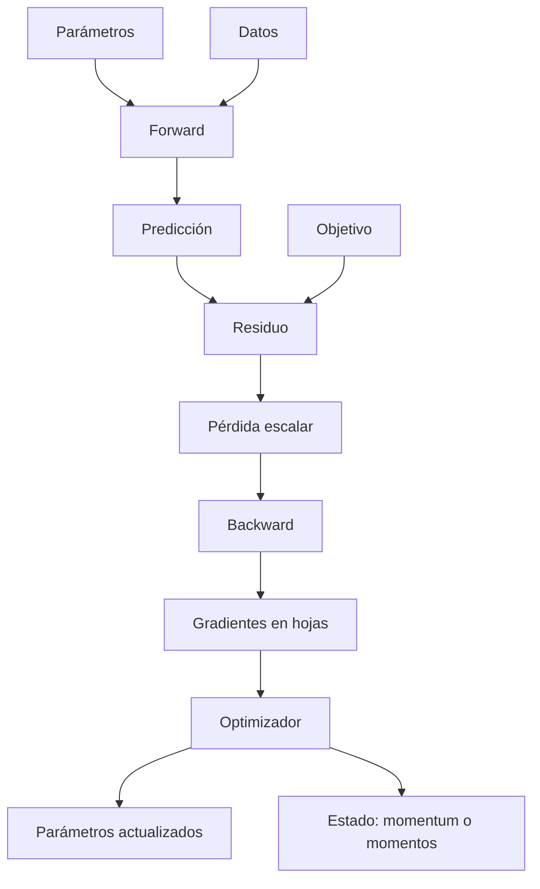
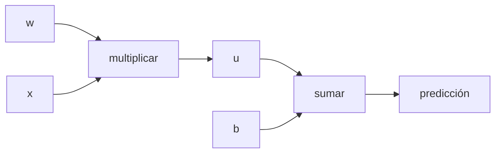

# Glosario visual: términos del entrenamiento

> [!abstract] Propósito
> Esta nota evita aprender palabras aisladas. Cada término se explica por su significado, su función y su relación con el ciclo completo.

## Mapa de relaciones

## Conceptos del objetivo

### Parámetro

Un número entrenable del modelo, como un peso $w$ o un sesgo $b$. Es aquello que el optimizador modifica.

**Para qué sirve:** contiene lo que el modelo aprende. Los datos se observan; los parámetros se ajustan.

### Predicción

La salida del modelo. En el caso lineal:

$$\hat y=wx+b.$$

El sombrero distingue la estimación $\hat y$ del valor observado $y$.

### Residuo

La diferencia firmada entre predicción y objetivo:

$$r=\hat y-y.$$

- $r<0$: la predicción quedó por debajo;
- $r>0$: quedó por encima;
- $r=0$: coincide en ese ejemplo.

El signo conserva una información causal que se pierde al elevar al cuadrado.

### Pérdida escalar

Una sola cantidad que resume el objetivo que se desea reducir:

$$L(\theta)\in\mathbb R.$$

**Por qué escalar:** permite comparar dos estados de muchos parámetros mediante una autoridad común. No significa que el problema tenga un solo parámetro.

> [!warning] Límite
> Una pérdida menor no demuestra por sí sola estabilidad, convergencia ni generalización.

## Conceptos de derivación

### Derivada

Predice cómo cambia una salida al mover ligeramente una entrada:

$$f(x+\Delta x)\approx f(x)+f'(x)\Delta x.$$

Es local: describe el entorno del punto actual.

### Derivada parcial

Mide el efecto de una variable manteniendo las demás fijas. Para $L(w,b)$:

$$\frac{\partial L}{\partial w},\qquad \frac{\partial L}{\partial b}.$$

### Gradiente

Vector que reúne todas las derivadas parciales:

$$
\nabla_\theta L=
\begin{bmatrix}
\partial L/\partial\theta_1\\
\vdots\\
\partial L/\partial\theta_p
\end{bmatrix}.
$$

**Qué dice:** sensibilidad local de la pérdida. 
**Qué no dice:** el mejor mínimo global ni el tamaño óptimo de un paso finito.

### Curvatura

Describe cuánto cambia la pendiente. En la cuadrática

$$L(\theta)=\frac a2(\theta-\theta^*)^2,$$

$a>0$ es la curvatura. Una curvatura mayor limita más la tasa de aprendizaje estable.

## Conceptos del grafo

### Grafo computacional

Un DAG —grafo dirigido acíclico— que conserva qué operaciones produjeron cada valor.

### Forward

Recorrido desde causas hacia resultados. Calcula valores y construye dependencias.

### Backward o backpropagation

Recorrido inverso que aplica la regla de la cadena y acumula contribuciones. No es una regla matemática nueva: es una forma eficiente de organizar reglas locales sobre el grafo.

### Derivada local

Derivada de una operación respecto a una entrada inmediata. Por ejemplo, si $u=wx$, entonces:

$$\frac{\partial u}{\partial w}=x.$$

Backprop multiplica estas derivadas por la sensibilidad que llega desde más adelante.

### Semilla

El backward de una pérdida comienza con:

$$\frac{\partial L}{\partial L}=1.$$

El $1$ expresa que la pérdida cambia uno a uno respecto de sí misma.

### Hoja

Nodo creado directamente, no resultado de una operación registrada. Los parámetros entrenables suelen ser hojas y reciben el resultado en <code>.grad</code>.

### <code>requires_grad</code>, <code>grad_fn</code> y <code>.grad</code>

| Propiedad | Pregunta que responde |
|---|---|
| <code>requires_grad</code> | ¿debe autograd seguir operaciones relacionadas con este tensor? |
| <code>grad_fn</code> | ¿qué operación registrada produjo este tensor no hoja? |
| <code>.grad</code> | ¿qué gradiente se acumuló en esta hoja tras <code>backward()</code>? |

## Conceptos de optimización

### Tasa de aprendizaje

$\eta$ controla la escala del paso:

$$\theta_{t+1}=\theta_t-\eta g_t.$$

Mayor no siempre es más rápido: puede producir oscilación o divergencia.

### Full-batch

Usa todos los ejemplos para calcular un gradiente determinista del conjunto actual.

### Mini-batch

Usa un subconjunto. Produce una estimación del gradiente completo: puede ser correcta en promedio sin coincidir en cada paso.

### SGD

Descenso de gradiente estocástico. En PyTorch, <code>torch.optim.SGD</code> puede trabajar con cualquier tamaño de lote; lo estocástico normalmente proviene del muestreo del mini-batch.

### Optimizador

Consume gradientes y decide el cambio de parámetros. <code>backward()</code> calcula gradientes; <code>optimizer.step()</code> los usa.

### Estado del optimizador

Memoria persistente entre pasos:

- GD simple: no necesita memoria adicional;
- momentum: conserva una velocidad;
- Adam: conserva dos momentos y un contador.

## Conceptos de ejecución

### <code>model.train()</code> y <code>model.eval()</code>

Cambian el comportamiento de módulos sensibles al modo, principalmente Dropout y BatchNorm.

### Gradientes habilitados y <code>torch.no_grad()</code>

Controlan si las operaciones construyen historial para autograd. Son independientes del modo del módulo.

> [!important] Frase de examen
> <code>eval()</code> no apaga autograd y <code>no_grad()</code> no pone el modelo en modo evaluación.

### Reinicio de gradientes

<code>optimizer.zero_grad()</code> prepara el acumulador para un nuevo backward. Es distinto de propagar y distinto de actualizar.

### Convergencia

La secuencia de parámetros o errores se acerca a un límite.

### Estabilidad

Pequeñas perturbaciones no destruyen la dinámica. En la cuadrática unidimensional, la condición exacta para GD es:

$$0<\eta<\frac2a.$$

---

Volver al [[00 Índice - Gradientes, autodiferenciación y optimización]] · Siguiente: [[01 Pérdida escalar, residuo y predicción de signos]]
