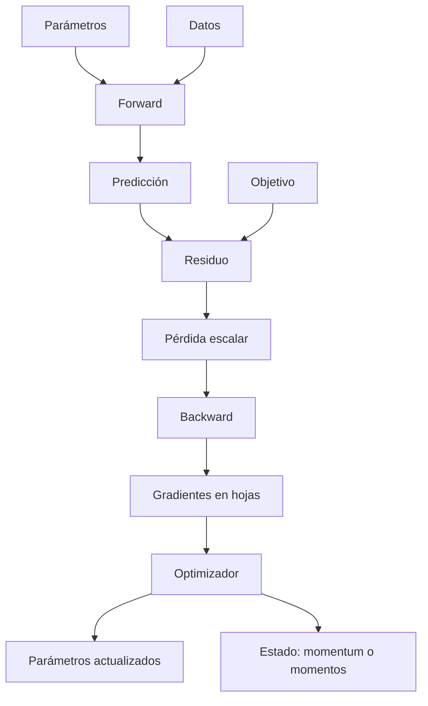
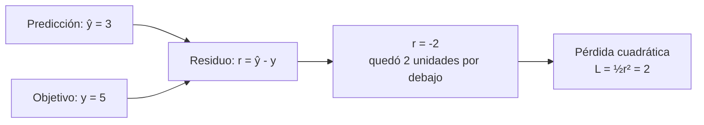
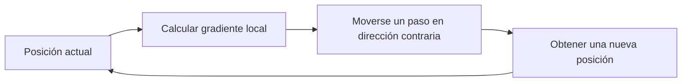
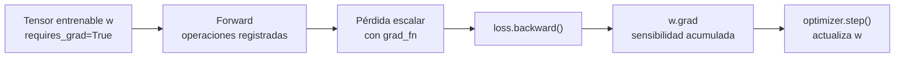
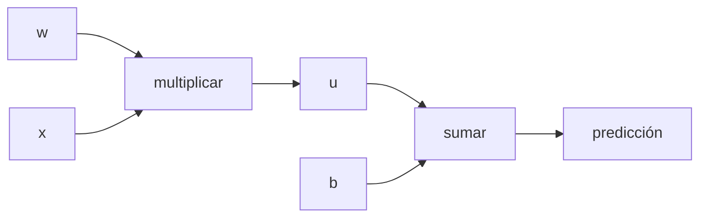
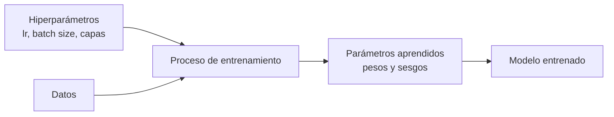

# Glosario visual: términos del entrenamiento

> [!abstract] Propósito
> Esta nota evita aprender palabras aisladas. Cada término se explica por su significado, su función y su relación con el ciclo completo.

> [!tip] Cómo estudiar esta nota
> Para cada número pregúntate: **¿qué representa?, ¿qué significa su signo?, ¿con qué se compara? y ¿qué cambiaría si fuera mayor o menor?** Una predicción, una pérdida, un gradiente y una tasa de aprendizaje son cantidades distintas; no deben interpretarse con la misma regla.

## Mapa de relaciones



## Conceptos del objetivo

### Parámetro

Un número entrenable del modelo, como un peso $w$ o un sesgo $b$. Es aquello que el optimizador modifica.

**Para qué sirve:** contiene lo que el modelo aprende. Los datos se observan; los parámetros se ajustan.

### Predicción

La salida del modelo. En el caso lineal:

$$\hat y=wx+b.$$

El sombrero distingue la estimación $\hat y$ del valor observado $y$.

**Ejemplo:** si $\hat y=3$, el modelo está diciendo “mi estimación es 3”. Todavía no sabemos si es buena: primero hay que compararla con el objetivo real.

### Residuo

La diferencia firmada entre predicción y objetivo:

$$r=\hat y-y.$$

- $r<0$: la predicción quedó por debajo;
- $r>0$: quedó por encima;
- $r=0$: coincide en ese ejemplo.

El signo conserva una información causal que se pierde al elevar al cuadrado.



> [!example] Cómo interpretar $r=-2$
> El **signo negativo** indica la dirección del error: faltaron 2 unidades para llegar al objetivo. El **valor absoluto** $|r|=2$ indica el tamaño del error en las mismas unidades de $y$.

### Pérdida escalar

Una sola cantidad que resume el objetivo que se desea reducir:

$$L(\theta)\in\mathbb R.$$

**Por qué escalar:** permite comparar dos estados de muchos parámetros mediante una autoridad común. No significa que el problema tenga un solo parámetro.

En el ejemplo anterior, si $L=\frac12r^2$, entonces $r=-2$ produce $L=2$. La pérdida ya no conserva el signo del residuo: solo penaliza su tamaño.

> [!important] Cómo interpretar el valor de la pérdida
> - $L=0$ es el valor ideal para esta pérdida: no hay error.
> - Un valor menor es mejor **si se usa la misma función, los mismos datos y la misma reducción**.
> - $L=2$ no significa necesariamente “dos unidades de error” ni “dos ejemplos incorrectos”. Su escala depende de cómo fue definida la pérdida.

> [!warning] Límite
> Una pérdida menor no demuestra por sí sola estabilidad, convergencia ni generalización.

## Conceptos de derivación

### Derivada

Predice cómo cambia una salida al mover **un poco** una entrada:

$$f(x+\Delta x)\approx f(x)+f'(x)\Delta x.$$

Aquí **local** significa «cerca del punto actual». La derivada describe un pequeño tramo de la curva, no toda la curva. Después de movernos, la inclinación puede cambiar y debemos calcular otra vez la derivada.

En el gráfico usamos:

$$
L(w)=\frac12(w-3)^2,
\qquad
L'(w)=w-3.
$$

![[assets/04-derivada-como-pendiente.png|900]]

**Cómo leer el gráfico:**

- derivada negativa: al aumentar un poco el parámetro, la pérdida baja;
- derivada cero: la curva está localmente plana;
- derivada positiva: al aumentar un poco el parámetro, la pérdida sube;
- cuanto mayor es $|f'(x)|$, más inclinada es la curva alrededor de ese punto.

#### Panel izquierdo: $L'(1)=-2$

Primero estamos en $w=1$. En ese punto la pérdida vale:

$$L(1)=\frac12(1-3)^2=2.$$

Ahora aumentamos ligeramente el parámetro:

$$
\Delta w=+0.1
\qquad\Longrightarrow\qquad
w_{\text{nuevo}}=1+0.1=1.1.
$$

La derivada $-2$ permite predecir el cambio de la pérdida:

$$
\Delta L
\approx L'(1)\Delta w
=(-2)(0.1)
=-0.2.
$$

El signo negativo de $\Delta L$ significa que la pérdida **baja**. Como empezaba en $2$, predecimos:

$$L(1.1)\approx2-0.2=1.8.$$

El valor exacto es $L(1.1)=1.805$. La predicción es cercana porque el movimiento $0.1$ es pequeño.

#### Panel derecho: $L'(5)=+2$

En $w=5$ también tenemos $L(5)=2$, pero la curva está inclinada en el sentido contrario. Si hacemos $\Delta w=+0.1$:

$$
\Delta L
\approx L'(5)\Delta w
=(+2)(0.1)
=+0.2.
$$

El signo positivo significa que la pérdida **sube**. Predecimos $L(5.1)\approx2.2$; el valor exacto es $2.205$.

> [!important] La derivada no es la pérdida
> En ambos puntos la pérdida vale $2$, pero sus derivadas son distintas: $-2$ en $w=1$ y $+2$ en $w=5$. La pérdida dice **qué tan alto estamos**; la derivada dice **cómo cambia esa altura si nos movemos un poco**.

**Tasa local de cambio** significa entonces: «cuántas unidades cambia aproximadamente $L$ por cada unidad pequeña que cambiamos $w$, alrededor del punto actual». Por ejemplo, $L'(1)=-2$ indica que, cerca de $w=1$, aumentar $w$ en $0.1$ reduce $L$ aproximadamente en $0.2$.

### Derivada parcial

Mide el efecto de una variable manteniendo las demás fijas. Para $L(w,b)$:

$$\frac{\partial L}{\partial w},\qquad \frac{\partial L}{\partial b}.$$

### Gradiente

Es una **flecha que resume cómo cambia localmente la pérdida al modificar todos los parámetros**. Sus componentes son las derivadas parciales:

$$
\nabla_\theta L=
\begin{bmatrix}
\partial L/\partial\theta_1\\
\vdots\\
\partial L/\partial\theta_p
\end{bmatrix}.
$$

Si hay dos parámetros, $\theta=(w,b)$, entonces:

$$
\nabla L(w,b)=
\left(
\frac{\partial L}{\partial w},
\frac{\partial L}{\partial b}
\right).
$$

- **Cada componente** indica la sensibilidad de la pérdida a un parámetro.
- **La dirección de $\nabla L$** es la dirección que, entre movimientos pequeños del mismo tamaño, produciría el mayor aumento aproximado de la pérdida.
- **La dirección de $-\nabla L$** es la contraria: entre movimientos pequeños del mismo tamaño, produciría la mayor disminución aproximada.
- **La longitud $\lVert\nabla L\rVert$** indica cuán sensible es la pérdida alrededor del punto actual.

#### Qué significan aumento local y descenso local

Imagina que estás en una montaña:

- **aumento** significa terminar un poco más arriba: la pérdida crece;
- **descenso** significa terminar un poco más abajo: la pérdida disminuye;
- **local** significa que solo observamos los alrededores inmediatos del lugar donde estamos;
- **más rápido** significa «mayor cambio para un movimiento pequeño de longitud fija».

Por tanto, $\nabla L$ no señala necesariamente el punto más alto de toda la montaña. Solo indica la subida más pronunciada **desde la posición actual**. Del mismo modo, $-\nabla L$ no señala necesariamente el mínimo global ni garantiza llegar a él en un solo paso: indica la bajada más pronunciada disponible cerca del punto actual.

Después de dar un paso, estamos en otro lugar y la inclinación puede ser distinta. Por eso el entrenamiento repite:



> [!example] Lectura del gráfico de dos parámetros
> En el punto naranja, la flecha roja $\nabla L$ señala la subida más pronunciada cercana. La dirección contraria, usada por la flecha verde, reduce la pérdida. Es una decisión basada en el terreno cercano, no un conocimiento completo de toda la ruta hasta el mínimo.

#### Ejemplo usado en los gráficos

Para que los números no aparezcan de la nada, usamos esta pérdida sencilla:

$$
L(w,b)=(w-2)^2+2(b-1)^2.
$$

Su punto más bajo es $(w,b)=(2,1)$, donde $L=0$. Su gradiente es:

$$
\nabla L(w,b)=\left(2(w-2),\,4(b-1)\right).
$$

En el punto actual $\theta=(w,b)=(0,2)$:

$$
L(0,2)=6,
\qquad
\nabla L(0,2)=(-4,4).
$$

![[assets/06-gradiente-direcciones.png|900]]

#### Cómo interpretar los valores del gráfico

Las curvas son como las líneas de altura de un mapa: cada una une combinaciones de $(w,b)$ con la misma pérdida.

| Valor | Qué representa | Cómo se interpreta |
|---|---|---|
| $w$ y $b$ | Ejes del gráfico | Son los dos parámetros que podemos modificar. |
| $L=0.25$, $L=3$, $L=14$, etc. | Curvas de nivel | Todos los puntos de una misma curva tienen igual pérdida. Acercarse a $L=0$ es mejorar en este ejemplo. |
| Color del fondo | Altura de la pérdida | Las regiones más oscuras tienen mayor pérdida; las más claras están más cerca del mínimo. |
| Estrella en $(2,1)$ | Mínimo del ejemplo | Allí la pérdida vale $0$ y el gradiente es $(0,0)$. |
| $\theta=(0,2)$ | Estado actual | El modelo tiene ahora $w=0$ y $b=2$. No es un gradiente ni una pérdida. |
| $L(0,2)=6$ | Pérdida actual | Sirve como referencia para decidir si el siguiente estado mejoró. |
| $\nabla L=(-4,4)$ | Sensibilidad local | Primer valor para $w$; segundo para $b$. Sus signos indican qué ocurre al aumentar cada parámetro. |
| $\lVert\nabla L\rVert\approx5.66$ | Magnitud del gradiente | La zona tiene una inclinación local apreciable. No es la distancia al mínimo ni el valor de la pérdida. |
| $-\nabla L=(4,-4)$ | Dirección de descenso | Para bajar localmente conviene aumentar $w$ y disminuir $b$. |
| $\eta=0.2$ | Tasa de aprendizaje | Es el factor que escala el gradiente para formar el paso. |
| $\theta_{\text{nuevo}}=(0.8,1.2)$ | Parámetros actualizados | Es el resultado de aplicar el paso; no es otro gradiente. |

> [!note] Longitud de las flechas del dibujo
> La flecha roja está normalizada para mostrar la **dirección** de subida sin salirse del mapa. La flecha verde sí representa el paso aplicado: $-\eta\nabla L=(0.8,-0.8)$. La magnitud numérica real del gradiente es $\sqrt{(-4)^2+4^2}\approx5.66$.

#### Cómo leer cada componente

- $\partial L/\partial w=-4$: por cada aumento pequeño de $w$, la pérdida cambia aproximadamente $-4$ veces ese aumento. Si $\Delta w=0.01$, entonces $\Delta L\approx-0.04$.
- $\partial L/\partial b=4$: si $\Delta b=0.01$, entonces $\Delta L\approx+0.04$.
- El signo dice **sube o baja**; el valor absoluto dice **qué tan sensible** es la pérdida localmente.
- Estas interpretaciones cambian un parámetro a la vez y mantienen fijo el otro.

![[assets/07-interpretar-componentes-gradiente.png|900]]

Si cambian varios parámetros a la vez, se combinan las contribuciones mediante:

$$
\Delta L\approx\nabla L^\mathsf{T}\Delta\theta
=(-4)\Delta w+4\Delta b.
$$

Por ejemplo, $\Delta\theta=(0.01,-0.01)$ predice:

$$
\Delta L\approx(-4)(0.01)+4(-0.01)=-0.08.
$$

El signo negativo indica que la pérdida debería disminuir para ese cambio pequeño.

#### Del gradiente al movimiento

El gradiente **no es todavía el movimiento**. El optimizador elige el tamaño del paso mediante la tasa de aprendizaje:

$$
\theta_{\text{nuevo}}=\theta-\eta\nabla L.
$$

En el ejemplo del gráfico, con $\eta=0.2$, se pasa de $(0,2)$ a $(0.8,1.2)$ y la pérdida baja de $6$ a $1.52$.

El cálculo completo es:

$$
-\eta\nabla L=-0.2(-4,4)=(0.8,-0.8),
$$

$$
\theta_{\text{nuevo}}=(0,2)+(0.8,-0.8)=(0.8,1.2).
$$

> [!tip] Idea para recordar
> **Gradiente = flecha de subida; gradiente negativo = flecha de bajada.** Es información local: orienta el siguiente paso, pero no revela por sí solo el mínimo global.

> [!warning] No confundas estas cantidades
> $L=6$ es una **pérdida**, $\theta=(0,2)$ son **parámetros**, $\nabla L=(-4,4)$ son **sensibilidades** y $(0.8,-0.8)$ es el **cambio aplicado**. Aunque todos son números, responden preguntas diferentes.

**Qué dice:** sensibilidad local de la pérdida.<br>
**Qué no dice:** el mejor mínimo global ni el tamaño óptimo de un paso finito.

### Curvatura

Describe cuánto cambia la pendiente. En la cuadrática

$$L(\theta)=\frac a2(\theta-\theta^*)^2,$$

$a>0$ es la curvatura. Una curvatura mayor limita más la tasa de aprendizaje estable.

### Diferencias finitas

Estimación de la derivada **sin usar su fórmula**: se evalúa la función a ambos lados del punto y se divide entre la distancia entre esas dos entradas.

$$
g_{\text{num}}(w)=\frac{f(w+h)-f(w-h)}{2h}\approx f'(w).
$$

Con $f(w)=w^2$ en $w=3$ y $h=0.01$: $(9.0601-8.9401)/0.02=6$.

| Elemento | Significado |
|---|---|
| $h$ | perturbación positiva; **no** es la tasa de aprendizaje |
| $2h$ | distancia entre $w-h$ y $w+h$ |
| $\lvert g_{\text{num}}-g_{\text{cand}}\rvert$ | lo que se compara con el gradiente a mano o de autograd |

**Qué dice:** si la derivada candidata es compatible con la función en ese punto y con esa $h$.<br>
**Qué no dice:** que la implementación sea correcta en otros puntos, ni que una $h$ menor sea siempre mejor: por debajo de cierto tamaño el redondeo domina y, si $w+h$ se guarda como $w$, el resultado es $0$ por un motivo numérico.

Desarrollo completo, con gráficos y animaciones, en [[13 Verificación de gradientes con diferencias finitas]].

## Conceptos del grafo

### Autograd

**Autograd** es el motor de **diferenciación automática de PyTorch**. Su trabajo es registrar las operaciones realizadas con tensores y usar ese historial para calcular derivadas mediante la regla de la cadena.

No es un gradiente concreto ni un optimizador. Es el sistema que permite obtener gradientes como <code>w.grad</code> a partir de una pérdida.



Autograd interviene en las cuatro etapas centrales:

1. **Observa:** si un tensor tiene <code>requires_grad=True</code> y el registro está habilitado, sigue las operaciones relacionadas con él.
2. **Construye:** cada operación del forward crea dependencias en un grafo computacional dinámico.
3. **Deriva:** <code>backward()</code> recorre el grafo en sentido inverso y aplica la regla de la cadena.
4. **Acumula:** guarda el resultado en <code>.grad</code> de las hojas entrenables.

**Ejemplo mínimo:**

```python
import torch

w = torch.tensor(1.0, requires_grad=True)
loss = 0.5 * (w - 3.0) ** 2

loss.backward()

print(loss.item())  # 2.0
print(w.grad)       # tensor(-2.)
```

El valor <code>w.grad = -2</code> significa que, alrededor de $w=1$, aumentar ligeramente $w$ hace disminuir la pérdida. Por ejemplo, $\Delta w=0.01$ predice $\Delta L\approx(-2)(0.01)=-0.02$.

> [!important] Lo que autograd no hace
> Autograd **no elige la pérdida**, **no selecciona la tasa de aprendizaje** y **no actualiza los parámetros**. <code>backward()</code> calcula gradientes; el optimizador los consume mediante <code>step()</code>.

![[assets/10-ciclo-autograd.png|900]]

**Cómo leer el gráfico:** el forward crea valores e historial; <code>backward()</code> llena o acumula <code>.grad</code>; <code>step()</code> cambia los parámetros; <code>zero_grad()</code> prepara el siguiente ciclo.

Desarrollo completo: [[04 Autodiferenciación con micrograd y PyTorch#Qué es autograd]].

### Grafo computacional

Un DAG —grafo dirigido acíclico— que conserva qué operaciones produjeron cada valor.



### Forward

Recorrido desde causas hacia resultados. Calcula valores y construye dependencias.

### Backward o backpropagation

Recorrido inverso que aplica la regla de la cadena y acumula contribuciones. No es una regla matemática nueva: es una forma eficiente de organizar reglas locales sobre el grafo.

### Derivada local

Derivada de una operación respecto a una entrada inmediata. Por ejemplo, si $u=wx$, entonces:

$$\frac{\partial u}{\partial w}=x.$$

Backprop multiplica estas derivadas por la sensibilidad que llega desde más adelante.

### Semilla

El backward de una pérdida comienza con:

$$\frac{\partial L}{\partial L}=1.$$

El $1$ expresa que la pérdida cambia uno a uno respecto de sí misma.

### Hoja

Nodo creado directamente, no resultado de una operación registrada. Los parámetros entrenables suelen ser hojas y reciben el resultado en <code>.grad</code>.

### <code>requires_grad</code>, <code>grad_fn</code> y <code>.grad</code>

| Propiedad | Pregunta que responde |
|---|---|
| <code>requires_grad</code> | ¿debe autograd seguir operaciones relacionadas con este tensor? |
| <code>grad_fn</code> | ¿qué operación registrada produjo este tensor no hoja? |
| <code>.grad</code> | ¿qué gradiente se acumuló en esta hoja tras <code>backward()</code>? |

## Conceptos de optimización

### Hiperparámetro

Un **hiperparámetro** es una configuración elegida **fuera del entrenamiento normal de los pesos** que controla cómo se construye o cómo aprende el modelo.

La diferencia central es:

- un **parámetro** como $w$ o $b$ es aprendido por el optimizador;
- un **hiperparámetro** como la tasa $\eta$ configura el proceso que aprende esos parámetros.



| Ejemplo | Tipo | Quién o qué lo modifica |
|---|---|---|
| peso $w$ | parámetro | <code>optimizer.step()</code> |
| sesgo $b$ | parámetro | <code>optimizer.step()</code> |
| tasa de aprendizaje <code>lr</code> | hiperparámetro | la configuración o un *scheduler* |
| tamaño del mini-batch | hiperparámetro | la configuración del <code>DataLoader</code> |
| cantidad de capas | hiperparámetro | el diseño de la arquitectura |
| momentum, $\beta_1$ y $\beta_2$ | hiperparámetros | la configuración del optimizador |
| número de épocas | hiperparámetro | el ciclo de entrenamiento |

**Ejemplo:**

```python
model = torch.nn.Linear(1, 1)           # crea parámetros w y b
optimizer = torch.optim.SGD(
    model.parameters(),
    lr=0.1,                             # hiperparámetro
    momentum=0.9,                       # hiperparámetro
)
```

Durante el entrenamiento, <code>w</code> y <code>b</code> cambian mediante gradientes. En cambio, <code>lr=0.1</code> y <code>momentum=0.9</code> permanecen como configuraciones salvo que otro mecanismo las modifique explícitamente.

> [!important] No significa “parámetro muy importante”
> El prefijo “hiper” indica que está en un nivel de configuración superior al de los pesos aprendidos. Un hiperparámetro puede ajustarse automáticamente mediante búsqueda o un algoritmo externo, pero no lo aprende el <code>backward()</code> ordinario de la pérdida del modelo.

> [!tip] Cómo se elige
> Se prueban valores usando datos de validación y un protocolo controlado. El conjunto de prueba debe reservarse para la evaluación final, no para elegir repetidamente la configuración.

### Tasa de aprendizaje

La tasa de aprendizaje $\eta$ es un **hiperparámetro positivo que convierte el gradiente en el tamaño del paso**:

$$
\Delta\theta_t=-\eta g_t,
\qquad
\theta_{t+1}=\theta_t+\Delta\theta_t.
$$

- el gradiente $g_t$ decide la dirección;
- $\eta$ escala la distancia recorrida;
- $-\eta g_t$ es el cambio aplicado;
- $\eta=0$ impide que los parámetros aprendan.

**Ejemplo:** si $g_t=-2$ y $\eta=0.1$, entonces:

$$
\Delta\theta=-0.1(-2)=+0.2.
$$

El parámetro aumenta $0.2$. La expresión $\eta=0.1$ no significa que la pérdida bajará un $10\%$: solo indica que el gradiente se multiplica por $0.1$.

Mayor no siempre es más rápido: puede producir oscilación o divergencia.

![[assets/17-tasa-aprendizaje-intuicion.png|900]]

**Cómo leerlo:** los tres paneles tienen el mismo punto inicial y el mismo gradiente; solo cambia $\eta$. Una tasa pequeña da un paso corto, una intermedia puede acercarse rápidamente y una demasiado grande puede saltar sobre el mínimo y aumentar la pérdida.

La tasa es un [[#Hiperparámetro|hiperparámetro]] porque configura cómo se actualizan los pesos, pero no es uno de los pesos aprendidos.

Desarrollo completo: [[06 Tasa de aprendizaje, curvatura y estabilidad#Qué es la tasa de aprendizaje]].

### Full-batch

Usa todos los ejemplos para calcular un gradiente determinista del conjunto actual.

### Mini-batch

Usa un subconjunto. Produce una estimación del gradiente completo: puede ser correcta en promedio sin coincidir en cada paso.

### SGD

Descenso de gradiente estocástico. En PyTorch, <code>torch.optim.SGD</code> puede trabajar con cualquier tamaño de lote; lo estocástico normalmente proviene del muestreo del mini-batch.

### Optimizador

Consume gradientes y decide el cambio de parámetros. <code>backward()</code> calcula gradientes; <code>optimizer.step()</code> los usa.

### Estado del optimizador

Memoria persistente entre pasos:

- GD simple: no necesita memoria adicional;
- momentum: conserva una velocidad;
- Adam: conserva dos momentos y un contador.

## Conceptos de ejecución

### <code>model.train()</code> y <code>model.eval()</code>

Cambian el comportamiento de módulos sensibles al modo, principalmente Dropout y BatchNorm.

### Gradientes habilitados y <code>torch.no_grad()</code>

Controlan si las operaciones construyen historial para autograd. Son independientes del modo del módulo.

> [!important] Frase de examen
> <code>eval()</code> no apaga autograd y <code>no_grad()</code> no pone el modelo en modo evaluación.

### Reinicio de gradientes

<code>optimizer.zero_grad()</code> prepara el acumulador para un nuevo backward. Es distinto de propagar y distinto de actualizar.

### Convergencia

La secuencia de parámetros o errores se acerca a un límite.

### Estabilidad

Pequeñas perturbaciones no destruyen la dinámica. En la cuadrática unidimensional, la condición exacta para GD es:

$$0<\eta<\frac2a.$$

![[assets/01-regimenes-tasa-aprendizaje.png|1000]]

**Cómo interpretar este gráfico:**

- el eje horizontal muestra las iteraciones;
- el eje vertical muestra el error firmado respecto del mínimo;
- acercarse a cero significa converger;
- alternar entre positivo y negativo significa oscilar;
- alejarse cada vez más de cero significa divergir;
- $\rho=1-a\eta$ es el factor que multiplica el error en cada iteración: si $|\rho|<1$ el error se reduce; si $\rho<0$ cambia de signo y oscila; si $|\rho|>1$ crece y diverge;
- una tasa mayor puede acelerar, oscilar o destruir la convergencia: depende de la curvatura $a$.

---

Volver al [[00 Índice - Gradientes, autodiferenciación y optimización]] · Siguiente: [[01 Pérdida escalar, residuo y predicción de signos]]
