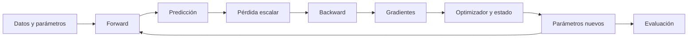

# Gradientes, autodiferenciación y optimización

> [!abstract] Objetivo
> Aprender a explicar y auditar cómo un modelo pasa de una **pérdida escalar** a un **cambio de parámetros**. Al terminar deberías poder anticipar signos, reconstruir un <code>backward</code>, elegir una tasa estable en un caso cuadrático, distinguir el gradiente del estado del optimizador y ejecutar evaluación sin confundir <code>eval()</code> con <code>no_grad()</code>.

> [!summary] La idea en una frase
> Entrenar consiste en construir una pérdida, calcular qué tan sensible es a cada parámetro y usar esa información mediante una regla de actualización verificable.

## La historia completa

Cada flecha responde una pregunta distinta:

| Etapa | Pregunta |
|---|---|
| forward | ¿qué predice el modelo con los parámetros actuales? |
| pérdida | ¿qué cantidad escalar queremos reducir? |
| backward | ¿cómo cambia la pérdida ante cada parámetro? |
| optimizador | ¿cómo se transforma el gradiente en un paso? |
| evaluación | ¿cómo se comporta el modelo sin añadir historia de entrenamiento? |

## Mapa visual del módulo

![[assets/15-mapa-visual-modulo.png|1000]]

### Cómo leerlo

El mapa se recorre de izquierda a derecha, pero el entrenamiento real repite el ciclo muchas veces:

1. **Objetivo:** transforma predicciones y objetivos en una pérdida escalar.
2. **Sensibilidad:** calcula cuánto influye cada parámetro en esa pérdida.
3. **Datos:** decide si el gradiente usa todo el dataset o una estimación mini-batch.
4. **Dinámica:** combina tasa y curvatura; determina si el error disminuye, oscila o crece.
5. **Optimizador:** convierte gradiente e historial en un cambio de parámetros.
6. **Ejecución:** comprueba formas, modos, gradientes y cambios reales.

> [!important] Cuatro cantidades que no son intercambiables
> La **pérdida** mide el objetivo, el **gradiente** mide sensibilidad, el **paso** es el cambio aplicado y el **estado del optimizador** es memoria entre iteraciones.

## Caso conductor

La primera mitad usa una regresión lineal de una sola observación:

$$
\hat y=wx+b,\qquad r=\hat y-y,\qquad L=\frac12r^2.
$$

En el punto

$$
x=2,\quad y=5,\quad w_0=1,\quad b_0=0,
$$

obtenemos

$$
\hat y_0=2,\qquad r_0=-3,\qquad L_0=4.5.
$$

Antes de derivar ya podemos razonar: la predicción está por debajo del objetivo y $x>0$, así que aumentar $w$ o $b$ eleva $\hat y$. Por tanto, el descenso debe mover ambos parámetros hacia arriba. Más adelante comprobaremos:

$$
\frac{\partial L}{\partial w}=rx=-6,
\qquad
\frac{\partial L}{\partial b}=r=-3.
$$

Como descenso resta el gradiente, restará números negativos y aumentará $w$ y $b$.

> [!important] Método del módulo
> **Predice → deriva → ejecuta → contrasta → explica.** El código confirma una afirmación previa; no sustituye la comprensión.

## Prerrequisitos y conexiones

- [[tensores y algebra computacional con pytorch/00 Índice - Tensores y álgebra computacional con PyTorch|Tensores y álgebra computacional con PyTorch]] para formas, lotes y broadcasting.
- [[poo ia/05 Scalar y autodiferenciación|Scalar: valor e historia computacional]] y [[poo ia/06 Grafo computacional y neurona|grafo computacional y neurona]] para la estructura previa a <code>backward</code>.
- [[funcion de perdida|Función de pérdida]] para conectar el objetivo escalar con problemas de regresión y clasificación.
- [[espectro svd y rango bajo/02 Autovalores, autovectores y espectro|Autovalores y direcciones propias]] para entender la estabilidad en varias dimensiones.

## Ruta recomendada

Si los términos todavía se mezclan, empieza por [[00 Glosario visual - términos del entrenamiento]].

1. [[01 Pérdida escalar, residuo y predicción de signos]]
2. [[02 Gradiente, aproximación local y dirección de descenso]]
3. [[03 Grafo computacional y backpropagation]]
4. [[04 Autodiferenciación con micrograd y PyTorch]]
5. [[05 Lotes, reducción y formas del gradiente]]
6. [[06 Tasa de aprendizaje, curvatura y estabilidad]]
7. [[07 Mini-batch y SGD como estimador]]
8. [[08 Momentum y Adam - memoria del optimizador]]
9. [[09 train, eval, grad y no_grad]]
10. [[10 Ciclo de entrenamiento reproducible y diagnóstico]]
11. [[11 Laboratorio PyTorch - predecir, observar y verificar]]
12. [[12 Resumen, mapa mental y autoevaluación]]
13. [[13 Verificación de gradientes con diferencias finitas]] (lectura previa del Control 3)
14. [[14 Control de lectura 3 - el experimento resuelto y explicado]]

## Cobertura de la presentación

| Páginas | Tema principal | Nota donde se desarrolla |
|---:|---|---|
| 1–3 | pérdida escalar y signos | [[01 Pérdida escalar, residuo y predicción de signos]] |
| 4–6 | aproximación local y descenso | [[02 Gradiente, aproximación local y dirección de descenso]] |
| 7–13 | DAG, regla de la cadena y acumulación | [[03 Grafo computacional y backpropagation]] y [[04 Autodiferenciación con micrograd y PyTorch]] |
| 14–19 | lotes, formas y paso explícito | [[05 Lotes, reducción y formas del gradiente]] |
| 20–23 | tasa, recurrencia y curvatura | [[06 Tasa de aprendizaje, curvatura y estabilidad]] |
| 24–25 | estimación mini-batch | [[07 Mini-batch y SGD como estimador]] |
| 26–30 | momentum y Adam | [[08 Momentum y Adam - memoria del optimizador]] |
| 31–37 | modos y registro de autograd | [[09 train, eval, grad y no_grad]] |
| 38–43 | ciclo, evidencia y diagnóstico | [[10 Ciclo de entrenamiento reproducible y diagnóstico]] y [[11 Laboratorio PyTorch - predecir, observar y verificar]] |
| Lectura previa del Control 3 | verificación numérica del gradiente con diferencias finitas | [[13 Verificación de gradientes con diferencias finitas]] |

## El gráfico que conviene entender primero

![[assets/17-tasa-aprendizaje-intuicion.png|1000]]

Los tres paneles usan el mismo punto y el mismo gradiente. Solo cambia la tasa de aprendizaje: el gradiente decide el sentido y la tasa decide la longitud del paso. El ejemplo no afirma que una tasa concreta siempre funcione; prepara la derivación completa de [[06 Tasa de aprendizaje, curvatura y estabilidad]].

## Cómo estudiar

Haz dos pasadas:

1. **Primera:** intuición, diagramas, signos y responsabilidades.
2. **Segunda:** derivaciones, formas, código y pruebas.

Al ver una fórmula, contesta siempre:

- **qué** representa cada símbolo;
- **por qué** aparece;
- **cómo** se calcula o verifica;
- **para qué** sirve dentro del entrenamiento;
- **hasta dónde** es válida la conclusión.

## Ampliación con la guía del estudiante

- [[15 Guía de comprensión - del ejemplo a todo el entrenamiento|Empieza aquí si necesitas reconstruir la explicación paso a paso]].
- Tus imágenes explicadas: [[02 Gradiente, aproximación local y dirección de descenso#Tu imagen 3D: dónde están los parámetros y dónde está la pérdida|Gradiente en 3D]] y [[06 Tasa de aprendizaje, curvatura y estabilidad|Error con signo y curvatura]].
- Las preguntas de repaso se abren al hacer clic en su encabezado en vista de lectura o Live Preview de Obsidian.
- Después: [[../contenedores y ejecucion reproducible con docker/00 Índice - M09 Docker y ejecución reproducible|M09 Docker]] y [[../modelo relacional y sql analitico/00 Índice - M10 Modelo relacional y SQL analítico|M10 SQL]].

## Material fuente

- [[assets/guia_estudiante_m08_gradientes_autodiferenciacion_optimizacion.pdf|Guía del estudiante M08, 45 páginas]].

- Presentación completa: ![[assets/module_08.pdf]]
- Gráficos reproducibles: [[assets/generar_graficos_m08.py]]
- Lectura previa del Control 3: ![[assets/Control_Lectura_3_Lectura_Previa.pdf]]
- Gráficos y GIFs de la verificación numérica: [[assets/generar_graficos_control3.py]]
- Control de lectura 3 resuelto (enunciado, notebook ejecutado y CSV): [[14 Control de lectura 3 - el experimento resuelto y explicado]]

---

Siguiente: [[00 Glosario visual - términos del entrenamiento]]
