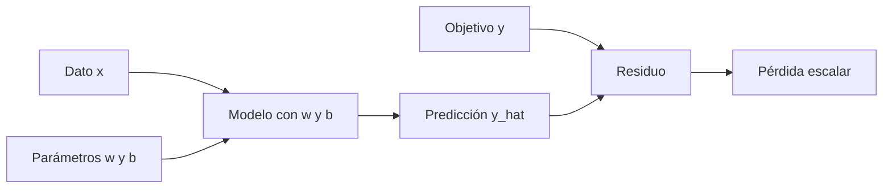

# Pérdida escalar, residuo y predicción de signos

## Qué problema resuelve la pérdida

Un modelo puede tener miles o millones de parámetros. Necesitamos una cantidad común para decidir si un cambio conjunto fue mejor o peor. Una pérdida escalar cumple esa función:

$$L(\theta)\in\mathbb R.$$

**Qué es:** el objetivo numérico que se optimiza. 
**Por qué:** permite comparar estados de muchos parámetros. 
**Cómo:** combina predicciones y objetivos mediante una función definida. 
**Para qué:** entrega a autograd una salida escalar desde la cual propagar sensibilidad.

## Caso conductor paso a paso

Modelo:

$$\hat y=wx+b.$$

Residuo:

$$r=\hat y-y.$$

Pérdida cuadrática con factor $1/2$:

$$L=\frac12r^2.$$

Usamos:

$$x=2,\quad y=5,\quad w=1,\quad b=0.$$

### 1. Predicción

$$\hat y=1(2)+0=2.$$

### 2. Residuo

$$r=2-5=-3.$$

La magnitud $3$ dice cuánto falta. El signo negativo dice que la predicción está por debajo.

### 3. Pérdida

$$L=\frac12(-3)^2=4.5.$$

El cuadrado hace positiva la penalización y castiga más los errores grandes. El factor $1/2$ no cambia el mínimo; simplifica la derivada porque cancela el $2$.

## Predecir el signo antes de derivar

Aquí $x>0$ y la predicción está baja.

| Cambio | Efecto sobre $\hat y=wx+b$ | Efecto esperado sobre $L$ |
|---|---|---|
| aumentar $w$ | aumenta $wx$ porque $x>0$ | disminuye localmente |
| aumentar $b$ | aumenta directamente $\hat y$ | disminuye localmente |

Si aumentar una variable reduce la función, su derivada local debe ser negativa:

$$\frac{\partial L}{\partial w}<0,
\qquad
\frac{\partial L}{\partial b}<0.
$$

Ahora derivamos:

$$
\frac{\partial L}{\partial w}
=\frac{\partial L}{\partial r}
 \frac{\partial r}{\partial\hat y}
 \frac{\partial\hat y}{\partial w}
=r\cdot1\cdot x=rx=-6,
$$

$$
\frac{\partial L}{\partial b}
=r\cdot1\cdot1=r=-3.
$$

Los signos coinciden con la predicción causal.

> [!important] Contraste falsable
> Si el álgebra hubiera producido derivadas positivas, no deberíamos aceptar el resultado: contradiría el efecto que acabamos de razonar para $x>0$.

## Cómo el descenso usa esos signos

Descenso de gradiente actualiza:

$$
w^+=w-\eta\frac{\partial L}{\partial w},
\qquad
b^+=b-\eta\frac{\partial L}{\partial b}.
$$

Con $\eta=0.1$:

$$
w^+=1-0.1(-6)=1.6,
\qquad
b^+=0-0.1(-3)=0.3.
$$

Nueva predicción:

$$\hat y^+=1.6(2)+0.3=3.5.$$

Nueva pérdida:

$$L^+=\frac12(3.5-5)^2=1.125.$$

El cambio fue coherente: elevó la predicción y redujo la pérdida.

## Qué cambia si $x<0$

Supón que la predicción sigue demasiado baja, pero $x=-2$.

- Aumentar $b$ aún eleva la predicción.
- Aumentar $w$ ahora hace $wx$ más negativo y baja la predicción.
- Para elevar $\hat y$, habría que **disminuir** $w$.

Como $r<0$ y $x<0$:

$$\frac{\partial L}{\partial w}=rx>0.$$

El descenso resta un número positivo, por lo que reduce $w$. La regla no memoriza “si la predicción es baja, aumenta todos los parámetros”; usa la estructura causal del modelo.

## Lo que una pérdida baja no demuestra

Una pérdida descendente es evidencia parcial. No prueba:

- que la tasa sea estable;
- que se haya alcanzado un mínimo;
- que los gradientes no se hayan acumulado por error;
- que el modelo generalice a datos nuevos;
- que las formas no hayan activado broadcasting equivocado.

La pérdida responde **qué objetivo numérico se redujo**. Las demás preguntas requieren evidencia adicional.

## Comprueba tu comprensión

1. ¿Por qué se conserva el signo en $r$ antes de elevarlo al cuadrado?
2. ¿Para qué sirve el factor $1/2$?
3. Si $r>0$ y $x>0$, ¿qué signos esperas en las dos derivadas?
4. ¿Por qué una única salida escalar puede depender de muchos parámetros?

> [!question]- Respuestas
> 1. Porque permite saber si la predicción quedó por encima o por debajo y anticipar la dirección causal.
> 2. Para cancelar el $2$ al derivar $r^2$; no cambia el punto mínimo.
> 3. Ambas positivas; el descenso reducirá $w$ y $b$.
> 4. Porque una función puede combinar muchas entradas y devolver una sola cantidad, igual que una suma reúne muchos términos.

---

Anterior: [[00 Glosario visual - términos del entrenamiento]] · Siguiente: [[02 Gradiente, aproximación local y dirección de descenso]]
