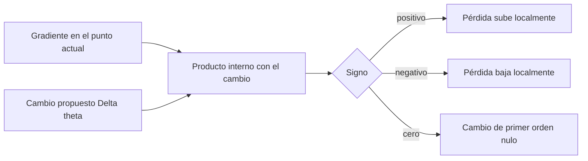
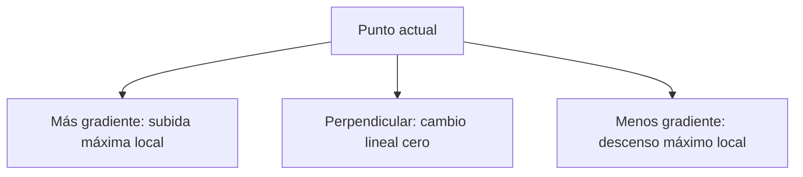

# Gradiente, aproximación local y dirección de descenso

## Qué es realmente el gradiente

Para $\theta=(\theta_1,\ldots,\theta_p)$:

$$
\nabla L(\theta)=
\begin{bmatrix}
\frac{\partial L}{\partial\theta_1}\\
\vdots\\
\frac{\partial L}{\partial\theta_p}
\end{bmatrix}.
$$

No es un movimiento. Es una colección de sensibilidades locales. El movimiento aparece cuando elegimos $\Delta\theta$.

La aproximación de primer orden dice:

$$
L(\theta+\Delta\theta)
\approx
L(\theta)+\nabla L(\theta)^\mathsf{T}\Delta\theta.
$$

El producto interno

$$\Delta L_{\text{lin}}=\nabla L(\theta)^\mathsf{T}\Delta\theta$$

predice el cambio de pérdida:

- positivo: aumento local;
- negativo: descenso local;
- cero: sin cambio de primer orden en esa dirección.

## Mapa visual: gradiente frente a paso

![[assets/06-gradiente-direcciones.png|1000]]

El gráfico usa la función didáctica:

$$
L(w,b)=(w-2)^2+2(b-1)^2.
$$

En $\theta=(0,2)$, la pérdida vale $6$ y el gradiente es $(-4,4)$.

- La **flecha roja** muestra la dirección del gradiente: hacia allí la pérdida aumenta más rápido localmente.
- El primer valor, $-4$, significa que aumentar un poco $w$ tiende a bajar $L$.
- El segundo valor, $+4$, significa que aumentar un poco $b$ tiende a subir $L$.
- La **flecha verde** ya incluye la tasa $\eta=0.2$: es el cambio real $-\eta\nabla L=(0.8,-0.8)$.
- El nuevo estado $(0.8,1.2)$ tiene pérdida $1.52$; por eso este paso concreto mejoró el objetivo.

### Cómo se calcula el paso

En descenso de gradiente, el **paso** es el cambio que aplicamos a los parámetros:

$$
\Delta\theta=-\eta\nabla L(\theta),
\qquad
\theta_{\text{nuevo}}=\theta+\Delta\theta.
$$

Conviene no confundir estas tres ideas:

- $-\nabla L(\theta)$ indica la **dirección de descenso**;
- $\eta$ controla cuánto avanzamos y se llama **tasa de aprendizaje**;
- $\Delta\theta=-\eta\nabla L(\theta)$ es el **paso completo**, es decir, el cambio real de los parámetros.

En el ejemplo, $\theta=(0,2)$, $\nabla L=(-4,4)$ y se elige $\eta=0.2$. Entonces:

$$
\Delta\theta=-0.2(-4,4)=(0.8,-0.8),
$$

$$
\theta_{\text{nuevo}}=(0,2)+(0.8,-0.8)=(0.8,1.2).
$$

### Qué es un hiperparámetro

Un **parámetro** es un valor que el modelo aprende durante el entrenamiento, como $w$ y $b$. Un **hiperparámetro** es una configuración del proceso de aprendizaje que fijamos desde fuera; el modelo no la aprende directamente mediante el gradiente.

La tasa de aprendizaje $\eta$ es un hiperparámetro. En este ejemplo, el valor $\eta=0.2$ **no se obtiene del gradiente**: se escoge para decidir el tamaño del movimiento.

- Si $\eta$ es demasiado pequeño, la pérdida puede bajar muy lentamente.
- Si $\eta$ es demasiado grande, el paso puede sobrepasar el mínimo o incluso aumentar la pérdida.
- Normalmente se prueban distintos valores, se usa un conjunto de validación o se aplica una estrategia que modifica $\eta$ durante el entrenamiento.

> [!example] Parámetros frente a hiperparámetros
> En una regresión lineal, $w$ y $b$ son **parámetros** porque el algoritmo los actualiza. La tasa de aprendizaje $\eta$, el número de iteraciones y el tamaño del lote son **hiperparámetros** porque configuran cómo se realiza el entrenamiento.

En esta nota, los símbolos $\eta$ y $\alpha$ cumplen el mismo papel: ambos representan la tasa de aprendizaje.

> [!note] Por qué las curvas son óvalos
> Cada curva une puntos con el mismo valor de $L$. El factor $2$ delante de $(b-1)^2$ hace que la pérdida sea más sensible a cambios en $b$; por eso las curvas se comprimen más en esa dirección.

> [!warning] Dos ejemplos distintos
> Este mapa usa una cuadrática bidimensional para mostrar la geometría. El “caso conductor” de la sección numérica usa la regresión lineal de la nota anterior. Los principios son los mismos, pero no debes mezclar sus valores.

## Por qué se llama aproximación local

La fórmula

$$
L(\theta+\Delta\theta)
\approx
L(\theta)+\nabla L(\theta)^\mathsf{T}\Delta\theta
$$

reemplaza temporalmente la superficie curva de $L$ por su **plano tangente** en el punto actual $\theta$. En ese punto, ambos tienen el mismo valor y la misma pendiente, pero el plano no reproduce la curvatura de la función.

La expansión de Taylor permite ver qué se está omitiendo:

$$
L(\theta+\Delta\theta)
=
L(\theta)
+\nabla L(\theta)^\mathsf{T}\Delta\theta
+\underbrace{\frac12\Delta\theta^\mathsf{T}
H(\tilde\theta)\Delta\theta}_{\text{efecto de la curvatura}},
$$

donde $H$ es la matriz Hessiana y $\tilde\theta$ es un punto intermedio. El término lineal crece con el tamaño del paso, mientras que el error debido a la curvatura es, localmente, de orden $\lVert\Delta\theta\rVert^2$. Por eso, al reducir suficientemente el paso, el error se vuelve pequeño mucho más rápido.

Un ejemplo en una dimensión lo hace visible. Para $L(x)=x^2$, alrededor de $x=1$:

$$
L(1+h)=1+2h+h^2.
$$

La aproximación lineal predice $1+2h$ y omite $h^2$. Si $h=0.1$, predice $1.20$ y el valor exacto es $1.21$; si $h=1$, predice $3$ y el valor exacto es $4$. La recta tangente no cambió: lo que cambió fue la distancia al punto donde era una buena aproximación.

> [!warning] Límite
> El gradiente describe la pendiente **en el punto actual**. Puede predecir bien el efecto de pasos suficientemente pequeños, pero por sí solo no garantiza el resultado de un paso grande, el mejor tamaño de paso ni la llegada al mínimo global.

## Por qué la dirección opuesta produce el máximo descenso lineal

El cambio direccional en una dirección unitaria $d$ es:

$$D_dL(\theta)=\nabla L(\theta)^\mathsf{T}d,
\qquad \lVert d\rVert_2=1.$$

Por Cauchy-Schwarz:

$$
\nabla L^\mathsf{T}d
\ge -\lVert\nabla L\rVert_2\lVert d\rVert_2
=-\lVert\nabla L\rVert_2.
$$

La igualdad ocurre cuando:

$$
d=-\frac{\nabla L}{\lVert\nabla L\rVert_2}.
$$

Así, entre direcciones de longitud uno, la opuesta al gradiente produce el cambio lineal más negativo.

### Intuición sin la desigualdad

Piensa en $\nabla L$ como una flecha:

- misma dirección: producto interno positivo;
- perpendicular: producto interno cero;
- dirección opuesta: producto interno tan negativo como permite la longitud fijada.

## Contraste numérico

En el caso conductor:

$$\theta=(w,b)=(1,0),
\qquad
\nabla L=(-6,-3).
$$

Tomemos $\alpha=0.05$.

### A favor del gradiente

$$
\Delta\theta_+=\alpha\nabla L=(-0.30,-0.15).
$$

Predicción lineal:

$$
\Delta L_{\text{lin}}
=\nabla L^\mathsf{T}\Delta\theta_+
=\alpha\lVert\nabla L\rVert^2
=2.25>0.
$$

Nuevo punto: $(0.70,-0.15)$. La pérdida exacta pasa de $4.5$ a:

$$
\frac12(0.70\cdot2-0.15-5)^2=7.03125.
$$

### En contra del gradiente

$$
\Delta\theta_-=-\alpha\nabla L=(0.30,0.15).
$$

$$
\Delta L_{\text{lin}}=-2.25<0.
$$

Nuevo punto: $(1.30,0.15)$. La pérdida exacta es:

$$
\frac12(1.30\cdot2+0.15-5)^2=2.53125.
$$

La predicción lineal no coincide exactamente con el cambio real porque la pérdida es curva, pero acierta el signo para este paso pequeño.

## Tu imagen 3D: dónde están los parámetros y dónde está la pérdida

![[assets/27-gradiente-3d-referencia.png|1100]]

Esta imagen se interpreta con el caso de la guía del estudiante, páginas 3–7:

$$L(w,b)=\frac12(2w+b-5)^2.$$

**Lee primero los ejes:** $w$ y $b$ son los dos parámetros del suelo; la altura es $L(w,b)$. El punto naranja $(1,0,4.5)$ dice «peso 1, sesgo 0 y pérdida 4.5». El 4.5 no es un tercer parámetro entrenable.

**Después lee las flechas:** en $(w,b)=(1,0)$ el residuo es $-3$ y el gradiente es $(-6,-3)$. El gradiente apunta hacia aumento local de la pérdida; al restarlo aumentamos ambos parámetros. Con $\eta=0.05$, el paso es $(0.30,0.15)$, el nuevo punto en el suelo es $(1.30,0.15)$ y su altura es $2.53125$.

Las flechas dibujadas sobre la superficie son una representación ilustrativa. Matemáticamente $\nabla L$ tiene **dos componentes en el espacio de parámetros**; no es un vector de tres parámetros $(w,b,L)$ ni debemos deducir sus signos solo de la perspectiva del dibujo.

### Por qué el fondo es una línea

La pérdida es cero siempre que $2w+b=5$. Por ejemplo, $(w,b)=(1,3)$, $(2,1)$ y $(0,5)$ ajustan exactamente la única observación. Hay una línea de soluciones: una observación no identifica de forma única dos parámetros.

Esto distingue esta superficie del cuenco positivo definido de la nota de curvatura. Aquí el Hessiano es

$$H=\begin{pmatrix}4&2\\2&1\end{pmatrix},$$

con autovalores $5$ y $0$. El cero corresponde a moverse por la dirección plana $(1,-2)$: cambiar $w$ en $1$ y $b$ en $-2$ deja $2w+b$ igual. No apliques la afirmación «todas las direcciones del error se contraen» a esa dirección plana.

Fuente: [[assets/guia_estudiante_m08_gradientes_autodiferenciacion_optimizacion.pdf#page=3|Guía M08, páginas 3–7]]. La imagen es la referencia aportada; la explicación de la línea de mínimos amplía ese ejemplo.

## Gradiente nulo no equivale siempre a mínimo

Si $\nabla L(\theta)=0$, todas las derivadas direccionales de primer orden son cero. El punto podría ser:

- un mínimo local;
- un máximo local;
- un punto silla;
- una región plana.

Hace falta información de orden superior o del contexto para clasificarlo.

## Qué, por qué, cómo y para qué

| Pregunta | Respuesta |
|---|---|
| ¿qué? | vector de derivadas parciales |
| ¿por qué? | resume la sensibilidad local a todos los parámetros |
| ¿cómo? | derivación manual o autodiferenciación |
| ¿para qué? | evaluar direcciones y construir reglas de actualización |
| ¿límite? | información local de primer orden |

## Preguntas con respuesta desplegable

Haz clic en cada pregunta después de intentar responder.

> [!question]- Si $\nabla L=(3,-4)$ y $\Delta\theta=(-0.2,0.1)$, ¿qué cambio predice Taylor?
> $\Delta L_{\mathrm{lin}}=3(-0.2)+(-4)(0.1)=-1$. Predice una disminución aproximada de una unidad; la curvatura decide cuánto se aparta el valor real.

> [!question]- ¿El 4.5 del punto naranja es un parámetro?
> No. Es el valor de la pérdida para w=1 y b=0.

> [!question]- ¿Por qué la imagen tiene una línea de mínimos?
> Porque todos los pares que cumplen 2w+b=5 predicen correctamente la única observación. Hay una dirección plana.

---

Anterior: [[01 Pérdida escalar, residuo y predicción de signos]] · Siguiente: [[03 Grafo computacional y backpropagation]]
