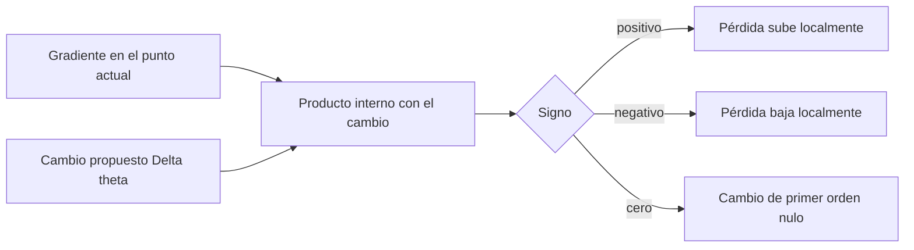
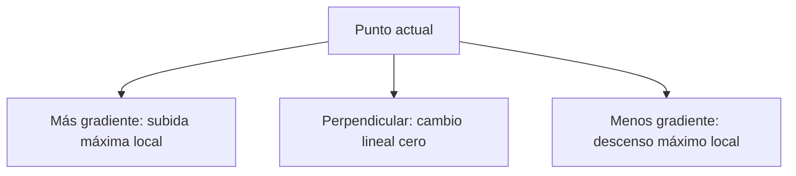

# Gradiente, aproximación local y dirección de descenso

## Qué es realmente el gradiente

Para $\theta=(\theta_1,\ldots,\theta_p)$:

$$
\nabla L(\theta)=
\begin{bmatrix}
\frac{\partial L}{\partial\theta_1}\\
\vdots\\
\frac{\partial L}{\partial\theta_p}
\end{bmatrix}.
$$

No es un movimiento. Es una colección de sensibilidades locales. El movimiento aparece cuando elegimos $\Delta\theta$.

La aproximación de primer orden dice:

$$
L(\theta+\Delta\theta)
\approx
L(\theta)+\nabla L(\theta)^\mathsf{T}\Delta\theta.
$$

El producto interno

$$\Delta L_{\text{lin}}=\nabla L(\theta)^\mathsf{T}\Delta\theta$$

predice el cambio de pérdida:

- positivo: aumento local;
- negativo: descenso local;
- cero: sin cambio de primer orden en esa dirección.

## Por qué se llama aproximación local

Una recta tangente se parece a una curva solo cerca del punto de contacto. El término omitido contiene curvatura y crece al agrandar el paso. Por eso:

> [!warning] Límite
> El gradiente predice bien cambios suficientemente pequeños. No garantiza el resultado de un paso grande, el mejor paso finito ni el mínimo global.

## Por qué la dirección opuesta produce el máximo descenso lineal

El cambio direccional en una dirección unitaria $d$ es:

$$D_dL(\theta)=\nabla L(\theta)^\mathsf{T}d,
\qquad \lVert d\rVert_2=1.$$

Por Cauchy-Schwarz:

$$
\nabla L^\mathsf{T}d
\ge -\lVert\nabla L\rVert_2\lVert d\rVert_2
=-\lVert\nabla L\rVert_2.
$$

La igualdad ocurre cuando:

$$
d=-\frac{\nabla L}{\lVert\nabla L\rVert_2}.
$$

Así, entre direcciones de longitud uno, la opuesta al gradiente produce el cambio lineal más negativo.

### Intuición sin la desigualdad

Piensa en $\nabla L$ como una flecha:

- misma dirección: producto interno positivo;
- perpendicular: producto interno cero;
- dirección opuesta: producto interno tan negativo como permite la longitud fijada.

## Contraste numérico

En el caso conductor:

$$\theta=(w,b)=(1,0),
\qquad
\nabla L=(-6,-3).
$$

Tomemos $\alpha=0.05$.

### A favor del gradiente

$$
\Delta\theta_+=\alpha\nabla L=(-0.30,-0.15).
$$

Predicción lineal:

$$
\Delta L_{\text{lin}}
=\nabla L^\mathsf{T}\Delta\theta_+
=\alpha\lVert\nabla L\rVert^2
=2.25>0.
$$

Nuevo punto: $(0.70,-0.15)$. La pérdida exacta pasa de $4.5$ a:

$$
\frac12(0.70\cdot2-0.15-5)^2=7.03125.
$$

### En contra del gradiente

$$
\Delta\theta_-=-\alpha\nabla L=(0.30,0.15).
$$

$$
\Delta L_{\text{lin}}=-2.25<0.
$$

Nuevo punto: $(1.30,0.15)$. La pérdida exacta es:

$$
\frac12(1.30\cdot2+0.15-5)^2=2.53125.
$$

La predicción lineal no coincide exactamente con el cambio real porque la pérdida es curva, pero acierta el signo para este paso pequeño.

## Gradiente nulo no equivale siempre a mínimo

Si $\nabla L(\theta)=0$, todas las derivadas direccionales de primer orden son cero. El punto podría ser:

- un mínimo local;
- un máximo local;
- un punto silla;
- una región plana.

Hace falta información de orden superior o del contexto para clasificarlo.

## Qué, por qué, cómo y para qué

| Pregunta | Respuesta |
|---|---|
| ¿qué? | vector de derivadas parciales |
| ¿por qué? | resume la sensibilidad local a todos los parámetros |
| ¿cómo? | derivación manual o autodiferenciación |
| ¿para qué? | evaluar direcciones y construir reglas de actualización |
| ¿límite? | información local de primer orden |

## Pregunta de control

Si $\nabla L=(3,-4)$ y propones $\Delta\theta=(-0.2,0.1)$:

$$\Delta L_{\text{lin}}=3(-0.2)+(-4)(0.1)=-1.$$

La pérdida debería bajar aproximadamente una unidad si el paso es suficientemente pequeño.

---

Anterior: [[01 Pérdida escalar, residuo y predicción de signos]] · Siguiente: [[03 Grafo computacional y backpropagation]]
