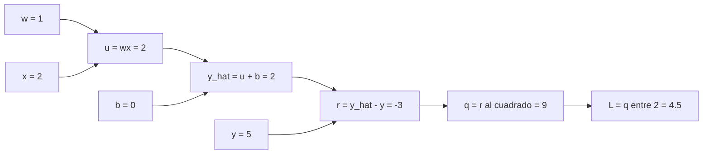
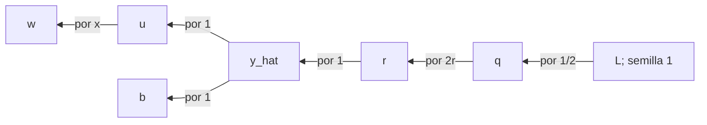
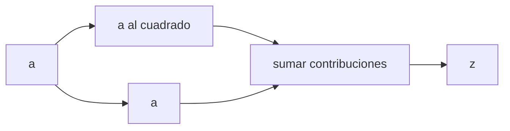
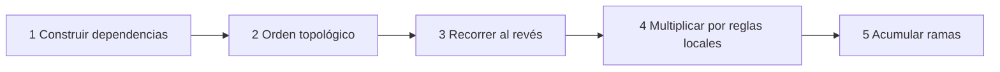

# Grafo computacional y backpropagation

## Por qué descomponer el cálculo

La expresión compacta

$$L(w,b)=\frac12(wx+b-y)^2$$

es cómoda para leer, pero una computadora necesita conocer las operaciones elementales y sus dependencias. Las separamos:

$$
u=wx,\quad
\hat y=u+b,\quad
r=\hat y-y,\quad
q=r^2,\quad
L=\frac12q.
$$

El forward hace dos cosas:

1. calcula el valor de cada nodo;
2. conserva qué nodos y qué operación lo produjeron.

## Vista conjunta de forward y backward

### Animación paso a paso

![[assets/03-forward-backpropagation-animado.gif|1000]]

> [!tip] Sigue el recorrido por colores
> El **morado** muestra el forward de izquierda a derecha: calcula y guarda valores. El **verde** muestra el backward de derecha a izquierda: parte de la semilla $\partial L/\partial L=1$, multiplica por cada derivada local y finalmente obtiene $\partial L/\partial w=-6$ y $\partial L/\partial b=-3$.

### Vista estática

![[assets/09-forward-backward-valores.png|1000]]

### Cómo interpretar el gráfico

- La fila superior se recorre de **izquierda a derecha** y contiene valores calculados: $2$, $-3$, $9$ y $4.5$.
- La fila inferior se recorre de **derecha a izquierda** y contiene sensibilidades: no vuelve a calcular el forward.
- La semilla $\partial L/\partial L=1$ solo significa que la salida cambia una unidad respecto de sí misma.
- Cada operación multiplica la sensibilidad recibida por su derivada local.
- Para llegar a $w$, la última operación es $u=wx$, cuya derivada respecto de $w$ vale $x=2$; por eso $-3$ se convierte en $-6$.
- Para llegar a $b$, la suma aporta un factor $1$; por eso el gradiente de $b$ permanece en $-3$.

> [!important] Valores frente a sensibilidades
> $r=-3$ es un **valor del forward**. $\partial L/\partial r=-3$ es una **sensibilidad del backward**. En este ejemplo coinciden numéricamente por la forma de $L=\frac12r^2$, pero representan cosas distintas.

## Derivadas locales de las aristas

| Operación | Derivada local en el caso conductor |
|---|---:|
| $u=wx$ | $\partial u/\partial w=x=2$ |
| $\hat y=u+b$ | $\partial\hat y/\partial u=1$, $\partial\hat y/\partial b=1$ |
| $r=\hat y-y$ | $\partial r/\partial\hat y=1$ |
| $q=r^2$ | $\partial q/\partial r=2r=-6$ |
| $L=q/2$ | $\partial L/\partial q=1/2$ |

Una derivada local solo conoce la operación inmediata. La derivada total aparece al componer la ruta completa.

## La sensibilidad nace en 1

El backward comienza en la salida:

$$\frac{\partial L}{\partial L}=1.$$

Luego recorre el grafo de derecha a izquierda:

Para $w$:

$$
\frac{\partial L}{\partial w}
=
\frac{\partial L}{\partial q}
\frac{\partial q}{\partial r}
\frac{\partial r}{\partial\hat y}
\frac{\partial\hat y}{\partial u}
\frac{\partial u}{\partial w}
=
\frac12(2r)(1)(1)x
=rx=-6.
$$

Para $b$, la última derivada vale $1$:

$$
\frac{\partial L}{\partial b}
=
\frac12(2r)(1)(1)
=r=-3.
$$

> [!summary] Qué hace backpropagation
> Multiplica factores locales **a lo largo de una ruta** y suma contribuciones **entre rutas diferentes** que llegan al mismo nodo.

## Cuando una variable aparece en dos rutas

Sea:

$$z=a^2+a.$$

El nodo $a$ influye por dos ramas:

La primera aporta $2a$ y la segunda aporta $1$:

$$\frac{dz}{da}=2a+1.$$

En $a=2$, el resultado es $5$. Guardar solo la última contribución produciría $1$; reemplazar en vez de sumar destruiría parte de la dependencia causal.

En un motor de autodiferenciación esta es la razón del operador <code>+=</code> al actualizar gradientes.

## Por qué el orden topológico importa

Un orden topológico coloca cada padre antes de sus descendientes:

$$[w,x,u,b,\hat y,y,r,q,L].$$

Backward invierte ese orden:

$$[L,q,r,y,\hat y,b,u,x,w].$$

Así, un nodo compartido recibe todas las contribuciones de sus descendientes antes de propagar su sensibilidad hacia sus padres.

Son responsabilidades diferentes:

- **topología:** respeta dependencias;
- **regla de la cadena:** transporta sensibilidad;
- **acumulación:** conserva todas las rutas.

## Por qué la salida suele ser escalar

Para

$$L=f_k\circ\cdots\circ f_1(\theta)\in\mathbb R,$$

existe una única semilla natural $\partial L/\partial L=1$ y backward produce $\nabla_\theta L$.

Si la salida es vectorial:

$$y(\theta)\in\mathbb R^m,$$

decir “deriva $y$” es ambiguo. El Jacobiano completo sería:

$$
J_y(\theta)
=
\frac{\partial y}{\partial\theta}
\in\mathbb R^{m\times p},
$$

donde hay una fila por componente de salida y una columna por parámetro. Hay que indicar qué combinación escalar interesa. Por ejemplo, para:

$$s=v^\mathsf{T}y,\qquad v\in\mathbb R^m,$$

la forma de columna del gradiente es:

$$
\nabla_\theta s
=J_y(\theta)^\mathsf{T}v
\in\mathbb R^p.
$$

La misma operación puede escribirse como fila:

$$
(\nabla_\theta s)^\mathsf{T}
=v^\mathsf{T}J_y(\theta).
$$

Esta última expresión es el **producto vector-Jacobiano** o VJP. Los frameworks permiten suministrar $v$ cuando la salida no es escalar. La transposición solo depende de si representamos el gradiente como columna o fila; sus $p$ componentes son las mismas.

> [!important] Eficiencia
> El modo inverso evita construir todo el Jacobiano cuando se desea el gradiente de una pérdida escalar respecto a muchos parámetros.

## Qué, por qué, cómo y para qué

| Pregunta | Respuesta |
|---|---|
| ¿qué? | recorrido inverso del grafo |
| ¿por qué? | aplica la regla de la cadena reutilizando sensibilidades |
| ¿cómo? | orden topológico inverso, productos locales y sumas |
| ¿para qué? | obtener el gradiente de una salida escalar respecto a muchas hojas |

## Autoexplicación

Intenta completar sin mirar:

> El forward conserva ___ y ___. El backward empieza con ___, multiplica ___ a lo largo de cada ruta y ___ las contribuciones cuando una variable participa en varias ramas.

> [!question]- Mostrar la frase completa
> El forward conserva **valores** y **dependencias**. El backward empieza con **una semilla igual a 1**, multiplica **derivadas locales** a lo largo de cada ruta y **suma** las contribuciones cuando una variable participa en varias ramas.

## Ejemplo animado en una red neuronal pequeña

La siguiente red tiene dos entradas, una capa oculta con dos neuronas ReLU y una salida. En el **forward** calcula $h_1$, $h_2$, la predicción $\hat y$ y la pérdida. En el **backward**, la sensibilidad regresa por todas las conexiones hasta obtener el gradiente de cada peso.

![[assets/03-red-neuronal-forward-backpropagation-v2.gif|1000]]

> [!note] Qué debes observar
> - **Morado:** los valores avanzan desde $x_1,x_2$ hasta $L$.
> - **Verde:** el gradiente vuelve desde $L$ hacia las capas anteriores.
> - **Amarillo:** pesos entrenables de cada conexión.
> - Una neurona con varias salidas recibe y acumula las contribuciones de todas sus rutas.

---

Anterior: [[02 Gradiente, aproximación local y dirección de descenso]] · Siguiente: [[04 Autodiferenciación con micrograd y PyTorch]]
