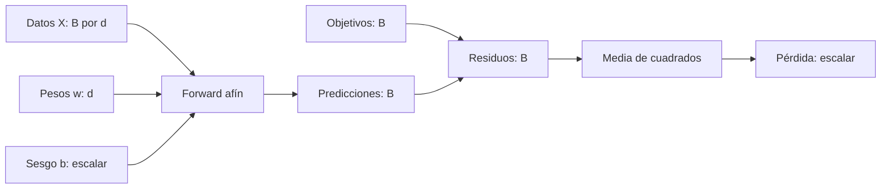
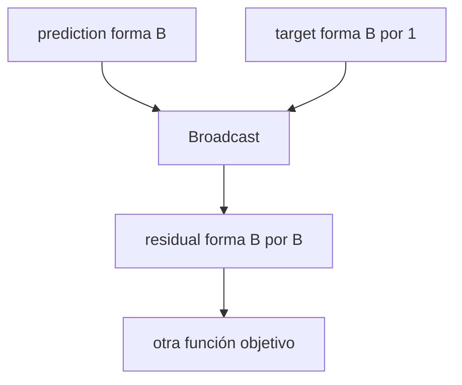

# Lotes, reducción y formas del gradiente

## Antes de empezar: ¿qué es un lote?

Un **lote** (*batch*) es un grupo de ejemplos que el modelo procesa juntos antes de actualizar sus parámetros.

Por ejemplo, supongamos que tenemos estos datos:

| Entrada $x$ | Resultado esperado $y$ |
|---:|---:|
| 1 | 3 |
| 2 | 5 |
| 3 | 7 |

Aquí hay tres ejemplos, por lo que el tamaño del lote es:

$$B=3.$$

Cada ejemplo tiene una sola característica, de modo que:

$$d=1.$$

Al reunir los ejemplos en una matriz obtenemos:

$$
X=
\begin{bmatrix}
1\\
2\\
3
\end{bmatrix}
\in\mathbb R^{3\times1}.
$$

> [!important] Cómo leer $X:(B,d)$
> - Cada **fila** representa un ejemplo.
> - Cada **columna** representa una característica.
> - $B$ es la cantidad de ejemplos.
> - $d$ es la cantidad de características de cada ejemplo.

Si procesáramos los datos individualmente, ejecutaríamos el modelo tres veces. Al utilizar un lote, PyTorch puede realizar las tres predicciones mediante una sola operación matricial.

### Recorrido completo del lote

El entrenamiento sigue este recorrido:

```text
Lote de B ejemplos
        ↓
B predicciones
        ↓
B residuos o errores
        ↓
Reducción con mean()
        ↓
Una pérdida escalar
        ↓
backward()
        ↓
Un gradiente para cada parámetro
```

Usamos el modelo lineal:

$$\hat y=Xw+b.$$

Con los valores iniciales $w=1$ y $b=0$ obtenemos:

$$
\hat y=
\begin{bmatrix}1\\2\\3\end{bmatrix}.
$$

El modelo produce **una predicción por cada ejemplo del lote**. Al compararlas con los resultados correctos:

$$
y=
\begin{bmatrix}3\\5\\7\end{bmatrix},
$$

obtenemos un residuo por ejemplo:

$$
r=\hat y-y
=
\begin{bmatrix}
1-3\\
2-5\\
3-7
\end{bmatrix}
=
\begin{bmatrix}-2\\-3\\-4\end{bmatrix}.
$$

Los residuos son negativos porque todas las predicciones son menores que sus objetivos.

### ¿Qué es la reducción?

En este punto tenemos tres errores, pero para entrenar normalmente queremos un solo número que resuma qué tan mal funcionó el modelo en todo el lote. Convertir varios valores en uno se llama **reducción**.

En este caso usamos la media de los errores al cuadrado:

$$
L=\frac1{2B}\sum_{i=1}^{B}r_i^2.
$$

Para nuestro lote:

$$
L
=\frac1{2\cdot3}\left((-2)^2+(-3)^2+(-4)^2\right)
=\frac{29}{6}
\approx4.8333.
$$

- Elevar al cuadrado evita que los errores positivos y negativos se cancelen.
- Dividir por $B$ calcula el error promedio del lote.
- El factor $1/2$ simplifica la derivada del cuadrado.

> [!note] Una precisión
> La pérdida no tiene que ser escalar en todos los casos matemáticos. Sin embargo, durante el entrenamiento normalmente se reduce a un escalar para poder llamar `loss.backward()` directamente y obtener una medida global del error del lote.

### Intuición de los gradientes

La reducción produce una sola pérdida, pero `backward()` calcula cuánta responsabilidad tiene cada parámetro en esa pérdida.

Para el peso:

$$
\nabla_wL=\frac1B X^\mathsf{T}r
=\frac1B\sum_{i=1}^{B}x_i r_i.
$$

Cada residuo se multiplica por la entrada que lo produjo. Por eso los ejemplos con un valor de $x_i$ mayor influyen más en el gradiente de $w$.

En nuestro ejemplo:

$$
\nabla_wL
=\frac13\left(1(-2)+2(-3)+3(-4)\right)
=-\frac{20}{3}.
$$

Para el sesgo:

$$
\frac{\partial L}{\partial b}
=\frac1B\sum_{i=1}^{B}r_i
=\frac{-2-3-4}{3}
=-3.
$$

El gradiente de $b$ es el residuo promedio porque el mismo sesgo se suma por igual a todas las predicciones.

Con una tasa de aprendizaje $\eta=0.1$:

$$
w_1=w_0-\eta\nabla_wL=1.6667,
\qquad
b_1=b_0-\eta\frac{\partial L}{\partial b}=0.3.
$$

Los dos parámetros aumentan porque el modelo estaba prediciendo valores demasiado pequeños.

> [!summary] Idea esencial
> Un lote permite procesar varios ejemplos juntos. Cada ejemplo produce una predicción y un residuo; la reducción resume esos residuos en una pérdida escalar, y `backward()` calcula un gradiente con la forma de cada parámetro.

La siguiente sección expresa esta misma idea de manera más formal y deriva las fórmulas de los gradientes.

## Qué cambia al introducir un lote

El forward pasa de una predicción a $B$ predicciones, pero la reducción final mantiene una pérdida escalar.

$$
X\in\mathbb R^{B\times d},
\quad
w\in\mathbb R^d,
\quad
b\in\mathbb R.
$$

$$
\hat y=Xw+b\mathbf1_B,
\qquad
r=\hat y-y,
\qquad
L=\frac1{2B}r^\mathsf{T}r.
$$



**Qué:** se vectoriza el cálculo.<br>
**Por qué:** procesar varios ejemplos juntos aprovecha operaciones matriciales.<br>
**Cómo:** cada ejemplo produce un residuo y una reducción los reúne.<br>
**Para qué:** backward mantiene una única salida escalar.

## Caso numérico

$$
X=
\begin{bmatrix}1\\2\\3\end{bmatrix},
\quad
y=
\begin{bmatrix}3\\5\\7\end{bmatrix},
\quad
w_0=1,
\quad
b_0=0.
$$

Predicciones y residuos:

$$
\hat y=
\begin{bmatrix}1\\2\\3\end{bmatrix},
\qquad
r=
\begin{bmatrix}-2\\-3\\-4\end{bmatrix}.
$$

Pérdida:

$$
L_0
=\frac1{2\cdot3}(4+9+16)
=\frac{29}{6}
\approx4.8333.
$$

## Derivar perturbando los pesos

Movemos $w$ una cantidad pequeña $\Delta w$:

$$r(w+\Delta w,b)=r+X\Delta w.$$

Sustituimos:

$$
L(w+\Delta w,b)
=
\frac1{2B}(r+X\Delta w)^\mathsf{T}(r+X\Delta w).
$$

Expandimos:

$$
L(w+\Delta w,b)
=L(w,b)
+\frac1B r^\mathsf{T}X\Delta w
+\frac1{2B}\lVert X\Delta w\rVert_2^2.
$$

El último término es cuadrático y se vuelve pequeño más rápido que el término lineal. Reescribimos:

$$
\frac1B r^\mathsf{T}X\Delta w
=
\left(\frac1B X^\mathsf{T}r\right)^\mathsf{T}\Delta w.
$$

Por comparación con $\nabla_wL^\mathsf{T}\Delta w$:

$$
\boxed{\nabla_wL=\frac1B X^\mathsf{T}r}.
$$

> [!tip] Lectura
> $X^\mathsf{T}$ lleva los residuos desde el espacio de ejemplos hacia el espacio de características. El gradiente final tiene la misma forma que $w$.

## Derivada respecto al sesgo

Al mover $b$ por $\Delta b$, el mismo cambio se replica en todo el lote:

$$r(w,b+\Delta b)=r+\Delta b\,\mathbf1_B.$$

El término lineal conduce a:

$$
\boxed{
\frac{\partial L}{\partial b}
=\frac1B\mathbf1_B^\mathsf{T}r
}.
$$

Es decir, el gradiente del sesgo es el residuo promedio.

## Auditoría de formas

| Objeto | Forma |
|---|---:|
| $X$ | $(B,d)$ |
| $r$ | $(B,)$ |
| $X^\mathsf{T}$ | $(d,B)$ |
| $X^\mathsf{T}r$ | $(d,)$, igual que $w$ |
| $\mathbf1_B^\mathsf{T}r$ | escalar, igual que $b$ |

> [!important] Invariante
> Cada gradiente debe heredar la forma de su parámetro. Si no coincide, revisa la derivación o el broadcasting.

## Mapa visual de formas y broadcasting

![[assets/11-formas-y-broadcasting.png|1000]]

### Cómo interpretar las formas

- $X:(B,d)$ significa **$B$ ejemplos por $d$ características**. En el dibujo, $(3,1)$ son tres ejemplos con una característica cada uno.
- $w:(d,)$ contiene un peso por característica. El producto $Xw$ elimina la dimensión $d$ y deja una predicción por ejemplo: $(B,)$.
- El objetivo $y$ debe tener la misma forma semántica que $\hat y$. Entonces la resta genera exactamente $B$ residuos emparejados.
- <code>mean</code> reduce esos $B$ valores a una pérdida escalar; eso permite iniciar backward con una semilla natural igual a $1$.
- El gradiente de $w$ vuelve a tener forma $(d,)$ y el de $b$ vuelve a ser escalar.

### Cómo leer la matriz roja y azul

Si se resta $(3,)$ menos $(3,1)$, broadcasting combina cada predicción con cada objetivo y crea una matriz $(3,3)$:

$$
\begin{bmatrix}1&2&3\end{bmatrix}
-
\begin{bmatrix}1\\2\\3\end{bmatrix}
=
\begin{bmatrix}
0&1&2\\
-1&0&1\\
-2&-1&0
\end{bmatrix}.
$$

La diagonal contiene comparaciones emparejadas, pero las otras seis celdas son cruces no deseados. El programa ejecuta sin error porque las formas son compatibles para broadcasting; el error es **semántico**.

En el caso numérico:

$$
\nabla_wL
=\frac13[1,2,3]
\begin{bmatrix}-2\\-3\\-4\end{bmatrix}
=-\frac{20}{3},
$$

$$
\frac{\partial L}{\partial b}
=\frac13(-2-3-4)
=-3.
$$

Con $\eta=0.1$:

$$w_1=1-\eta(-20/3)=1.6667,\qquad b_1=0.3.$$

## Implementación exacta en PyTorch

```python
import torch

X = torch.tensor([[1.], [2.], [3.]])  # (B,d) = (3,1)
y = torch.tensor([3., 5., 7.])        # (B,)   = (3,)
w = torch.tensor([1.], requires_grad=True)
b = torch.tensor(0., requires_grad=True)

y_hat = X @ w + b                     # (B,)
assert y_hat.shape == y.shape

r = y_hat - y                         # (B,)
loss = 0.5 * torch.mean(r ** 2)       # ()
loss.backward()

assert w.grad.shape == w.shape
assert b.grad.shape == b.shape
assert torch.allclose(w.grad, torch.tensor([-20 / 3]))
assert torch.allclose(b.grad, torch.tensor(-3.0))
```

## Broadcasting silencioso: código válido, objetivo equivocado

Supón:

```python
prediction = torch.zeros(4)     # (B,)
target = torch.arange(4.)[:, None]  # (B,1)
residual = prediction - target
```

PyTorch alinea:

$$
(B,)\;-\;(B,1)\longrightarrow(B,B).
$$

Ya no hay un residuo por ejemplo. Aparecen todas las diferencias $\hat y_j-y_i$ y la media optimiza otra función:

$$
L_{\text{equivocada}}
=\operatorname{mean}_{i,j}(\hat y_j-y_i)^2.
$$



La primera barrera diagnóstica es:

```python
assert prediction.shape == target.shape
```

Consulta también [[tensores y algebra computacional con pytorch/05 Broadcasting con significado|Broadcasting con significado]].


## Preguntas con respuesta desplegable

Haz clic en cada pregunta después de intentar responder.

> [!question]- ¿Por qué la pérdida debe reducir los $B$ residuos?
> Para definir un objetivo escalar común a partir de los errores del lote. En este caso se promedian sus cuadrados y se multiplica por 1/2; el residuo sigue siendo vector antes de reducir.

> [!question]- ¿Por qué $X^\mathsf{T}r$ tiene la forma de $w$?
> Si $X$ tiene forma $(B,d)$, su transpuesta tiene $(d,B)$ y $r$ tiene $(B,)$. El producto tiene $(d,)$, una sensibilidad por peso.

> [!question]- ¿Qué significa que el gradiente de b sea el residuo promedio?
> El mismo sesgo se suma a todas las predicciones. Cada ejemplo aporta su residuo y la reducción media divide la suma por B.

> [!question]- ¿Por qué una resta que ejecuta puede representar otro objetivo?
> El broadcasting puede convertir (B,) menos (B,1) en (B,B), comparando predicciones con objetivos de otras observaciones.

---

Anterior: [[04 Autodiferenciación con micrograd y PyTorch]] · Siguiente: [[06 Tasa de aprendizaje, curvatura y estabilidad]]
