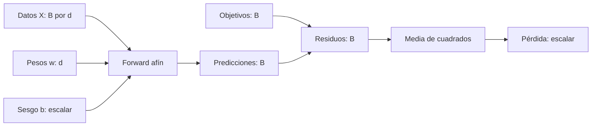
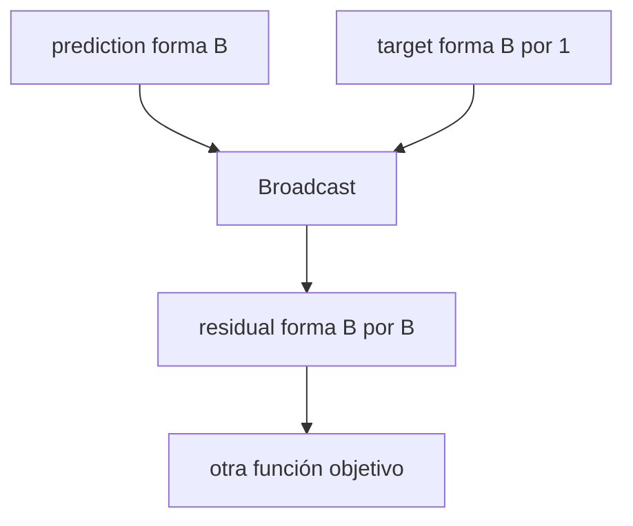

# Lotes, reducción y formas del gradiente

## Qué cambia al introducir un lote

El forward pasa de una predicción a $B$ predicciones, pero la reducción final mantiene una pérdida escalar.

$$
X\in\mathbb R^{B\times d},
\quad
w\in\mathbb R^d,
\quad
b\in\mathbb R.
$$

$$
\hat y=Xw+b\mathbf1_B,
\qquad
r=\hat y-y,
\qquad
L=\frac1{2B}r^\mathsf{T}r.
$$



**Qué:** se vectoriza el cálculo.<br>
**Por qué:** procesar varios ejemplos juntos aprovecha operaciones matriciales.<br>
**Cómo:** cada ejemplo produce un residuo y una reducción los reúne.<br>
**Para qué:** backward mantiene una única salida escalar.

## Caso numérico

$$
X=
\begin{bmatrix}1\\2\\3\end{bmatrix},
\quad
y=
\begin{bmatrix}3\\5\\7\end{bmatrix},
\quad
w_0=1,
\quad
b_0=0.
$$

Predicciones y residuos:

$$
\hat y=
\begin{bmatrix}1\\2\\3\end{bmatrix},
\qquad
r=
\begin{bmatrix}-2\\-3\\-4\end{bmatrix}.
$$

Pérdida:

$$
L_0
=\frac1{2\cdot3}(4+9+16)
=\frac{29}{6}
\approx4.8333.
$$

## Derivar perturbando los pesos

Movemos $w$ una cantidad pequeña $\Delta w$:

$$r(w+\Delta w,b)=r+X\Delta w.$$

Sustituimos:

$$
L(w+\Delta w,b)
=
\frac1{2B}(r+X\Delta w)^\mathsf{T}(r+X\Delta w).
$$

Expandimos:

$$
L(w+\Delta w,b)
=L(w,b)
+\frac1B r^\mathsf{T}X\Delta w
+\frac1{2B}\lVert X\Delta w\rVert_2^2.
$$

El último término es cuadrático y se vuelve pequeño más rápido que el término lineal. Reescribimos:

$$
\frac1B r^\mathsf{T}X\Delta w
=
\left(\frac1B X^\mathsf{T}r\right)^\mathsf{T}\Delta w.
$$

Por comparación con $\nabla_wL^\mathsf{T}\Delta w$:

$$
\boxed{\nabla_wL=\frac1B X^\mathsf{T}r}.
$$

> [!tip] Lectura
> $X^\mathsf{T}$ lleva los residuos desde el espacio de ejemplos hacia el espacio de características. El gradiente final tiene la misma forma que $w$.

## Derivada respecto al sesgo

Al mover $b$ por $\Delta b$, el mismo cambio se replica en todo el lote:

$$r(w,b+\Delta b)=r+\Delta b\,\mathbf1_B.$$

El término lineal conduce a:

$$
\boxed{
\frac{\partial L}{\partial b}
=\frac1B\mathbf1_B^\mathsf{T}r
}.
$$

Es decir, el gradiente del sesgo es el residuo promedio.

## Auditoría de formas

| Objeto | Forma |
|---|---:|
| $X$ | $(B,d)$ |
| $r$ | $(B,)$ |
| $X^\mathsf{T}$ | $(d,B)$ |
| $X^\mathsf{T}r$ | $(d,)$, igual que $w$ |
| $\mathbf1_B^\mathsf{T}r$ | escalar, igual que $b$ |

> [!important] Invariante
> Cada gradiente debe heredar la forma de su parámetro. Si no coincide, revisa la derivación o el broadcasting.

En el caso numérico:

$$
\nabla_wL
=\frac13[1,2,3]
\begin{bmatrix}-2\\-3\\-4\end{bmatrix}
=-\frac{20}{3},
$$

$$
\frac{\partial L}{\partial b}
=\frac13(-2-3-4)
=-3.
$$

Con $\eta=0.1$:

$$w_1=1-\eta(-20/3)=1.6667,\qquad b_1=0.3.$$

## Implementación exacta en PyTorch

```python
import torch

X = torch.tensor([[1.], [2.], [3.]])  # (B,d) = (3,1)
y = torch.tensor([3., 5., 7.])        # (B,)   = (3,)
w = torch.tensor([1.], requires_grad=True)
b = torch.tensor(0., requires_grad=True)

y_hat = X @ w + b                     # (B,)
assert y_hat.shape == y.shape

r = y_hat - y                         # (B,)
loss = 0.5 * torch.mean(r ** 2)       # ()
loss.backward()

assert w.grad.shape == w.shape
assert b.grad.shape == b.shape
assert torch.allclose(w.grad, torch.tensor([-20 / 3]))
assert torch.allclose(b.grad, torch.tensor(-3.0))
```

## Broadcasting silencioso: código válido, objetivo equivocado

Supón:

```python
prediction = torch.zeros(4)     # (B,)
target = torch.arange(4.)[:, None]  # (B,1)
residual = prediction - target
```

PyTorch alinea:

$$
(B,)\;-\;(B,1)\longrightarrow(B,B).
$$

Ya no hay un residuo por ejemplo. Aparecen todas las diferencias $\hat y_j-y_i$ y la media optimiza otra función:

$$
L_{\text{equivocada}}
=\operatorname{mean}_{i,j}(\hat y_j-y_i)^2.
$$



La primera barrera diagnóstica es:

```python
assert prediction.shape == target.shape
```

Consulta también [[tensores y algebra computacional con pytorch/05 Broadcasting con significado|Broadcasting con significado]].

## Preguntas de control

1. ¿Por qué la pérdida debe reducir los $B$ residuos?
2. ¿Por qué $X^\mathsf{T}r$ tiene la forma de $w$?
3. ¿Qué significa que el gradiente de $b$ sea el residuo promedio?
4. ¿Por qué una resta que ejecuta puede representar un objetivo incorrecto?

---

Anterior: [[04 Autodiferenciación con micrograd y PyTorch]] · Siguiente: [[06 Tasa de aprendizaje, curvatura y estabilidad]]
