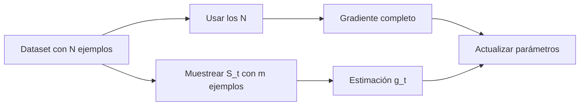

# Mini-batch y SGD como estimador

> [!summary] Idea central
> El **gradiente completo** indica cómo cambiarían los parámetros si consultáramos todos los ejemplos del dataset. Un **mini-batch** consulta solo una muestra y produce una aproximación más barata. Si la muestra se elige uniformemente, esa aproximación es correcta **en promedio**, aunque un mini-batch concreto no coincida con el gradiente completo.

> [!tip] Ruta visual de esta nota
> Los cuatro recursos visuales aparecen en orden durante la explicación: muestran **qué significa una pendiente**, **cómo se convierte en movimiento**, **cómo las pérdidas de un lote convergen en un solo backward** y **por qué la pendiente estimada cambia entre lotes**. No interpretes el ruido del mini-batch antes de distinguir gradiente, paso y pérdida.

## 1. Qué significa cada símbolo

La notación distingue tres cosas: **los datos** que se usan, **el estado del modelo** y **las cantidades que miden cómo corregirlo**. Una pérdida es un número que mide el error; un gradiente es un vector que indica cómo cambia ese error al modificar cada parámetro.

| Símbolo | Significado preciso | Cómo se lee | Idea intuitiva |
|---|---|---|---|
| $N$ | Número total de ejemplos del dataset. | «ene» | Tamaño de la colección completa. Si hay 10 000 pares entrada–respuesta, entonces $N=10\,000$. |
| $i$ | Índice que identifica un ejemplo: $i\in\{1,\dots,N\}$. | «índice i» | Es la etiqueta numérica de un dato concreto; no es el dato mismo. |
| $t$ | Número de la iteración o paso de entrenamiento. | «paso te» | Permite distinguir el estado del modelo antes y después de cada actualización. |
| $\theta$ | Vector que reúne **todos** los parámetros entrenables, por ejemplo $\theta=(w_1,w_2,b)$. | «theta» | Es todo lo que el modelo puede ajustar para aprender: pesos, sesgos, etc. |
| $\theta_t$ | Valor concreto de $\theta$ al comenzar el paso $t$. | «theta en el paso te» | Es la versión actual del modelo, antes de procesar el mini-batch de ese paso. |
| $\ell_i(\theta)$ | Pérdida producida por el ejemplo $i$ cuando el modelo usa los parámetros $\theta$. Es un **escalar**. | «pérdida del ejemplo i» | Responde: «con estos parámetros, ¿qué tan mal salió este ejemplo?». |
| $L(\theta)$ | Pérdida media de todo el dataset: $L(\theta)=\frac1N\sum_{i=1}^N\ell_i(\theta)$. | «pérdida media» o «función objetivo» | Resume en un solo número el desempeño global que queremos mejorar. |
| $\nabla$ | Operador que calcula una derivada respecto a cada componente de $\theta$ y las reúne en un vector. | «gradiente de» | Convierte una pérdida en un mapa de pendientes: una por cada parámetro. |
| $\nabla\ell_i(\theta)$ | Vector de derivadas de la pérdida del ejemplo $i$ respecto a todos los parámetros. | «gradiente de la pérdida i» | Indica cómo **aumentaría** el error de ese ejemplo al cambiar los parámetros; para reducirlo nos movemos en la dirección contraria. |
| $S_t$ | Conjunto de índices seleccionados aleatoriamente en el paso $t$, por ejemplo $S_t=\{4,12,29\}$. | «ese sub te» | Identifica qué ejemplos forman el mini-batch actual. Contiene índices, no gradientes. |
| $i\in S_t$ | El índice $i$ pertenece al conjunto $S_t$. | «i pertenece a ese sub te» | En una suma, indica que solo recorremos los ejemplos elegidos para el mini-batch. |
| $m=\lvert S_t\rvert$ | Número de elementos de $S_t$. Las barras indican la **cardinalidad** del conjunto. | «eme igual al tamaño de ese sub te» | Es el número de ejemplos del mini-batch, es decir, el `batch_size`. |
| $g_t$ | Promedio de los gradientes del mini-batch: $g_t=\frac1m\sum_{i\in S_t}\nabla\ell_i(\theta_t)$. | «ge sub te» | Es una estimación barata del gradiente completo en el paso $t$; cambia si cambia el mini-batch. |
| $\eta$ | Tasa de aprendizaje, normalmente un número positivo pequeño. | «eta» | Controla cuánto avanzamos en la dirección propuesta por el gradiente. Muy grande puede volver inestable el entrenamiento; muy pequeña puede hacerlo lento. |
| $\mathbb E[\cdot]$ | Esperanza matemática respecto al muestreo aleatorio del mini-batch. | «esperanza de» | Es el promedio que obtendríamos al repetir el sorteo del mini-batch muchísimas veces manteniendo fijo el modelo. No describe necesariamente un solo paso. |

> [!example] Cómo se conectan los símbolos
> Supón que $N=1000$ y estamos en el paso $t=20$. El modelo actual es $\theta_{20}$. Si se elige $S_{20}=\{8,34,205,901\}$, entonces $m=4$. Calculamos el gradiente de cada uno de esos cuatro ejemplos en $\theta_{20}$, los promediamos para obtener $g_{20}$ y actualizamos el modelo:
> $$
> \theta_{21}=\theta_{20}-\eta g_{20}.
> $$
> En palabras: **estado nuevo = estado actual − tamaño del paso × dirección estimada de aumento del error**. Restamos porque queremos disminuir la pérdida.

> [!important] Distinciones que conviene recordar
> - $\ell_i(\theta)$ y $L(\theta)$ son **pérdidas**: devuelven un número.
> - $\nabla\ell_i(\theta)$, $\nabla L(\theta)$ y $g_t$ son **gradientes**: devuelven un vector con una componente por parámetro.
> - $\nabla L(\theta_t)$ usa todo el dataset; $g_t$ usa solo $S_t$ y lo aproxima.

> [!note] Por qué usamos $N$ y $m$
> $N$ representa el tamaño **total** del dataset y $m$ el tamaño del **mini-batch**. Así evitamos usar la misma letra para dos cantidades diferentes.

## 2. Antes de hablar de SGD: qué es una derivada

La **derivada** responde a esta pregunta:

> Si cambio un parámetro una cantidad muy pequeña, ¿la pérdida sube o baja y con qué intensidad?

Imagina que la pérdida $L(w)$ es una montaña y que $w$ indica tu posición horizontal. La derivada $L'(w)$ es la **pendiente del suelo justo donde estás**.

$$
L'(w)
=\frac{dL}{dw}
\approx
\frac{\text{cambio de la pérdida}}{\text{cambio del parámetro}}
=\frac{\Delta L}{\Delta w}.
$$

La aproximación funciona para un cambio $\Delta w$ pequeño:

$$
\Delta L\approx L'(w)\,\Delta w.
$$

### Cómo interpretar el signo

| Valor de $L'(w)$ | Qué sucede al aumentar un poco $w$ | Para bajar la pérdida conviene |
|---:|---|---|
| negativo | la pérdida baja | aumentar $w$, moverse a la derecha |
| cero | la pérdida casi no cambia | estamos en una zona plana |
| positivo | la pérdida sube | disminuir $w$, moverse a la izquierda |

![[assets/04-derivada-como-pendiente.png|1000]]

La línea oscura es la función de pérdida completa. La línea de color es la **recta tangente**, es decir, la mejor aproximación recta de la curva cerca del punto marcado:

- tangente inclinada hacia abajo: derivada negativa;
- tangente horizontal: derivada cero;
- tangente inclinada hacia arriba: derivada positiva.

### Ejemplo de lectura numérica

Si en $w=1$ tenemos $L'(1)=-2$ y aumentamos el parámetro en $\Delta w=0.1$, entonces:

$$
\Delta L\approx(-2)(0.1)=-0.2.
$$

El signo negativo predice que la pérdida bajará aproximadamente $0.2$. La derivada no entrega el nuevo valor exacto de la pérdida: hace una predicción **local**, válida para pasos pequeños.

### Por qué el descenso por gradiente resta la derivada

La actualización para un solo parámetro es:

$$
w_{t+1}=w_t-\eta L'(w_t).
$$

- Si $L'(w_t)>0$, restamos un positivo y $w$ se mueve a la izquierda.
- Si $L'(w_t)<0$, restamos un negativo y $w$ se mueve a la derecha.
- En ambos casos intentamos movernos cuesta abajo.
- $\eta$ controla qué tan grande es el movimiento.

![[assets/05-restar-derivada.png|1000]]

> [!tip] Frase para recordarlo
> **La derivada describe la cuesta; el negativo de la derivada señala hacia abajo.**

### De una derivada a un gradiente

Si el modelo tiene un solo parámetro $w$, usamos una derivada: $L'(w)$. Si tiene muchos parámetros, calculamos una derivada para cada uno y las reunimos en un vector llamado **gradiente**:

$$
\theta=(w,b),
\qquad
\nabla L(\theta)=
\begin{bmatrix}
\frac{\partial L}{\partial w}\\[4pt]
\frac{\partial L}{\partial b}
\end{bmatrix}.
$$

Por tanto, una expresión como $\nabla\ell_i(\theta)$ significa: «todas las pendientes que el ejemplo $i$ propone para los parámetros del modelo».

El mini-batch no hace aparecer una derivada distinta. Simplemente **promedia las pendientes propuestas por varios ejemplos**.

## 3. Pérdida y gradiente completos

Cada ejemplo genera su propia pérdida $\ell_i(\theta)$. La función objetivo del entrenamiento es la media de todas esas pérdidas:

$$
L(\theta)=\frac1N\sum_{i=1}^{N}\ell_i(\theta).
$$

Esta expresión dice:

1. calcular el error de cada uno de los $N$ ejemplos;
2. sumar los errores;
3. dividir entre $N$ para obtener el error medio.

Al derivar la media, obtenemos el **gradiente completo**:

$$
\nabla L(\theta)
=\frac1N\sum_{i=1}^{N}\nabla\ell_i(\theta).
$$

El gradiente es un vector con una derivada por cada componente de $\theta$. Indica la dirección de mayor aumento de la pérdida; por eso el descenso por gradiente se mueve en la dirección contraria.

Usando todos los datos, una actualización sería:

$$
\theta_{t+1}=\theta_t-\eta\nabla L(\theta_t).
$$

**Ventaja:** la dirección es estable y representa exactamente al dataset completo.
**Desventaja:** calcularla puede ser lento o no caber en memoria cuando $N$ es grande.

## 4. Qué hace un mini-batch

En el paso $t$ elegimos un subconjunto $S_t$ con $m$ ejemplos y promediamos solo sus gradientes:

$$
g_t
=\frac1m\sum_{i\in S_t}\nabla\ell_i(\theta_t).
$$

Aquí:

- $i\in S_t$ significa «el índice $i$ pertenece al mini-batch actual»;
- $g_t$ no es una pérdida: es el gradiente estimado con ese mini-batch;
- todos los gradientes se evalúan en el mismo estado actual $\theta_t$;
- el modelo se actualiza usando $g_t$ en lugar del gradiente completo.

La actualización de SGD queda:

$$
\boxed{\theta_{t+1}=\theta_t-\eta g_t}.
$$



### Tres casos posibles

| Tamaño usado | Nombre | Qué ocurre |
|---:|---|---|
| $m=1$ | SGD en sentido estricto | un ejemplo genera cada actualización |
| $1<m<N$ | mini-batch SGD | varios ejemplos generan cada actualización |
| $m=N$ | full-batch gradient descent | se usa el gradiente completo |

En aprendizaje profundo, se suele decir **SGD** también cuando se usan mini-batches.

### Caso AND: un lote, cuatro ramas y una sola actualización

La compuerta AND permite ver el ciclo completo con solo cuatro ejemplos. Organizamos las entradas como **filas** y las características como **columnas**:

$$
X=
\begin{bmatrix}
0&0\\
0&1\\
1&0\\
1&1
\end{bmatrix}
\in\mathbb R^{4\times2},
\qquad
y=
\begin{bmatrix}
0\\0\\0\\1
\end{bmatrix}
\in\mathbb R^4.
$$

Un único modelo comparte los parámetros $w=(w_1,w_2)^\top$ y $b$ entre los cuatro casos:

$$
z=Xw+b\mathbf 1_4
=
\begin{bmatrix}
b\\
w_2+b\\
w_1+b\\
w_1+w_2+b
\end{bmatrix},
\qquad
\hat y=\sigma(z)\in\mathbb R^4.
$$

![[assets/24-flujo-lote-iteracion-and.png|1200]]

*Figura — Las cuatro filas de AND generan cuatro predicciones y cuatro pérdidas con los mismos parámetros; al promediarlas se ejecutan un solo `backward()` y una sola actualización. Todo el diagrama representa una iteración full-batch, no cuatro iteraciones.*

La parte superior de la imagen escribe el forward de forma vectorizada. La parte inferior muestra qué ocurre si un motor de autodiferenciación escalar —por ejemplo, uno inspirado en micrograd— no tiene una operación matricial: construye **cuatro ramas del mismo grafo**, una por fila, pero todas apuntan a los mismos objetos $w_1$, $w_2$ y $b$.

Cada rama produce una predicción y una pérdida:

$$
L_1,L_2,L_3,L_4,
\qquad
L=\frac{L_1+L_2+L_3+L_4}{4}.
$$

Al llamar una sola vez a `L.backward()`, la regla de la cadena lleva el aporte de las cuatro rutas hasta los parámetros compartidos:

$$
\frac{\partial L}{\partial\theta}
=\frac14\sum_{i=1}^{4}
\frac{\partial L_i}{\partial\theta},
\qquad
\theta=(w_1,w_2,b).
$$

Por eso el orden correcto de **una iteración** es:

1. limpiar una vez los gradientes anteriores;
2. calcular las cuatro predicciones con el mismo estado $\theta_t$;
3. reducir las cuatro pérdidas a un solo escalar $L$;
4. ejecutar un solo backward, que acumula los cuatro aportes;
5. actualizar una sola vez $w_1,w_2,b$;
6. comenzar el siguiente forward con $\theta_{t+1}$.

> [!important] Qué caso de la tabla representa
> Aquí $N=4$ y se usan los cuatro ejemplos, así que $m=N=4$: es **full-batch gradient descent**. El hecho de que el motor construya cuatro ramas escalares no lo convierte en cuatro mini-batches ni en cuatro iteraciones. La definición depende de cuándo se actualizan los parámetros.

> [!question]- ¿Qué cambiaría si actualizáramos después de cada caso?
> Ya no calcularíamos el gradiente de la media de las cuatro pérdidas evaluadas en un mismo $\theta_t$. Tendríamos cuatro actualizaciones de tamaño uno: el caso 2 usaría parámetros modificados por el caso 1, el caso 3 usaría otra versión y así sucesivamente. Eso es SGD online con $m=1$, depende del orden y describe otra trayectoria de optimización.
>
> **Regla de lectura:** cuatro `forward` escalares pueden representar un solo forward de lote; lo decisivo es que comparten parámetros, sus pérdidas se reducen y `step()` ocurre una sola vez.

## 5. Por qué $g_t$ es un estimador

Un **estimador** es una cantidad calculada con una muestra para aproximar una cantidad de toda la población.

- población: los $N$ ejemplos;
- muestra: el mini-batch $S_t$;
- cantidad que queremos conocer: $\nabla L(\theta_t)$;
- estimación obtenida: $g_t$.

Es la misma idea de una encuesta: no se pregunta a toda la población, sino a una muestra. Distintas muestras producen resultados distintos.

Si los ejemplos del mini-batch se eligen uniformemente, entonces:

$$
\mathbb E[g_t\mid\theta_t]=\nabla L(\theta_t).
$$

### Cómo leer esta igualdad

- $\mathbb E$ significa «promedio sobre todos los mini-batches que podrían salir».
- La barra vertical $\mid\theta_t$ significa «manteniendo fijos los parámetros actuales».
- Congelamos $\theta_t$, repetimos únicamente el sorteo de $S_t$ muchas veces y promediamos los $g_t$ obtenidos.
- Ese promedio coincide con el gradiente completo.

Por eso se dice que $g_t$ es un estimador **no sesgado**.

> [!important] No sesgado no significa exacto
> La igualdad se cumple en promedio, no en cada paso. Un mini-batch concreto puede dar un gradiente mayor, menor o incluso con alguna componente en sentido contrario al gradiente completo.

Podemos escribir la estimación como:

$$
g_t=\nabla L(\theta_t)+\varepsilon_t,
\qquad
\mathbb E[\varepsilon_t\mid\theta_t]=0.
$$

$\varepsilon_t$ es el **ruido de muestreo**: la diferencia entre el gradiente del mini-batch y el completo. Su media es cero, pero su valor en un paso concreto normalmente no lo es.

## 6. Ejemplo numérico paso a paso

En el modelo lineal de [[05 Lotes, reducción y formas del gradiente]], para el parámetro escalar $w$ tenemos:

$$
x=(1,2,3),\qquad r=(-2,-3,-4).
$$

Para la pérdida cuadrática $\ell_i=\tfrac12r_i^2$, la contribución de cada ejemplo al gradiente de $w$ es:

$$
g_i=\frac{\partial\ell_i}{\partial w}=x_i r_i.
$$

Por tanto:

$$
g_1=1(-2)=-2,\qquad
g_2=2(-3)=-6,\qquad
g_3=3(-4)=-12.
$$

### Gradiente completo

Promediamos las tres contribuciones:

$$
g_{\text{full}}
=\frac{-2-6-12}{3}
=-\frac{20}{3}
\approx-6.67.
$$

### Mini-batches de tamaño $m=2$

Hay tres subconjuntos posibles:

| $S_t$ | Cálculo | $g_t$ |
|---|---:|---:|
| $\{1,2\}$ | $(-2-6)/2$ | $-4$ |
| $\{2,3\}$ | $(-6-12)/2$ | $-9$ |
| $\{1,3\}$ | $(-2-12)/2$ | $-7$ |

Si los tres subconjuntos son igual de probables, cada uno tiene probabilidad $1/3$. La esperanza es:

$$
\mathbb E[g_t]
=\frac13(-4)+\frac13(-9)+\frac13(-7)
=-\frac{20}{3}.
$$

La media de las estimaciones recupera el gradiente completo, aunque ninguna estimación individual sea exactamente $-20/3$.

### Qué pasa en una actualización concreta

Si sale $S_t=\{2,3\}$, entonces $g_t=-9$. Con $\eta=0.1$:

$$
w_{t+1}=w_t-0.1(-9)=w_t+0.9.
$$

Con el gradiente completo, el cambio habría sido aproximadamente $+0.667$. La diferencia no implica un error de implementación: es la variabilidad normal del muestreo.

![[assets/03-variabilidad-mini-batch.png|950]]

## 7. Qué muestra el gráfico

- Con $m=1$, cada estimación usa una sola contribución: $-2$, $-6$ o $-12$. Hay mucha dispersión.
- Con $m=2$, se promedian dos contribuciones y las estimaciones quedan menos separadas.
- Con $m=3=N$, solo existe una posibilidad: el gradiente completo.
- Los diamantes representan la media de todas las estimaciones para cada $m$.
- La línea discontinua representa el gradiente completo, aproximadamente $-6.67$.

> [!example] Interpretar un punto concreto
> El punto $-9$ cuando $m=2$ significa que ese mini-batch propone aumentar $w$ en $0.9$ si $\eta=0.1$, porque $-\eta g_t=-0.1(-9)=+0.9$. No significa que la pérdida valga $-9$: es un **gradiente estimado**, no el objetivo.

En general, aumentar $m$ reduce el ruido de muestreo, porque cada valor extremo se compensa con más ejemplos. No elimina otras fuentes de aleatoriedad, como *dropout* o aumentación de datos.

## 8. Lote pequeño frente a lote grande

| Mini-batch pequeño | Mini-batch grande |
|---|---|
| menos memoria | más memoria |
| menos cálculo por actualización | más cálculo por actualización |
| gradiente más variable | gradiente más estable |
| más actualizaciones por época | menos actualizaciones por época |
| el ruido puede ayudar a explorar | aprovecha mejor cierto hardware paralelo |

Una **actualización** o **paso** ocurre cada vez que se ejecuta `optimizer.step()`.
Una **época** termina cuando el entrenamiento ha recorrido una vez todos los ejemplos. Con $N$ ejemplos y mini-batches de tamaño $m$, hay aproximadamente $\lceil N/m\rceil$ actualizaciones por época.

No hay un tamaño universalmente mejor: depende de la memoria, el hardware, los datos, la tasa de aprendizaje y la geometría de la función de pérdida.

## 9. Por qué se llama estocástico

**Estocástico** significa que interviene azar. Aquí, el azar está principalmente en qué índices entran en $S_t$ y en qué orden se procesan.

`optimizer.step()` no sortea normalmente los ejemplos. Su función es usar el gradiente que ya está almacenado en cada parámetro para actualizarlo. Dados el mismo gradiente y el mismo estado interno del optimizador, el resultado del paso es determinista.

## 10. Comprobación en Python

Este código enumera todos los mini-batches posibles del ejemplo:

```python
from itertools import combinations
import numpy as np

# Gradiente aportado por cada ejemplo.
individual = np.array([-2.0, -6.0, -12.0])

# Gradiente del dataset completo.
full = individual.mean()

for m in (1, 2, 3):
    # combinations devuelve todos los subconjuntos de tamaño m.
    estimates = [
        individual[list(indices)].mean()
        for indices in combinations(range(3), m)
    ]

    print("m =", m, "estimaciones =", estimates)

    # La media de todas las estimaciones coincide con el gradiente completo.
    assert np.isclose(np.mean(estimates), full)
```

## 11. Mini-batch en un ciclo de PyTorch

```python
import torch

# Hace reproducible el orden aleatorio de los ejemplos.
generator = torch.Generator().manual_seed(8)

# Divide el dataset en mini-batches de hasta 32 ejemplos.
loader = torch.utils.data.DataLoader(
    dataset,
    batch_size=32,
    shuffle=True,
    generator=generator,
)

for X_batch, y_batch in loader:
    # Borra gradientes del paso anterior; PyTorch los acumula por defecto.
    optimizer.zero_grad(set_to_none=True)

    # Forward: calcula predicciones para el mini-batch actual.
    prediction = model(X_batch)
    assert prediction.shape == y_batch.shape

    # Produce una pérdida escalar, normalmente promediada en el mini-batch.
    loss = loss_fn(prediction, y_batch)

    # Calcula g_t mediante autodiferenciación y lo guarda en .grad.
    loss.backward()

    # Aplica theta <- theta - eta * g_t, o la regla del optimizador usado.
    optimizer.step()
```

### Qué hace cada parte

1. `DataLoader` forma los conjuntos $S_t$.
2. `shuffle=True` cambia aleatoriamente el orden de los ejemplos.
3. `zero_grad()` evita sumar por accidente el gradiente actual con los anteriores.
4. `model(X_batch)` calcula las predicciones del mini-batch.
5. `loss_fn(...)` reúne las pérdidas individuales en una pérdida escalar.
6. `loss.backward()` calcula el gradiente estimado $g_t$.
7. `optimizer.step()` actualiza los parámetros.

La semilla permite repetir el mismo orden de muestreo. No hace que cada mini-batch sea igual al dataset completo ni elimina la variabilidad entre mini-batches dentro de la ejecución.

## 12. Errores frecuentes

- **Esperar el mismo gradiente en cada mini-batch:** solo la media teórica coincide con el gradiente completo.
- **No usar muestreo representativo:** si ciertos ejemplos aparecen con mayor probabilidad sin corregir los pesos, el estimador puede quedar sesgado.
- **Olvidar `zero_grad()`:** se acumulan gradientes de pasos distintos.
- **Confundir suma con promedio:** `sum` hace que la escala del gradiente crezca con $m$; `mean` mantiene una escala comparable.
- **Comparar ejecuciones sin controlar la semilla y los índices:** no se sabe si la diferencia viene del código o del muestreo.
- **Confundir ruido estadístico con un bug:** el ruido esperado cambia entre mini-batches; un error de formas o *broadcasting* cambia la función que se está optimizando.
- **Cambiar lote y tasa de aprendizaje al mismo tiempo:** dificulta saber qué cambio causó el resultado.

## 13. Resumen mental

$$
\underbrace{\nabla L(\theta_t)}_{\text{gradiente exacto}}
\approx
\underbrace{g_t}_{\text{gradiente del mini-batch}}
\quad\Longrightarrow\quad
\underbrace{\theta_{t+1}=\theta_t-\eta g_t}_{\text{actualización}}.
$$

1. El dataset completo define el objetivo real de entrenamiento.
2. El mini-batch ofrece una estimación más barata de su gradiente.
3. La estimación cambia según los ejemplos sorteados.
4. Con muestreo uniforme es correcta en promedio.
5. Un lote mayor suele reducir la variabilidad, pero cuesta más por paso.

---

Anterior: [[06 Tasa de aprendizaje, curvatura y estabilidad]] · Siguiente: [[08 Momentum y Adam - memoria del optimizador]]
