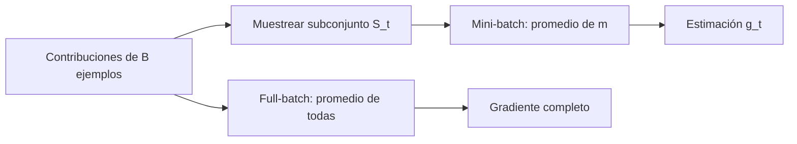

# Mini-batch y SGD como estimador

## Gradiente completo

Si el conjunto tiene $B$ ejemplos:

$$
L(\theta)=\frac1B\sum_{i=1}^{B}\ell_i(\theta),
$$

entonces:

$$
\nabla L(\theta)
=\frac1B\sum_{i=1}^{B}\nabla\ell_i(\theta).
$$

El full-batch promedia todas las contribuciones en el estado actual $\theta_t$.

## Qué hace un mini-batch

Elegimos un subconjunto $S_t$ de tamaño $m$:

$$
g_t
=\frac1m\sum_{i\in S_t}\nabla\ell_i(\theta_t).
$$



Con muestreo uniforme, condicionado al estado actual:

$$
\mathbb E[g_t\mid\theta_t]=\nabla L(\theta_t).
$$

Esto significa **no sesgado en promedio**, no igualdad paso a paso.

Condicionar en $\theta_t$ significa imaginar que congelamos los parámetros actuales y repetimos únicamente el sorteo del mini-batch. La única fuente de variación examinada en esa igualdad es qué índices entran en $S_t$. En la ejecución real, $\theta_t$ también depende de todos los sorteos y pasos anteriores.

> [!important] Distinción
> Un mini-batch concreto es una realización del estimador. Puede diferir del gradiente completo y seguir siendo parte de un procedimiento correcto.

## Ejemplo con tres contribuciones

En el caso lineal de [[05 Lotes, reducción y formas del gradiente]]:

$$
g_1=-2,\qquad g_2=-6,\qquad g_3=-12.
$$

Gradiente completo:

$$
g_{\text{full}}
=\frac{-2-6-12}{3}
=-\frac{20}{3}
\approx-6.67.
$$

Para mini-batches de tamaño $2$:

| Subconjunto | Gradiente |
|---|---:|
| $\{1,2\}$ | $(-2-6)/2=-4$ |
| $\{2,3\}$ | $(-6-12)/2=-9$ |
| $\{1,3\}$ | $(-2-12)/2=-7$ |

Ninguno tiene que ser exactamente $-20/3$. Sin embargo:

$$\frac{-4-9-7}{3}=-\frac{20}{3}.$$

La media sobre todos los subconjuntos posibles recupera el gradiente completo.

![[assets/03-variabilidad-mini-batch.png|950]]

## Qué muestra el gráfico

- Con $m=1$ existen tres estimaciones muy separadas.
- Con $m=2$ el intervalo se estrecha.
- Con $m=3$ queda una sola estimación: el gradiente completo.
- Los diamantes representan la media de las realizaciones y caen sobre la línea discontinua.

Este ejemplo ilustra el intercambio:

| Lote menor | Lote mayor |
|---|---|
| menos cálculo por paso | más cálculo por paso |
| más variabilidad | menos variabilidad |
| más actualizaciones por recorrido | menos actualizaciones |
| puede explorar con ruido | dirección más estable |

No existe un ganador universal: depende de memoria, hardware, geometría, datos y objetivo.

## Por qué se llama estocástico

Lo aleatorio normalmente está en la selección de $S_t$, no en la fórmula de <code>optimizer.step()</code>. El mismo optimizador SGD puede recibir:

- un ejemplo: SGD en sentido estricto;
- un mini-batch: uso habitual;
- todo el conjunto: descenso full-batch.

## Contraste en Python

```python
from itertools import combinations
import numpy as np

individual = np.array([-2.0, -6.0, -12.0])
full = individual.mean()

for m in (1, 2, 3):
    estimates = [
        individual[list(indices)].mean()
        for indices in combinations(range(3), m)
    ]
    print("m =", m, "estimaciones =", estimates)
    assert np.isclose(np.mean(estimates), full)
```

## Mini-batch correcto en un ciclo

```python
generator = torch.Generator().manual_seed(8)

loader = torch.utils.data.DataLoader(
    dataset,
    batch_size=32,
    shuffle=True,
    generator=generator,
)

for X_batch, y_batch in loader:
    optimizer.zero_grad(set_to_none=True)
    prediction = model(X_batch)
    assert prediction.shape == y_batch.shape
    loss = loss_fn(prediction, y_batch)
    loss.backward()
    optimizer.step()
```

La semilla ayuda a reproducir el orden de muestreo. No convierte cada mini-batch en una copia del gradiente completo.

## Errores frecuentes

- Concluir que dos ejecuciones son incorrectas porque sus primeros pasos difieren.
- Llamar “ruido” a cualquier error de implementación.
- Comparar mini-batches sin registrar sus índices.
- Cambiar tamaño de lote, tasa y semilla al mismo tiempo.
- Confundir promedio por ejemplo con suma y cambiar la escala efectiva del gradiente.

## Para qué sirve comprender el estimador

Permite distinguir variabilidad esperada de:

- gradientes acumulados accidentalmente;
- broadcasting incorrecto;
- muestreo sesgado;
- cambios no reproducibles del pipeline;
- diferencias genuinas entre optimizadores.

---

Anterior: [[06 Tasa de aprendizaje, curvatura y estabilidad]] · Siguiente: [[08 Momentum y Adam - memoria del optimizador]]
