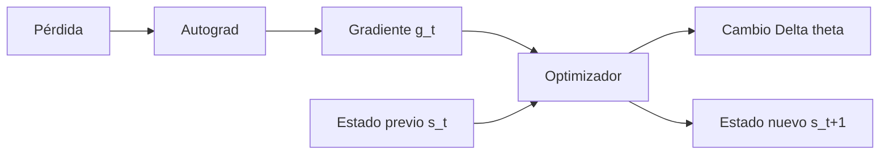
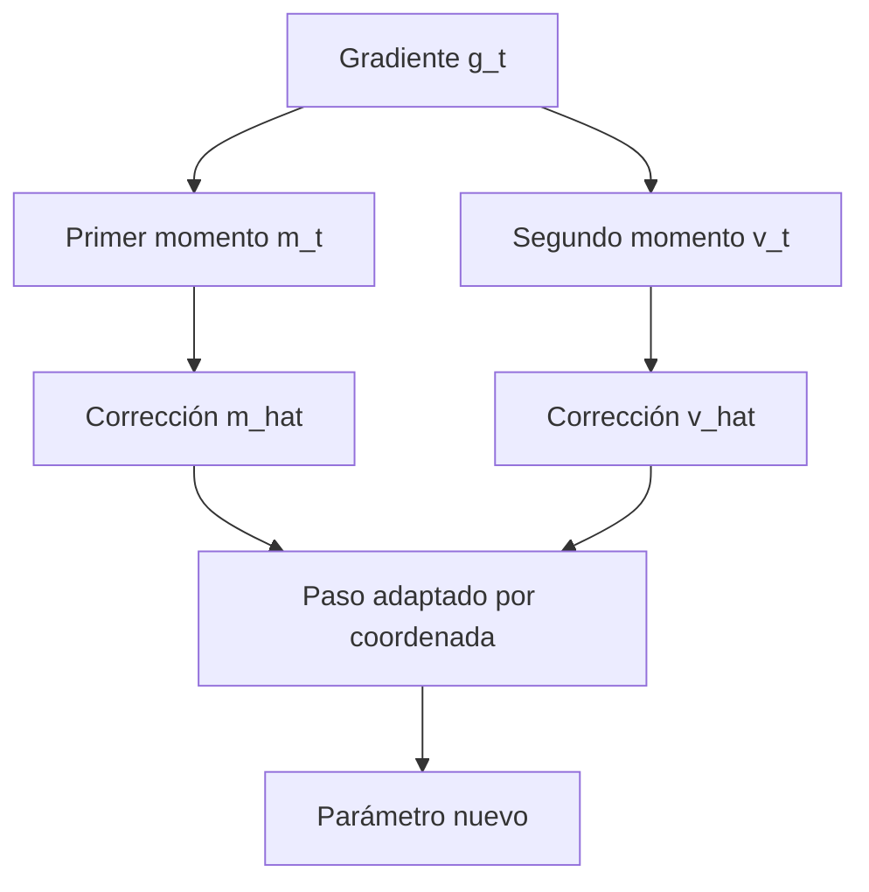

# Momentum y Adam: memoria del optimizador

## Gradiente y paso no son lo mismo

Autograd entrega:

$$g_t=\nabla_\theta L_t.$$

El optimizador decide cómo convertir $g_t$ en $\Delta\theta_t$. Dos optimizadores pueden recibir el mismo gradiente y producir pasos distintos porque mantienen estados diferentes.



## GD simple: solo el gradiente actual

$$
\theta_{t+1}=\theta_t-\eta g_t.
$$

No conserva una memoria adicional de gradientes previos.

## Momentum: gradiente más velocidad

Una convención común es:

$$
v_t=\mu v_{t-1}+g_t,
\qquad
\theta_{t+1}=\theta_t-\eta v_t,
\qquad 0\le\mu<1.
$$

Al desenrollar:

$$
v_t
=g_t+\mu g_{t-1}+\mu^2g_{t-2}+\cdots+\mu^{t-1}g_1+\mu^tv_0.
$$

Los gradientes recientes pesan más y la historia antigua se atenúa geométricamente.

**Qué:** promedio acumulado sin normalizar de direcciones recientes.<br>
**Por qué:** refuerza direcciones persistentes y suaviza cambios aislados.<br>
**Cómo:** conserva $v_t$ entre iteraciones.<br>
**Para qué:** puede acelerar direcciones coherentes y reducir zigzag.

## Ejemplo numérico de momentum

Con:

$$
\mu=0.9,\quad\eta=0.1,\quad v_0=0,\quad\theta_0=0,
$$

y gradientes:

$$g_1=-3,\qquad g_2=-1,\qquad g_3=4,$$

obtenemos:

| Paso | $g_t$ | $v_t=0.9v_{t-1}+g_t$ | $\Delta\theta_t=-0.1v_t$ | $\theta_t$ |
|---:|---:|---:|---:|---:|
| 1 | $-3$ | $-3$ | $+0.30$ | $0.30$ |
| 2 | $-1$ | $-3.7$ | $+0.37$ | $0.67$ |
| 3 | $4$ | $0.67$ | $-0.067$ | $0.603$ |

En el paso 2:

$$|g_2|<|g_1|,\qquad |\Delta\theta_2|>|\Delta\theta_1|.$$

El paso crece porque la memoria conserva la dirección anterior. En el paso 3, el gradiente cambia de signo y supera la memoria acumulada.

## Lectura visual de la memoria de momentum

![[assets/12-momentum-gradiente-memoria-paso.png|1000]]

### Cómo interpretar cada panel

1. **Gradiente $g_t$:** es la información nueva producida por autograd en ese paso. Un valor negativo propone aumentar el parámetro bajo la regla de descenso.
2. **Velocidad $v_t$:** mezcla el gradiente nuevo con el $90\%$ de la memoria anterior. Por eso $v_2=-3.7$ aunque $g_2=-1$.
3. **Parámetro $\theta_t$:** cambia usando $-\eta v_t$, no usando directamente $-\eta g_t$.

En $t=2$:

$$
v_2=0.9(-3)+(-1)=-3.7,
\qquad
\Delta\theta_2=-0.1(-3.7)=+0.37.
$$

El valor $-3.7$ no es una pérdida ni un gradiente nuevo: es el **estado acumulado** del optimizador. En $t=3$, el gradiente $+4$ se opone a la memoria negativa y produce $v_3=0.67$; el paso finalmente cambia de sentido.

> [!warning] Cuatro columnas, cuatro significados
> $g_t$ = sensibilidad actual; $v_t$ = memoria; $-\eta v_t$ = paso; $\theta_t$ = posición del parámetro. Comparar sus magnitudes como si fueran la misma cantidad conduce a conclusiones incorrectas.

## Ver el estado real en PyTorch

```python
import torch

parameter = torch.tensor([0.0], requires_grad=True)
optimizer = torch.optim.SGD(
    [parameter],
    lr=0.1,
    momentum=0.9,
)

for gradient in (-3.0, -1.0, 4.0):
    optimizer.zero_grad(set_to_none=True)
    parameter.grad = torch.tensor([gradient])
    optimizer.step()

    state = optimizer.state[parameter]
    buffer = state["momentum_buffer"].detach().clone()
    print(parameter.item(), buffer.item())
```

Resultados esperados:

| Paso | buffer | parámetro |
|---:|---:|---:|
| 1 | $-3$ | $0.30$ |
| 2 | $-3.7$ | $0.67$ |
| 3 | $0.67$ | $0.603$ |

El <code>momentum_buffer</code> hace visible la memoria; el optimizador no debe tratarse como caja negra.

## Adam: dos memorias por coordenada

Adam mantiene:

1. un primer momento para dirección promedio;
2. un segundo momento para magnitud cuadrática.

$$
m_t=\beta_1m_{t-1}+(1-\beta_1)g_t,
$$

$$
v_t=\beta_2v_{t-1}+(1-\beta_2)g_t^2.
$$

Como ambos estados suelen iniciar en cero, al principio están sesgados hacia cero. Se corrigen:

$$
\hat m_t=\frac{m_t}{1-\beta_1^t},
\qquad
\hat v_t=\frac{v_t}{1-\beta_2^t}.
$$

Actualización:

$$
\theta_t
=\theta_{t-1}
-\eta\frac{\hat m_t}{\sqrt{\hat v_t}+\varepsilon}.
$$



El denominador adapta la escala por coordenada. No cambia el gradiente calculado por autograd; cambia la regla que lo consume.

### Por qué hace falta corregir el sesgo inicial

Con los valores usuales $\beta_1=0.9$, $\beta_2=0.999$, estados iniciales cero y primer gradiente $g_1=-2$:

$$
m_1=0.9(0)+0.1(-2)=-0.2,
$$

$$
v_1=0.999(0)+0.001(-2)^2=0.004.
$$

Estos números parecen mucho menores que el gradiente y su cuadrado porque casi todo el peso inicial multiplicó estados cero. Las correcciones recuperan las escalas:

$$
\hat m_1=\frac{-0.2}{1-0.9}=-2,
\qquad
\hat v_1=\frac{0.004}{1-0.999}=4.
$$

Por tanto, ignorando el diminuto $\varepsilon$:

$$
\Delta\theta_1
=-\eta\frac{-2}{\sqrt4}
=+\eta.
$$

Con $\eta=0.01$, un parámetro que empieza en $1$ pasa aproximadamente a $1.01$. Ahora los valores internos de la siguiente sección dejan de parecer arbitrarios.

## Secuencia mínima de Adam

```python
parameter = torch.tensor([1.0], requires_grad=True)
optimizer = torch.optim.Adam([parameter], lr=0.01)

optimizer.zero_grad(set_to_none=True)
loss = 0.5 * (parameter - 3.0).pow(2).sum()
loss.backward()

gradient_before_step = parameter.grad.detach().clone()
assert torch.equal(gradient_before_step, torch.tensor([-2.0]))

optimizer.step()
state = optimizer.state[parameter]

print(parameter)            # aproximadamente 1.01
print(state["step"])        # contador
print(state["exp_avg"])     # aproximadamente -0.2
print(state["exp_avg_sq"])  # aproximadamente 0.004
```

Antes de <code>step()</code>, el gradiente ya existe. Después aparecen o cambian los estados del optimizador.

## Comparación

| Método | Entrada actual | Estado persistente | Idea |
|---|---|---|---|
| GD | $g_t$ | ninguno adicional | paso proporcional al gradiente |
| Momentum | $g_t$ | velocidad $v_t$ | memoria de dirección |
| Adam | $g_t$ | $m_t$, $v_t$, contador | dirección y escala por coordenada |

> [!warning] No hay superioridad universal
> Adam no reemplaza la formulación correcta, una tasa razonable, la evaluación ni el diagnóstico. El mejor optimizador depende del problema y debe compararse con un protocolo controlado.

## Nota sobre convenciones

Bibliotecas y textos pueden ubicar factores como $(1-\mu)$ de forma diferente o nombrar “velocidad” con signo opuesto. Antes de comparar fórmulas, deriva dos pasos y comprueba el estado observable de la implementación.

---

Anterior: [[07 Mini-batch y SGD como estimador]] · Siguiente: [[09 train, eval, grad y no_grad]]
