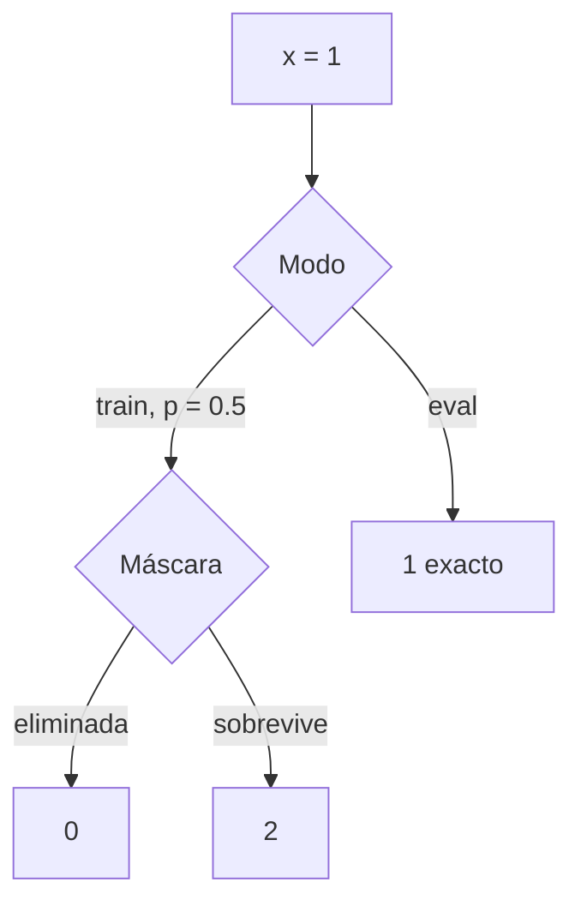
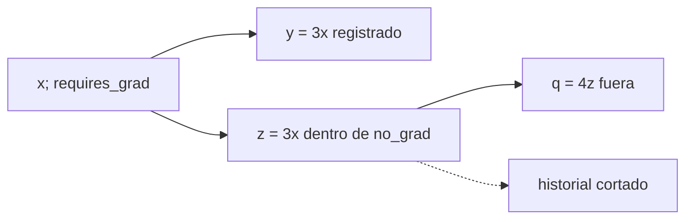

# <code>train</code>, <code>eval</code>, grad y <code>no_grad</code>

## Dos interruptores independientes

PyTorch separa dos preguntas:

1. **¿Cómo debe comportarse el módulo?** → <code>model.train()</code> o <code>model.eval()</code>.
2. **¿Deben registrarse operaciones para derivar?** → gradientes habilitados o <code>torch.no_grad()</code>.

| | Gradientes habilitados | <code>torch.no_grad()</code> |
|---|---|---|
| <code>model.train()</code> | entrenamiento habitual | modo train sin historial |
| <code>model.eval()</code> | análisis de sensibilidad en modo evaluación | inferencia o evaluación habitual |

> [!important] Regla central
> <code>train/eval</code> controla el comportamiento de módulos sensibles; grad/<code>no_grad</code> controla el registro del grafo.

No son dos nombres para lo mismo.

## Matriz visual de las cuatro combinaciones

![[assets/13-matriz-train-eval-grad.png|1000]]

### Cómo leer la matriz

- Muévete **verticalmente** para cambiar la conducta del módulo: arriba <code>train()</code>, abajo <code>eval()</code>.
- Muévete **horizontalmente** para cambiar el registro de operaciones: izquierda con gradientes, derecha con <code>no_grad()</code>.
- Dropout depende de la fila, no de la columna.
- <code>requires_grad</code> y la construcción del historial dependen de la columna, no de la fila.

Por eso la celda inferior izquierda es totalmente válida: <code>model.eval()</code> con gradientes habilitados permite calcular saliencia o sensibilidad sin activar Dropout. La celda superior derecha también es posible: <code>model.train()</code> dentro de <code>no_grad()</code> mantiene Dropout aleatorio, pero no construye un grafo derivable.

> [!tip] Pregunta de diagnóstico
> Si los **valores** cambian entre ejecuciones, inspecciona <code>train/eval</code>. Si falta <code>grad_fn</code> o <code>requires_grad</code>, inspecciona el contexto grad/<code>no_grad</code>.

## Qué cambia con <code>train()</code> y <code>eval()</code>

Módulos como Dropout y BatchNorm consultan <code>module.training</code>.

- <code>model.train()</code> asigna <code>training = True</code>.
- <code>model.eval()</code> asigna <code>training = False</code>.

Una capa <code>nn.Linear</code> aplica la misma transformación en ambos modos. El modo importa solo si algún submódulo define conductas diferentes.

## Dropout: ejemplo visible

Con probabilidad de eliminación $p$, durante entrenamiento:

$$
\tilde x=\frac{m}{1-p}x,
\qquad
m\sim\operatorname{Bernoulli}(1-p).
$$

Para $x=1$ y $p=0.5$:

- si $m=0$, $\tilde x=0$;
- si $m=1$, $\tilde x=2$.

En promedio:

$$
\mathbb E[\tilde x]
=0(0.5)+2(0.5)
=1
=x.
$$

En evaluación, Dropout es la identidad:

$$\tilde x_{\text{eval}}=x.$$



> [!warning] Expectativa no es igualdad por muestra
> $\mathbb E[\tilde x]=x$ no significa que cada ejecución en train devuelva $x$.

## Experimento reproducible con Dropout

```python
import torch
from torch import nn

torch.manual_seed(8)
dropout = nn.Dropout(p=0.5)
x = torch.ones(6, requires_grad=True)

dropout.train()
train_1 = dropout(x)
train_2 = dropout(x)

dropout.eval()
eval_output = dropout(x)

print(train_1)     # valores 0 o 2
print(train_2)     # puede usar otra máscara
print(eval_output) # todos 1

assert torch.equal(eval_output, x)
assert eval_output.requires_grad
```

En <code>eval()</code>, autograd sigue habilitado. Como Dropout devuelve la entrada sin crear una operación nueva, <code>eval_output</code> puede ser la propia hoja y tener <code>grad_fn is None</code>. Eso no demuestra que autograd esté apagado:

```python
eval_output.sum().backward()
assert torch.equal(x.grad, torch.ones_like(x))
```

Una operación real posterior, o una capa lineal en eval, sí crea <code>grad_fn</code>.

## Qué hace <code>torch.no_grad()</code>

```python
x = torch.tensor([2.0], requires_grad=True)

y = 3.0 * x

with torch.no_grad():
    z = 3.0 * x

q = 4.0 * z
```

Resultados:

| Tensor | <code>requires_grad</code> | <code>grad_fn</code> | ¿hay ruta hacia $x$? |
|---|---:|---|---:|
| <code>x</code> | <code>True</code> | <code>None</code> | es la hoja |
| <code>y</code> | <code>True</code> | no es <code>None</code> | sí |
| <code>z</code> | <code>False</code> | <code>None</code> | no |
| <code>q</code> | <code>False</code> | <code>None</code> | no |



Operar con <code>z</code> después de salir del contexto no reconstruye retroactivamente la historia.

## Las cuatro combinaciones con una capa lineal

```python
model = nn.Linear(1, 1)
x = torch.ones(2, 1)

model.train()
out_train_grad = model(x)

model.eval()
out_eval_grad = model(x)

model.train()
with torch.no_grad():
    out_train_no_grad = model(x)

model.eval()
with torch.no_grad():
    out_eval_no_grad = model(x)

assert out_train_grad.requires_grad
assert out_eval_grad.requires_grad
assert not out_train_no_grad.requires_grad
assert not out_eval_no_grad.requires_grad
```

La capa lineal produce los mismos valores si pesos y entrada no cambian. La evidencia está en <code>model.training</code> y <code>requires_grad</code>.

## Evaluar no limpia gradientes anteriores

```python
grads_before = [
    None if p.grad is None else p.grad.detach().clone()
    for p in model.parameters()
]

model.eval()
with torch.no_grad():
    prediction_eval = model(X_eval)
    loss_eval = loss_fn(prediction_eval, y_eval)

grads_after = [
    None if p.grad is None else p.grad.detach().clone()
    for p in model.parameters()
]
```

No se añade historia nueva y tampoco se borra <code>.grad</code>. Si había gradientes, deben coincidir antes y después.

## Elegir por intención

| Intención | Modo | Registro |
|---|---|---|
| entrenar | <code>model.train()</code> | habilitado |
| actualizar manualmente parámetros | sin cambio necesario | <code>torch.no_grad()</code> |
| inferir o medir validación | <code>model.eval()</code> | <code>torch.no_grad()</code> |
| calcular saliencia o derivadas en evaluación | <code>model.eval()</code> | habilitado |

No uses <code>.data</code> para expresar estas intenciones. Los contextos explícitos son más claros y seguros.

## Preguntas de control

1. ¿Por qué <code>model.eval()</code> no impide <code>backward()</code>?
2. ¿Por qué <code>torch.no_grad()</code> no desactiva Dropout por sí mismo?
3. ¿Qué significa que Dropout conserve la expectativa?
4. ¿La evaluación borra gradientes calculados anteriormente?

---

Anterior: [[08 Momentum y Adam - memoria del optimizador]] · Siguiente: [[10 Ciclo de entrenamiento reproducible y diagnóstico]]
