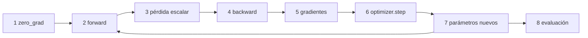
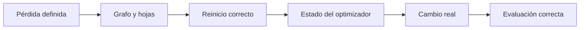
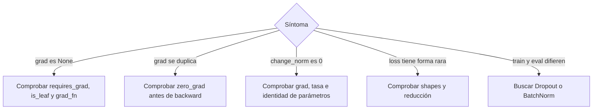
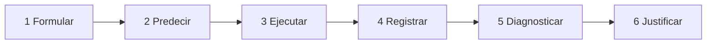

# Ciclo de entrenamiento reproducible y diagnóstico

## El ciclo separa responsabilidades



| Acción | Responsabilidad | No hace |
|---|---|---|
| <code>zero_grad()</code> | reinicia acumuladores | no deriva ni actualiza |
| forward | calcula predicción y construye grafo | no llena <code>.grad</code> |
| pérdida | define el objetivo escalar | no cambia parámetros |
| <code>backward()</code> | calcula y acumula gradientes | no ejecuta el paso |
| <code>step()</code> | consume gradientes y estado | no recalcula gradientes |
| evaluación | mide con conducta de evaluación | no limpia gradientes previos |

## Vista visual del ciclo y sus evidencias

![[assets/14-ciclo-entrenamiento-evidencia.png|1000]]

### Cómo interpretar las tres mediciones

- <code>loss</code> responde **cuánto vale el objetivo actual**. Puede bajar aunque exista un problema de evaluación o de generalización.
- <code>grad_norm</code> responde **si llegó sensibilidad a las hojas**. Un valor cero puede ser correcto en un punto estacionario; <code>None</code> puede indicar desconexión o ausencia de backward.
- <code>change_norm</code> responde **si los parámetros se movieron realmente**. Se mide comparando valores antes y después de <code>step()</code>.

| Patrón observado | Primera interpretación que debes comprobar |
|---|---|
| <code>loss</code> existe, <code>grad_norm</code> no existe | la ruta entre pérdida y parámetros puede estar cortada |
| <code>grad_norm &gt; 0</code>, <code>change_norm = 0</code> | falta <code>step()</code>, la tasa es cero o el optimizador tiene otros parámetros |
| el segundo gradiente es exactamente el doble | probablemente se acumularon dos backward sin reinicio |
| la forma de <code>loss</code> o del residuo es inesperada | revisa reducción y broadcasting antes de tocar el optimizador |

> [!important] Diagnosticar por etapas
> Encuentra primero la primera evidencia que contradice lo esperado. Cambiar varias cosas a la vez puede esconder el síntoma sin corregir la causa.

## Ciclo mínimo anotado

```python
import math
import torch

torch.manual_seed(8)
model.train()

for X_batch, y_batch in train_loader:
    # 1. Preparar acumuladores
    optimizer.zero_grad(set_to_none=True)

    # 2. Forward
    prediction = model(X_batch)
    assert prediction.shape == y_batch.shape

    # 3. Objetivo escalar
    loss = loss_fn(prediction, y_batch)
    assert loss.ndim == 0

    # 4. Sensibilidades
    loss.backward()

    # 5. Evidencia del gradiente
    grad_sq = sum(
        p.grad.detach().pow(2).sum().item()
        for p in model.parameters()
        if p.grad is not None
    )
    grad_norm = math.sqrt(grad_sq)

    # 6. Guardar el estado antes del cambio
    before = [
        p.detach().clone()
        for p in model.parameters()
    ]

    # 7. Consumir gradientes y actualizar
    optimizer.step()

    # 8. Evidencia del cambio real
    change_sq = sum(
        (p.detach() - old).pow(2).sum().item()
        for p, old in zip(model.parameters(), before)
    )
    change_norm = math.sqrt(change_sq)

    print(
        f"loss={loss.item():.6f} "
        f"grad_norm={grad_norm:.6f} "
        f"change_norm={change_norm:.6f}"
    )
```

Las tres mediciones responden preguntas distintas:

| Medición | Qué demuestra |
|---|---|
| <code>loss</code> | valor del objetivo actual |
| <code>grad_norm</code> | sensibilidad llegó a alguna hoja |
| <code>change_norm</code> | los parámetros realmente cambiaron |

## Rama de evaluación

```python
model.eval()
eval_loss_sum = 0.0

with torch.no_grad():
    for X_eval, y_eval in eval_loader:
        prediction_eval = model(X_eval)
        assert prediction_eval.shape == y_eval.shape
        eval_loss_sum += loss_fn(
            prediction_eval,
            y_eval,
        ).item()
```

Esta rama cambia el comportamiento de módulos sensibles y evita historia nueva. No añade ni borra gradientes.

## Una curva descendente es evidencia insuficiente

Una pérdida que baja es una señal atractiva, pero no identifica toda la cadena causal.



Seis preguntas completan la prueba:

1. **Pérdida:** ¿qué función se redujo?
2. **Hojas:** ¿qué parámetros recibieron gradiente?
3. **Reinicio:** ¿se limpió <code>.grad</code> antes del backward?
4. **Estado:** ¿qué memoria consumió el optimizador?
5. **Cambio:** ¿$\lVert\Delta\theta\rVert$ confirma una actualización?
6. **Evaluación:** ¿modo y contexto fueron correctos?

## Diagnóstico según el síntoma



### 1. <code>parameter.grad is None</code>

Causas plausibles:

- <code>requires_grad=False</code>;
- parámetro desconectado de la pérdida;
- operación calculada dentro de <code>no_grad</code>;
- se inspecciona un tensor no hoja sin <code>retain_grad()</code>;
- se llamó <code>zero_grad(set_to_none=True)</code> y aún no hubo backward.

Primera evidencia:

```python
print(parameter.requires_grad)
print(parameter.is_leaf)
print(loss.grad_fn)
```

### 2. El segundo gradiente vale el doble

Causa típica: acumulación entre dos backward.

```python
optimizer.zero_grad(set_to_none=True)
loss.backward()
```

No reduzcas la tasa para esconderlo: eso cambia el síntoma, no la causa.

### 3. <code>change_norm == 0</code>

Posibles causas:

- gradiente realmente cero;
- tasa igual a cero;
- el optimizador recibió parámetros diferentes;
- actualización omitida;
- parámetros congelados.

Comprueba por separado:

```python
print(grad_norm)
print(optimizer.param_groups[0]["lr"])
print([id(p) for p in model.parameters()])
print([
    id(p)
    for group in optimizer.param_groups
    for p in group["params"]
])
```

### 4. Pérdida extraña sin error de ejecución

Compara formas antes de calcularla:

```python
assert prediction.shape == target.shape
```

El caso crítico es $(B,)-(B,1)\to(B,B)$ por broadcasting. Consulta [[05 Lotes, reducción y formas del gradiente#Broadcasting silencioso: código válido, objetivo equivocado|Broadcasting silencioso]].

## Protocolo de evidencia causal

Una solución defendible asciende por seis niveles:



1. Formular formas, predicción y pérdida.
2. Predecir signos y comportamiento.
3. Ejecutar un ciclo reproducible.
4. Registrar <code>loss</code>, <code>grad_norm</code> y <code>change_norm</code>.
5. Relacionar síntomas con causas.
6. Justificar corrección y límites.

> [!summary] Criterio
> Un notebook que solo corre no basta. Cada afirmación debe quedar ligada a una evidencia observable.

## Lista antes de entregar

- [ ] Declaré la función de pérdida y su reducción.
- [ ] Verifiqué formas antes de restar.
- [ ] Predije el signo de gradientes simples.
- [ ] Reinicié antes de backward.
- [ ] Confirmé qué hojas recibieron <code>.grad</code>.
- [ ] Inspeccioné el estado del optimizador cuando existe.
- [ ] Medí un cambio real de parámetros.
- [ ] Usé <code>eval()</code> y <code>no_grad()</code> según la intención.
- [ ] Separé diagnóstico de corrección.
- [ ] Expliqué los límites de mi conclusión.

---

Anterior: [[09 train, eval, grad y no_grad]] · Siguiente: [[11 Laboratorio PyTorch - predecir, observar y verificar]]
