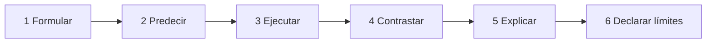

# Laboratorio PyTorch: predecir, observar y verificar

> [!important] Regla del laboratorio
> No ejecutes para descubrir qué ocurre. Primero escribe la predicción, después ejecuta y finalmente explica qué evidencia aceptaría o refutaría tu predicción.

## Protocolo



Para cada experimento registra:

> **Qué espero:** ___.<br>
> **Por qué:** ___.<br>
> **Qué observé:** ___.<br>
> **Qué prueba el resultado:** ___.<br>
> **Qué no prueba:** ___.

## Plantilla visual del método

![[assets/16-protocolo-laboratorio.png|1000]]

### Cómo usarla en cada experimento

1. **Formula:** escribe la función, las formas y las variables antes del código.
2. **Predice:** comprométete con un signo, valor o patrón observable.
3. **Ejecuta:** usa semilla fija y aserciones; evita depender solo de impresiones visuales.
4. **Registra:** conserva los valores relevantes, no únicamente la salida final.
5. **Contrasta:** compara la observación con la predicción anterior.
6. **Explica:** declara la causa apoyada por la evidencia y también lo que el experimento no demuestra.

> [!example] Diferencia entre observación y conclusión
> Observar <code>w.grad == -6</code> es un dato. Concluir que el signo coincide porque $r<0$ y $x>0$ es una explicación. Afirmar que “el entrenamiento siempre convergerá” excedería la evidencia de ese experimento.

## Preparación

```python
import math
import torch
from torch import nn

torch.manual_seed(8)
torch.set_printoptions(precision=4, sci_mode=False)
print(torch.__version__)
```

## Experimento 1: predecir signos

Antes de ejecutar:

$$
\hat y=wx+b,\quad
r=\hat y-y,\quad
L=\frac12r^2.
$$

Con $x=2$, $y=5$, $w=1$, $b=0$, responde:

1. ¿La predicción está arriba o abajo?
2. ¿Aumentar $w$ eleva o baja la predicción?
3. ¿Qué signos esperas en <code>w.grad</code> y <code>b.grad</code>?

```python
x = torch.tensor(2.0)
y = torch.tensor(5.0)
w = torch.tensor(1.0, requires_grad=True)
b = torch.tensor(0.0, requires_grad=True)

y_hat = w * x + b
r = y_hat - y
loss = 0.5 * r**2
loss.backward()

assert loss.ndim == 0
assert torch.equal(loss, torch.tensor(4.5))
assert torch.equal(w.grad, torch.tensor(-6.0))
assert torch.equal(b.grad, torch.tensor(-3.0))
```

Explicación exigida: $r<0$ y $x>0$, por lo que $rx<0$ y $r<0$.

## Experimento 2: verificar un paso explícito

Predice $w^+$, $b^+$, $\hat y^+$ y $L^+$ con $\eta=0.1$.

```python
eta = 0.1

with torch.no_grad():
    w -= eta * w.grad
    b -= eta * b.grad

y_hat_new = w * x + b
loss_new = 0.5 * (y_hat_new - y) ** 2

assert torch.allclose(w, torch.tensor(1.6))
assert torch.allclose(b, torch.tensor(0.3))
assert torch.allclose(y_hat_new, torch.tensor(3.5))
assert torch.allclose(loss_new, torch.tensor(1.125))
```

¿Qué prueba? Que este paso concreto tuvo la dirección esperada.<br>
¿Qué no prueba? Que cualquier tasa o cualquier número de pasos convergerá.

## Experimento 3: acumulación frente a reinicio

```python
w = torch.tensor(1.0, requires_grad=True)

loss_1 = 0.5 * (w - 3.0) ** 2
loss_1.backward()
assert torch.equal(w.grad, torch.tensor(-2.0))

loss_2 = 0.5 * (w - 3.0) ** 2
loss_2.backward()
assert torch.equal(w.grad, torch.tensor(-4.0))

w.grad = None
loss_3 = 0.5 * (w - 3.0) ** 2
loss_3.backward()
assert torch.equal(w.grad, torch.tensor(-2.0))
```

Explica por qué el segundo backward no “calculó mal”: PyTorch sumó dos contribuciones correctas. El error aparecería si el protocolo requería una contribución fresca y olvidaste reiniciar.

## Experimento 4: pérdida y gradientes por lotes

Predice formas y valores antes de ejecutar:

```python
X = torch.tensor([[1.], [2.], [3.]])
y = torch.tensor([3., 5., 7.])
w = torch.tensor([1.], requires_grad=True)
b = torch.tensor(0., requires_grad=True)

y_hat = X @ w + b
r = y_hat - y
loss = 0.5 * torch.mean(r**2)

assert X.shape == (3, 1)
assert y_hat.shape == y.shape == (3,)
assert loss.shape == torch.Size([])

loss.backward()

assert torch.allclose(r, torch.tensor([-2., -3., -4.]))
assert torch.allclose(loss, torch.tensor(29 / 6))
assert torch.allclose(w.grad, torch.tensor([-20 / 3]))
assert torch.allclose(b.grad, torch.tensor(-3.0))
```

Completa verbalmente:

> $X^\mathsf{T}r$ suma ___ ponderados por cada ___. Su resultado tiene forma ___, igual que ___.

> [!question]- Mostrar la frase completa
> Residuos, característica, $(d,)$, $w$.

## Experimento 5: hacer visible el broadcasting erróneo

```python
prediction = torch.tensor([1., 2., 3.])       # (3,)
target_bad = torch.tensor([[1.], [2.], [3.]]) # (3,1)

residual_bad = prediction - target_bad
assert residual_bad.shape == (3, 3)

target_good = target_bad.squeeze(1)
residual_good = prediction - target_good
assert residual_good.shape == (3,)
assert prediction.shape == target_good.shape
```

Compara:

```python
print(residual_bad)
print(residual_good)
```

Explica por qué ambos bloques ejecutan, pero solo el segundo representa un residuo por observación.

## Experimento 6: clasificar tasas antes de observar

```python
def quadratic_trace(theta0, eta, a=4.0, steps=8):
    theta = float(theta0)
    trace = [theta]
    for _ in range(steps):
        theta -= eta * a * theta  # theta* = 0
        trace.append(theta)
    return trace

cases = {
    0.10: "monótona",
    0.25: "un paso",
    0.40: "oscila y converge",
    0.50: "no contrae",
    0.60: "diverge",
}

for eta, expected in cases.items():
    rho = 1 - 4 * eta
    trace = quadratic_trace(1.0, eta)
    print(eta, rho, expected, trace)
```

Antes de mirar <code>trace</code>, justifica cada etiqueta usando el signo y el módulo de $\rho$.

## Experimento 7: mini-batches posibles

```python
from itertools import combinations

individual = torch.tensor([-2., -6., -12.])
full = individual.mean()

for m in (1, 2, 3):
    estimates = torch.stack([
        individual[list(indices)].mean()
        for indices in combinations(range(3), m)
    ])
    print("m =", m, estimates)
    assert torch.allclose(estimates.mean(), full)
```

Observa que la media coincide, pero la dispersión cambia. Relaciónalo con ![[assets/03-variabilidad-mini-batch.png|700]].

## Experimento 8: inspeccionar momentum

```python
parameter = torch.tensor([0.0], requires_grad=True)
optimizer = torch.optim.SGD(
    [parameter],
    lr=0.1,
    momentum=0.9,
)

expected = [
    (0.30, -3.00),
    (0.67, -3.70),
    (0.603, 0.67),
]

for gradient, (theta_expected, buffer_expected) in zip(
    (-3.0, -1.0, 4.0),
    expected,
):
    optimizer.zero_grad(set_to_none=True)
    parameter.grad = torch.tensor([gradient])
    optimizer.step()

    buffer = optimizer.state[parameter]["momentum_buffer"]
    assert torch.allclose(
        parameter,
        torch.tensor([theta_expected]),
        atol=1e-6,
    )
    assert torch.allclose(
        buffer,
        torch.tensor([buffer_expected]),
        atol=1e-6,
    )
```

Explica por qué en el segundo paso el buffer es $-3.7$ aunque el gradiente actual solo sea $-1$.

## Experimento 9: separar el gradiente del estado de Adam

Antes de <code>step()</code>, predice el gradiente. Después del paso, inspecciona qué información nueva apareció:

```python
parameter = torch.tensor([1.0], requires_grad=True)
optimizer = torch.optim.Adam(
    [parameter],
    lr=0.01,
)

optimizer.zero_grad(set_to_none=True)
loss = 0.5 * (parameter - 3.0).pow(2).sum()
loss.backward()

gradient_before_step = parameter.grad.detach().clone()
assert torch.equal(
    gradient_before_step,
    torch.tensor([-2.0]),
)

optimizer.step()
state = optimizer.state[parameter]

assert torch.allclose(
    parameter,
    torch.tensor([1.01]),
)
assert torch.allclose(
    state["exp_avg"],
    torch.tensor([-0.2]),
)
assert torch.allclose(
    state["exp_avg_sq"],
    torch.tensor([0.004]),
)
```

Explica la secuencia causal:

1. la pérdida fija $g_1=-2$;
2. autograd lo guarda en <code>parameter.grad</code>;
3. Adam crea sus momentos durante <code>step()</code>;
4. la corrección inicial produce un cambio aproximado de $+0.01$.

## Experimento 10: <code>eval()</code> no apaga autograd

```python
dropout = nn.Dropout(p=0.5)
x = torch.ones(6, requires_grad=True)

dropout.eval()
y_eval = dropout(x)

assert dropout.training is False
assert y_eval.requires_grad is True
assert torch.equal(y_eval, x)

y_eval.sum().backward()
assert torch.equal(x.grad, torch.ones_like(x))
```

Ahora corta el historial:

```python
x.grad = None
with torch.no_grad():
    z = 3 * x

assert z.requires_grad is False
assert z.grad_fn is None
```

Completa: <code>eval()</code> controla ___; <code>no_grad()</code> controla ___.<br>

> [!question]- Mostrar la diferencia
> `eval()` controla el comportamiento del módulo; `no_grad()` controla el registro de operaciones.

## Experimento 11: ciclo pequeño con evidencia

```python
torch.manual_seed(8)

X = torch.tensor([[1.], [2.], [3.]])
y = torch.tensor([[3.], [5.], [7.]])

model = nn.Linear(1, 1)
optimizer = torch.optim.SGD(
    model.parameters(),
    lr=0.1,
)

for step in range(6):
    model.train()
    optimizer.zero_grad(set_to_none=True)

    prediction = model(X)
    assert prediction.shape == y.shape
    loss = 0.5 * torch.mean((prediction - y) ** 2)
    loss.backward()

    grad_norm = math.sqrt(sum(
        p.grad.detach().pow(2).sum().item()
        for p in model.parameters()
        if p.grad is not None
    ))

    before = [
        p.detach().clone()
        for p in model.parameters()
    ]
    optimizer.step()

    change_norm = math.sqrt(sum(
        (p.detach() - old).pow(2).sum().item()
        for p, old in zip(model.parameters(), before)
    ))

    print(
        step,
        f"loss={loss.item():.6f}",
        f"grad_norm={grad_norm:.6f}",
        f"change_norm={change_norm:.6f}",
    )

model.eval()
with torch.no_grad():
    prediction_eval = model(X)
    loss_eval = 0.5 * torch.mean(
        (prediction_eval - y) ** 2
    )
```

## Informe final del laboratorio

Responde antes de abrir cada solución. Las respuestas distinguen los experimentos manuales del ciclo final.

> [!question]- ¿Qué función escalar se optimizó?
> En el ciclo final, $L=\frac1{2B}\sum_i(\hat y_i-y_i)^2$, con tres observaciones. Los experimentos anteriores también incluyen pérdidas escalares de una sola observación.

> [!question]- ¿Qué formas se comprobaron?
> En el ciclo final, prediction y y tienen forma (3,1) y la pérdida es escalar. En el experimento 4 se usa (3,) para predicciones y objetivos; ambas convenciones son válidas si el emparejamiento coincide.

> [!question]- ¿Qué signo esperabas en el primer gradiente?
> En el caso manual w=1, b=0, ambos gradientes son negativos porque la predicción queda por debajo y las entradas son positivas. En el ciclo con nn.Linear debes observar su inicialización y reconstruir los residuos antes de justificar el signo.

> [!question]- ¿Qué hojas recibieron gradiente?
> w y b en los casos manuales; weight y bias de nn.Linear en el ciclo final. Los intermedios no conservan .grad de forma predeterminada.

> [!question]- ¿Dónde se reinició el acumulador?
> Al inicio de cada iteración mediante optimizer.zero_grad(set_to_none=True), antes de backward.

> [!question]- ¿Qué estado mantuvo el optimizador?
> El SGD sin momentum del ciclo final no añade memoria de dirección. El experimento 8 usa momentum_buffer; el de Adam usa exp_avg, exp_avg_sq y contador de pasos.

> [!question]- ¿Qué evidencia confirma un cambio real?
> change_norm compara copias de los parámetros antes y después de step. Un gradiente no nulo por sí solo no prueba que se hayan actualizado.

> [!question]- ¿Cómo se separó evaluación de entrenamiento?
> Con model.eval() y torch.no_grad(), sin backward ni step. El código evalúa sobre X del entrenamiento: separa el modo de ejecución, pero no aporta un conjunto independiente de generalización.

> [!question]- ¿Qué conclusión permite la pérdida?
> Describe el valor del objetivo definido sobre esos datos. Si disminuye, demuestra mejora de ese objetivo bajo las comprobaciones realizadas.

> [!question]- ¿Qué conclusión exige datos no usados para entrenar?
> El desempeño en ejemplos nuevos. Este pequeño ciclo reutiliza X y por ello no mide por sí solo generalización.

---

Anterior: [[10 Ciclo de entrenamiento reproducible y diagnóstico]] · Siguiente: [[12 Resumen, mapa mental y autoevaluación]]
