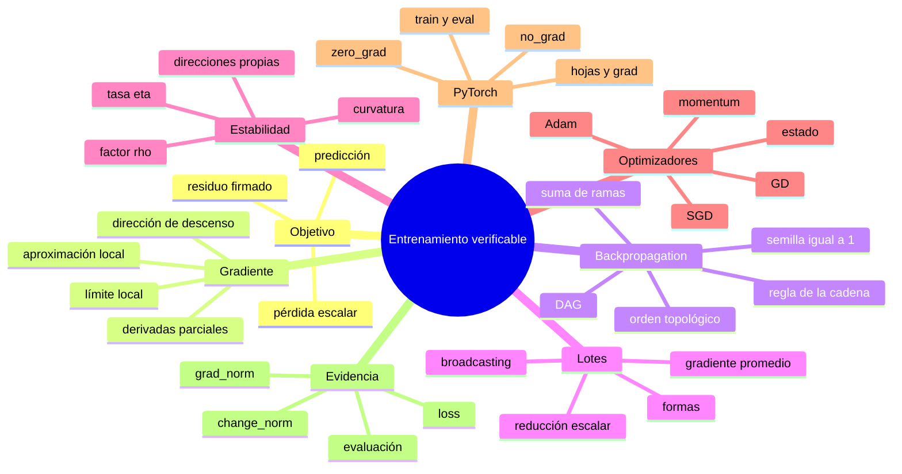

# Resumen, mapa mental y autoevaluación

## Resumen en 90 segundos

1. El entrenamiento reduce una pérdida escalar construida desde datos, parámetros y predicciones.
2. El residuo firmado permite anticipar direcciones antes de derivar.
3. El gradiente reúne sensibilidades locales; no es todavía el paso.
4. $-\nabla L$ produce el máximo descenso de la aproximación lineal entre direcciones unitarias.
5. Backpropagation organiza la regla de la cadena sobre un grafo en orden inverso.
6. Las derivadas se multiplican por ruta y se suman entre rutas.
7. <code>backward()</code> acumula gradientes en hojas; <code>zero_grad()</code> los prepara para otro recorrido.
8. En un lote, la reducción final debe seguir siendo escalar y cada gradiente debe tener la forma de su parámetro.
9. La tasa de aprendizaje interactúa con la curvatura y puede causar convergencia, oscilación o divergencia.
10. Un mini-batch estima el gradiente completo; no tiene que copiarlo en cada paso.
11. Momentum y Adam transforman el gradiente mediante estado persistente.
12. <code>train/eval</code> controla módulos; grad/<code>no_grad</code> controla el grafo.
13. Una curva de pérdida sola no demuestra que todo el protocolo sea correcto.

> [!summary] Frase que debes recordar
> Forward calcula el objetivo; backward calcula sensibilidad; el optimizador decide el paso; la evaluación mide sin confundir modo con historial.

## Mapa mental

## Formulario razonado

| Idea | Fórmula | Lectura |
|---|---|---|
| caso escalar | $\hat y=wx+b$ | peso por dato más sesgo |
| residuo | $r=\hat y-y$ | error firmado |
| pérdida | $L=\frac12r^2$ | objetivo escalar |
| gradiente local | $L(\theta+\Delta\theta)\approx L(\theta)+\nabla L^\mathsf{T}\Delta\theta$ | cambio predicho |
| descenso | $\theta^+=\theta-\eta\nabla L$ | resta sensibilidad |
| lote | $L=\frac1{2B}\lVert Xw+b\mathbf1-y\rVert^2$ | media cuadrática |
| pesos | $\nabla_wL=\frac1BX^\mathsf{T}r$ | residuos llevados a características |
| sesgo | $\partial L/\partial b=\frac1B\mathbf1^\mathsf{T}r$ | residuo promedio |
| cuadrática 1D | $e_{t+1}=(1-\eta a)e_t$ | dinámica exacta |
| estabilidad 1D | $0<\eta<2/a$ | el error se contrae |
| cuadrática multidimensional | $0<\eta<2/\lambda_{\max}(H)$ | manda la mayor curvatura |
| mini-batch | $g_t=\frac1m\sum_{i\in S_t}\nabla\ell_i$ | estimación |
| momentum | $v_t=\mu v_{t-1}+g_t$ | memoria de dirección |
| Adam | $m_t$, $v_t$, corrección y escala | dos memorias por coordenada |

## Distinciones que no debes mezclar

| A | B | Diferencia |
|---|---|---|
| gradiente | paso | sensibilidad frente a regla de actualización |
| backward | step | calcula frente a consume |
| acumular | reiniciar | sumar contribuciones frente a preparar otro recorrido |
| full-batch | mini-batch | gradiente completo frente a estimación |
| <code>train()</code> | grad habilitado | comportamiento del módulo frente a registro |
| <code>eval()</code> | <code>no_grad()</code> | modo de evaluación frente a corte del historial |
| pérdida baja | generalización | objetivo de entrenamiento frente a rendimiento en datos nuevos |
| código ejecutable | código correcto | aceptación de API frente a intención matemática |

## Errores que ya deberías detectar

- Derivar sin predecir el signo cuando el caso permite hacerlo.
- Decir que el gradiente “es el cambio de pesos”.
- Olvidar sumar rutas que llegan al mismo nodo.
- Llamar backward sobre una salida vectorial sin aclarar la semilla.
- Esperar que <code>.grad</code> se reemplace automáticamente.
- Aceptar un gradiente cuya forma no coincide con el parámetro.
- Creer que una tasa mayor solo acelera.
- Exigir que cada mini-batch coincida con el gradiente completo.
- Atribuir a autograd el estado de momentum o Adam.
- Usar <code>model.eval()</code> como si apagara autograd.
- Suponer que <code>no_grad()</code> desactiva Dropout.
- Restar tensores $(B,)$ y $(B,1)$ sin revisar el resultado.
- Presentar una curva descendente como prueba completa.

## Mini examen

Intenta responder antes de desplegar cada solución.

> [!question]- 1. ¿Por qué una pérdida escalar puede organizar millones de parámetros?
> Porque una función escalar puede depender de muchas variables y ofrece una cantidad común para comparar estados. Su gradiente contiene una componente por parámetro.

> [!question]- 2. En el caso $r<0$ y $x>0$, ¿qué signos tienen $\partial L/\partial w$ y $\partial L/\partial b$?
> Ambos son negativos: $\partial L/\partial w=rx<0$ y $\partial L/\partial b=r<0$. Restarlos aumenta $w$ y $b$.

> [!question]- 3. ¿Por qué $-\nabla L$ es descenso máximo solo en sentido local?
> La prueba usa la aproximación lineal de primer orden. La curvatura y términos superiores importan para pasos finitos.

> [!question]- 4. ¿Qué significa la semilla $\partial L/\partial L=1$?
> Que la pérdida cambia uno a uno respecto de sí misma; es el punto de partida del recorrido inverso.

> [!question]- 5. Si una variable aparece en dos ramas, ¿qué hace backward?
> Calcula la contribución de cada ruta y las suma antes de propagar al nodo compartido.

> [!question]- 6. ¿Por qué la salida escalar favorece el modo inverso?
> Porque una sola semilla permite obtener el gradiente respecto a muchas entradas sin materializar todo el Jacobiano.

> [!question]- 7. Para $X:(B,d)$ y $r:(B,)$, ¿qué forma tiene $X^\mathsf{T}r$?
> $(d,)$, la misma forma que el vector de pesos.

> [!question]- 8. ¿Cuándo converge la cuadrática $L=\frac a2(\theta-\theta^*)^2$ con GD?
> Para $0<\eta<2/a$. Si $1/a<\eta<2/a$, converge alternando el signo del error.

> [!question]- 9. ¿Por qué $\lambda_{\max}$ limita la tasa en varias dimensiones?
> Porque todas las direcciones propias deben contraerse y la de mayor curvatura alcanza primero la frontera $|1-\eta\lambda_i|=1$.

> [!question]- 10. ¿Qué afirma realmente $\mathbb E[g_t\mid\theta_t]=\nabla L(\theta_t)$?
> Que el estimador es correcto en promedio bajo el esquema de muestreo; no que cada mini-batch coincida con el gradiente completo.

> [!question]- 11. Si $|g_2|<|g_1|$, ¿momentum obliga a que el segundo paso sea menor?
> No. El paso depende de $v_2=\mu v_1+g_2$, por lo que la memoria puede amplificarlo.

> [!question]- 12. ¿Qué añade Adam después de autograd?
> Dos estados por coordenada, correcciones del sesgo inicial y una transformación adaptada del gradiente en paso.

> [!question]- 13. ¿Por qué <code>eval()</code> no equivale a <code>no_grad()</code>?
> <code>eval()</code> cambia el comportamiento de módulos sensibles; <code>no_grad()</code> evita registrar operaciones. Son ejes independientes.

> [!question]- 14. ¿Qué ocurre con $(B,)-(B,1)$?
> Broadcasting produce $(B,B)$ y puede cambiar silenciosamente la función objetivo.

> [!question]- 15. ¿Qué tres señales conviene registrar además del código?
> <code>loss</code>, <code>grad_norm</code> y <code>change_norm</code>; luego se añade una evaluación con modo y contexto correctos.

## Ruta visual de repaso

1. Regímenes de tasa: ![[assets/01-regimenes-tasa-aprendizaje.png|700]]
2. Curvatura y zigzag: ![[assets/02-valle-curvatura-gd.png|700]]
3. Variabilidad de mini-batch: ![[assets/03-variabilidad-mini-batch.png|700]]

## Criterio de dominio

Has comprendido el módulo si puedes, ante un ciclo nuevo:

1. formular predicción, residuo y pérdida;
2. anticipar signos;
3. dibujar el DAG esencial;
4. reconstruir al menos una ruta de backward;
5. auditar formas de parámetros y gradientes;
6. explicar cómo curvatura y tasa afectan estabilidad;
7. distinguir gradiente, estado y paso;
8. elegir correctamente entre train/eval y grad/no-grad;
9. registrar evidencia causal;
10. diagnosticar antes de corregir.

Practica todo el recorrido en [[11 Laboratorio PyTorch - predecir, observar y verificar]].

---

Volver al [[00 Índice - Gradientes, autodiferenciación y optimización]]
