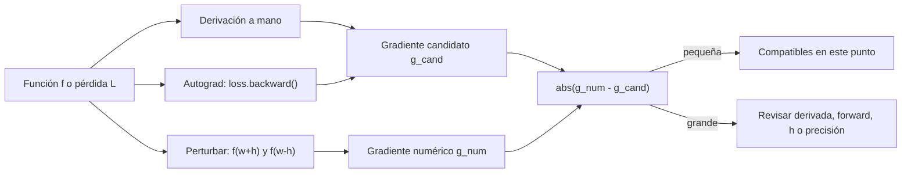
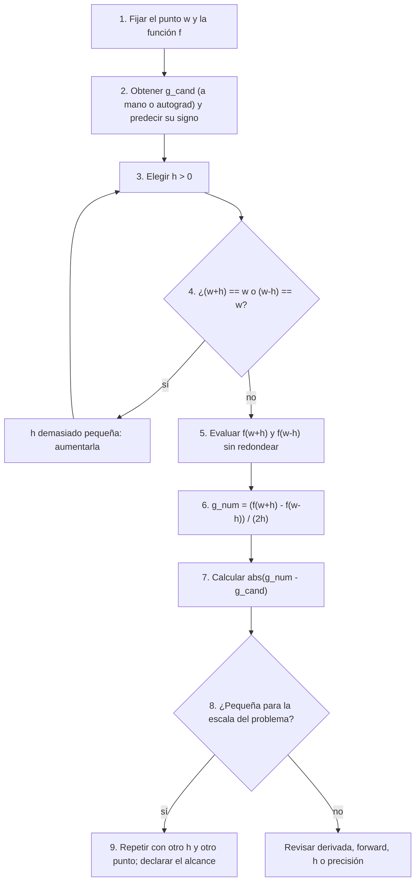

# Verificación de gradientes con diferencias finitas

> [!abstract] Objetivo de la lectura previa
> Comprender **qué compara** una verificación numérica del gradiente y **por qué una perturbación menor no siempre produce una estimación mejor**.

> [!summary] La idea en una frase
> Para comprobar una derivada no hace falta la fórmula de la derivada: se evalúa la función un poco a la izquierda y un poco a la derecha del punto, se resta y se divide entre la distancia entre ambas entradas.

> [!info] Nota compañera
> Esta nota desarrolla la **lectura previa**. El enunciado del control, sus tablas de resultados y el notebook resuelto están en [[14 Control de lectura 3 - el experimento resuelto y explicado]], que reutiliza los mismos gráficos.

## Dónde encaja en el módulo

Hasta ahora el módulo obtuvo gradientes de dos maneras: **a mano** ([[02 Gradiente, aproximación local y dirección de descenso]] y [[03 Grafo computacional y backpropagation]]) y **con autograd** ([[04 Autodiferenciación con micrograd y PyTorch]]). Esta nota añade una tercera vía, independiente de las anteriores, cuyo único propósito es **auditarlas**.



| Vía | Qué necesita | Qué produce | Para qué sirve |
|---|---|---|---|
| derivación a mano | la fórmula de la derivada | expresión exacta | entender y predecir signos |
| autograd | el forward ejecutado | valor exacto salvo redondeo | entrenar |
| diferencias finitas | solo poder evaluar $f$ | aproximación | verificar las otras dos |

> [!important] Método del módulo aplicado a esta nota
> **Predice → deriva → ejecuta → contrasta → explica.** Aquí “contrasta” deja de ser una intención y se convierte en un número: la diferencia absoluta entre dos estimaciones del mismo gradiente.

## 1. Un ejemplo concreto

La **derivada** describe la tasa de cambio local de una función: cuánto cambia la salida por unidad de cambio de la entrada, cerca de un punto. Si la entrada es $w$ y la función es su cuadrado, la derivada es $f'(w)=2w$ y en $w=3$ vale $6$.

Podemos contrastar ese $6$ **sin usar la fórmula** $2w$. Basta evaluar $f$ en dos entradas cercanas, una a cada lado de $3$:

$$
f(w)=w^2;\qquad f(3.01)=9.0601;\qquad f(2.99)=8.9401.
$$

$$
\frac{f(3.01)-f(2.99)}{3.01-2.99}
=\frac{9.0601-8.9401}{0.02}
=\frac{0.12}{0.02}
=6.
$$

Se resta el valor de la función **a la izquierda** del valor **a la derecha**, y se divide entre la **distancia entre ambas entradas**.

![[assets/18-diferencia-central-secante.png|1000]]

### Cómo leer el gráfico

- **Panel izquierdo** ($h=1$, exagerado para ver la geometría): la recta verde une $(2,4)$ y $(4,16)$; su pendiente es $(16-4)/2=6$. La tangente naranja en $w=3$ también tiene pendiente $6$: las dos rectas son paralelas.
- **Panel derecho** (el ejemplo de la lectura, $h=0.01$): el triángulo morado muestra la subida $0.12$ sobre el avance $0.02$. Tan cerca del punto, la curva casi se confunde con su recta tangente.
- El número $6$ se obtuvo con **dos evaluaciones de la función y una división**. En ningún momento se usó $f'(w)=2w$.

> [!note] Por qué en este ejemplo coincide exactamente
> Para una parábola, $(w+h)^2-(w-h)^2=4wh$. Al dividir entre $2h$ queda $2w$ **para cualquier $h$**. Por eso la secante centrada de una parábola siempre es paralela a la tangente. Es una particularidad de las funciones cuadráticas: la lectura advierte que “en otras funciones y en la computadora generalmente habrá una diferencia pequeña”. La sección 4 muestra de dónde salen esas dos diferencias.

> [!warning] En la computadora ni siquiera este ejemplo es exacto
> Los decimales $3.01$ y $2.99$ no existen en binario; se guardan aproximaciones. Estos son los valores reales en `float64`, mostrados con `repr()` y sin redondear:
>
> | Cantidad | En papel | En memoria |
> |---|---:|---:|
> | $3.01$ | $3.01$ | `3.0099999999999997868…` |
> | $f(3.01)$ | $9.0601$ | `9.060099999999998` |
> | $f(2.99)$ | $8.9401$ | `8.940100000000001` |
> | numerador | $0.12$ | `0.11999999999999744` |
> | dividido entre $2h=0.02$ | $6$ | `5.999999999999872` |
> | $\lvert g_{\text{num}}-6\rvert$ | $0$ | `1.28e-13` |
>
> Ese $1.28\cdot10^{-13}$ no es un error de la derivada: es el precio de representar decimales en binario. La verificación **no exige igualdad exacta** precisamente por esto.

## 2. La diferencia central

$$
g_{\text{num}}(w)=\frac{f(w+h)-f(w-h)}{2h}\approx f'(w).
$$

| Símbolo | Qué es | Qué no es |
|---|---|---|
| $w$ | el punto que se comprueba | no cambia durante la verificación |
| $h$ | perturbación positiva, distinta de cero | **no es la tasa de aprendizaje** |
| $f(w+h)$, $f(w-h)$ | dos evaluaciones de la función, una a cada lado | no son derivadas |
| $2h$ | distancia entre los dos puntos evaluados | no es “dos veces el paso de entrenamiento” |
| $g_{\text{num}}$ | pendiente de la secante que une los dos puntos | no es la derivada exacta |

### Por qué el denominador es $2h$

Los puntos están a distancia $h$ **a cada lado** de $w$, así que la distancia entre ellos es:

$$
(w+h)-(w-h)=2h.
$$

Dividir entre $h$ en lugar de $2h$ es un error de factor $2$: con el ejemplo de la lectura se obtendría $12$ en lugar de $6$.

Existe también la **diferencia hacia adelante**, que usa el propio punto y uno a la derecha:

$$
g_{\text{adelante}}(w)=\frac{f(w+h)-f(w)}{h}.
$$

Allí la distancia entre los dos puntos sí es $h$. Ambas fórmulas son válidas, pero con la misma $h$ la central aproxima mejor:

![[assets/19-adelante-vs-central.png|1000]]

Para verlo no hacen falta series de Taylor; basta expandir un cubo. Con $f(w)=w^3$ alrededor de $w=1$, donde $f'(1)=3$:

$$
(1+h)^3-(1-h)^3=6h+2h^3
\quad\Rightarrow\quad
g_{\text{central}}=3+h^2,
$$

$$
(1+h)^3-1^3=3h+3h^2+h^3
\quad\Rightarrow\quad
g_{\text{adelante}}=3+3h+h^2.
$$

| $h$ | $g_{\text{adelante}}$ | error | $g_{\text{central}}$ | error |
|---:|---:|---:|---:|---:|
| $0.5$ | $4.75$ | $1.75$ | $3.25$ | $0.25$ |
| $0.1$ | $3.31$ | $0.31$ | $3.01$ | $0.01$ |
| $0.01$ | $3.0301$ | $0.0301$ | $3.0001$ | $0.0001$ |
| $0.001$ | $3.003001$ | $0.003001$ | $3.000001$ | $0.000001$ |

Al dividir $h$ entre $10$, el error de la fórmula hacia adelante baja unas $10$ veces; el de la central baja unas $100$ veces. La intuición: la central se apoya en ambos lados del punto, y la curvatura la hace sobrestimar en un lado y subestimar en el otro, de modo que ambos efectos se compensan.

### Animación: al reducir $h$ la secante se acerca a la tangente

![[assets/18-secante-a-tangente-animado.gif|1000]]

- **Izquierda** (parábola en $w=3$): $g_{\text{num}}$ vale $6$ en todos los cuadros; la secante solo se desplaza, siempre paralela a la tangente.
- **Derecha** (cúbica en $w=1$): $g_{\text{num}}=3+h^2$ desciende hacia $3$ mientras $h$ se reduce.

Esta animación muestra la mitad “$h$ grande” de la historia. La sección 4 muestra qué ocurre cuando $h$ es demasiado pequeña.

> [!important] $h$ no es la tasa de aprendizaje
> Aquí se **comprueba** un gradiente; no se **actualiza** un parámetro.
>
> | | $h$ (perturbación) | $\eta$ (tasa de aprendizaje) |
> |---|---|---|
> | dónde aparece | en la verificación del gradiente | en la actualización $\theta\leftarrow\theta-\eta\nabla L$ |
> | qué se hace con ella | se evalúa $f$ en $w\pm h$ y se divide entre $2h$ | multiplica el gradiente para construir el paso |
> | ¿cambia el parámetro? | no: $w$ queda igual después de comprobar | sí: ese es su propósito |
> | valores habituales | $10^{-4}$ a $10^{-6}$ en `float64`; en este ejercicio $0.01$ | $10^{-1}$ a $10^{-4}$ según el problema |
> | si es “grande” | la secante representa mal el cambio local | el paso sobrepasa o diverge ([[06 Tasa de aprendizaje, curvatura y estabilidad]]) |
> | si es “diminuta” | se pierde en la representación finita | el entrenamiento casi no avanza |
>
> Que ambas se escriban con una letra y sean “un número pequeño positivo” es todo lo que tienen en común.

> [!note] Una variable, una componente
> En una función de una variable el gradiente tiene una sola componente, así que “gradiente” y “derivada” son la misma cantidad. Con varios parámetros, la sección 5 muestra cómo se comprueba una componente cada vez.

## 3. Qué significa comparar

La aproximación numérica se contrasta con un **gradiente candidato** obtenido de otra forma:

- **analíticamente:** $f'(w)=2w$, que en $w=3$ da $6$;
- **por autodiferenciación:** `loss.backward()` y después `w.grad`.

![[assets/22-que-compara-la-verificacion.png|1000]]

Se calcula la **diferencia absoluta**:

$$
\lvert g_{\text{num}}-g_{\text{cand}}\rvert.
$$

Una discrepancia pequeña **apoya la compatibilidad local** de la derivada candidata: describe bien la tasa de cambio en ese punto y con esa $h$. No se exige igualdad exacta, porque hay dos fuentes legítimas de diferencia (curvatura y redondeo, sección 4).

> [!warning] La diferencia absoluta es una elección de este ejercicio
> Sirve porque todos los valores tienen una escala parecida (derivadas de tamaño $6$, diferencias de tamaño $10^{-13}$). No es una tolerancia universal: si el gradiente valiera $10^{6}$, una diferencia de $1$ sería diminuta; si valiera $10^{-6}$, una diferencia de $10^{-4}$ sería enorme.

### Ejecutarlo en Python puro

```python
def f(w):
    return w ** 2

def gradiente_numerico(f, w, h=1e-5):
    assert h > 0, "h debe ser positiva y distinta de cero"
    izquierda, derecha = w - h, w + h
    assert derecha != w and izquierda != w, "h se perdió en la representación"
    return (f(derecha) - f(izquierda)) / (2 * h)

w = 3.0
g_cand = 2 * w                               # derivada a mano: f'(w) = 2w
g_num = gradiente_numerico(f, w, h=1e-5)

print(repr(g_num))                           # 6.000000000039306
print(f"{abs(g_num - g_cand):.3e}")          # 3.931e-11
```

### Ejecutarlo contra autograd

```python
import torch

def f(w):
    return w ** 2

w = torch.tensor(3.0, dtype=torch.float64, requires_grad=True)
f(w).backward()
g_cand = w.grad.item()                       # 6.0 (autograd)

h = 1e-5
with torch.no_grad():                        # la comprobación no debe entrar en el grafo
    g_num = ((f(w + h) - f(w - h)) / (2 * h)).item()

print(g_cand, g_num, abs(g_num - g_cand))    # 6.0  6.000000000039306  3.9e-11
```

Dos detalles del código conectan con notas anteriores:

- las evaluaciones en $w\pm h$ van dentro de `torch.no_grad()` porque son mediciones, no parte del entrenamiento ([[09 train, eval, grad y no_grad]]);
- el tensor se crea con `dtype=torch.float64` a propósito. La sección 4 muestra qué ocurre con el `float32` por defecto.

> [!tip] Más allá del control: error relativo y `gradcheck`
> La referencia de CS231n recomienda el **error relativo** $\dfrac{\lvert g_{\text{num}}-g_{\text{cand}}\rvert}{\max(\lvert g_{\text{num}}\rvert,\lvert g_{\text{cand}}\rvert)}$ con umbrales orientativos: mayor que $10^{-2}$ suele indicar un error; entre $10^{-2}$ y $10^{-4}$ es incómodo; menor que $10^{-7}$ es tranquilizador en `float64`. PyTorch automatiza la comprobación con `torch.autograd.gradcheck(f, (w,), eps=1e-6)`, que exige `float64` y usa la diferencia central. Nada de esto se pide en el control; el control usa la diferencia absoluta a escala fija.

## 4. Por qué importa el paso

Dos fuentes de error compiten, y una tercera situación las hace colapsar:

| Tamaño de $h$ | Qué sale mal | Nombre | Cómo se ve en el error |
|---|---|---|---|
| grande | la secante abarca un tramo curvo y representa mal el cambio **local** | error de truncamiento | baja como $h^2$ al reducir $h$ (fórmula central) |
| diminuta | $f(w+h)$ y $f(w-h)$ comparten casi todos sus dígitos; al restar quedan pocos dígitos útiles y al dividir entre un $2h$ minúsculo se amplifican | error de redondeo o cancelación | **sube** al reducir $h$ |
| por debajo de medio hueco de la rejilla | $w+h$ se guarda como el mismo número que $w$ | colapso de la representación | numerador $0$, $g_{\text{num}}=0$, error igual a $\lvert f'(w)\rvert$ |

![[assets/20-error-vs-h-curva.png|1000]]

### Cómo leer la curva

- El eje horizontal muestra $h$ decreciendo hacia la derecha; el vertical, el error absoluto en escala logarítmica.
- **Línea azul marino** ($w^3$ en $w=1$): a la izquierda baja con pendiente $h^2$ (truncamiento); toca un mínimo cercano a $10^{-11}$ alrededor de $h\approx10^{-5}$; después sube (redondeo) y en $h=10^{-16}$ salta a $3$, porque $1+10^{-16}$ se guarda como $1$.
- **Línea morada** (el ejemplo de la lectura, $w^2$ en $w=3$): no tiene rama de truncamiento porque la parábola es exacta; solo se ve el ruido de redondeo, que crece de $10^{-14}$ hasta $0.67$ en $h=10^{-15}$ y salta a $6$ en $h=10^{-16}$.
- **Línea roja discontinua** (`float32`, el tipo por defecto de PyTorch): lo mejor que consigue es un error de $6\cdot10^{-6}$ con $h\approx10^{-2}$, y ya en $h=10^{-7}$ colapsa.

### Animación del barrido

![[assets/20-error-vs-h-animado.gif|1000]]

El panel derecho muestra los números tal como quedan en memoria en cada cuadro. Observa cómo `(w + h) == w` cambia a `True` en el último tramo y el numerador pasa a ser exactamente `0.0`.

### Los números del ejemplo de la lectura, sin redondear

Barrido en `float64` para $f(w)=w^2$ en $w=3$, cuya derivada exacta es $6$:

| $h$ | `(w+h) == w` | $f(w+h)-f(w-h)$ | $g_{\text{num}}$ | $\lvert g_{\text{num}}-6\rvert$ |
|---:|:---:|---:|---:|---:|
| `1e-1` | `False` | `1.200000000000001` | `6.000000000000005` | `5.3e-15` |
| `1e-2` | `False` | `0.11999999999999744` | `5.999999999999872` | `1.3e-13` |
| `1e-4` | `False` | `0.0012000000000025324` | `6.000000000012662` | `1.3e-11` |
| `1e-6` | `False` | `1.2000000001677336e-05` | `6.000000000838668` | `8.4e-10` |
| `1e-8` | `False` | `1.1999999927070348e-07` | `5.999999963535174` | `3.6e-08` |
| `1e-10` | `False` | `1.2000000992884452e-09` | `6.000000496442226` | `5.0e-07` |
| `1e-12` | `False` | `1.2001066806988092e-11` | `6.000533403494046` | `5.3e-04` |
| `1e-14` | `False` | `1.2256862191861728e-13` | `6.128431095930864` | `1.3e-01` |
| `1e-15` | `False` | `1.0658141036401503e-14` | `5.329070518200751` | `6.7e-01` |
| `1e-16` | `True` | `0.0` | `0.0` | `6.0` |

Lectura de la tabla:

1. De $10^{-1}$ a $10^{-6}$ el error se mantiene por debajo de $10^{-9}$: cualquiera de esas $h$ sirve.
2. A partir de $10^{-8}$ **reducir $h$ empeora** la estimación: el numerador conserva cada vez menos cifras útiles (mira cómo el `1.2…` se degrada a `1.2256…` y luego a `1.0658…`).
3. En $10^{-16}$ el numerador es exactamente cero. **No** porque la derivada real sea cero (vale $6$), sino porque $3+10^{-16}$ y $3-10^{-16}$ se guardaron como $3$.

> [!warning] Un $g_{\text{num}}=0$ puede ser una ilusión numérica
> Si el gradiente numérico sale exactamente cero, comprueba antes que nada si `(w + h) == w`. Un error igual a $\lvert g_{\text{cand}}\rvert$ es la firma de este colapso: no dice nada sobre la derivada candidata.

### El mismo barrido en `float32`

`torch.tensor(3.0)` crea un `float32`. Con ese tipo la rejilla cerca de $3$ es mucho más gruesa:

| $h$ | `(w+h) == w` | $g_{\text{num}}$ | $\lvert g_{\text{num}}-6\rvert$ |
|---:|:---:|---:|---:|
| `1e-2` | `False` | `5.999994277954102` | `5.7e-06` |
| `1e-3` | `False` | `5.9995646476745605` | `4.4e-04` |
| `1e-4` | `False` | `5.993843078613281` | `6.2e-03` |
| `1e-5` | `False` | `6.008148193359375` | `8.1e-03` |
| `1e-6` | `False` | `5.7220458984375` | `2.8e-01` |
| `1e-7` | `True` | `0.0` | `6.0` |

> [!warning] PyTorch usa `float32` por defecto
> Una $h=10^{-6}$ que en `float64` es excelente produce en `float32` un error de $0.28$, y $h=10^{-7}$ colapsa. Para verificar gradientes en PyTorch crea los tensores con `dtype=torch.float64`; es lo que hace `gradcheck` y lo que recomienda CS231n.

### Por qué “se pierde en la representación”

![[assets/21-representacion-finita-flotante.png|1000]]

La computadora almacena una cantidad finita de cifras. Cerca de $3$, los números representables en `float64` forman una rejilla con huecos de $4.44\cdot10^{-16}$ (una **ulp**, *unit in the last place*). Cualquier resultado cae en el punto de la rejilla más cercano:

- $3+10^{-15}$ equivale a $2.25$ huecos: se guarda como $3+2\,\text{ulp}$, que es `3.00000000000000088817…`, no `3.000000000000001`;
- $3+10^{-16}$ equivale a $0.23$ huecos: se redondea a $3$ y **`(w + h) == w` es `True`**.

En `float32` el hueco cerca de $3$ es $2.38\cdot10^{-7}$; por eso $h=10^{-7}$ ya desaparece y $h=10^{-6}$ sobrevive con apenas cuatro huecos de resolución.

> [!important] No redondee los cálculos intermedios
> Muestre suficientes cifras y compruebe si los puntos almacenados son realmente iguales.
>
> ```python
> w, h = 3.0, 1e-16
> print(f"{w + h:.6f}")     # 3.000000  ← pocos decimales: no informa nada
> print(repr(w + h))        # 3.0       ← repr muestra el valor guardado
> print((w + h) == w)       # True      ← la perturbación desapareció
> ```
>
> Dos confusiones simétricas que hay que evitar:
> 1. **dos números impresos con pocos decimales** parecen iguales, pero pueden ser distintos en memoria: `3+1e-15` y `3` imprimen ambos `3.000000` con seis decimales y sin embargo `(3+1e-15) == 3` es `False`;
> 2. **dos números distintos en papel** ($3$ y $3+10^{-16}$) pueden ser el mismo valor en memoria.
>
> La única prueba fiable es comparar los valores almacenados (`==`, `repr`, o formato `.17g`).

## 5. Alcance de la comprobación

### Un punto no certifica la implementación

Pasar la prueba en $w=3$ con $h=0.01$ dice que la derivada candidata es compatible **ahí**. Una fórmula equivocada puede coincidir en un punto: $g(w)=w+3$ también vale $6$ en $w=3$ y es incorrecta en cualquier otro. Conviene probar **otros puntos y otros pasos** antes de concluir.

### Varios parámetros: una componente cada vez

Con $\theta=(\theta_1,\ldots,\theta_p)$ se perturba **una** coordenada y se mantienen fijas las demás y los datos:

$$
\frac{\partial L}{\partial\theta_i}
\approx
\frac{L(\theta+h\,e_i)-L(\theta-h\,e_i)}{2h},
$$

donde $e_i$ es el vector con un $1$ en la posición $i$ y ceros en el resto.

![[assets/23-una-componente-a-la-vez.png|1000]]

El gráfico usa la cuadrática de [[02 Gradiente, aproximación local y dirección de descenso]], $L(w,b)=(w-2)^2+2(b-1)^2$ en $\theta=(0,2)$, cuyo gradiente exacto es $(-4,4)$. Con $h=0.4$:

- **componente $w$** (naranja): $b=2$ y los datos quedan fijos; $\dfrac{L(0.4,2)-L(-0.4,2)}{0.8}=\dfrac{4.56-7.76}{0.8}=-4$;
- **componente $b$** (azul): $w=0$ queda fijo; $\dfrac{L(0,2.4)-L(0,1.6)}{0.8}=\dfrac{7.92-4.72}{0.8}=4$.

Cada componente exige **dos evaluaciones completas** de la pérdida; con $p$ parámetros son $2p$ forwards. Por eso las diferencias finitas sirven para verificar y no para entrenar: autograd obtiene todas las componentes con un solo recorrido inverso ([[04 Autodiferenciación con micrograd y PyTorch#Autodiferenciación no es diferenciación numérica ni simbólica|comparación de los tres métodos]]).

### El caso conductor del módulo, verificado

Con $\hat y=wx+b$, $r=\hat y-y$, $L=\frac12r^2$ y los datos fijos $x=2$, $y=5$, en $\theta=(1,0)$ el módulo derivó $\partial L/\partial w=-6$ y $\partial L/\partial b=-3$. Comprobación con $h=0.1$:

$$
\frac{L(1.1,\,0)-L(0.9,\,0)}{0.2}
=\frac{\tfrac12(2.2-5)^2-\tfrac12(1.8-5)^2}{0.2}
=\frac{3.92-5.12}{0.2}
=-6,
$$

$$
\frac{L(1,\,0.1)-L(1,\,-0.1)}{0.2}
=\frac{\tfrac12(2.1-5)^2-\tfrac12(1.9-5)^2}{0.2}
=\frac{4.205-4.805}{0.2}
=-3.
$$

En PyTorch con `float64` y $h=10^{-5}$: autograd devuelve `-6.0` y `-3.0`; la diferencia central devuelve `-6.000000000039306` y `-3.000000000019653`. Las discrepancias, de orden $10^{-11}$, apoyan la compatibilidad local.

> [!note] Alcance de este control
> Para el control basta una variable y no se requieren expansiones de Taylor. Todo lo que aparece con varios parámetros o con error relativo es contexto, no requisito.

## 6. Protocolo paso a paso



Registro sugerido para cada comprobación, en el formato de [[11 Laboratorio PyTorch - predecir, observar y verificar]]:

> **Punto y paso:** $w=3$, $h=0.01$.<br>
> **Qué espero:** $g_{\text{cand}}=6$; $g_{\text{num}}$ cercano pero no idéntico.<br>
> **Qué observé:** `g_num = 5.999999999999872`, diferencia `1.28e-13`.<br>
> **Qué prueba:** la derivada $2w$ es compatible con la función en $w=3$.<br>
> **Qué no prueba:** que la derivada sea correcta en otros puntos ni que $h=0.01$ sea el mejor paso para otra función.

## Qué, por qué, cómo y para qué

| Pregunta | Respuesta |
|---|---|
| ¿qué? | pendiente de la secante que une $f(w-h)$ y $f(w+h)$ |
| ¿por qué? | aproxima la tasa de cambio local sin usar la fórmula de la derivada |
| ¿cómo? | dos evaluaciones de $f$, una resta y una división entre $2h$ |
| ¿para qué? | auditar un gradiente obtenido a mano o con autograd |
| ¿límite? | válida en un punto y con una $h$; sensible al truncamiento y al redondeo |

## Errores que ya deberías detectar

| Error | Por qué es un error |
|---|---|
| dividir entre $h$ en la fórmula central | los puntos distan $2h$; el resultado se duplica |
| usar $h$ como si fuera la tasa de aprendizaje | $h$ comprueba, $\eta$ actualiza; nada las relaciona |
| bajar $h$ “para más precisión” sin límite | por debajo de $10^{-8}$ en `float64` el error crece; en $10^{-16}$ colapsa |
| interpretar $g_{\text{num}}=0$ como derivada nula | puede ser que $w+h$ se haya guardado como $w$ |
| exigir $g_{\text{num}}=g_{\text{cand}}$ exactamente | curvatura y redondeo garantizan una diferencia pequeña |
| verificar en `float32` con $h=10^{-6}$ | error de $0.28$; hace falta `float64` o una $h$ mayor |
| redondear valores intermedios o comparar impresiones | dos impresiones iguales no implican dos valores iguales |
| concluir por un solo punto | otra fórmula podría coincidir solo ahí |
| perturbar todos los parámetros a la vez | se mezclan componentes; hay que mover una y congelar el resto |

## Antes del control

La lectura pide poder responder tres cosas. Intenta contestarlas antes de desplegar cada respuesta.

> [!question]- ¿Por qué el denominador es $2h$?
> Porque los dos puntos evaluados, $w-h$ y $w+h$, están a distancia $h$ **a cada lado** de $w$; la distancia entre ellos es $(w+h)-(w-h)=2h$. La fórmula calcula la pendiente “subida entre avance” y el avance es $2h$. Con el ejemplo de la lectura, $0.12/0.02=6$; dividir entre $h=0.01$ daría $12$, el doble de la derivada.

> [!question]- ¿En qué se distingue $h$ de la tasa de aprendizaje?
> $h$ es una perturbación que sirve para **medir** la pendiente: se evalúa $f$ en $w\pm h$ y $w$ no cambia. La tasa $\eta$ es un hiperparámetro que **construye el paso** $-\eta\nabla L$ y sí modifica el parámetro. Pueden tener valores parecidos por casualidad, pero no hay ninguna relación entre ellas: una $h$ buena para verificar ($10^{-5}$) sería una tasa inútil, y una tasa razonable ($0.1$) es una $h$ demasiado grande para funciones con curvatura.

> [!question]- ¿Por qué un resultado numérico puede ser engañoso?
> Por cuatro motivos distintos:
> 1. **$h$ grande:** la secante abarca un tramo curvo y no representa el cambio local (error de truncamiento);
> 2. **$h$ diminuta:** $f(w+h)$ y $f(w-h)$ comparten casi todos sus dígitos y la resta conserva pocos útiles (cancelación); el error **crece** al reducir $h$;
> 3. **colapso:** si $h$ es menor que medio hueco de la rejilla, $w+h$ se guarda como $w$, el numerador es $0$ y $g_{\text{num}}=0$ aunque la derivada real no lo sea;
> 4. **impresión redondeada:** dos valores impresos con pocos decimales pueden verse iguales sin serlo, o parecer distintos en papel y ser el mismo valor en memoria.

## Mini examen

> [!question]- 1. Con $f(w)=w^3$, $w=2$ y $h=0.1$, calcula $g_{\text{num}}$ y compárala con la derivada exacta.
> $f(2.1)=9.261$, $f(1.9)=6.859$. $g_{\text{num}}=(9.261-6.859)/0.2=2.402/0.2=12.01$. La derivada exacta es $3w^2=12$; la diferencia es $0.01=h^2$, como predice la expansión del cubo: $(2+h)^3-(2-h)^3=24h+2h^3$, así que $g_{\text{central}}=12+h^2$.

> [!question]- 2. Repite el cálculo anterior con la diferencia hacia adelante.
> $(f(2.1)-f(2))/0.1=(9.261-8)/0.1=12.61$. Error $0.61$, unas $60$ veces mayor que el de la central con la misma $h$.

> [!question]- 3. Con $f(w)=w^2$ en $w=3$ y $h=0.5$, ¿qué obtienes?
> $(12.25-6.25)/1=6$. Exacto, como para cualquier $h$: la secante centrada de una parábola es paralela a la tangente. Esto no ocurre con otras funciones.

> [!question]- 4. En `float64`, con $w=3$ y $h=10^{-17}$, la diferencia central devuelve $0$. ¿La derivada es cero?
> No. $3+10^{-17}$ y $3-10^{-17}$ se almacenan como $3.0$, así que el numerador es $0$ por un problema numérico. La derivada real vale $6$. Un error igual a $\lvert g_{\text{cand}}\rvert$ es la firma del colapso; hay que aumentar $h$.

> [!question]- 5. Un compañero imprime `w + h` y `w` con cuatro decimales, ve `3.0000` en ambos y concluye que $h$ se perdió. ¿Es válida la conclusión?
> No. Con pocos decimales cualquier $h<5\cdot10^{-5}$ imprime `3.0000` aunque el valor guardado sea distinto. Debe comparar con `(w + h) == w` o mirar `repr(w + h)`. La afirmación inversa sí es válida: si `repr` muestra `3.0` para ambos, son el mismo valor.

> [!question]- 6. La comprobación en $w=3$ con $h=0.01$ dio una diferencia de $10^{-13}$. ¿Certifica que $f'(w)=2w$ es correcta?
> No. Apoya la compatibilidad **en ese punto y con esa $h$**. La fórmula $g(w)=w+3$ también daría $6$ en $w=3$ y es incorrecta. Hay que repetir en otros puntos y con otros pasos.

> [!question]- 7. Un modelo tiene parámetros $w$ y $b$. ¿Cómo se verifica $\partial L/\partial b$?
> Se perturba **solo** $b$, manteniendo $w$ y los datos fijos: $\bigl(L(w,b+h)-L(w,b-h)\bigr)/2h$. Después se repite por separado para $w$. Nunca se mueven ambos a la vez.

> [!question]- 8. En PyTorch, con `torch.tensor(3.0, requires_grad=True)` y $h=10^{-6}$, la diferencia central da $5.72$. ¿Autograd está mal?
> No necesariamente: el tensor es `float32`, cuya rejilla cerca de $3$ tiene huecos de $2.4\cdot10^{-7}$; con $h=10^{-6}$ solo hay cuatro huecos de resolución y el error es $0.28$. El fallo está en $g_{\text{num}}$, no en $g_{\text{cand}}$. Usa `dtype=torch.float64` o una $h$ mayor ($10^{-2}$ da un error de $6\cdot10^{-6}$).

> [!question]- 9. ¿Por qué no se exige $g_{\text{num}}=g_{\text{cand}}$?
> Porque salvo en funciones cuadráticas la secante tiene un error de truncamiento del orden de $h^2$, y porque en la computadora los valores intermedios se redondean. Una discrepancia pequeña es lo esperado; una nula sería sospechosa.

> [!question]- 10. ¿Por qué las diferencias finitas no se usan para entrenar?
> Cada componente del gradiente exige dos forwards completos; con millones de parámetros son millones de evaluaciones por paso, y además cada una lleva un error. Autograd obtiene todas las componentes con un backward, exactas salvo redondeo. Las diferencias finitas quedan como herramienta de auditoría.

## Fuentes

- [1] Stanford CS231n, *Gradient Checks*: fórmula central, elección de $h$ y alcance local. https://cs231n.github.io/neural-networks-3/#gradient-checks
- [2] Documentación oficial de Python, *Floating-Point Arithmetic: Issues and Limitations*. https://docs.python.org/3/tutorial/floatingpoint.html
- Lectura previa del Control 3: ![[assets/Control_Lectura_3_Lectura_Previa.pdf]]
- Gráficos y GIFs reproducibles: [[assets/generar_graficos_control3.py]]

---

Anterior: [[12 Resumen, mapa mental y autoevaluación]] · Siguiente: [[14 Control de lectura 3 - el experimento resuelto y explicado]] · Volver al [[00 Índice - Gradientes, autodiferenciación y optimización]]
