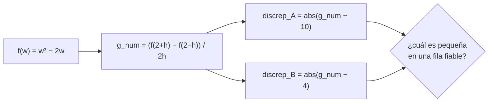

# Control de lectura 3: el experimento resuelto y explicado

> [!abstract] Objetivo
> Entender de principio a fin el ejercicio evaluado el 5 de septiembre de 2026: qué dos números se compararon, por qué la fila $h=10^{-5}$ es la que decide, por qué la fila $h=10^{-16}$ da exactamente $0.0$ y qué **no** demuestra haber acertado en un solo punto.

> [!summary] La idea en una frase
> Con dos evaluaciones de la función y una división se estima la derivada en $w=2$; esa estimación coincide con $g_A$ y descarta a $g_B$, pero solo mientras $w+h$ y $w-h$ sigan siendo números distintos en memoria.

> [!info] Dónde está la teoría
> Qué es la diferencia central, por qué se divide entre $2h$, por qué es mejor que la fórmula hacia adelante, en qué se distingue $h$ de la tasa de aprendizaje y cómo es la rejilla de los floats: todo eso, con gráficos y animaciones, está en [[13 Verificación de gradientes con diferencias finitas]]. Esta nota aplica esa teoría al ejercicio concreto que se evaluó.

## El problema

Se dan una función y dos candidatos a su derivada:

$$
f(w)=w^3-2w,\qquad g_A(w)=3w^2-2,\qquad g_B(w)=3w-2.
$$

Hay que decidir cuál es compatible con la evidencia numérica en $w=2$, **sin derivar a mano**, usando diferencias centrales con tres pasos: $h=10^{-1}$, $10^{-5}$ y $10^{-16}$. En $w=2$ los candidatos valen $g_A(2)=10$ y $g_B(2)=4$.



## Lo único que había que programar

```python
def diferencia_central(f, w, h):
    return (f(w + h) - f(w - h)) / (2 * h)
```

Recibe la **función**, no la derivada. No debe llamar a `gradiente_A` ni a `gradiente_B`: si lo hiciera, la estimación dejaría de ser una evidencia independiente. El denominador es $2h$ porque los dos puntos están a $h$ de cada lado de $w$.

## Predicción antes de ejecutar (P0)

El control exigía escribir la predicción antes de correr el código y conservarla. Esta fue la predicción:

- **Qué se compara.** El gradiente numérico $g_{num}(2)$, obtenido solo con $f$, contra el valor de cada candidato en el mismo punto. La medida es la discrepancia absoluta $\lvert g_{num}-g_{cand}\rvert$.
- **¿Un $h$ menor siempre mejora?** No. El error de truncamiento baja como $h^2$, pero el error de redondeo sube al achicar $h$ porque se restan dos números casi iguales y se divide por algo diminuto. Debe haber un $h$ intermedio óptimo, cerca de $10^{-5}$ en doble precisión.
- **Por paso.** $h=0.1$: cerca del valor correcto con error visible. $h=10^{-5}$: la mejor. $h=10^{-16}$: falla, porque es menor que la mitad del hueco entre floats cerca de $2$ (unos $4.4\times10^{-16}$), así que $w\pm h$ se guardarán como $2.0$ y el numerador será $0$.

## Resultados

Python en doble precisión, sin redondear cálculos intermedios:

| h | g_num | g_A | g_B | discrep_A | discrep_B |
|:---:|:---:|:---:|:---:|:---:|:---:|
| 1e-1 | 10.010000000000007 | 10 | 4 | 1.000000e-02 | 6.010000e+00 |
| 1e-5 | 10.000000000198739 | 10 | 4 | 1.987388e-10 | 6.000000e+00 |
| 1e-16 | 0.0 | 10 | 4 | 1.000000e+01 | 4.000000e+00 |

Puntos perturbados tal como quedaron almacenados (17 cifras significativas):

| h | w + h | w − h | ¿w + h == w − h? |
|:---:|:---:|:---:|:---:|
| 1e-1 | 2.1000000000000001 | 1.8999999999999999 | False |
| 1e-5 | 2.0000100000000001 | 1.9999899999999999 | False |
| 1e-16 | 2 | 2 | **True** |

## Cómo leer las tablas (P1)

- **Fila $h=10^{-5}$: la que decide.** $g_{num}=10.000000000198739$, a $1.99\times10^{-10}$ de $g_A$ y a $6$ unidades de $g_B$. La estimación coincide con $g_A$ en unas diez cifras. **El candidato compatible es $g_A$.**
- **Fila $h=10^{-1}$: apunta a lo mismo.** $g_{num}=10.010000000000007$, discrepancia con A de $0.01$ y con B de $6.01$. El error con A es mayor porque el paso es grande, pero sigue siendo unas 600 veces menor que el error con B.
- **Fila $h=10^{-16}$: no sirve para decidir.** $g_{num}=0.0$, discrepancia con A de $10$ y con B de $4$. Mirada sola elegiría a $g_B$, el candidato **equivocado**. Por eso se decide con las filas donde el método funciona, no con la de menor $h$.

> [!example] Por qué la discrepancia con A vale exactamente $h^2$
> No se pedía en el control, pero explica los números. Expandiendo los cubos, en aritmética exacta:
> $$
> g_{num}(w)=\frac{(w+h)^3-2(w+h)-(w-h)^3+2(w-h)}{2h}=\frac{6w^2h+2h^3-4h}{2h}=3w^2-2+h^2.
> $$
> Es decir, $g_{num}=g_A(w)+h^2$ **para cualquier $h$**. En $w=2$: con $h=0.1$ da $10.01$ (observado $10.010000000000007$) y con $h=10^{-5}$ da $10.0000000001$ (observado $10.000000000198739$; el resto, $\approx10^{-10}$, es redondeo). Con $h=10^{-16}$ debería dar $10+10^{-32}$, pero la computadora dio $0.0$: la pista de que algo pasó **antes** de aplicar la fórmula.

## Qué pasó con $h=10^{-16}$ (P2)

Un float de doble precisión tiene 53 bits de mantisa. Cerca de $2$ los números almacenables están separados por

$$
\text{ulp}(2.0)=2^{-51}\approx4.44\times10^{-16}.
$$

El paso $10^{-16}$ es menor que la mitad de ese hueco, así que $2.0+10^{-16}$ se redondea al número almacenable más cercano, que es $2.0$, y lo mismo pasa con $2.0-10^{-16}$. La perturbación desaparece **antes** de evaluar $f$:

$$
g_{num}=\frac{f(2.0)-f(2.0)}{2\cdot10^{-16}}=\frac{4.0-4.0}{2\cdot10^{-16}}=0.0
$$

No es que la fórmula converja a $0$ ni que la derivada sea $0$: la computadora perdió el paso. Se comprueba sin bibliotecas:

```python
import math
math.ulp(2.0)          # 4.440892098500626e-16
2.0 + 1e-16 == 2.0     # True   -> la perturbación se perdió
2.0 + 3e-16            # 2.0000000000000004  -> sobrevive, un solo hueco
2.0 + 1e-5 == 2.0      # False  -> h útil
```

Con $h=10^{-5}$ el paso sí sobrevive ($2.00001$ y $1.99999$ se distinguen sin problema). En esa fila el truncamiento ($\approx h^2=10^{-10}$) y el redondeo ($\approx\varepsilon\,\lvert f(2)\rvert/h\approx2.2\times10^{-16}\cdot4/10^{-5}\approx10^{-10}$) son del mismo tamaño; por eso la discrepancia queda en $\approx2\times10^{-10}$, casi lo mejor que puede dar el método.

El barrido completo en $w=2$ muestra las tres zonas de la curva de error:

| h | discrepancia con $g_A$ | zona |
|:---:|:---:|---|
| 1e-1 | 1.0e-02 | truncamiento |
| 1e-3 | 1.0e-06 | truncamiento |
| 1e-5 | 2.0e-10 | zona útil |
| 1e-7 | 5.3e-09 | empieza el redondeo |
| 1e-10 | 8.3e-07 | redondeo |
| 1e-13 | 8.0e-03 | redondeo fuerte |
| 1e-16 | 1.0e+01 | colapso: $g_{num}=0$ |

![[assets/20-error-vs-h-curva.png|1000]]

**Contraste con P0.** La predicción se cumplió: bajar $h$ ayudó hasta cierto punto (de $10^{-1}$ a $10^{-5}$ la discrepancia con A bajó de $10^{-2}$ a $2\times10^{-10}$) y después perjudicó (de $10^{-5}$ a $10^{-16}$ subió de $2\times10^{-10}$ a $10$). El único matiz: el fallo en $10^{-16}$ fue total y silencioso, un $0.0$ exacto sin ningún aviso.

> [!warning] Imprimir con pocos decimales engaña
> `print(f"{2 + 1e-15:.6f}")` muestra `2.000000`, igual que `2.0`, pero `(2 + 1e-15) == 2.0` es `False`. Y al revés, `2 + 1e-16` **sí** es exactamente `2.0`. Para saber si dos puntos son iguales hay que compararlos con `==` o imprimirlos con 17 cifras (`repr` o formato `.17g`). Por eso el control pedía la segunda tabla.

## Un punto no demuestra corrección (P3)

Coincidir en $w=2$ es **una sola comparación**. Muchas funciones distintas valen $10$ en $w=2$ (por ejemplo $5w$, $w^2+6$ o la constante $10$) y todas pasarían la prueba siendo incorrectas. La evidencia en un punto **refuta** a $g_B$, pero a $g_A$ solo **no la refuta**.

Hay un detalle que lo hace evidente: $g_A$ y $g_B$ coinciden donde $3w^2-2=3w-2$, es decir, en $w=0$ y $w=1$. Si el control se hubiera hecho en uno de esos puntos, la diferencia central no habría podido distinguirlos:

| w | g_num (h = 1e-5) | g_A | g_B | discrep_A | discrep_B |
|:---:|:---:|:---:|:---:|:---:|:---:|
| −1.0 | 1.000000000095369 | 1 | −5 | 9.5e-11 | 6.0 |
| 0.0 | −1.9999999999 | −2 | −2 | 1.0e-10 | 1.0e-10 |
| 0.5 | −1.2499999998971667 | −1.25 | −0.5 | 1.0e-10 | 0.75 |
| 1.0 | 1.000000000095369 | 1 | 1 | 9.5e-11 | 9.5e-11 |
| 2.0 | 10.000000000198739 | 10 | 4 | 2.0e-10 | 6.0 |
| 3.0 | 25.000000000297003 | 25 | 7 | 3.0e-10 | 18.0 |

En $w=0$ y $w=1$ ambos pasan; en el resto solo pasa $g_A$. Una comprobación seria usa **varios puntos** que cubran regímenes distintos (negativos, cerca de cero, cambio de signo del gradiente, valores grandes), evita los puntos donde los candidatos coinciden y exige pasar en **todos**. Basta un fallo para descartar un candidato.

> [!tip] Medir la discrepancia de forma relativa
> La diferencia absoluta sirve en este ejercicio porque todos los valores tienen una escala parecida. En general conviene la medida relativa que propone CS231n:
> $$
> \frac{\lvert g_{num}-g_{cand}\rvert}{\max\!\big(\lvert g_{num}\rvert,\lvert g_{cand}\rvert\big)}
> $$
> Valores por debajo de $10^{-7}$ son buenos en float64; cerca de $10^{-2}$ indican casi seguro un error.

## Respuestas modelo

Las respuestas tal como quedaron en el notebook entregado, resumidas. Intenta responder antes de desplegar.

> [!question]- P0. ¿Qué dos cantidades se comparan? ¿Un $h$ menor siempre mejora?
> Se comparan el gradiente numérico $g_{num}$, calculado solo con $f$, y el gradiente candidato en el mismo punto, midiendo $\lvert g_{num}-g_{cand}\rvert$. Un $h$ menor no siempre mejora: el truncamiento baja como $h^2$ pero el redondeo sube, y por debajo de medio hueco entre floats la perturbación desaparece y la estimación colapsa a $0$.

> [!question]- P1. ¿Qué candidato respalda una fila fiable?
> La fila $h=10^{-5}$: $g_{num}=10.000000000198739$, discrepancia con A de $1.987388\times10^{-10}$ y con B de $6.000000$. Respalda a $g_A$. La fila $h=10^{-1}$ coincide ($0.01$ frente a $6.01$). La fila $h=10^{-16}$ no es fiable y, sola, señalaría al candidato equivocado.

> [!question]- P2. Compara $h=10^{-16}$ con $h=10^{-5}$.
> Con $10^{-5}$: $w\pm h$ son $2.0000100000000001$ y $1.9999899999999999$, distintos, y $g_{num}\approx10$. Con $10^{-16}$: ambos se almacenan como $2$, la comparación de igualdad da `True` y $g_{num}=0.0$. Causa: el hueco entre floats cerca de $2$ es $4.44\times10^{-16}$ y $10^{-16}$ es menor que su mitad. Confirma la predicción de P0.

> [!question]- P3. ¿Coincidir en $w=2$ demuestra corrección para cualquier entrada?
> No: es una sola comparación y $g_A$ y $g_B$ incluso coinciden en $w=0$ y $w=1$. Comprobación propuesta: repetir con $h=10^{-5}$ en $w=-1.5,-0.5,0.5,1.5,3$, evitar $w=0$ y $w=1$, y exigir discrepancia relativa menor que $10^{-6}$ en todos los puntos.

## Errores que se cometen en este control

- Dividir entre $h$ en lugar de $2h$: todas las estimaciones salen dobles.
- Llamar a `gradiente_A` o `gradiente_B` dentro de `diferencia_central`.
- Decidir con la fila $h=10^{-16}$ porque "es la más precisa".
- Interpretar $g_{num}=0$ como "la derivada es cero".
- Redondear los cálculos o juzgar la igualdad de $w\pm h$ por cómo se imprimen.
- Cambiar la predicción de P0 después de ver los resultados en lugar de contrastarla.
- Concluir que $g_A$ "es correcta para todo $w$" por una coincidencia en un punto.

## Material del control

- Enunciado: ![[assets/Control_Lectura_3_Enunciado.pdf]]
- Lectura previa: ![[assets/Control_Lectura_3_Lectura_Previa.pdf]]
- Notebook resuelto y ejecutado: [[assets/Control_Lectura_3_resuelto.ipynb]] · resultados: [[assets/resultados_control_3.csv]]
- Gráficos de la nota 13, reproducibles: [[assets/generar_graficos_control3.py]]

---

Anterior: [[13 Verificación de gradientes con diferencias finitas]] · Volver al [[00 Índice - Gradientes, autodiferenciación y optimización]]
