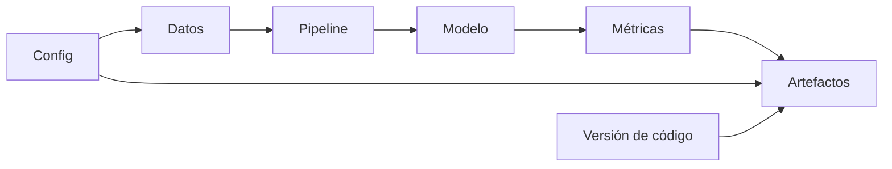

# Ingeniería de software para Machine Learning

> [!abstract] Idea central
> Un experimento no es reproducible porque “el código corrió una vez”. Debe conservar datos, configuración, transformaciones, versión, semillas, métricas y artefactos de forma verificable.

![[../assets/ruta maestra ia/12-experimento-reproducible.svg|900]]

## Ruta

1. [[01 Estructura, entornos y reproducibilidad]]
2. [[02 Configuración, dataclasses, contratos y composición]]
3. [[03 Validación, excepciones, assert y tipos]]
4. [[04 Pruebas unitarias, integración y pruebas semánticas]]
5. [[05 Logging, artefactos, serialización y laboratorio]]

## Recordatorio

| Herramienta | Función |
|---|---|
| `pyproject.toml` | dependencias y metadatos declarados |
| `uv.lock` | resolución exacta reproducible |
| `.venv` | instalación local reconstruible, no versionada |
| test | especificación ejecutable |
| log | registro de eventos |
| artefacto | salida persistente: modelo, tabla, figura |

---

Volver a [[../00 INICIO - Qué es cada cosa y ruta maestra de IA]] · Siguiente: [[01 Estructura, entornos y reproducibilidad]]
