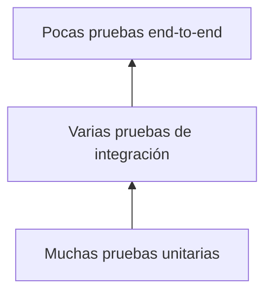

# Pruebas unitarias, integración y pruebas semánticas

## Pirámide útil



## Unitarias

Prueban una función pequeña con entradas controladas:

```python
def test_distancia_segmento_recto():
    points = [(0, 0), (3, 4)]
    assert path_length(points) == 5.0
```

## Integración

Comprueban interacción entre componentes: leer una sesión, extraer características, aplicar modelo y producir score.

## End-to-end

Ejecutan un flujo representativo completo con un dataset pequeño. Son valiosas pero más lentas y menos precisas al localizar fallos.

## Pruebas semánticas para ML

- duplicar el mismo lote no cambia la media de pérdida;
- permutar filas no cambia un modelo independiente del orden;
- modificar el futuro no cambia logits causales del prefijo;
- train y test no comparten grupo;
- una transformación ajustada no cambia al transformar test;
- aumentar el score en dirección “más anómala” mantiene convención de signo.

## Tests de metamorfismo

Cuando no conoces la salida exacta, comprueba relaciones:

- trasladar todas las coordenadas no cambia velocidades;
- escalar tiempo cambia velocidades de forma predecible;
- añadir un duplicado con $\Delta t=0$ no debe dividir por cero;
- reordenar una tabla que luego se ordena por tiempo no cambia características.

## Aproximaciones numéricas

Usa tolerancias:

```python
assert math.isclose(actual, expected, rel_tol=1e-9, abs_tol=1e-12)
```

La tolerancia debe justificarse por escala, dtype y algoritmo.

## Reproducibilidad en tests estocásticos

Fija semilla y prueba propiedades robustas, no una secuencia incidental cuando la librería puede cambiar implementación.

## Autoevaluación

1. Diferencia unit, integration y end-to-end.
2. Da una prueba semántica de causalidad.
3. ¿Qué es una prueba metamórfica?
4. ¿Por qué igualdad exacta es frágil para flotantes?

---

Anterior: [[03 Validación, excepciones, assert y tipos]] · Siguiente: [[05 Logging, artefactos, serialización y laboratorio]]

## Aplicación en Data Engineering freelance

- [[Obsidian/freelance/Data Engineering/Testing/02 Regresión y pruebas de datos|02 Regresión y pruebas de datos]] — Invariantes y regresión en transformaciones SQL y Spark.
