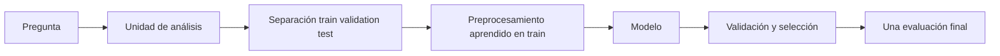

# Machine Learning clásico: índice y recordatorio

> [!abstract] Pregunta del módulo
> ¿Cómo elegimos una función a partir de ejemplos y comprobamos que aprendió un patrón general en lugar de memorizar accidentes?

## Recordatorio de piezas

| Pieza | Qué contiene | No confundir con |
|---|---|---|
| $X\in\mathbb R^{B\times D}$ | características | etiquetas |
| $y$ | objetivo | predicción $\hat y$ |
| $f_\theta$ | familia de modelos | un resultado ya entrenado |
| $\theta$ | parámetros | hiperparámetros |
| train | ajusta parámetros | evaluación final |
| validation | elige configuración/umbral | test |
| test | estima desempeño final | recurso para iterar |

## Ruta

1. [[01 Problema de aprendizaje, representación y particiones]]
2. [[02 Regresión lineal y logística desde la pérdida]]
3. [[03 Generalización, sesgo-varianza y regularización]]
4. [[04 Árboles, Random Forest y boosting]]
5. [[05 Métricas, umbrales, calibración y validación]]
6. [[06 Laboratorio y autoevaluación - Machine Learning clásico]]

## Dos preguntas diferentes

- **Optimización:** ¿encontré buenos parámetros para train?
- **Generalización:** ¿funciona el procedimiento en unidades nuevas?

Un mínimo de pérdida de entrenamiento responde la primera, no la segunda.

---

Volver a [[../00 INICIO - Qué es cada cosa y ruta maestra de IA]] · Siguiente: [[01 Problema de aprendizaje, representación y particiones]]

