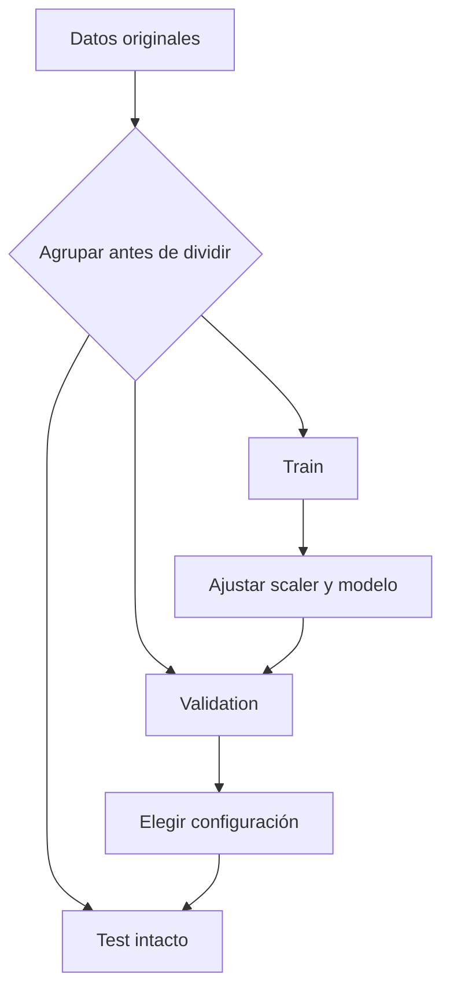

# Problema de aprendizaje, representación y particiones

![[../assets/ruta maestra ia/08-particiones-sin-fuga.gif|900]]

## Antes del algoritmo: define la observación

Completa estas frases:

1. Una fila representa ___

> [!success]- Ver respuesta
> Una sesión de interacción con el mouse o, si se trabaja por ventanas, una ventana perteneciente a una sesión y a un usuario concretos.

2. Las características están disponibles en el momento de decidir ___

> [!success]- Ver respuesta
> Si la sesión pertenece a un usuario legítimo o a un posible impostor, sin utilizar información registrada después de esa decisión.

3. La etiqueta representa ___

> [!success]- Ver respuesta
> La clase real de la observación; por ejemplo, **usuario legítimo** o **impostor**.

4. La unidad nueva que quiero generalizar es ___

> [!success]- Ver respuesta
> Una sesión futura si se evaluarán usuarios conocidos, o un usuario nuevo si el sistema debe funcionar con personas no vistas durante el entrenamiento.

Para dinámica de mouse, una fila puede ser una sesión. Si se crean ventanas, varias filas comparten sesión y usuario; no son independientes para dividir al azar.

## Tipos de tarea

| Tarea | Objetivo | Ejemplo |
|---|---|---|
| regresión | número continuo | duración futura |
| clasificación | clase discreta | legítimo/impostor |
| ranking | orden relativo | priorizar alertas |
| clustering | grupos sin etiqueta | estilos de interacción |
| anomalías | desviación respecto de normalidad | sesión atípica |

## Representación

Un algoritmo no recibe “una sesión”; recibe un vector:

$$x=[\text{duración},\text{velocidad media},\text{pausas},\ldots].$$

La representación determina qué diferencias puede usar el modelo. Si no incluye orden temporal, dos trayectorias con igual resumen pueden verse idénticas.

## Particiones

- **Train:** aprende parámetros y estadísticas de preprocesamiento.
- **Validation:** elige hiperparámetros, modelo y umbral.
- **Test:** estima una sola vez el desempeño del procedimiento cerrado.

## Fuga de información

Existe fuga cuando durante entrenamiento o selección entra información que no estaría disponible al desplegar.

Ejemplos:

- normalizar usando media de todo el dataset;
- crear ventanas y luego repartir ventanas de una misma sesión;
- elegir umbral mirando test;
- usar una variable registrada después del evento objetivo;
- seleccionar características con todo el dataset.

## Agrupamiento

Si $g_i$ identifica usuario o sesión, la separación debe preservar grupos:

$$g_i\in train\Rightarrow g_i\notin validation,test.$$

La elección depende de la afirmación:

- generalizar a sesiones futuras del mismo usuario → separar por sesión y tiempo;
- generalizar a usuarios nuevos → separar por usuario;
- personalizar un detector por usuario → enrolamiento y prueba separados dentro de cada cuenta.

## Preprocesamiento como parte del modelo

Si estandarizamos:

$$z_j=\frac{x_j-\mu_j}{\sigma_j},$$

$\mu_j$ y $\sigma_j$ son parámetros aprendidos de train. Deben guardarse y aplicarse sin recalcular en validation/test.

## Baseline

Un baseline responde si la complejidad aporta valor. Ejemplos:

- predecir la clase mayoritaria;
- usar media de train;
- distancia a un centro;
- regresión logística antes de una red profunda.

## Invariantes de un pipeline

- mismas columnas y orden;
- mismas unidades;
- transformaciones ajustadas solo en train;
- grupos disjuntos;
- semilla y configuración registradas;
- test no participa en decisiones.

## Autoevaluación

1. ¿Por qué separar ventanas al azar puede filtrar identidad?

> [!success]- Ver respuesta
> Porque varias ventanas pueden provenir de la misma sesión o del mismo usuario. Si unas quedan en train y otras en validation/test, el modelo puede reconocer patrones particulares de esa identidad en vez de aprender a generalizar.

2. ¿Por qué un scaler tiene parámetros?

> [!success]- Ver respuesta
> Porque usa valores aprendidos de los datos de train, como la media $\mu_j$ y la desviación estándar $\sigma_j$. Esos valores deben conservarse y aplicarse sin recalcularlos en validation/test.

3. ¿Qué afirmación cambia entre separar por sesión y por usuario?

> [!success]- Ver respuesta
> Separar por sesión evalúa la generalización a sesiones nuevas, posiblemente de usuarios ya conocidos. Separar por usuario evalúa la generalización a personas completamente nuevas.

4. ¿Por qué siempre conviene un baseline?

> [!success]- Ver respuesta
> Porque establece un punto de comparación simple. Permite comprobar si el modelo complejo aporta una mejora real y ayuda a detectar errores en los datos, la métrica o el pipeline.

---

Anterior: [[00 Índice y recordatorio - Machine Learning clásico]] · Siguiente: [[02 Regresión lineal y logística desde la pérdida]]
