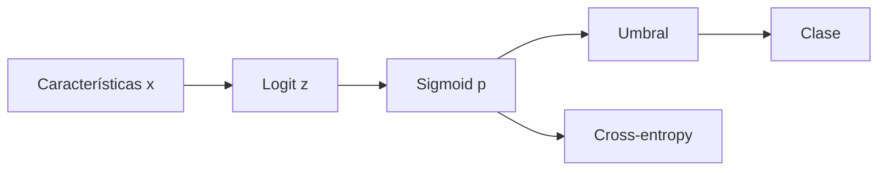

# Regresión lineal y logística desde la pérdida

## Regresión lineal

$$\hat y=Xw+b.$$

El nombre “lineal” se refiere a los parámetros; con sesgo es una transformación afín.

Con error cuadrático:

$$L(w)=\frac1{2B}\lVert Xw-y\rVert^2.$$

Gradiente:

$$\nabla_wL=\frac1B X^T(Xw-y).$$

Las ecuaciones normales satisfacen:

$$X^TXw=X^Ty.$$

No conviene calcular $(X^TX)^{-1}$ explícitamente. QR, SVD o un solver son más estables.

## Interpretación geométrica

$Xw$ vive en el espacio generado por las columnas de $X$. La solución de mínimos cuadrados proyecta $y$ sobre ese espacio. El residuo es ortogonal a todas las columnas:

$$X^T(y-X\hat w)=0.$$

## Regresión logística

Para clasificación binaria:

$$z=w^Tx+b,$$

$$p(y=1\mid x)=\sigma(z)=\frac1{1+e^{-z}}.$$

$z$ es log-odds:

$$z=\log\frac{p}{1-p}.$$

### ¿Qué es un logit?

El **logit** es el número real $z$ que el modelo calcula **antes** de aplicar la función sigmoide. En regresión logística,

$$z=w^Tx+b,$$

donde cada característica de $x$ aporta al resultado de acuerdo con su peso en $w$, y $b$ es el sesgo. El logit todavía **no es una probabilidad**: puede tomar cualquier valor entre $-\infty$ y $+\infty$. La sigmoide transforma ese valor en una probabilidad entre 0 y 1:

$$p=\sigma(z)=\frac{1}{1+e^{-z}}.$$

El nombre *logit* proviene de aplicar el logaritmo a los **odds** o momios. Si $p$ es la probabilidad de que ocurra la clase positiva, entonces:

$$\text{odds}=\frac{p}{1-p}.$$

Los odds comparan la probabilidad de que el evento ocurra con la probabilidad de que no ocurra:

- Si $p=0.5$, entonces los odds son $0.5/0.5=1$: ambas clases son igualmente probables.
- Si $p=0.8$, entonces los odds son $0.8/0.2=4$: la clase positiva es cuatro veces más probable que la negativa.
- Si $p=0.2$, entonces los odds son $0.2/0.8=0.25$: la clase positiva tiene una posibilidad por cada cuatro de la negativa.

Al tomar el logaritmo de los odds se obtiene el logit:

$$\operatorname{logit}(p)=\log\left(\frac{p}{1-p}\right)=z.$$

Esto permite representar una probabilidad acotada mediante una escala real y simétrica alrededor de cero:

| Logit $z$ | Probabilidad $p=\sigma(z)$ | Interpretación |
|---:|---:|---|
| $-2$ | $\approx 0.119$ | evidencia a favor de la clase 0 |
| $0$ | $0.5$ | ninguna clase domina |
| $2$ | $\approx 0.881$ | evidencia a favor de la clase 1 |

Por tanto, el signo y la magnitud de $z$ tienen interpretaciones diferentes:

- $z>0$: $p>0.5$ y el modelo favorece la clase positiva.
- $z<0$: $p<0.5$ y el modelo favorece la clase negativa.
- $z=0$: $p=0.5$.
- Cuanto mayor es $|z|$, más se aleja $p$ de $0.5$ y más decidida es la predicción.

La relación también puede invertirse. Partiendo de un logit $z$, la probabilidad correspondiente es:

$$p=\frac{e^z}{1+e^z}=\frac{1}{1+e^{-z}}.$$

> [!important] Logit, sigmoide y probabilidad no son lo mismo
> - **Logit:** $z=w^Tx+b$, salida lineal sin acotar.
> - **Sigmoide:** función que transforma el logit.
> - **Probabilidad:** $p=\sigma(z)$, resultado acotado entre 0 y 1.

#### Interpretación de los coeficientes

Como

$$\log\frac{p}{1-p}=w^Tx+b,$$

si una característica $x_j$ aumenta una unidad y las demás permanecen constantes, el logit aumenta en $w_j$. Al volver desde log-odds a odds, estos se multiplican por $e^{w_j}$:

$$\frac{\text{odds nuevos}}{\text{odds anteriores}}=e^{w_j}.$$

Por ejemplo, si $w_j=\log 2\approx0.693$, aumentar $x_j$ una unidad duplica los odds de la clase positiva. Esto **no significa** que la probabilidad se duplique, porque la relación entre el logit y la probabilidad es no lineal.

## Pérdida

$$L=-[y\log p+(1-y)\log(1-p)].$$

La derivada respecto del logit se simplifica:

$$\frac{\partial L}{\partial z}=p-y.$$

Por tanto:

$$\nabla_wL=(p-y)x.$$

Para un lote:

$$\nabla_wL=\frac1B X^T(p-y).$$

## Ejemplo de signo

Si $y=1$ y $p=0.2$:

$$p-y=-0.8.$$

El gradiente empuja el logit hacia arriba. Si $y=0$ y $p=0.8$, $p-y=0.8$ y el descenso reduce el logit.

## Frontera de decisión

Con umbral 0.5:

$$p\ge0.5\Longleftrightarrow z\ge0.$$

La frontera $w^Tx+b=0$ es un hiperplano. Cambiar el umbral desplaza la frontera sin reentrenar los parámetros.

## Multiclase

Con $K$ logits:

$$p_k=\frac{e^{z_k}}{\sum_j e^{z_j}},\qquad
L=-\log p_y.$$

El gradiente:

$$\frac{\partial L}{\partial z_k}=p_k-\mathbf1[k=y].$$

## Qué pueden y qué no pueden hacer

- Son interpretables y buenos baselines.
- Su frontera es lineal en las características suministradas.
- Pueden modelar relaciones no lineales si se construyen características no lineales.
- La escala afecta optimización y regularización.
- Coeficiente grande no implica importancia causal.

## Autoevaluación

1. ¿Por qué el residuo de mínimos cuadrados es ortogonal a las columnas?
2. ¿Qué representa el logit logístico?
3. ¿Por qué $p-y$ tiene el signo correcto?
4. ¿Cambiar umbral cambia parámetros?

---

Anterior: [[01 Problema de aprendizaje, representación y particiones]] · Siguiente: [[03 Generalización, sesgo-varianza y regularización]]
