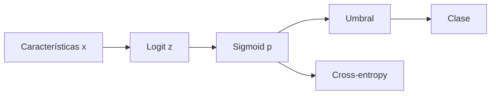

# Regresión lineal y logística desde la pérdida

## Regresión lineal

$$\hat y=Xw+b.$$

El nombre “lineal” se refiere a los parámetros; con sesgo es una transformación afín.

Con error cuadrático:

$$L(w)=\frac1{2B}\lVert Xw-y\rVert^2.$$

Gradiente:

$$\nabla_wL=\frac1B X^T(Xw-y).$$

Las ecuaciones normales satisfacen:

$$X^TXw=X^Ty.$$

No conviene calcular $(X^TX)^{-1}$ explícitamente. QR, SVD o un solver son más estables.

## Interpretación geométrica

$Xw$ vive en el espacio generado por las columnas de $X$. La solución de mínimos cuadrados proyecta $y$ sobre ese espacio. El residuo es ortogonal a todas las columnas:

$$X^T(y-X\hat w)=0.$$

## Regresión logística

Para clasificación binaria:

$$z=w^Tx+b,$$

$$p(y=1\mid x)=\sigma(z)=\frac1{1+e^{-z}}.$$

$z$ es log-odds:

$$z=\log\frac{p}{1-p}.$$

## Pérdida

$$L=-[y\log p+(1-y)\log(1-p)].$$

La derivada respecto del logit se simplifica:

$$\frac{\partial L}{\partial z}=p-y.$$

Por tanto:

$$\nabla_wL=(p-y)x.$$

Para un lote:

$$\nabla_wL=\frac1B X^T(p-y).$$

## Ejemplo de signo

Si $y=1$ y $p=0.2$:

$$p-y=-0.8.$$

El gradiente empuja el logit hacia arriba. Si $y=0$ y $p=0.8$, $p-y=0.8$ y el descenso reduce el logit.

## Frontera de decisión

Con umbral 0.5:

$$p\ge0.5\Longleftrightarrow z\ge0.$$

La frontera $w^Tx+b=0$ es un hiperplano. Cambiar el umbral desplaza la frontera sin reentrenar los parámetros.

## Multiclase

Con $K$ logits:

$$p_k=\frac{e^{z_k}}{\sum_j e^{z_j}},\qquad
L=-\log p_y.$$

El gradiente:

$$\frac{\partial L}{\partial z_k}=p_k-\mathbf1[k=y].$$

## Qué pueden y qué no pueden hacer

- Son interpretables y buenos baselines.
- Su frontera es lineal en las características suministradas.
- Pueden modelar relaciones no lineales si se construyen características no lineales.
- La escala afecta optimización y regularización.
- Coeficiente grande no implica importancia causal.

## Autoevaluación

1. ¿Por qué el residuo de mínimos cuadrados es ortogonal a las columnas?
2. ¿Qué representa el logit logístico?
3. ¿Por qué $p-y$ tiene el signo correcto?
4. ¿Cambiar umbral cambia parámetros?

---

Anterior: [[01 Problema de aprendizaje, representación y particiones]] · Siguiente: [[03 Generalización, sesgo-varianza y regularización]]

