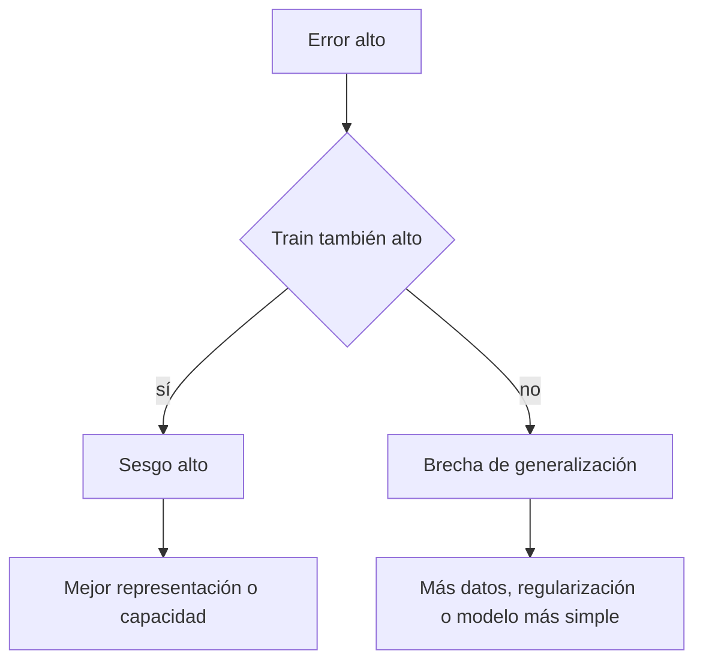

# Generalización, sesgo-varianza y regularización

![[../assets/ruta maestra ia/05-bias-varianza.svg|900]]

## Riesgo empírico y riesgo poblacional

Entrenamos con:

$$\hat R(\theta)=\frac1n\sum_{i=1}^n\ell(f_\theta(x_i),y_i).$$

Pero interesa:

$$R(\theta)=E_{(X,Y)\sim P}[\ell(f_\theta(X),Y)].$$

La brecha $R-\hat R$ es la brecha de generalización.

## Underfitting y overfitting

| Estado | Train | Validation | Diagnóstico |
|---|---|---|---|
| underfitting | malo | malo | modelo/representación insuficiente |
| buen ajuste | bueno | parecido | patrón transferible |
| overfitting | excelente | peor | aprendió particularidades de train |

## Sesgo y varianza

En regresión cuadrática, de forma conceptual:

$$E[(Y-\hat f(X))^2]=\text{ruido}+\text{sesgo}^2+\text{varianza}.$$

- **Sesgo alto:** el procedimiento es sistemáticamente rígido.
- **Varianza alta:** cambia demasiado si cambia la muestra.
- **Ruido irreducible:** parte de $Y$ no está determinada por las características disponibles.

> [!warning] No confundir dos sesgos
> Sesgo estadístico de un estimador no es lo mismo que sesgo social o algorítmico entre grupos. Ambos importan, pero responden preguntas distintas.

## ¿Qué es la regularización?

La **regularización** es una técnica para evitar que un modelo se ajuste demasiado a los ejemplos de entrenamiento. En vez de minimizar únicamente el error, se añade una **penalización por complejidad**:

$$
\underbrace{L_\lambda(\theta)}_{\text{objetivo regularizado}}
=
\underbrace{L(\theta)}_{\text{error de entrenamiento}}
+
\underbrace{\lambda\,\Omega(\theta)}_{\text{penalización por complejidad}}.
$$

Esto obliga al entrenamiento a buscar un equilibrio entre:

1. **ajustar bien los datos**, reduciendo $L(\theta)$;
2. **mantener el modelo simple o estable**, reduciendo $\Omega(\theta)$.

Significado de cada parte:

| Símbolo | Significado |
|---|---|
| $\theta$ | Conjunto de parámetros que aprende el modelo, por ejemplo los pesos de una regresión. |
| $L(\theta)$ | Pérdida original: mide cuánto se equivoca el modelo en los datos de entrenamiento. |
| $\Omega(\theta)$ | Medida de complejidad que se desea penalizar. Su forma distingue, por ejemplo, L1 de L2. |
| $\lambda\ge 0$ | Fuerza de la regularización; es un hiperparámetro elegido con datos de validación. |
| $L_\lambda(\theta)$ | Función completa que se minimiza durante el entrenamiento. |

- Si $\lambda=0$, no hay regularización y se minimiza solamente el error.
- Si $\lambda$ es pequeño, el ajuste a los datos tiene más peso.
- Si $\lambda$ es grande, se prefieren parámetros más simples, aunque el modelo puede caer en *underfitting*.

Por tanto, la regularización suele **reducir la varianza** a cambio de introducir algo más de **sesgo**, con el objetivo de disminuir el error en datos nuevos. La penalización se aplica al entrenamiento, no a la pérdida usada para informar el desempeño en validación o test.

## Regularización L2

$$
L_\lambda(\theta)
=L(\theta)+\frac{\lambda}{2}\lVert\theta\rVert_2^2
=L(\theta)+\frac{\lambda}{2}\sum_{j=1}^{p}\theta_j^2.
$$

En esta fórmula:

- $\theta_j$ es el parámetro número $j$ y $p$ es la cantidad de parámetros penalizados;
- $\lVert\theta\rVert_2^2=\sum_j\theta_j^2$ es la suma de los cuadrados de los parámetros;
- $\lambda$ determina cuánto importan esos cuadrados frente al error original;
- el factor $1/2$ se usa por conveniencia matemática: al derivar cancela el $2$ del cuadrado.

El gradiente de la penalización es:

$$
\nabla_\theta\left(\frac{\lambda}{2}\lVert\theta\rVert_2^2\right)=\lambda\theta.
$$

Por eso, cada actualización empuja los pesos hacia cero. L2 normalmente produce pesos **pequeños**, pero no exactamente iguales a cero; reduce la sensibilidad del modelo y suaviza soluciones inestables. En regresión lineal también se conoce como **Ridge** o *weight decay* en ciertos contextos de optimización.

## Regularización L1

$$
L_\lambda(\theta)
=L(\theta)+\lambda\lVert\theta\rVert_1
=L(\theta)+\lambda\sum_{j=1}^{p}|\theta_j|.
$$

Aquí:

- $|\theta_j|$ es el valor absoluto de cada parámetro;
- $\lVert\theta\rVert_1=\sum_j|\theta_j|$ es la suma de sus magnitudes;
- $\lambda$ controla cuánto se penalizan esas magnitudes.

L1 puede llevar algunos parámetros a ser **exactamente cero**, por lo que genera soluciones dispersas y puede actuar como una forma de selección de variables. En regresión lineal se conoce como **Lasso**. Sin embargo, cuando hay predictores muy correlacionados, puede escoger uno y descartar otros de forma inestable, lo que complica la interpretación.

> [!note] El intercepto suele quedar fuera
> En muchos modelos se penalizan los pesos asociados a las características, pero no el intercepto o término de sesgo. La convención exacta depende de la implementación.

## Regularización no es solo un término

También regularizan:

- limitar profundidad de un árbol;
- early stopping;
- dropout;
- data augmentation;
- reducir características;
- compartir parámetros;
- introducir priors.

## Curvas de aprendizaje

Entrena con tamaños crecientes de muestra y grafica train/validation.

- ambas curvas malas y cercanas → sesgo alto;
- train buena, validation peor y brecha amplia → varianza alta;
- validation mejora con más datos → recolectar datos puede ayudar;
- ambas se estabilizan mal → más datos por sí solos quizá no resuelvan.

## Cambio de distribución

Una buena validación interna no garantiza funcionamiento si cambia $P(X,Y)$:

- otro dispositivo;
- otro periodo;
- nuevos usuarios;
- otra población;
- cambio de comportamiento después del despliegue.

Declara explícitamente la población a la que generalizas.

## Autoevaluación

1. ¿Por qué pérdida de train no estima por sí sola el riesgo poblacional?
2. ¿Qué patrón de curvas sugiere varianza alta?
3. ¿Cómo cambia el gradiente con L2?
4. ¿Por qué más datos no siempre corrigen sesgo alto?

---

Anterior: [[02 Regresión lineal y logística desde la pérdida]] · Siguiente: [[04 Árboles, Random Forest y boosting]]
