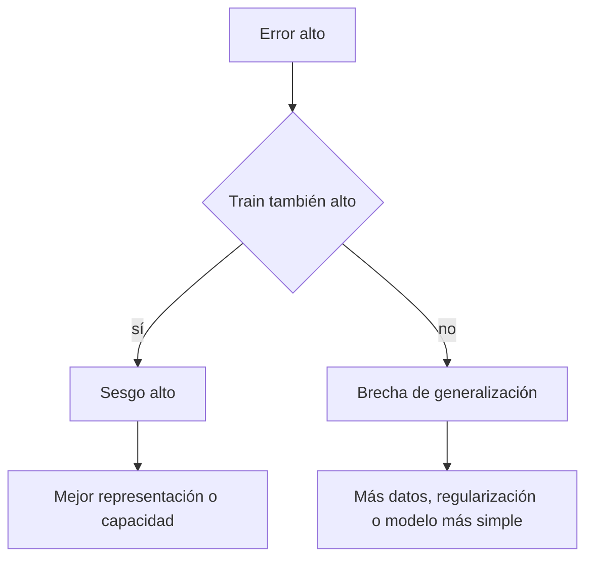

# Generalización, sesgo-varianza y regularización

![[../assets/ruta maestra ia/05-bias-varianza.svg|900]]

## Riesgo empírico y riesgo poblacional

Entrenamos con:

$$\hat R(\theta)=\frac1n\sum_{i=1}^n\ell(f_\theta(x_i),y_i).$$

Pero interesa:

$$R(\theta)=E_{(X,Y)\sim P}[\ell(f_\theta(X),Y)].$$

La brecha $R-\hat R$ es la brecha de generalización.

## Underfitting y overfitting

| Estado | Train | Validation | Diagnóstico |
|---|---|---|---|
| underfitting | malo | malo | modelo/representación insuficiente |
| buen ajuste | bueno | parecido | patrón transferible |
| overfitting | excelente | peor | aprendió particularidades de train |

## Sesgo y varianza

En regresión cuadrática, de forma conceptual:

$$E[(Y-\hat f(X))^2]=\text{ruido}+\text{sesgo}^2+\text{varianza}.$$

- **Sesgo alto:** el procedimiento es sistemáticamente rígido.
- **Varianza alta:** cambia demasiado si cambia la muestra.
- **Ruido irreducible:** parte de $Y$ no está determinada por las características disponibles.

> [!warning] No confundir dos sesgos
> Sesgo estadístico de un estimador no es lo mismo que sesgo social o algorítmico entre grupos. Ambos importan, pero responden preguntas distintas.

## Regularización L2

$$L_\lambda(\theta)=L(\theta)+\frac\lambda2\lVert\theta\rVert^2.$$

Su gradiente añade $\lambda\theta$. Reduce parámetros grandes y suaviza soluciones inestables.

## Regularización L1

$$L_\lambda(\theta)=L(\theta)+\lambda\lVert\theta\rVert_1.$$

Favorece soluciones dispersas, pero la interpretación de selección de variables se complica con predictores correlacionados.

## Regularización no es solo un término

También regularizan:

- limitar profundidad de un árbol;
- early stopping;
- dropout;
- data augmentation;
- reducir características;
- compartir parámetros;
- introducir priors.

## Curvas de aprendizaje

Entrena con tamaños crecientes de muestra y grafica train/validation.

- ambas curvas malas y cercanas → sesgo alto;
- train buena, validation peor y brecha amplia → varianza alta;
- validation mejora con más datos → recolectar datos puede ayudar;
- ambas se estabilizan mal → más datos por sí solos quizá no resuelvan.

## Cambio de distribución

Una buena validación interna no garantiza funcionamiento si cambia $P(X,Y)$:

- otro dispositivo;
- otro periodo;
- nuevos usuarios;
- otra población;
- cambio de comportamiento después del despliegue.

Declara explícitamente la población a la que generalizas.

## Autoevaluación

1. ¿Por qué pérdida de train no estima por sí sola el riesgo poblacional?
2. ¿Qué patrón de curvas sugiere varianza alta?
3. ¿Cómo cambia el gradiente con L2?
4. ¿Por qué más datos no siempre corrigen sesgo alto?

---

Anterior: [[02 Regresión lineal y logística desde la pérdida]] · Siguiente: [[04 Árboles, Random Forest y boosting]]
