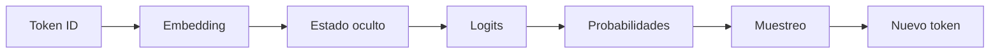
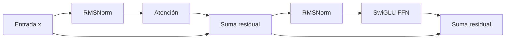
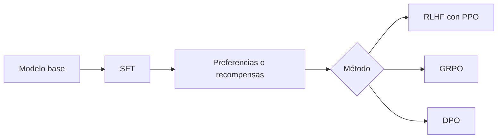

# Glosario visual de LLMs

> [!summary] Cómo usarlo
> No memorices definiciones aisladas. Sitúa cada término en la historia completa: **entrada, transformación, objetivo, generación o sistema**.

## La cadena mínima

| Término | Qué significa | Confusión frecuente |
|---|---|---|
| token | unidad discreta del vocabulario | no siempre coincide con una palabra |
| token ID | índice entero del token | el número no contiene significado ordinal |
| vocabulario $V$ | conjunto de tokens posibles | grande no implica mejor comprensión |
| embedding | vector asociado a un token u objeto | no es el objeto ni una explicación semántica completa |
| estado oculto | representación contextual en dimensión $D$ | cambia por posición y por capa |
| logit | puntaje real antes de softmax | no es una probabilidad |
| softmax | convierte logits en una distribución | no corrige hechos ni crea conocimiento |
| temperatura | divide los logits antes de softmax | no es una medida de confianza calibrada |
| entropía | incertidumbre de una distribución | no es lo mismo que pérdida en todos los casos |
| entropía cruzada | coste de codificar datos de $p$ usando $q$ | en next-token training, equivale a NLL del token correcto |
| perplejidad | $exp$ de la pérdida media en nats | depende de la tokenización; no compare vocabularios sin cuidado |

## Dentro de un bloque Transformer

| Término | Pregunta intuitiva | Papel matemático |
|---|---|---|
| Query $Q$ | ¿qué busco? | vector que consulta las claves |
| Key $K$ | ¿qué ofrezco y cómo me encuentran? | participa en $QK^\top$ |
| Value $V$ | ¿qué contenido entrego si me seleccionan? | se mezcla mediante los pesos de atención |
| cabeza | subespacio de atención | dimensión $H=D/N$ en el caso usual |
| máscara causal | ¿qué posiciones están permitidas? | asigna $-\infty$ al futuro antes de softmax |
| MHA | cada cabeza tiene $Q$, $K$ y $V$ propios | KV cache grande |
| GQA | varias consultas comparten una cabeza KV | equilibrio entre capacidad y memoria |
| MQA | todas las consultas comparten un único $K,V$ | máxima reducción del KV cache |
| RMSNorm | controla escala sin centrar la media | divide por RMS y aprende $\gamma$ |
| residual | conserva una ruta identidad | $x\leftarrow x+f(x)$ |
| SwiGLU | FFN con contenido y compuerta | $\operatorname{SiLU}(xW_g)\odot(xW_u)W_d$ |
| RoPE | incorpora posición rotando $Q,K$ | hace que el producto dependa de posición relativa |

## Entrenamiento e inferencia

| Término | Definición corta | Qué domina |
|---|---|---|
| forward | calcula activaciones y logits | cómputo y activaciones |
| backward | propaga gradientes | aproximadamente dos veces el coste de matmuls del forward como regla gruesa |
| prefill | procesa todo el prompt en paralelo | cómputo; muchas posiciones a la vez |
| decode | genera uno o pocos tokens por secuencia | movimiento de pesos y KV cache |
| KV cache | claves y valores ya calculados por capa | memoria lineal en $B,S,L,K,H$ |
| latencia | tiempo de una solicitud | experiencia de una petición |
| throughput | trabajo agregado por unidad de tiempo | capacidad del sistema |
| continuous batching | reemplaza secuencias al terminar | utilización sostenida de GPU |
| sequence packing | agrupa ejemplos sin permitir atención cruzada | menos padding desperdiciado |
| FlashAttention | cálculo exacto por bloques con menos IO | reduce memoria intermedia y tráfico HBM↔SRAM |

## Post-entrenamiento

| Término | Idea central |
|---|---|
| SFT | maximizar la probabilidad de respuestas demostradas |
| política $\pi_\theta$ | el LLM visto como distribución de acciones o tokens |
| rollout | respuesta completa muestreada de la política |
| recompensa | señal escalar sobre una respuesta o trayectoria |
| baseline | referencia que reduce varianza sin depender de la acción actual |
| ventaja | cuánto mejor fue una acción respecto de lo esperado |
| PPO | reutiliza rollouts y limita cambios mediante clipping |
| RLHF | usa preferencias humanas, modelo de recompensa y regularización KL |
| GRPO | compara un grupo de respuestas y evita un crítico aprendido |
| DPO | aprende directamente de pares preferido/rechazado respecto de una referencia |
| KL | mide divergencia entre distribuciones; es asimétrica |

## Sistemas distribuidos

| Término | Qué se reparte | Comunicación característica |
|---|---|---|
| DP | ejemplos del lote | all-reduce de gradientes |
| FSDP / ZeRO-3 | parámetros, gradientes y estado | all-gather y reduce-scatter por capas |
| TP | canales, matrices o cabezas de una capa | reducciones dentro del forward |
| PP | capas o etapas | activaciones entre etapas |
| SP | posiciones de secuencia | colectivas sobre el eje de secuencia |
| EP | expertos de un MoE | all-to-all para enrutar tokens |
| all-gather | reúne fragmentos en cada dispositivo | elimina un sharding |
| reduce-scatter | suma y deja un fragmento en cada dispositivo | reduce y añade sharding |
| all-reduce | suma y replica el resultado | reduce-scatter + all-gather conceptualmente |

> [!important] Fórmula verbal
> **Atención decide de dónde leer; FFN transforma lo leído; residual conserva; norm estabiliza; RoPE aporta orden.**

---

Anterior: [[00 Índice - Modelos de lenguaje y transformers]] · Siguiente: [[01 Del texto a probabilidades - embeddings, logits, softmax y entropía]]
