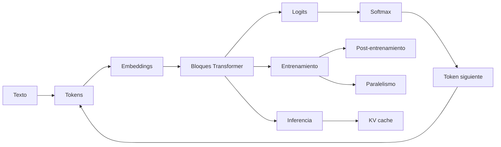

# Modelos de lenguaje y transformers

> [!abstract] Objetivo
> Comprender un LLM como una cadena verificable de representaciones, operaciones y decisiones: **texto → tokens → vectores → bloques Transformer → logits → distribución → token siguiente**. El módulo también explica entrenamiento, inferencia, memoria, post-entrenamiento, paralelismo y multimodalidad.

> [!summary] La idea en una frase
> Un modelo de lenguaje aprende a asignar probabilidades al siguiente token; un Transformer hace esa predicción mezclando información del contexto mediante atención y transformaciones por posición.

## El mapa completo

La flecha de `token siguiente` a `tokens` es la generación autoregresiva: cada salida vuelve a entrar como parte del contexto.

## Ruta recomendada

Si los nombres todavía se mezclan, empieza por [[00 Glosario visual - LLMs]].

1. [[01 Del texto a probabilidades - embeddings, logits, softmax y entropía]]
2. [[02 Transformer causal - arquitectura completa y formas]]
3. [[03 Atención - Q, K, V, máscara causal y multi-head]]
4. [[04 RMSNorm, conexiones residuales, SwiGLU y RoPE]]
5. [[05 Entrenamiento de un LLM - objetivo, parámetros, FLOPs y memoria]]
6. [[06 Inferencia autoregresiva - prefill, decode, KV cache y batching]]
7. [[07 Muestreo, temperatura, top-k, top-p y decodificación especulativa]]
8. [[08 FlashAttention, estabilidad numérica y secuencias largas]]
9. [[09 Escalado, GPU, precisión y cuantización]]
10. [[10 RNN, LSTM, SSM y Transformer - comparación]]
11. [[11 Post-entrenamiento - SFT, RLHF, PPO, GRPO y DPO]]
12. [[12 Paralelismo - datos, tensor, pipeline, secuencia y expertos]]
13. [[13 Multimodalidad - ViT, CLIP y LLaVA]]
14. [[14 Laboratorio - mini Transformer causal en PyTorch]]
15. [[15 Resumen, mapa mental y autoevaluación]]

## Prerrequisitos que ya existen en el vault

Este módulo no vuelve a desarrollar desde cero contenidos que ya están bien cubiertos:

- [[../espacios vectoriales y embeddings/00 Índice - Espacios vectoriales y embeddings|Espacios vectoriales y embeddings]] para distinguir objeto, vector y representación.
- [[../tensores y algebra computacional con pytorch/00 Índice - Tensores y álgebra computacional con PyTorch|Tensores y PyTorch]] para formas, ejes, broadcasting y productos matriciales.
- [[../gradientes autodiferenciacion y optimizacion/00 Índice - Gradientes, autodiferenciación y optimización|Gradientes y optimización]] para backpropagation, Adam y tasa de aprendizaje.
- [[funcion de perdida|Funciones de pérdida]] para entropía cruzada.
- [[../comparacion estadistica de modelos/00 Índice - Comparación estadística de modelos|Comparación estadística de modelos]] para no confundir una diferencia observada con evidencia estadística.

## Tres recorridos posibles

| Si tu objetivo es… | Estudia primero |
|---|---|
| entender qué hace un LLM | 01 → 02 → 03 → 04 → 15 |
| implementar un Transformer | 02 → 03 → 04 → 14 |
| entender costes y despliegue | 05 → 06 → 08 → 09 → 12 |
| entender alineamiento | 01 → 05 → 07 → 11 |
| entender modelos multimodales | 01 → 02 → 03 → 04 → 13 |

## Convención de formas

| Símbolo | Significado |
|---|---|
| $B$ | número de secuencias del lote |
| $S$ | longitud del contexto disponible |
| $T$ | número de posiciones consultadas o generadas |
| $L$ | número de capas Transformer |
| $V$ | tamaño del vocabulario |
| $D$ | dimensión oculta del modelo |
| $N$ | número de cabezas de consulta |
| $H$ | dimensión de cada cabeza; normalmente $D=NH$ |
| $K$ | número de cabezas de claves/valores en GQA |
| $F$ | dimensión intermedia de la FFN |

> [!important] Regla para no perderse
> Antes de cada multiplicación escribe los ejes, no solo los tamaños. Por ejemplo, $(B,N,T,H)@(B,N,H,S)$ contrae `H` y produce $(B,N,T,S)$: un puntaje por consulta y posición del contexto.

## Correcciones y matices aplicados a la fuente

Las notas son una síntesis explicada, no una traducción literal. Se corrigieron estos puntos:

- `model.half()` convierte a **FP16**, no a BF16; BF16 se obtiene con `model.bfloat16()` o `model.to(torch.bfloat16)`.
- **Pipeline parallelism** reparte capas o etapas; **tensor parallelism** reparte matrices, canales o cabezas dentro de una capa.
- El KV cache estándar crece linealmente con la longitud del contexto. Solo queda acotado si se usa una ventana local fija u otra política de descarte.
- FlashAttention evita materializar la matriz completa de atención y reduce tráfico de memoria; la atención densa conserva coste aritmético cuadrático en la longitud.
- La ecuación de rotación RoPE usa $(x_1\cos\phi-x_2\sin\phi,\;x_1\sin\phi+x_2\cos\phi)$.
- Los conteos de parámetros cambian si embedding y unembedding comparten pesos, si hay sesgos o si se usa GQA/MQA.
- El tiempo de las colectivas incluye un término de latencia dependiente del número de dispositivos; “depende solo del tamaño y ancho de banda” es una aproximación incompleta.

## Cómo estudiar

En cada capítulo responde cinco preguntas:

1. ¿Qué representa cada tensor?
2. ¿Qué ejes conserva, transforma o contrae la operación?
3. ¿Qué aprende y qué permanece fijo?
4. ¿Qué coste crece con $B$, $S$, $D$ o $L$?
5. ¿Qué error conceptual produciría una implementación aparentemente válida?

> [!tip] Método
> **Predice la forma → calcula → comprueba → interpreta.** El código confirma una explicación previa; no la reemplaza.

## Fuente y referencias principales

- Fuente base: [Alisa’s book of LLMs](https://alisawuffles.notion.site/alisa-s-book-of-llms).
- Arquitectura original: [Attention Is All You Need](https://arxiv.org/abs/1706.03762).
- RoPE: [RoFormer](https://arxiv.org/abs/2104.09864).
- FlashAttention: [Fast and Memory-Efficient Exact Attention with IO-Awareness](https://arxiv.org/abs/2205.14135).
- Implementación actual: [PyTorch scaled dot product attention](https://docs.pytorch.org/docs/stable/generated/torch.nn.functional.scaled_dot_product_attention.html).

---

Siguiente: [[00 Glosario visual - LLMs]]
