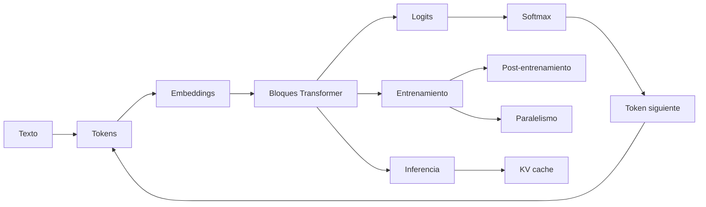

# Modelos de lenguaje y transformers

> [!abstract] Objetivo
> Comprender un LLM como una cadena verificable de representaciones, operaciones y decisiones: **texto → tokens → vectores → bloques Transformer → logits → distribución → token siguiente**. El módulo también explica entrenamiento, inferencia, memoria, post-entrenamiento, paralelismo y multimodalidad.

> [!summary] La idea en una frase
> Un modelo de lenguaje aprende a asignar probabilidades al siguiente token; un Transformer hace esa predicción mezclando información del contexto mediante atención y transformaciones por posición.

## El mapa completo

La flecha de `token siguiente` a `tokens` es la generación autoregresiva: cada salida vuelve a entrar como parte del contexto.

## Clase de orientación: qué, cómo, para qué y por qué

> [!question]- ¿Qué es realmente un LLM?
> Un **modelo de lenguaje grande** es una distribución de probabilidad parametrizada sobre secuencias de tokens. En un modelo causal, la pregunta matemática central es: “dado el prefijo que ya vi, ¿qué probabilidad asigno a cada posible token siguiente?”.
>
> No es una base de datos que busque una frase guardada ni una persona que piense con palabras. Es una función aprendida: recibe IDs, los transforma en vectores, procesa el contexto y produce un logit por elemento del vocabulario. Softmax convierte esos logits en probabilidades y una regla de decodificación elige el siguiente token.
>
> **Recorrido recomendado:** [[01 Del texto a probabilidades - embeddings, logits, softmax y entropía#La tarea fundamental|predicción probabilística]] → [[02 Transformer causal - arquitectura completa y formas#Qué debe lograr un bloque|arquitectura causal]].

> [!question]- ¿Cómo funciona de extremo a extremo?
> 1. El **tokenizador** convierte texto en IDs discretos; el ID identifica una fila, no una cantidad ordinal.
> 2. La tabla de **embeddings** convierte cada ID en un vector de dimensión $D$.
> 3. Cada bloque Transformer usa **atención** para mezclar información entre posiciones permitidas y una **FFN** para transformar las características de cada posición.
> 4. **RMSNorm** estabiliza escalas, las conexiones **residuales** conservan una ruta de identidad y **RoPE** introduce relaciones posicionales en $Q$ y $K$.
> 5. La proyección de salida produce $V$ logits; softmax obtiene $p(x_{t+1}\mid x_{\le t})$.
> 6. En entrenamiento, la entropía cruzada compara esa distribución con el token real y backpropagation ajusta los parámetros. En inferencia, el modelo hace **prefill**, reutiliza el **KV cache** y repite **decode** token por token.
>
> **Míralo por piezas:** [[02 Transformer causal - arquitectura completa y formas#Libro mayor de formas|formas completas]] · [[03 Atención - Q, K, V, máscara causal y multi-head#La intuición correcta|atención]] · [[04 RMSNorm, conexiones residuales, SwiGLU y RoPE#Una capa completa, ahora con significado|resto del bloque]] · [[05 Entrenamiento de un LLM - objetivo, parámetros, FLOPs y memoria#El ciclo|entrenamiento]] · [[06 Inferencia autoregresiva - prefill, decode, KV cache y batching#Dos fases distintas|inferencia]].

> [!question]- ¿Para qué sirve y cómo se convierte una tarea en generación?
> Sirve para producir o transformar secuencias: explicar, resumir, traducir, extraer datos, clasificar mediante etiquetas textuales, escribir código y combinar lenguaje con imágenes. Muchas tareas se expresan como **contexto + instrucción + ejemplos → continuación esperada**.
>
> La técnica correcta depende de lo que falta: **prompting** para instrucciones ocasionales; **RAG** para conocimiento externo, cambiante y citable; **fine-tuning** para un patrón de formato o comportamiento repetido. Ninguna de ellas convierte por sí sola una salida en un hecho verdadero.
>
> **Decide con evidencia:** [[18 RAG - chunking, embeddings, recuperación y reranking#Idea|RAG]] · [[17 Fine-tuning eficiente - LoRA, QLoRA y PEFT#Fine-tuning frente a RAG|fine-tuning frente a RAG]] · [[20 Laboratorio aplicado - elegir prompting, RAG o fine-tuning#Árbol de decisión|árbol de decisión]].

> [!question]- ¿Por qué puede aprender capacidades tan generales prediciendo el siguiente token?
> Porque el texto contiene regularidades sobre sintaxis, hechos, estilos, relaciones y procedimientos. Para reducir sistemáticamente el error de predicción en corpus diversos, el modelo debe construir representaciones internas útiles de esas regularidades. La atención ofrece acceso dependiente del contenido al contexto; la profundidad compone transformaciones; y la escala permite representar más patrones.
>
> Esto explica capacidad, no garantiza comprensión humana ni razonamiento infalible. El objetivo entrena **probabilidad de continuación**, no verdad, intención ni seguridad. El comportamiento final también depende de datos, tokenización, post-entrenamiento, contexto y decodificación.
>
> **Profundiza:** [[01 Del texto a probabilidades - embeddings, logits, softmax y entropía#Objetivo next-token|objetivo next-token]] · [[03 Atención - Q, K, V, máscara causal y multi-head#Una consulta contra todas las claves|acceso al contexto]] · [[05 Entrenamiento de un LLM - objetivo, parámetros, FLOPs y memoria#Datos y objetivo|señal de aprendizaje]] · [[09 Escalado, GPU, precisión y cuantización#Escalar no es solo añadir parámetros|escala]].

> [!question]- ¿Cuáles son sus límites prácticos?
> El contexto es finito; los pesos pueden contener conocimiento desactualizado; la generación puede ser sensible al prompt y al muestreo; más fluidez no implica más exactitud; y ejecutar modelos grandes cuesta memoria, cómputo y comunicación. Además, texto recuperado o proporcionado por terceros puede intentar cambiar las instrucciones del sistema.
>
> Por eso un producto con LLM necesita fuentes, permisos, abstención, evaluación por categorías, límites operativos y controles fuera del prompt. El criterio no es “¿sonó convincente?”, sino “¿la respuesta está respaldada, es segura y cumple latencia y coste?”.
>
> **Profundiza:** [[19 Evaluación, alucinaciones, seguridad y prompt injection#Evaluar un sistema, no una impresión|evaluación y seguridad]] · [[08 FlashAttention, estabilidad numérica y secuencias largas#Dos problemas distintos|límites de contexto]] · [[09 Escalado, GPU, precisión y cuantización#Jerarquía de memoria de GPU|coste de hardware]].

> [!info] Cómo se evitó duplicar tus apuntes
> La fuente ya estaba distribuida en este módulo. Las bases de cálculo, gradientes, optimización y estadística se enlazan como prerrequisitos; aquí solo se explica lo específico de los LLM. Las clases 16–20 amplían temas aplicados y las clases 21–22 completan dos vacíos comprobados de la fuente: gradientes a través de decisiones discretas y el puente entre lenguajes formales, autómatas y memoria neuronal.

## Ruta recomendada

Si los nombres todavía se mezclan, empieza por [[00 Glosario visual - LLMs]].

1. [[01 Del texto a probabilidades - embeddings, logits, softmax y entropía]]
2. [[02 Transformer causal - arquitectura completa y formas]]
3. [[03 Atención - Q, K, V, máscara causal y multi-head]]
4. [[04 RMSNorm, conexiones residuales, SwiGLU y RoPE]]
5. [[05 Entrenamiento de un LLM - objetivo, parámetros, FLOPs y memoria]]
6. [[06 Inferencia autoregresiva - prefill, decode, KV cache y batching]]
7. [[07 Muestreo, temperatura, top-k, top-p y decodificación especulativa]]
8. [[08 FlashAttention, estabilidad numérica y secuencias largas]]
9. [[09 Escalado, GPU, precisión y cuantización]]
10. [[10 RNN, LSTM, SSM y Transformer - comparación]]
11. [[11 Post-entrenamiento - SFT, RLHF, PPO, GRPO y DPO]]
12. [[12 Paralelismo - datos, tensor, pipeline, secuencia y expertos]]
13. [[13 Multimodalidad - ViT, CLIP y LLaVA]]
14. [[14 Laboratorio - mini Transformer causal en PyTorch]]
15. [[15 Resumen, mapa mental y autoevaluación]]
16. [[16 Tokenización práctica - BPE, WordPiece y SentencePiece]]
17. [[17 Fine-tuning eficiente - LoRA, QLoRA y PEFT]]
18. [[18 RAG - chunking, embeddings, recuperación y reranking]]
19. [[19 Evaluación, alucinaciones, seguridad y prompt injection]]
20. [[20 Laboratorio aplicado - elegir prompting, RAG o fine-tuning]]
21. [[21 Muestreo diferenciable - Gumbel-Max, Gumbel-Softmax y straight-through]]
22. [[22 Lenguajes formales, autómatas y memoria de redes secuenciales]]

## Dónde quedó cada bloque de la fuente

| Bloque de *Alisa’s book of LLMs* | Nota canónica en este vault |
|---|---|
| *Neural net basics*: MLP, activaciones, gradientes, backprop, optimizadores y learning rate | [[../gradientes autodiferenciacion y optimizacion/00 Índice - Gradientes, autodiferenciación y optimización|Gradientes, autodiferenciación y optimización]] y [[../redes neuronales desde cero/00 Índice y recordatorio - Redes neuronales desde cero|Redes neuronales desde cero]] |
| *Mathy things*: información, estabilidad y estadística | [[01 Del texto a probabilidades - embeddings, logits, softmax y entropía#Entropía, entropía cruzada y KL|Información para LLM]] · [[08 FlashAttention, estabilidad numérica y secuencias largas#Softmax ingenuo|estabilidad numérica]] · [[../probabilidad y estadistica para ia/00 Índice y recordatorio - Probabilidad para IA|Probabilidad y estadística]] |
| *Mathy things*: muestreo discreto y flujo de gradiente | [[21 Muestreo diferenciable - Gumbel-Max, Gumbel-Softmax y straight-through]] |
| Arquitectura del Transformer moderno | [[02 Transformer causal - arquitectura completa y formas]] y [[04 RMSNorm, conexiones residuales, SwiGLU y RoPE]] |
| Atención, MHA, GQA y MQA | [[03 Atención - Q, K, V, máscara causal y multi-head]] |
| Parámetros, activaciones, FLOPs y memoria de entrenamiento | [[05 Entrenamiento de un LLM - objetivo, parámetros, FLOPs y memoria]] |
| Inferencia, batching, KV cache y sampling | [[06 Inferencia autoregresiva - prefill, decode, KV cache y batching]] y [[07 Muestreo, temperatura, top-k, top-p y decodificación especulativa]] |
| FlashAttention y contexto largo | [[08 FlashAttention, estabilidad numérica y secuencias largas]] |
| Scaling laws, GPU, precisión y cuantización | [[09 Escalado, GPU, precisión y cuantización]] |
| RNN, LSTM, SSM y comparación con Transformer | [[10 RNN, LSTM, SSM y Transformer - comparación]] |
| *Theoretical CS*: lenguajes formales, DFA, PDA y memoria | [[22 Lenguajes formales, autómatas y memoria de redes secuenciales]] |
| SFT, policy gradients, PPO, RLHF, GRPO y DPO | [[11 Post-entrenamiento - SFT, RLHF, PPO, GRPO y DPO]] |
| Data, tensor y pipeline parallelism | [[12 Paralelismo - datos, tensor, pipeline, secuencia y expertos]] |
| Multimodalidad | [[13 Multimodalidad - ViT, CLIP y LLaVA]] |
| Práctica integrada | [[14 Laboratorio - mini Transformer causal en PyTorch]] y [[15 Resumen, mapa mental y autoevaluación]] |
| Ampliaciones aplicadas del vault | [[16 Tokenización práctica - BPE, WordPiece y SentencePiece]] → [[20 Laboratorio aplicado - elegir prompting, RAG o fine-tuning]] |

## Prerrequisitos que ya existen en el vault

Este módulo no vuelve a desarrollar desde cero contenidos que ya están bien cubiertos:

- [[../espacios vectoriales y embeddings/00 Índice - Espacios vectoriales y embeddings|Espacios vectoriales y embeddings]] para distinguir objeto, vector y representación.
- [[../tensores y algebra computacional con pytorch/00 Índice - Tensores y álgebra computacional con PyTorch|Tensores y PyTorch]] para formas, ejes, broadcasting y productos matriciales.
- [[../gradientes autodiferenciacion y optimizacion/00 Índice - Gradientes, autodiferenciación y optimización|Gradientes y optimización]] para backpropagation, Adam y tasa de aprendizaje.
- [[../probabilidad y estadistica para ia/00 Índice y recordatorio - Probabilidad para IA|Probabilidad para IA]] para verosimilitud, entropía, muestreo e incertidumbre.
- [[../machine learning clasico y generalizacion/00 Índice y recordatorio - Machine Learning clásico|Machine Learning clásico]] para generalización, validación, métricas y calibración.
- [[funcion de perdida|Funciones de pérdida]] para entropía cruzada.
- [[../comparacion estadistica de modelos/00 Índice - Comparación estadística de modelos|Comparación estadística de modelos]] para no confundir una diferencia observada con evidencia estadística.

## Tres recorridos posibles

| Si tu objetivo es… | Estudia primero |
|---|---|
| entender qué hace un LLM | 01 → 02 → 03 → 04 → 15 |
| implementar un Transformer | 02 → 03 → 04 → 14 |
| entender costes y despliegue | 05 → 06 → 08 → 09 → 12 |
| entender alineamiento | 01 → 05 → 07 → 11 |
| entender modelos multimodales | 01 → 02 → 03 → 04 → 13 |
| construir una aplicación con documentos | 16 → 18 → 19 → 20 |
| adaptar un modelo con pocos recursos | 05 → 11 → 16 → 17 → 19 |
| entender decisiones discretas y límites de memoria | 10 → 21 → 22 |

## Convención de formas

| Símbolo | Significado |
|---|---|
| $B$ | número de secuencias del lote |
| $S$ | longitud del contexto disponible |
| $T$ | número de posiciones consultadas o generadas |
| $L$ | número de capas Transformer |
| $V$ | tamaño del vocabulario |
| $D$ | dimensión oculta del modelo |
| $N$ | número de cabezas de consulta |
| $H$ | dimensión de cada cabeza; normalmente $D=NH$ |
| $K$ | número de cabezas de claves/valores en GQA |
| $F$ | dimensión intermedia de la FFN |

> [!important] Regla para no perderse
> Antes de cada multiplicación escribe los ejes, no solo los tamaños. Por ejemplo, $(B,N,T,H)@(B,N,H,S)$ contrae `H` y produce $(B,N,T,S)$: un puntaje por consulta y posición del contexto.

## Correcciones y matices aplicados a la fuente

Las notas son una síntesis explicada, no una traducción literal. Se corrigieron estos puntos:

- `model.half()` convierte a **FP16**, no a BF16; BF16 se obtiene con `model.bfloat16()` o `model.to(torch.bfloat16)`.
- **Pipeline parallelism** reparte capas o etapas; **tensor parallelism** reparte matrices, canales o cabezas dentro de una capa.
- El KV cache estándar crece linealmente con la longitud del contexto. Solo queda acotado si se usa una ventana local fija u otra política de descarte.
- FlashAttention evita materializar la matriz completa de atención y reduce tráfico de memoria; la atención densa conserva coste aritmético cuadrático en la longitud.
- La ecuación de rotación RoPE usa $(x_1\cos\phi-x_2\sin\phi,\;x_1\sin\phi+x_2\cos\phi)$.
- Los conteos de parámetros cambian si embedding y unembedding comparten pesos, si hay sesgos o si se usa GQA/MQA.
- El tiempo de las colectivas incluye un término de latencia dependiente del número de dispositivos; “depende solo del tamaño y ancho de banda” es una aproximación incompleta.
- La temperatura de generación cambia qué token se elige durante inferencia; la temperatura $\tau$ de Gumbel-Softmax controla una relajación usada para entrenar una decisión discreta. Comparten una forma matemática parecida, pero no resuelven el mismo problema.
- La construcción aditiva de la fuente con una unidad ReLU por estado destino no implementa un DFA arbitrario: pierde el emparejamiento estado–símbolo y puede producir cruces falsos. [[22 Lenguajes formales, autómatas y memoria de redes secuenciales#5. Por qué falla la construcción aditiva directa|La clase 22 muestra el contraejemplo y una construcción correcta]].

## Cómo estudiar

En cada capítulo responde cinco preguntas:

1. ¿Qué representa cada tensor?
2. ¿Qué ejes conserva, transforma o contrae la operación?
3. ¿Qué aprende y qué permanece fijo?
4. ¿Qué coste crece con $B$, $S$, $D$ o $L$?
5. ¿Qué error conceptual produciría una implementación aparentemente válida?

> [!tip] Método
> **Predice la forma → calcula → comprueba → interpreta.** El código confirma una explicación previa; no la reemplaza.

## Fuente y referencias principales

- Fuente base: [Alisa’s book of LLMs](https://alisawuffles.notion.site/alisa-s-book-of-llms).
- Arquitectura original: [Attention Is All You Need](https://arxiv.org/abs/1706.03762).
- RoPE: [RoFormer](https://arxiv.org/abs/2104.09864).
- FlashAttention: [Fast and Memory-Efficient Exact Attention with IO-Awareness](https://arxiv.org/abs/2205.14135).
- Muestreo diferenciable: [Categorical Reparameterization with Gumbel-Softmax](https://arxiv.org/abs/1611.01144).
- Memoria y autómatas: [Sequential Neural Networks as Automata](https://aclanthology.org/W19-3901/).
- Implementación actual: [PyTorch scaled dot product attention](https://docs.pytorch.org/docs/stable/generated/torch.nn.functional.scaled_dot_product_attention.html).

---

Siguiente: [[00 Glosario visual - LLMs]]
