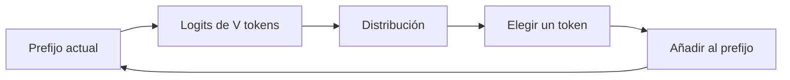

# Del texto a probabilidades: embeddings, logits, softmax y entropía

## La tarea fundamental

Un modelo causal recibe una secuencia $x_1,\dots,x_t$ y estima:

$$p_\theta(x_{t+1}\mid x_1,\dots,x_t).$$

No “escribe una respuesta” en una sola operación. Repite esta tarea muchas veces:



## De caracteres a token IDs

El tokenizador transforma texto en una secuencia de IDs:

```text
"El banco cerró" → [481, 9231, 17452]
```

Los números son índices de una tabla. No significa que `17452` sea “mayor” o “más importante” que `481`.

> [!important] Token no equivale a palabra
> Un token puede ser una palabra, parte de una palabra, puntuación, espacio o byte. Por eso la misma frase puede ocupar distinta cantidad de tokens según el tokenizador.

## Lookup de embeddings

Sea:

$$W_e\in\mathbb R^{V\times D}.$$

Para un lote `tokens` de forma $(B,S)$:

$$X^{(0)}=W_e[\text{tokens}]\in\mathbb R^{B\times S\times D}.$$

No hay multiplicación completa con una matriz one-hot: se seleccionan filas de $W_e$.

| Eje | Significado |
|---|---|
| $B$ | secuencia del lote |
| $S$ | posición del token |
| $D$ | característica aprendida |

Conecta esto con [[../espacios vectoriales y embeddings/04 Embeddings y representación de objetos|Embeddings y representación de objetos]]: el token es el objeto discreto y su fila en $W_e$ es la representación vectorial inicial.

## Estado oculto y logits

Después de $L$ bloques Transformer se obtiene:

$$X^{(L)}\in\mathbb R^{B\times S\times D}.$$

La capa de salida proyecta cada posición al vocabulario:

$$Z=X^{(L)}W_u,qquad W_u\in\mathbb R^{D\times V},$$

$$Z\in\mathbb R^{B\times S\times V}.$$

Cada $z_i$ es un **logit**: un puntaje sin normalizar. Puede ser negativo, no suma uno y no es una probabilidad.

## Softmax

Para una posición:

$$p_i=\frac{e^{z_i}}{\sum_{j=1}^{V}e^{z_j}}.$$

### Ejemplo numérico

Supón logits para tres tokens:

$$z=[2,1,0].$$

Como $e^2\approx7.389$, $e^1\approx2.718$ y $e^0=1$:

$$p\approx[0.665,0.245,0.090].$$

Las diferencias de logits importan, no su nivel absoluto:

$$\operatorname{softmax}([2,1,0])
=\operatorname{softmax}([102,101,100]).$$

Esta invariancia permite restar el máximo para ganar estabilidad:

$$p_i=\frac{e^{z_i-m}}{\sum_j e^{z_j-m}},\qquad m=\max_j z_j.$$

## Entropía, entropía cruzada y KL

### Entropía

$$H(p)=-\sum_x p(x)\log p(x).$$

Mide incertidumbre de $p$. Una distribución concentrada tiene menor entropía que una distribución uniforme.

### Entropía cruzada

$$\operatorname{CE}(p,q)=-\sum_x p(x)\log q(x).$$

Mide el coste esperado de usar $q$ cuando los datos siguen $p$.

### Divergencia KL

$$D_{\mathrm{KL}}(p\Vert q)=\sum_x p(x)\log\frac{p(x)}{q(x)}.$$

La relación clave es:

$$\operatorname{CE}(p,q)=H(p)+D_{\mathrm{KL}}(p\Vert q).$$

Durante entrenamiento, $p$ es la distribución objetivo y no depende de los parámetros. Reducir CE equivale a reducir KL porque $H(p)$ es constante respecto de $\theta$.

> [!warning] KL no es una distancia métrica
> Generalmente $D_{\mathrm{KL}}(p\Vert q)\neq D_{\mathrm{KL}}(q\Vert p)$ y no satisface simetría.

## Objetivo next-token

Con objetivo one-hot, la CE en una posición se reduce a:

$$\ell_t=-\log p_\theta(x_{t+1}\mid x_{\le t}).$$

Para toda la secuencia:

$$L=-\frac{1}{N_{\text{válidos}}}\sum_t m_t\log p_\theta(x_{t+1}\mid x_{\le t}),$$

donde $m_t$ vale 1 para tokens válidos y 0 para padding u otras posiciones ignoradas.

### El desplazamiento de etiquetas

```text
entrada:   [BOS,  La,  IA, aprende]
objetivo:  [ La,  IA, aprende,  EOS ]
```

Los logits de la posición $t$ predicen el token $t+1$.

```python
shift_logits = logits[:, :-1, :]
shift_labels = input_ids[:, 1:]
loss = F.cross_entropy(
    shift_logits.reshape(-1, vocab_size),
    shift_labels.reshape(-1),
    ignore_index=pad_id,
)
```

> [!warning] Error clásico
> Entrenar `logits[:, t]` contra `input_ids[:, t]` permite aprender a copiar el token visible en lugar de predecir el siguiente.

## Gradiente limpio de softmax + CE

Si $y$ es el vector one-hot correcto:

$$\frac{\partial L}{\partial z}=p-y.$$

Para el token correcto $c$:

$$\frac{\partial L}{\partial z_c}=p_c-1,$$

y para los demás:

$$\frac{\partial L}{\partial z_i}=p_i.$$

Interpretación: se eleva el logit correcto y se reducen los incorrectos en proporción a la probabilidad que recibieron.

## Log-softmax estable

No conviene calcular primero una probabilidad extremadamente pequeña y después aplicar logaritmo. Se usa:

$$\log\operatorname{softmax}(z)_i=z_i-\operatorname{logsumexp}(z),$$

$$\operatorname{logsumexp}(z)=m+\log\sum_j e^{z_j-m}.$$

Así el mayor exponente es $e^0=1$ y la suma nunca es cero.

## Perplejidad

Si la pérdida media usa logaritmo natural:

$$\operatorname{PPL}=e^L.$$

Una intuición aproximada: PPL 10 significa que el modelo afronta una incertidumbre similar a elegir uniformemente entre 10 alternativas por paso. No significa que literalmente existan 10 opciones equiprobables.

> [!warning] Comparabilidad
> La perplejidad depende del tokenizador y del conjunto de evaluación. Comparar modelos con vocabularios distintos exige mucho cuidado.

## Autoexplicación

Completa:

> Un token ID selecciona una fila de ___. El Transformer produce un estado de tamaño ___. La proyección final produce ___, softmax los convierte en ___ y la CE de un objetivo one-hot es el ___ negativo del token correcto.

Respuesta: la matriz de embeddings; $D$; logits; probabilidades; logaritmo.

---

Anterior: [[00 Glosario visual - LLMs]] · Siguiente: [[02 Transformer causal - arquitectura completa y formas]]
